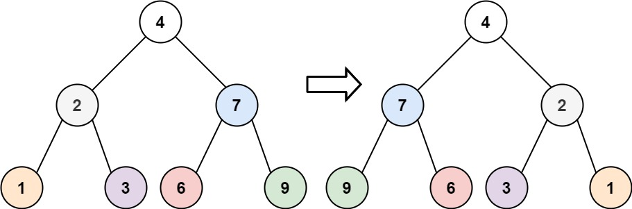
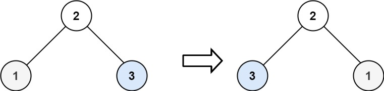
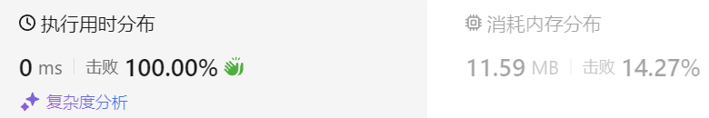

### 06、翻转二叉树（20231109，226题，简单。240724整理，10min）
<div style="border: 1px solid black; padding: 10px; background-color: SteelBlue;">

给你一棵二叉树的根节点 root ，翻转这棵二叉树，并返回其根节点。

 

示例 1：



- 输入：root = [4,2,7,1,3,6,9]
- 输出：[4,7,2,9,6,3,1]

示例 2：



- 输入：root = [2,1,3]
- 输出：[2,3,1]

示例 3：

- 输入：root = []
- 输出：[]
 

提示：

- 树中节点数目范围在 [0, 100] 内
- -100 <= Node.val <= 100

  </p>
</div>

<hr style="border-top: 5px solid #DC143C;">
<table>
  <tr>
    <td bgcolor="Yellow" style="padding: 5px; border: 0px solid black;">
      <span style="font-weight: bold; font-size: 20px;color: black;">
      重新整理（迭代法，层序遍历，240724，10min）
      </span>
    </td>
  </tr>
</table>
<div style="padding: 0px; border: 1.5px solid LightSalmon; margin-bottom: 10px;">

```C++
 /*
 10min
 思路：
层序遍历，遇到每个节点，交换左右子节点

 */
class Solution {
public:
    TreeNode* invertTree(TreeNode* root) {
        TreeNode* cur_node = nullptr;

        queue<TreeNode*> que;
        if(root == nullptr) return nullptr;

        que.push(root);
        while(!que.empty()){
            cur_node = que.front();
            que.pop();

            swap(cur_node->left, cur_node->right);
            if(cur_node->left) que.push(cur_node->left);
            if(cur_node->right) que.push(cur_node->right);
        }

        return root;
    }
};
```

</div>


<table>
  <tr>
    <td bgcolor="Yellow" style="padding: 5px; border: 0px solid black;">
      <span style="font-weight: bold; font-size: 20px;color: black;">
      重新整理（240726，2min）
      </span>
    </td>
  </tr>
</table>

<div style="padding: 0px; border: 1.5px solid LightSalmon; margin-bottom: 10px">

```C++
/*
2min
思路：
先序遍历，中左右
每遇到一个节点，交换其左右节点。
*/
class Solution {
public:
    TreeNode* invertTree(TreeNode* root) {
        if(root == nullptr) return nullptr;

        swap(root->left, root->right);

        invertTree(root->left);
        invertTree(root->right);

        return root;
    }
};
```
</div>



<hr style="border-top: 5px solid #DC143C;">

<table>
  <tr>
    <td bgcolor="Yellow" style="padding: 5px; border: 0px solid black;">
      <span style="font-weight: bold; font-size: 20px;color: black;">
      随想录答案（递归法，先序遍历）
      </span>
    </td>
  </tr>
</table>

<div style="padding: 0px; border: 1.5px solid LightSalmon; margin-bottom: 10px">

```C++
class Solution {
public:
    TreeNode* invertTree(TreeNode* root) {
        if (root == NULL) return root;
        swap(root->left, root->right);  // 中
        invertTree(root->left);         // 左
        invertTree(root->right);        // 右
        return root;
    }
};
```
</div>

<table>
  <tr>
    <td bgcolor="Yellow" style="padding: 5px; border: 0px solid black;">
      <span style="font-weight: bold; font-size: 20px;color: black;">
      随想录答案（迭代法，深度优先遍历，，使用栈！前序遍历）
      </span>
    </td>
  </tr>
</table>

<div style="padding: 0px; border: 1.5px solid LightSalmon; margin-bottom: 10px">

```C++
class Solution {
public:
    TreeNode* invertTree(TreeNode* root) {
        if (root == NULL) return root;
        stack<TreeNode*> st;
        st.push(root);
        while(!st.empty()) {
            TreeNode* node = st.top();              // 中
            st.pop();
            swap(node->left, node->right);
            if(node->right) st.push(node->right);   // 右
            if(node->left) st.push(node->left);     // 左
        }
        return root;
    }
};

// 改为栈的统一遍历方法
class Solution {
public:
    TreeNode* invertTree(TreeNode* root) {
        stack<TreeNode*> st;
        if (root != NULL) st.push(root);
        while (!st.empty()) {
            TreeNode* node = st.top();
            if (node != NULL) {
                st.pop();
                if (node->right) st.push(node->right);  // 右
                if (node->left) st.push(node->left);    // 左
                st.push(node);                          // 中
                st.push(NULL);
            } else {
                st.pop();
                node = st.top();
                st.pop();
                swap(node->left, node->right);          // 节点处理逻辑
            }
        }
        return root;
    }
};
```
</div>

<table>
  <tr>
    <td bgcolor="Yellow" style="padding: 5px; border: 0px solid black;">
      <span style="font-weight: bold; font-size: 20px;color: black;">
      随想录答案（迭代法，广度优先遍历，使用队列！前序遍历）
      </span>
    </td>
  </tr>
</table>

<div style="padding: 0px; border: 1.5px solid LightSalmon; margin-bottom: 10px">

```C++
class Solution {
public:
    TreeNode* invertTree(TreeNode* root) {
        queue<TreeNode*> que;
        if (root != NULL) que.push(root);
        while (!que.empty()) {
            int size = que.size();
            for (int i = 0; i < size; i++) {
                TreeNode* node = que.front();
                que.pop();
                swap(node->left, node->right); // 节点处理
                if (node->left) que.push(node->left);
                if (node->right) que.push(node->right);
            }
        }
        return root;
    }
};
```
</div>

<table>
  <tr>
    <td bgcolor="Yellow" style="padding: 5px; border: 0px solid black;">
      <span style="font-weight: bold; font-size: 20px;color: black;">
      仿照答案版本v2
      </span>
    </td>
  </tr>
</table>

<div style="padding: 0px; border: 1.5px solid LightSalmon; margin-bottom: 10px">

```C++
/*
文中我指的是递归的中序遍历是不行的，因为使用递归的中序遍历，某些节点的左右孩子会翻转两次。
如果非要使用递归中序的方式写，也可以，如下代码就可以避免节点左右孩子翻转两次的情况：
*/
class Solution {
public:
    TreeNode* invertTree(TreeNode* root) {
        if (root == NULL) return root;
        invertTree(root->left);         // 左
        swap(root->left, root->right);  // 中
        invertTree(root->left);         // 注意 这里依然要遍历左孩子，因为中间节点已经翻转了
        return root;
    }
};

/*
但使用迭代方式统一写法的中序是可以的
因为这是用栈来遍历，而不是靠指针来遍历，避免了递归法中翻转了两次的情况
*/
class Solution {
public:
    TreeNode* invertTree(TreeNode* root) {
        stack<TreeNode*> st;
        if (root != NULL) st.push(root);
        while (!st.empty()) {
            TreeNode* node = st.top();
            if (node != NULL) {
                st.pop();
                if (node->right) st.push(node->right);  // 右
                st.push(node);                          // 中
                st.push(NULL);
                if (node->left) st.push(node->left);    // 左

            } else {
                st.pop();
                node = st.top();
                st.pop();
                swap(node->left, node->right);          // 节点处理逻辑
            }
        }
        return root;
    }
};

```
</div>