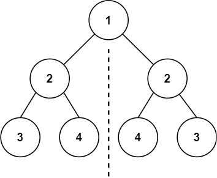
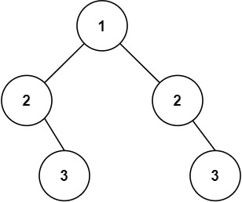
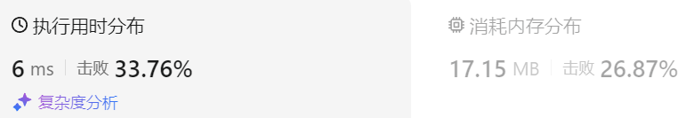

### 07、对称二叉树（20231109，101题，简单。240724整理，20min）
<div style="border: 1px solid black; padding: 10px; background-color: SteelBlue;">

给你一个二叉树的根节点 root ， 检查它是否轴对称。

 

示例 1：



- 输入：root = [1,2,2,3,4,4,3]
- 输出：true

示例 2：



- 输入：root = [1,2,2,null,3,null,3]
- 输出：false
 

提示：

- 树中节点数目在范围 [1, 1000] 内
- -100 <= Node.val <= 100
 

进阶：你可以运用递归和迭代两种方法解决这个问题吗？

  </p>
</div>

<hr style="border-top: 5px solid #DC143C;">
<table>
  <tr>
    <td bgcolor="Yellow" style="padding: 5px; border: 0px solid black;">
      <span style="font-weight: bold; font-size: 20px;color: black;">
      重新整理（双队列迭代法，240724，20min）
      </span>
    </td>
  </tr>
</table>
<div style="padding: 0px; border: 1.5px solid LightSalmon; margin-bottom: 10px;">

```C++ {.line-numbers}
/*
20min
思路：
使用两个队列来装各节点的左右子树
que1左子树，que2右子树
左子树左边先入队列，右子树右边先入队列！
两队列各取一个节点，A1/A2，来判断是否对称
    节点A1/A2值不同，返回false
    A1/A2左右子树空与否情况检查
*/class Solution {
public:
    bool isSymmetric(TreeNode* root) {
        queue<TreeNode*> que1, que2;

        que1.push(root->left);
        que2.push(root->right);
        if(root->left == root->right && root->right == NULL) return true;

        while(!que1.empty() || !que2.empty()){
            TreeNode* node1 = que1.front();
            TreeNode* node2 = que2.front();
            que1.pop();
            que2.pop();
            if(node1 == NULL && node2 != NULL) return false;
            if(node1 != NULL && node2 == NULL) return false;
            if(node1->val != node2->val) return false;

            if(node1->left != NULL && node2->right == NULL) return false;
            if(node1->right != NULL && node2->left == NULL) return false;
            if(node1->left == NULL && node2->right != NULL) return false;
            if(node1->right == NULL && node2->left != NULL) return false;

            if(node1->left != NULL) que1.push(node1->left);
            if(node1->right != NULL) que1.push(node1->right);

            if(node2->right != NULL) que2.push(node2->right);
            if(node2->left != NULL) que2.push(node2->left);
        }
        return true;
    }
};
```

</div>


<table>
  <tr>
    <td bgcolor="Yellow" style="padding: 5px; border: 0px solid black;">
      <span style="font-weight: bold; font-size: 20px;color: black;">
      仿照答案思路（递归法，240726，22min）
      </span>
    </td>
  </tr>
</table>

<div style="padding: 0px; border: 1.5px solid LightSalmon; margin-bottom: 10px">

```C++ {.line-numbers}
/*
22min
思路：
左右子树使用后续遍历来对比是否对称
左子树A1遍历顺序：左右中
A2右左中
比较当前节点的左右的返回值
    A1的左返回值left和A2的右返回值right必须相等
    A1的右返回值right和A2的左返回值left必须相等
空节点返回0；

*/class Solution {
public:
    bool travelTree(TreeNode* left_tree, TreeNode* right_tree){
        if(left_tree == NULL && right_tree == NULL) return true;
        if(left_tree == NULL && right_tree != NULL) return false;
        if(left_tree != NULL && right_tree == NULL) return false;

        if(left_tree->val != right_tree->val) return false;
        bool left = travelTree(left_tree->left, right_tree->right);
        bool right = travelTree(left_tree->right, right_tree->left);

        // return left || right;  // 有错，传递错误，要用“与”传递！！！
        return left && right;
    }
    bool isSymmetric(TreeNode* root) {

        return travelTree(root->left, root->right);
    }
};
```
</div>



<hr style="border-top: 5px solid #DC143C;">

<table>
  <tr>
    <td bgcolor="Yellow" style="padding: 5px; border: 0px solid black;">
      <span style="font-weight: bold; font-size: 20px;color: black;">
      随想录答案（递归法）
      </span>
    </td>
  </tr>
</table>

<div style="padding: 0px; border: 1.5px solid LightSalmon; margin-bottom: 10px">

```C++ {.line-numbers}
class Solution {
public:
    bool compare(TreeNode* left, TreeNode* right) {
        // 首先排除空节点的情况
        if (left == NULL && right != NULL) return false;
        else if (left != NULL && right == NULL) return false;
        else if (left == NULL && right == NULL) return true;
        // 排除了空节点，再排除数值不相同的情况
        else if (left->val != right->val) return false;

        // 此时就是：左右节点都不为空，且数值相同的情况
        // 此时才做递归，做下一层的判断
        bool outside = compare(left->left, right->right);   // 左子树：左、 右子树：右
        bool inside = compare(left->right, right->left);    // 左子树：右、 右子树：左
        bool isSame = outside && inside;                    // 左子树：中、 右子树：中 （逻辑处理）
        return isSame;

    }
    bool isSymmetric(TreeNode* root) {
        if (root == NULL) return true;
        return compare(root->left, root->right);
    }
};
```
</div>

<table>
  <tr>
    <td bgcolor="Yellow" style="padding: 5px; border: 0px solid black;">
      <span style="font-weight: bold; font-size: 20px;color: black;">
      随想录答案（迭代法，单个队列）
      </span>
    </td>
  </tr>
</table>

<div style="padding: 0px; border: 1.5px solid LightSalmon; margin-bottom: 10px">

```C++ {.line-numbers}
class Solution {
public:
    bool isSymmetric(TreeNode* root) {
        if (root == NULL) return true;
        queue<TreeNode*> que;
        que.push(root->left);   // 将左子树头结点加入队列
        que.push(root->right);  // 将右子树头结点加入队列
        
        while (!que.empty()) {  // 接下来就要判断这两个树是否相互翻转
            TreeNode* leftNode = que.front(); que.pop();
            TreeNode* rightNode = que.front(); que.pop();
            if (!leftNode && !rightNode) {  // 左节点为空、右节点为空，此时说明是对称的
                continue;
            }

            // 左右一个节点不为空，或者都不为空但数值不相同，返回false
            if ((!leftNode || !rightNode || (leftNode->val != rightNode->val))) {
                return false;
            }
            que.push(leftNode->left);   // 加入左节点左孩子
            que.push(rightNode->right); // 加入右节点右孩子
            que.push(leftNode->right);  // 加入左节点右孩子
            que.push(rightNode->left);  // 加入右节点左孩子
        }
        return true;
    }
};
```
</div>

<table>
  <tr>
    <td bgcolor="Yellow" style="padding: 5px; border: 0px solid black;">
      <span style="font-weight: bold; font-size: 20px;color: black;">
      随想录答案（迭代法，单个栈）
      </span>
    </td>
  </tr>
</table>

<div style="padding: 0px; border: 1.5px solid LightSalmon; margin-bottom: 10px">

```C++ {.line-numbers}
class Solution {
public:
    bool isSymmetric(TreeNode* root) {
        if (root == NULL) return true;
        stack<TreeNode*> st; // 这里改成了栈
        st.push(root->left);
        st.push(root->right);
        while (!st.empty()) {
            TreeNode* rightNode = st.top(); st.pop();
            TreeNode* leftNode = st.top(); st.pop();
            if (!leftNode && !rightNode) {
                continue;
            }
            if ((!leftNode || !rightNode || (leftNode->val != rightNode->val))) {
                return false;
            }
            st.push(leftNode->left);
            st.push(rightNode->right);
            st.push(leftNode->right);
            st.push(rightNode->left);
        }
        return true;
    }
};
```
</div>
