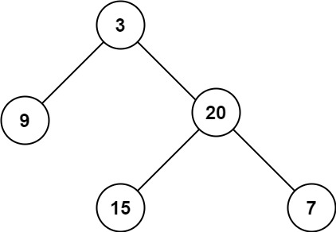

### 08、二叉树的最大深度（20231110，104题，简单。240724整理，9min）

<div style="border: 1px solid black; padding: 10px; background-color: SteelBlue;">

给定一个二叉树 root ，返回其最大深度。

二叉树的 最大深度 是指从根节点到最远叶子节点的最长路径上的节点数。

 

示例 1：



- 输入：root = [3,9,20,null,null,15,7]
- 输出：3

示例 2：

- 输入：root = [1,null,2]
- 输出：2
 

提示：

- 树中节点的数量在 [0, 104] 区间内。
- -100 <= Node.val <= 100


  </p>
</div>


<hr style="border-top: 5px solid #DC143C;">
<table>
  <tr>
    <td bgcolor="Yellow" style="padding: 5px; border: 0px solid black;">
      <span style="font-weight: bold; font-size: 20px;color: black;">
      重新整理（递归法，先序遍历，240724，9min）
      </span>
    </td>
  </tr>
</table>
<div style="padding: 0px; border: 1.5px solid LightSalmon; margin-bottom: 10px;">

```C++
 /*
 9min
 思路：
 递归遍历，记录当前深度，并更新最大的深度
 */
class Solution {
public:
    int max_depth;
    void travelTree(TreeNode* cur_node, int depth){
        if(cur_node == nullptr) return;

        if(depth > max_depth) max_depth = depth;

        travelTree(cur_node->left, depth+1);
        travelTree(cur_node->right, depth+1);
    }

    int maxDepth(TreeNode* root) {
        max_depth = 0;
        if(root == nullptr) return 0;

        travelTree(root, 1);

        return max_depth;
    }
};
```

</div>


 <table>
  <tr>
    <td bgcolor="Yellow" style="padding: 5px; border: 0px solid black;">
      <span style="font-weight: bold; font-size: 20px;color: black;">
      重新整理（递归法，后序遍历，240726，3min）
      </span>
    </td>
  </tr>
</table>
<div style="padding: 0px; border: 1.5px solid LightSalmon; margin-bottom: 10px;">

```C++
  /*
 3min
 思路：
 递归法，后序遍历，左右中。
 空节点返回0；
 非空节点A，取左子树A1与右子树A2的最大返回值max(left, right)，再加1并返回。
 */
class Solution {
public:

    int maxDepth(TreeNode* root) {

        if(root == nullptr) return 0;

        int left = maxDepth(root->left);
        int right = maxDepth(root->right);

        return max(left, right)+1;
    }
};
```

</div>


 <table>
  <tr>
    <td bgcolor="Yellow" style="padding: 5px; border: 0px solid black;">
      <span style="font-weight: bold; font-size: 20px;color: black;">
      重新整理（迭代法，层序遍历，240726，3min）
      </span>
    </td>
  </tr>
</table>
<div style="padding: 0px; border: 1.5px solid LightSalmon; margin-bottom: 10px;">

```C++
/*
 3min
 思路：
 递归法，层序遍历。
 使用size记录当前队列中的节点数，遍历这么多个节点，说明遍历完一层
    然后将深度depth加1
最后返回depth即可。
*/
class Solution {
public:

    int maxDepth(TreeNode* root) {
        if(root == nullptr) return 0;

        queue<TreeNode*> que;
        que.push(root);
        TreeNode* cur_node = nullptr;
        int depth = 0;

        while(!que.empty()){
            int size = que.size();
            depth++;

            for(int i = 0; i < size; i++){
                cur_node = que.front();
                que.pop();

                if(cur_node->left) que.push(cur_node->left);
                if(cur_node->right) que.push(cur_node->right);
            }
        }

        return depth;
    }
};
```

</div>


<hr style="border-top: 5px solid #DC143C;">
<table>
  <tr>
    <td bgcolor="Yellow" style="padding: 5px; border: 0px solid black;">
      <span style="font-weight: bold; font-size: 20px;color: black;">
      自己答案（递归方法，通过！）
      </span>
    </td>
  </tr>
</table>
<div style="padding: 0px; border: 1.5px solid LightSalmon; margin-bottom: 10px;">

```C++
 /*
 思路：
 递归遍历时传入当前节点深度，更高则更新节点深度
 */
class Solution {
public:
    int backtracking(TreeNode* cur, int depth)
    {
        if(cur == NULL) return depth;

        depth += 1;                                           // 中
        int ret_left_depth = backtracking(cur->left, depth);  // 左
        int ret_right_depth = backtracking(cur->right, depth);// 右
        return max(ret_left_depth, ret_right_depth);
    }

    int maxDepth(TreeNode* root) {
        if(root == NULL) return 0;

        int ret_depth = backtracking(root, 0);
        return ret_depth;
    }
};
```

</div>


<hr style="border-top: 5px solid #DC143C;">
<table>
  <tr>
    <td bgcolor="Yellow" style="padding: 5px; border: 0px solid black;">
      <span style="font-weight: bold; font-size: 20px;color: black;">
      随想录答案（递归方法，栈，后序遍历）
      </span>
    </td>
  </tr>
</table>
<div style="padding: 0px; border: 1.5px solid LightSalmon; margin-bottom: 10px;">

```C++
 /*
 思路：
 左右中去遍历，就是从最底层开始，每个节点贡献深度1向上返回；
 节点向上返回时，要加上自身左右子节点深度的最大值。
 */
class solution {
public:
    int getdepth(TreeNode* node) {
        if (node == NULL) return 0;
        int leftdepth = getdepth(node->left);       // 左
        int rightdepth = getdepth(node->right);     // 右
        int depth = 1 + max(leftdepth, rightdepth); // 中
        return depth;
    }
    int maxDepth(TreeNode* root) {
        return getdepth(root);
    }
};

//精简后：
class solution {
public:
    int maxDepth(TreeNode* root) {
        if (root == null) return 0;
        return 1 + max(maxDepth(root->left), maxDepth(root->right));
    }
};
```

</div>

 <table>
  <tr>
    <td bgcolor="Yellow" style="padding: 5px; border: 0px solid black;">
      <span style="font-weight: bold; font-size: 20px;color: black;">
      随想录答案（递归方法，先序遍历）
      </span>
    </td>
  </tr>
</table>
<div style="padding: 0px; border: 1.5px solid LightSalmon; margin-bottom: 10px;">

```C++
class Solution {
public:
    int result;
    void getdepth(TreeNode* node, int depth) {
        result = depth > result ? depth : result; // 中

        if (node->left == NULL && node->right == NULL) return ;

        if (node->left) { // 左
            depth++;    // 深度+1
            getdepth(node->left, depth);
            depth--;    // 回溯，深度-1
        }
        if (node->right) { // 右
            depth++;    // 深度+1
            getdepth(node->right, depth);
            depth--;    // 回溯，深度-1
        }
        return ;
    }
    int maxDepth(TreeNode* root) {
        result = 0;
        if (root == NULL) return result;
        getdepth(root, 1);
        return result;
    }
};
```

</div>

<table>
  <tr>
    <td bgcolor="Yellow" style="padding: 5px; border: 0px solid black;">
      <span style="font-weight: bold; font-size: 20px;color: black;">
      随想录答案（迭代方法，层序遍历）
      </span>
    </td>
  </tr>
</table>
<div style="padding: 0px; border: 1.5px solid LightSalmon; margin-bottom: 10px;">

```C++
class Solution {
public:
    int maxDepth(TreeNode* root) {
        if (root == NULL) return 0;
        int depth = 0;
        queue<TreeNode*> que;
        que.push(root);
        while(!que.empty()) {
            int size = que.size();
            depth++; // 记录深度
            for (int i = 0; i < size; i++) {
                TreeNode* node = que.front();
                que.pop();
                if (node->left) que.push(node->left);
                if (node->right) que.push(node->right);
            }
        }
        return depth;
    }
};
```

</div