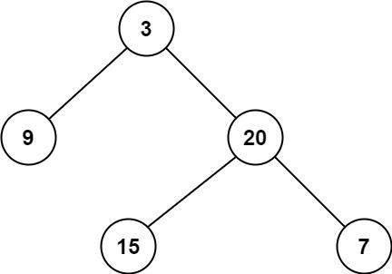

### 09、二叉树的最小深度（20231212，111题，简单。240724整理，10min）

<div style="border: 1px solid black; padding: 10px; background-color: SteelBlue;">

给定一个二叉树，找出其最小深度。  
最小深度是从根节点到最近叶子节点的最短路径上的节点数量。  
说明：叶子节点是指没有子节点的节点。  

**示例 1：**

  

- 输入：root = [3,9,20,null,null,15,7]
- 输出：2  

**示例 2：**

- 输入：root = [2,null,3,null,4,null,5,null,6]
- 输出：5


  </p>
</div>

<hr style="border-top: 5px solid #DC143C;">
<table>
  <tr>
    <td bgcolor="Yellow" style="padding: 5px; border: 0px solid black;">
      <span style="font-weight: bold; font-size: 20px;color: black;">
      重新整理（递归法，240724，10min）
      </span>
    </td>
  </tr>
</table>
<div style="padding: 0px; border: 1.5px solid LightSalmon; margin-bottom: 10px;">

```C++ {.line-numbers}
 /*
 10min
 思路（和答案先序遍历思路一致！）：
 递归遍历，找到叶子节点，记录当前的深度depth
 对比depth和min_depth，更新min_depth
 最后返回min_depth
 */
 
class Solution {
public:
    int min_depth;

    void travelTree(TreeNode* cur_node, int depth){
        if(cur_node == nullptr) return;

        if(cur_node->left == cur_node->right && cur_node->left == nullptr){
            if(depth < min_depth){
                min_depth = depth;
            }
        }
        if(cur_node->left) travelTree(cur_node->left, depth+1);
        if(cur_node->right) travelTree(cur_node->right, depth+1);
    }
    int minDepth(TreeNode* root) {
        min_depth = INT32_MAX;
        if(root == nullptr) return 0;

        travelTree(root, 1);

        return min_depth;
    }
};
```

</div>


<hr style="border-top: 5px solid #DC143C;">
<table>
  <tr>
    <td bgcolor="Yellow" style="padding: 5px; border: 0px solid black;">
      <span style="font-weight: bold; font-size: 20px;color: black;">
      参考答案思路（递归法，240725，6min）
      </span>
    </td>
  </tr>
</table>
<div style="padding: 0px; border: 1.5px solid LightSalmon; margin-bottom: 10px;">

```C++ {.line-numbers}
 /*
 6min
 思路：
 递归遍历，后续遍历，左右中
 空节点返回INT32_MAX;
 非空节点
    若是叶子节点，则返回1；
    非叶子节点，返回左右子树返回值的最小值，再加1
 */
 
class Solution {
public:
    int travelTree(TreeNode* cur_node){
        if(cur_node == nullptr) return INT32_MAX;

        if(cur_node->left == nullptr && cur_node->right == nullptr){
            return 1;
        }

        int left = travelTree(cur_node->left);
        int right = travelTree(cur_node->right);

        return min(left, right)+1;
    }

    int minDepth(TreeNode* root) {
        if(root == nullptr) return 0;

        int count = travelTree(root);
        return count;
    }
};
```

</div>


 <table>
  <tr>
    <td bgcolor="Yellow" style="padding: 5px; border: 0px solid black;">
      <span style="font-weight: bold; font-size: 20px;color: black;">
      参考答案思路（递归法，240725，7min）
      </span>
    </td>
  </tr>
</table>
<div style="padding: 0px; border: 1.5px solid LightSalmon; margin-bottom: 10px;">

```C++ {.line-numbers}
 /*
 7min
 思路：
 递归遍历，后续遍历，左右中
 空节点返回0,则要注意一节点为空，一节点为非空的情况
    左节点为空，右节点非空，返回right+1；
    右节点为空，左节点非空，返回left+1；
其他节点，左右同时为空，或者同时不为空。
    返回left和right最小的，再加1
 */
 
class Solution {
public:
    int minDepth(TreeNode* root) {
        if(root == nullptr) return 0;

        int left = minDepth(root->left);
        int right = minDepth(root->right);

        if(root->left == nullptr && root->right != nullptr){
            return 1+right;
        }
        if(root->left != nullptr && root->right == nullptr){
            return 1+left;
        }

        return min(left, right)+1;
    }
};
```

</div>


 <table>
  <tr>
    <td bgcolor="Yellow" style="padding: 5px; border: 0px solid black;">
      <span style="font-weight: bold; font-size: 20px;color: black;">
      参考答案思路（迭代法，层序遍历，240725，11min）
      </span>
    </td>
  </tr>
</table>
<div style="padding: 0px; border: 1.5px solid LightSalmon; margin-bottom: 10px;">

```C++ {.line-numbers}
 /*
 11min
 思路：
层序遍历
使用队列存放数的节点，记录当前层的节点数目，以便直到遍历完了一层
每遍历一层，计数count加1，
遍历到第一个叶子节点，返回count大小。
 */
 
class Solution {
public:
    int minDepth(TreeNode* root) {

        if(root == nullptr) return 0;

        queue<TreeNode*> que;
        TreeNode* cur_node = nullptr;
        que.push(root);
        int count = 0;

        while(!que.empty()){
            int size = que.size();
            count++;
            for(int i = 0; i < size; i++){
                cur_node = que.front();
                que.pop();
                if(cur_node->left == nullptr && cur_node->right == nullptr){
                    return count;
                }
                if(cur_node->left) que.push(cur_node->left);
                if(cur_node->right) que.push(cur_node->right);
            }
        }
        return count;
    }
};

```

</div>


<hr style="border-top: 5px solid #DC143C;">
<table>
  <tr>
    <td bgcolor="Yellow" style="padding: 5px; border: 0px solid black;">
      <span style="font-weight: bold; font-size: 20px;color: black;">
      自己写，通过（栈）
      </span>
    </td>
  </tr>
</table>
<div style="padding: 0px; border: 1.5px solid LightSalmon; margin-bottom: 10px;">


```C++ {.line-numbers}
 /*
 思路：
 遍历树，同时记录当前的深度，遍历到叶子节点则对比当前深度和全局记录的最小深度对比，取最小的
 */
class Solution {
public:
    int ret = pow(10,6);
    void backtracking(TreeNode* cur, int count)
    {
        if(cur == NULL) return;

        backtracking(cur->left,count+1);
        backtracking(cur->right,count+1);
        if(cur->left == NULL && cur->right == NULL)
        {
            if(count < ret)
            {
                ret = count;
            }
        }
    }
    int minDepth(TreeNode* root) {
        if(root == NULL) return 0;

        backtracking(root, 1);

        return ret;
    }
};
```

</div>


<table>
  <tr>
    <td bgcolor="Yellow" style="padding: 5px; border: 0px solid black;">
      <span style="font-weight: bold; font-size: 20px;color: black;">
      看答案写的（栈，后续遍历，求高度较小者）
      </span>
    </td>
  </tr>
</table>
<div style="padding: 0px; border: 1.5px solid LightSalmon; margin-bottom: 10px;">

```C++ {.line-numbers}
 /*
 思路：
 获取左右子树的深度，返回1加较小深度的子树深度即为树的最小深度
 需要注意的是，只有左或者右节点的节点，其深度应该是1加其子树的深度；
 有左右子节点的，返回1加左右子树的深度较小者。
 即取左右子树高度较小者。
 */
class Solution {
public:
    int getDepth(TreeNode* cur)
    {
        if(cur == NULL) return 0;  /*必须赋值0，给最后叶子节点的leftDepth和rightDepth赋值*/

        int leftDepth = getDepth(cur->left);     //左
        int rightDepth = getDepth(cur->right);   //右
                                                 //中
        if(cur->left != NULL && cur->right == NULL)
        {
            return 1 + leftDepth;
        }
        if(cur->right != NULL && cur->left == NULL)
        {
            return 1 + rightDepth;
        }
        int curDepth = 1 + min(leftDepth, rightDepth);
        return curDepth;
    }
    int minDepth(TreeNode* root) {

        if(root == NULL) return 0;

        int ret = getDepth(root);

        return ret;
    }
};
```

</div>


<hr style="border-top: 5px solid #DC143C;">
<table>
  <tr>
    <td bgcolor="Yellow" style="padding: 5px; border: 0px solid black;">
      <span style="font-weight: bold; font-size: 20px;color: black;">
      随想录答案（递归法，后序遍历）
      </span>
    </td>
  </tr>
</table>
<div style="padding: 0px; border: 1.5px solid LightSalmon; margin-bottom: 10px;">

```C++ {.line-numbers}
class Solution {
public:
    int getDepth(TreeNode* node) {
        if (node == NULL) return 0;
        int leftDepth = getDepth(node->left);           // 左
        int rightDepth = getDepth(node->right);         // 右
                                                        // 中
        // 当一个左子树为空，右不为空，这时并不是最低点
        if (node->left == NULL && node->right != NULL) { 
            return 1 + rightDepth;
        }   
        // 当一个右子树为空，左不为空，这时并不是最低点
        if (node->left != NULL && node->right == NULL) { 
            return 1 + leftDepth;
        }
        int result = 1 + min(leftDepth, rightDepth);
        return result;
    }

    int minDepth(TreeNode* root) {
        return getDepth(root);
    }
};
```

</div>

 <table>
  <tr>
    <td bgcolor="Yellow" style="padding: 5px; border: 0px solid black;">
      <span style="font-weight: bold; font-size: 20px;color: black;">
      随想录答案（递归法，先序遍历）
      </span>
    </td>
  </tr>
</table>
<div style="padding: 0px; border: 1.5px solid LightSalmon; margin-bottom: 10px;">

```C++ {.line-numbers}
class Solution {
private:
    int result;
    void getdepth(TreeNode* node, int depth) {
        // 函数递归终止条件
        if (node == nullptr) {
            return;
        }
        // 中，处理逻辑：判断是不是叶子结点
        if (node -> left == nullptr && node->right == nullptr) {
            result = min(result, depth);
        }
        if (node->left) { // 左
            getdepth(node->left, depth + 1);
        }
        if (node->right) { // 右
            getdepth(node->right, depth + 1);
        }
        return ;
    }

public:
    int minDepth(TreeNode* root) {
        if (root == nullptr) {
            return 0;
        }
        result = INT_MAX;
        getdepth(root, 1);
        return result;
    }
};
```

</div>

 <table>
  <tr>
    <td bgcolor="Yellow" style="padding: 5px; border: 0px solid black;">
      <span style="font-weight: bold; font-size: 20px;color: black;">
      随想录答案（迭代法，层序遍历）
      </span>
    </td>
  </tr>
</table>
<div style="padding: 0px; border: 1.5px solid LightSalmon; margin-bottom: 10px;">

```C++ {.line-numbers}
class Solution {
public:

    int minDepth(TreeNode* root) {
        if (root == NULL) return 0;
        int depth = 0;
        queue<TreeNode*> que;
        que.push(root);
        while(!que.empty()) {
            int size = que.size();
            depth++; // 记录最小深度
            for (int i = 0; i < size; i++) {
                TreeNode* node = que.front();
                que.pop();
                if (node->left) que.push(node->left);
                if (node->right) que.push(node->right);
                if (!node->left && !node->right) { // 当左右孩子都为空的时候，说明是最低点的一层了，退出
                    return depth;
                }
            }
        }
        return depth;
    }
};
```

</div>