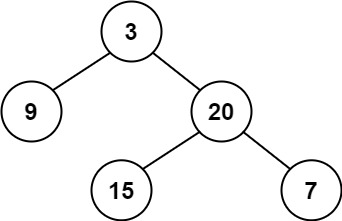
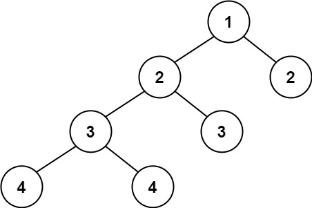
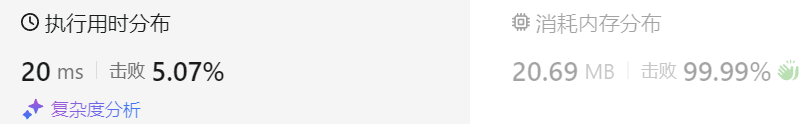

### 11、平衡二叉树（20231220，110题，简单。240724整理，10min）
<div style="border: 1px solid black; padding: 10px; background-color: SteelBlue;">

给定一个二叉树，判断它是否是 
平衡二叉树
  

 

示例 1：



- 输入：root = [3,9,20,null,null,15,7]
- 输出：true
  
示例 2：



- 输入：root = [1,2,2,3,3,null,null,4,4]
- 输出：false
  
示例 3：

- 输入：root = []
- 输出：true
 

提示：

- 树中的节点数在范围 [0, 5000] 内
- -104 <= Node.val <= 104


  </p>
</div>

<hr style="border-top: 5px solid #DC143C;">
<table>
  <tr>
    <td bgcolor="Yellow" style="padding: 5px; border: 0px solid black;">
      <span style="font-weight: bold; font-size: 20px;color: black;">
      重新整理（递归法，240724，10min）
      </span>
    </td>
  </tr>
</table>
<div style="padding: 0px; border: 1.5px solid LightSalmon; margin-bottom: 10px;">

```C++
/*
10min
思路：
当前节点为A，若A的左A1和右节点A2返回其深度depth1和depth2
    depth1和depth2相差大于1，说明要返回false
    否则当前递归返回depth1和depth2中的最大值，表明当前子树的最大深度；
A的子节点为空的话，返回A的深度depth！！！
*/
class Solution {
public:
    int max_depth;
    bool flag = true;

    int judgedTree(TreeNode* cur_node, int depth){

        if(cur_node == NULL) return depth;

        int left = judgedTree(cur_node->left, depth+1);
        int right = judgedTree(cur_node->right, depth+1);

        if(abs(left - right) > 1) flag = false;

        return max(left, right);
    }
    bool isBalanced(TreeNode* root) {
        if(root == NULL) return true;

        judgedTree(root, 1);

        return flag;
    }
};
```

</div>


 
<table>
  <tr>
    <td bgcolor="Yellow" style="padding: 5px; border: 0px solid black;">
      <span style="font-weight: bold; font-size: 20px;color: black;">
      仿照答案，重新整理（递归法，240724，10min）
      </span>
    </td>
  </tr>
</table>
<div style="padding: 0px; border: 1.5px solid LightSalmon; margin-bottom: 10px;">

```C++
/*
10min
递归法，思路：
后序遍历，左右中。
每一层遍历获取当前节点A的左节点A1和右节点A2的高度，判断高度差值diff是否大于1
    diff > 1，说明已经不是平衡二叉树，可以另当前节点返回-1；
        所以每层节点的左右节点的遍历，需要判断返回值是否为-1
    diff不大于1，说明左右子树高度差正常，则返回high1和high的最大值，加上1；
    diff = 1，说明找到不平衡的节点，返回-1；

空节点返回0，表示当前高度为0！
*/
class Solution {
public:
    int travelTree(TreeNode* cur_node){
        if(cur_node == NULL) return 0;

        int left = travelTree(cur_node->left);
        if(left == -1) return -1;

        int right = travelTree(cur_node->right);
        if(right == -1) return -1;

        if(abs(left-right) > 1) return -1;

        return 1 + max(left, right);
    }

    bool isBalanced(TreeNode* root) {

        int ret = travelTree(root);
        if(ret == -1){
            return false;
        }
        return true;
    }
};
```

</div>


<hr style="border-top: 5px solid #DC143C;">
<table>
  <tr>
    <td bgcolor="Yellow" style="padding: 5px; border: 0px solid black;">
      <span style="font-weight: bold; font-size: 20px;color: black;">
      重新整理（240724，未通过。。。）
      </span>
    </td>
  </tr>
</table>
<div style="padding: 0px; border: 1.5px solid LightSalmon; margin-bottom: 10px;">

```C++
/*

思路：
先遍历树，得知其最大深度max_depth
当前节点为A，若A的左或者右节点B为叶子节点
    则计算B的高度high，若max_depth-high>1则说明不是平衡二叉树

这种方法问题在于没考虑到A只有一边（如只有右子树）的情况！！！！！！
所以更统一的方式是将A的左右子树的高度进行对比，大于1则返回false
    问题在于怎么得到A的左右子树的高度；
*/
class Solution {
public:
    int max_depth;
    bool flag = true;

    void travelTree(TreeNode* cur_node, int depth){
        if(cur_node == NULL) return;

        if(depth > max_depth) max_depth = depth;

        if(cur_node->left) travelTree(cur_node->left, depth+1);
        if(cur_node->right) travelTree(cur_node->right, depth+1);
    }
    void judgedTree(TreeNode* cur_node, int depth){

        if(cur_node == NULL) return ;

        if(cur_node->left != NULL && cur_node->left->left == NULL && cur_node->left->right == NULL){
            int son_high = max_depth - (depth + 1);
            if(son_high > 1) flag = false;
        }
        if(cur_node->right != NULL && cur_node->right->left == NULL && cur_node->right->right == NULL){
            int son_high = max_depth - (depth + 1);
            if(son_high > 1) flag = false;
        }
        if(cur_node->left) judgedTree(cur_node->left, depth+1);
        if(cur_node->right) judgedTree(cur_node->right, depth+1);
    }
    bool isBalanced(TreeNode* root) {
        max_depth = 0;
        if(root == NULL) return true;

        travelTree(root, 1);
        if(root->left == NULL || root->right == NULL){
            if(max_depth > 2) return false;
        }
        judgedTree(root, 1);

        return flag;
    }
};
```

</div>

<hr style="border-top: 5px solid #DC143C;">
<table>
  <tr>
    <td bgcolor="Yellow" style="padding: 5px; border: 0px solid black;">
      <span style="font-weight: bold; font-size: 20px;color: black;">
      自己答案（递归方法，通过！）
      </span>
    </td>
  </tr>
</table>

<div style="padding: 0px; border: 1.5px solid LightSalmon; margin-bottom: 10px;">

```C++
class Solution {
public:
    // 返回以该节点为根节点的二叉树的高度，如果不是平衡二叉树了则返回-1
    int getHeight(TreeNode* node) {
        if (node == NULL) {
            return 0;
        }
        int leftHeight = getHeight(node->left);
        if (leftHeight == -1) return -1;
        int rightHeight = getHeight(node->right);
        if (rightHeight == -1) return -1;
        int result;
        if (abs(leftHeight - rightHeight) > 1) {  // 中
            result = -1;
        } else {
            result = 1 + max(leftHeight, rightHeight); // 以当前节点为根节点的树的最大高度
        }       

        return result;
    }
    bool isBalanced(TreeNode* root) {
        return getHeight(root) == -1 ? false : true;
    }
};
```

</div>




<hr style="border-top: 5px solid #DC143C;">
<table>
  <tr>
    <td bgcolor="Yellow" style="padding: 5px; border: 0px solid black;">
      <span style="font-weight: bold; font-size: 20px;color: black;">
      随想录答案（递归法）
      </span>
    </td>
  </tr>
</table>
<div style="padding: 0px; border: 1.5px solid LightSalmon; margin-bottom: 10px;">

```C++
class Solution {
public:
    // 返回以该节点为根节点的二叉树的高度，如果不是平衡二叉树了则返回-1
    int getHeight(TreeNode* node) {
        if (node == NULL) {
            return 0;
        }
        int leftHeight = getHeight(node->left);
        if (leftHeight == -1) return -1;
        int rightHeight = getHeight(node->right);
        if (rightHeight == -1) return -1;
        return abs(leftHeight - rightHeight) > 1 ? -1 : 1 + max(leftHeight, rightHeight);
    }
    bool isBalanced(TreeNode* root) {
        return getHeight(root) == -1 ? false : true;
    }
};
```

</div>

 <table>
  <tr>
    <td bgcolor="Yellow" style="padding: 5px; border: 0px solid black;">
      <span style="font-weight: bold; font-size: 20px;color: black;">
      随想录答案（迭代法）
      </span>
    </td>
  </tr>
</table>
<div style="padding: 0px; border: 1.5px solid LightSalmon; margin-bottom: 10px;">

```C++
class Solution {
private:
    // 通过栈模拟的后序遍历找每一个节点的高度（其实是通过求传入节点为根节点的最大深度来求的高度）
    int getDepth(TreeNode* cur) {
        stack<TreeNode*> st;
        if (cur != NULL) st.push(cur);
        int depth = 0; // 记录深度
        int result = 0;
        while (!st.empty()) {
            TreeNode* node = st.top();
            if (node != NULL) {
                st.pop();
                st.push(node);                          // 中
                st.push(NULL);
                depth++;
                if (node->right) st.push(node->right);  // 右
                if (node->left) st.push(node->left);    // 左

            } else {
                st.pop();
                node = st.top();
                st.pop();
                depth--;
            }
            result = result > depth ? result : depth;
        }
        return result;
    }

public:
    // 然后再用栈来模拟后序遍历，遍历每一个节点的时候，再去判断左右孩子的高度是否符合
    bool isBalanced(TreeNode* root) {
        stack<TreeNode*> st;
        if (root == NULL) return true;
        st.push(root);
        while (!st.empty()) {
            TreeNode* node = st.top();                       // 中
            st.pop();
            if (abs(getDepth(node->left) - getDepth(node->right)) > 1) {
                return false;
            }
            if (node->right) st.push(node->right);           // 右（空节点不入栈）
            if (node->left) st.push(node->left);             // 左（空节点不入栈）
        }
        return true;
    }
};
```

</div>