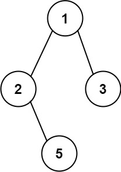

### 12、二叉树的所有路径（20231220，257题，简单。240724整理，38min）
<div style="border: 1px solid black; padding: 10px; background-color: SteelBlue;">

给你一个二叉树的根节点 root ，按 任意顺序 ，返回所有从根节点到叶子节点的路径。

叶子节点 是指没有子节点的节点。

 
示例 1：



- 输入：root = [1,2,3,null,5]
- 输出：["1->2->5","1->3"]

示例 2：

- 输入：root = [1]
- 输出：["1"]
 

提示：

- 树中节点的数目在范围 [1, 100] 内
- -100 <= Node.val <= 100

  </p>
</div>

<hr style="border-top: 5px solid #DC143C;">
<table>
  <tr>
    <td bgcolor="Yellow" style="padding: 5px; border: 0px solid black;">
      <span style="font-weight: bold; font-size: 20px;color: black;">
      重新整理（递归法，优化，参数使用引用，240724，38min）
      </span>
    </td>
  </tr>
</table>
<div style="padding: 0px; border: 1.5px solid LightSalmon; margin-bottom: 10px;">

```C++
 /*
 38min
 思路：
中序遍历，中左右；
递归时，将当前节点的值加入递归函数的参数string path中
    每加入一个值，都要将“->”字符加入
找到叶子叶子结点，将path最后一个“->”字符去掉，然后加入到结果vector<string> ret中
ret是成员

 */
class Solution {
public:
    vector<string> ret;

    void travelTree(TreeNode* cur_node, string& path){
        if(cur_node == nullptr) return;
        string str = to_string(cur_node->val);
        size_t str_size = str.size();
        size_t path_pre_size = path.size();
        int delete_len = str_size+2;  // 通常后续要将当前的数值和箭头都删除

        path = path + str + "->";  // path + str + "->" 拼接后要给path赋值！！！
        if(cur_node->left == nullptr && cur_node->right == nullptr){
            path.erase(path_pre_size+str_size, 2);
            ret.push_back(path);
            delete_len = str_size;  // 存储一条路径已经删除了箭头！！后续只需再删除当前数值
        }
        if(cur_node->left) travelTree(cur_node->left, path);
        if(cur_node->right) travelTree(cur_node->right, path);

        path.erase(path_pre_size, delete_len);  // 删除最后一个数字和箭头符号
    }
    vector<string> binaryTreePaths(TreeNode* root) {
        ret.clear();
        string path;

        travelTree(root, path);

        return ret;
    }
};
```

</div>


<table>
  <tr>
    <td bgcolor="Yellow" style="padding: 5px; border: 0px solid black;">
      <span style="font-weight: bold; font-size: 20px;color: black;">
      重新整理（递归法，240724，38min）
      </span>
    </td>
  </tr>
</table>
<div style="padding: 0px; border: 1.5px solid LightSalmon; margin-bottom: 10px;">

```C++
 /*
 38min
 思路：
中序遍历，中左右；
递归时，将当前节点的值加入递归函数的参数string path中
    每加入一个值，都要将“->”字符加入
找到叶子叶子结点，将path最后一个“->”字符去掉，然后加入到结果vector<string> ret中
ret是成员

 */
class Solution {
public:
    vector<string> ret;

    void travelTree(TreeNode* cur_node, string path){
        if(cur_node == nullptr) return;
        string str = to_string(cur_node->val);
        size_t str_size = str.size();
        size_t path_pre_size = path.size();
        // int delete_len = str_size+2;  // 通常后续要将当前的数值和箭头都删除

        path = path + str + "->";
        if(cur_node->left == nullptr && cur_node->right == nullptr){
            path.erase(path_pre_size+str_size, 2);
            ret.push_back(path);
            // delete_len = str_size;  // 存储一条路径已经删除了箭头！！后续只需再删除当前数值
        }
        if(cur_node->left) travelTree(cur_node->left, path);
        if(cur_node->right) travelTree(cur_node->right, path);

        // path.erase(path_pre_size, delete_len);  // 删除最后一个数字和箭头符号
    }
    vector<string> binaryTreePaths(TreeNode* root) {
        ret.clear();
        string path;

        travelTree(root, path);

        return ret;
    }
};
```

</div>


<hr style="border-top: 5px solid #DC143C;">
<table>
  <tr>
    <td bgcolor="Yellow" style="padding: 5px; border: 0px solid black;">
      <span style="font-weight: bold; font-size: 20px;color: black;">
      仿照答案（迭代法，240724，33min）
      </span>
    </td>
  </tr>
</table>
<div style="padding: 0px; border: 1.5px solid LightSalmon; margin-bottom: 10px;">

```C++
/*
33min
迭代法，思路：
先序遍历顺序读取二叉树，中左右
stack<TreeNode*> stk用来存储二叉树节点；
stack<string> pathStk用来存储处理当前节点cur_node时，当前路径上的节点组成的字符串

当遇到叶子节点时，将pathStk的top结果存入vector<string> result中
最后返回result！
*/
class Solution {
public:
    vector<string> binaryTreePaths(TreeNode* root) {

        TreeNode* cur_node = nullptr;
        stack<TreeNode*> node_stk;
        stack<string> path_stk;
        vector<string> result;

        node_stk.push(root);
        path_stk.push(to_string(root->val));
        while(!node_stk.empty()){
            cur_node = node_stk.top();
            node_stk.pop();
            string path = path_stk.top();
            path_stk.pop();

            if(cur_node->left == nullptr && cur_node->right == nullptr){
                result.push_back(path);
            }
            if(cur_node->right){
                node_stk.push(cur_node->right);
                // path += "->" + to_string(cur_node->right->val);
                // path_stk.push(path);  // 这两个if都可能会走到，所以下面的path会被这里的干扰！！！
                string str = path + "->" + to_string(cur_node->right->val);
                path_stk.push(str);
            } 
            if(cur_node->left){
                node_stk.push(cur_node->left);
                // path += "->" + to_string(cur_node->left->val);
                // path_stk.push(path);  // 这两个if都可能会走到，所以这里的path会被上面的干扰！！！
                string str = path + "->" + to_string(cur_node->left->val);
                path_stk.push(str);
            }

        }
        return result;
    }
};
```

</div>


<hr style="border-top: 5px solid #DC143C;">
<table>
  <tr>
    <td bgcolor="Yellow" style="padding: 5px; border: 0px solid black;">
      <span style="font-weight: bold; font-size: 20px;color: black;">
      自己答案（递归方法，通过！）
      </span>
    </td>
  </tr>
</table>
<div style="padding: 0px; border: 1.5px solid LightSalmon; margin-bottom: 10px;">

```C++
 /*
 思路：
 遍历树，每遍历一个节点，就将其存入tmp中；
 直到叶子结点，将tmp存入ret中；
 最后返回ret。
 */

// 去注释
class Solution {
public:
    vector<string> ret;
    string tmp;

    void getPath(TreeNode* cur)
    {
        if(cur == nullptr)
        {
            return;
        }
        tmp += to_string(cur->val) + "->";
        getPath(cur->left);
        getPath(cur->right);
        if(cur->left == nullptr && cur->right == nullptr)
        {
            ret.push_back(tmp.substr(0, tmp.length() - 2));  //删除最后两个字符 
        }
        tmp = tmp.substr(0, tmp.length() - to_string(cur->val).length() - 2);
        
        //tmp += to_string(cur.val) + "->";
    }
    vector<string> binaryTreePaths(TreeNode* root) {
        ret.clear();

        if(root == nullptr) return ret;

        getPath(root);

        return ret;
    }
};

// 初始版本
class Solution {
public:
    vector<string> ret;
    string tmp;

    void getPath(TreeNode* cur)
    {
        if(cur == nullptr)
        {
            return;
        }
        // if(cur->left != nullptr && cur->left != nullptr)
        // {
        //     ret.push_back(tmp.substr(0, tmp.length - 2));  //删除最后两个字符
        //     return;
        // }
        // if(cur->left != nullptr && cur->right == nullptr)  //左边不空，右边空
        // {
        //     getPath(cur->left);
        // }
        // else if(cur->left == nullptr && cur->right != nullptr) //左边空，右边不空
        // {
        //     getPath(cur->right);
        // }
        //tmp.push_back(to_string(cur.val));
        tmp += to_string(cur->val) + "->";
        getPath(cur->left);
        getPath(cur->right);
        if(cur->left == nullptr && cur->right == nullptr)
        {
            ret.push_back(tmp.substr(0, tmp.length() - 2));  //删除最后两个字符 
        }
        tmp = tmp.substr(0, tmp.length() - to_string(cur->val).length() - 2);
        
        //tmp += to_string(cur.val) + "->";
    }
    vector<string> binaryTreePaths(TreeNode* root) {
        ret.clear();

        if(root == nullptr) return ret;

        getPath(root);

        return ret;
    }
};
```

</div>


<hr style="border-top: 5px solid #DC143C;">
<table>
  <tr>
    <td bgcolor="Yellow" style="padding: 5px; border: 0px solid black;">
      <span style="font-weight: bold; font-size: 20px;color: black;">
      随想录答案（递归法）
      </span>
    </td>
  </tr>
</table>
<div style="padding: 0px; border: 1.5px solid LightSalmon; margin-bottom: 10px;">

```C++
// 版本一，path为引用传递！！！
class Solution {
private:

    void traversal(TreeNode* cur, vector<int>& path, vector<string>& result) {
        path.push_back(cur->val); // 中，中为什么写在这里，因为最后一个节点也要加入到path中 
        // 这才到了叶子节点
        if (cur->left == NULL && cur->right == NULL) {
            string sPath;
            for (int i = 0; i < path.size() - 1; i++) {
                sPath += to_string(path[i]);
                sPath += "->";
            }
            sPath += to_string(path[path.size() - 1]);
            result.push_back(sPath);
            return;
        }
        if (cur->left) { // 左 
            traversal(cur->left, path, result);
            path.pop_back(); // 回溯
        }
        if (cur->right) { // 右
            traversal(cur->right, path, result);
            path.pop_back(); // 回溯
        }
    }

public:
    vector<string> binaryTreePaths(TreeNode* root) {
        vector<string> result;
        vector<int> path;
        if (root == NULL) return result;
        traversal(root, path, result);
        return result;
    }
};

// 精简后，path改为了值传递！！！
class Solution {
private:

    void traversal(TreeNode* cur, string path, vector<string>& result) {
        path += to_string(cur->val); // 中
        if (cur->left == NULL && cur->right == NULL) {
            result.push_back(path);
            return;
        }
        if (cur->left) traversal(cur->left, path + "->", result); // 左
        if (cur->right) traversal(cur->right, path + "->", result); // 右
    }

public:
    vector<string> binaryTreePaths(TreeNode* root) {
        vector<string> result;
        string path;
        if (root == NULL) return result;
        traversal(root, path, result);
        return result;

    }
};

//版本二，精简版本的另类写法
class Solution {
private:
    void traversal(TreeNode* cur, string path, vector<string>& result) {
        path += to_string(cur->val); // 中，中为什么写在这里，因为最后一个节点也要加入到path中
        if (cur->left == NULL && cur->right == NULL) {
            result.push_back(path);
            return;
        }
        if (cur->left) {
            path += "->";
            traversal(cur->left, path, result); // 左
            path.pop_back(); // 回溯 '>'
            path.pop_back(); // 回溯 '-'
        }
        if (cur->right) {
            path += "->";
            traversal(cur->right, path, result); // 右
            path.pop_back(); // 回溯'>'
            path.pop_back(); // 回溯 '-'
        }
    }

public:
    vector<string> binaryTreePaths(TreeNode* root) {
        vector<string> result;
        string path;
        if (root == NULL) return result;
        traversal(root, path, result);
        return result;

    }
};
```

</div>

 <table>
  <tr>
    <td bgcolor="Yellow" style="padding: 5px; border: 0px solid black;">
      <span style="font-weight: bold; font-size: 20px;color: black;">
      随想录答案（迭代法）
      </span>
    </td>
  </tr>
</table>
<div style="padding: 0px; border: 1.5px solid LightSalmon; margin-bottom: 10px;">

```C++
class Solution {
public:
    vector<string> binaryTreePaths(TreeNode* root) {
        stack<TreeNode*> treeSt;// 保存树的遍历节点
        stack<string> pathSt;   // 保存遍历路径的节点
        vector<string> result;  // 保存最终路径集合
        if (root == NULL) return result;
        treeSt.push(root);
        pathSt.push(to_string(root->val));
        while (!treeSt.empty()) {
            TreeNode* node = treeSt.top(); treeSt.pop(); // 取出节点 中
            string path = pathSt.top();pathSt.pop();    // 取出该节点对应的路径
            if (node->left == NULL && node->right == NULL) { // 遇到叶子节点
                result.push_back(path);
            }
            if (node->right) { // 右
                treeSt.push(node->right);
                pathSt.push(path + "->" + to_string(node->right->val));
            }
            if (node->left) { // 左
                treeSt.push(node->left);
                pathSt.push(path + "->" + to_string(node->left->val));
            }
        }
        return result;
    }
};
```

</div>