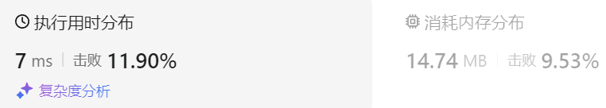
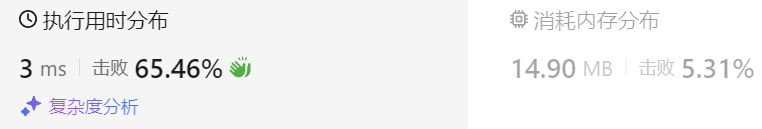

### 13、左叶子之和（20231221，404题，简单。240726整理，6min）
<div style="border: 1px solid black; padding: 10px; background-color: SteelBlue;">

给定二叉树的根节点 root ，返回所有左叶子之和。

 

示例 1：


- 输入: root = [3,9,20,null,null,15,7] 
- 输出: 24 
- 解释: 在这个二叉树中，有两个左叶子，分别是 9 和 15，所以返回 24

示例 2:

- 输入: root = [1]
- 输出: 0
 

提示:

- 节点数在 [1, 1000] 范围内
- -1000 <= Node.val <= 1000

  </p>
</div>

<hr style="border-top: 5px solid #DC143C;">
<table>
  <tr>
    <td bgcolor="Yellow" style="padding: 5px; border: 0px solid black;">
      <span style="font-weight: bold; font-size: 20px;color: black;">
      重新整理（递归法，异变的后续遍历，240726，6min）
      </span>
    </td>
  </tr>
</table>
<div style="padding: 0px; border: 1.5px solid LightSalmon; margin-bottom: 10px;">

```C++
 /*
 6min
 思路：
 递归法，异变的后续遍历，右左中
 空节点返回0；
 正常节点，检查左节点是否为叶子节点
    左节点是叶子节点，则返回叶子结点的值加上右节点返回值。
    左节点不是叶子节点，则返回左右子节点的返回值的和left+right。
 */
class Solution {
public:


    int sumOfLeftLeaves(TreeNode* root) {

        if(root == nullptr) return 0;

        int right = sumOfLeftLeaves(root->right);
        int left = sumOfLeftLeaves(root->left);
        
        if(root->left && root->left->left == nullptr && root->left->right == nullptr){
            return root->left->val + right;
        }
        return left+right;
    }
};
```

</div>



 <table>
  <tr>
    <td bgcolor="Yellow" style="padding: 5px; border: 0px solid black;">
      <span style="font-weight: bold; font-size: 20px;color: black;">
      重新整理（迭代法，深度优先遍历，使用栈，先序遍历，240726，6min）
      </span>
    </td>
  </tr>
</table>
<div style="padding: 0px; border: 1.5px solid LightSalmon; margin-bottom: 10px;">

```C++
 /*
 6min
 思路：
 迭代法，深度优先遍历，使用栈，先序遍历
 检查当前节点的左节点是否为叶子节点
    是叶子节点，则令返回的结果result加上叶子节点到的val
最后返回result
 */
class Solution {
public:


    int sumOfLeftLeaves(TreeNode* root) {

        if(root == nullptr) return 0;
        stack<TreeNode*> stk;
        TreeNode* cur_node = nullptr;
        stk.push(root);
        int result = 0;

        while(!stk.empty()){
            cur_node = stk.top();
            stk.pop();

            if(cur_node->left && cur_node->left->left == nullptr && cur_node->left->right == nullptr){
                result += cur_node->left->val;
            }

            if(cur_node->left) stk.push(cur_node->left);
            if(cur_node->right) stk.push(cur_node->right);
        }
        
        return result;
    }
};
```

</div>



<hr style="border-top: 5px solid #DC143C;">
<table>
  <tr>
    <td bgcolor="Yellow" style="padding: 5px; border: 0px solid black;">
      <span style="font-weight: bold; font-size: 20px;color: black;">
      自己答案（递归方法，通过！）
      </span>
    </td>
  </tr>
</table>
<div style="padding: 0px; border: 1.5px solid LightSalmon; margin-bottom: 10px;">


```C++
 /*
 思路：
 遍历整个树，令左右节点分别返回其所有左子结点的和。
 */
class Solution {
public:
    int sum;

    int countLeftSum(TreeNode* cur)
    {
        if(cur == nullptr) return 0;

        if(cur->left->left == nullptr && cur->left->right == nullptr)
        {
            return cur->left->val;
        }

        int leftSum = sumOfLeftLeaves(root->left);
        int rightSum = sumOfLeftLeaves(root->right);
        
    }
    int sumOfLeftLeaves(TreeNode* root) {
        sum = 0;

        countLeftSum(root);

        return sum;
    }
};
```

</div>


<hr style="border-top: 5px solid #DC143C;">
<table>
  <tr>
    <td bgcolor="Yellow" style="padding: 5px; border: 0px solid black;">
      <span style="font-weight: bold; font-size: 20px;color: black;">
      随想录答案（递归法）
      </span>
    </td>
  </tr>
</table>
<div style="padding: 0px; border: 1.5px solid LightSalmon; margin-bottom: 10px;">

```C++
class Solution {
public:
    int sumOfLeftLeaves(TreeNode* root) {
        if (root == NULL) return 0;
        if (root->left == NULL && root->right== NULL) return 0;

        int leftValue = sumOfLeftLeaves(root->left);    // 左
        if (root->left && !root->left->left && !root->left->right) { // 左子树就是一个左叶子的情况
            leftValue = root->left->val;
        }
        int rightValue = sumOfLeftLeaves(root->right);  // 右

        int sum = leftValue + rightValue;               // 中
        return sum;
    }
};
```

</div>

<table>
  <tr>
    <td bgcolor="Yellow" style="padding: 5px; border: 0px solid black;">
      <span style="font-weight: bold; font-size: 20px;color: black;">
      随想录答案（迭代法，使用栈）
      </span>
    </td>
  </tr>
</table>
<div style="padding: 0px; border: 1.5px solid LightSalmon; margin-bottom: 10px;">

```C++
class Solution {
public:
    int sumOfLeftLeaves(TreeNode* root) {
        stack<TreeNode*> st;
        if (root == NULL) return 0;
        st.push(root);
        int result = 0;
        while (!st.empty()) {
            TreeNode* node = st.top();
            st.pop();
            if (node->left != NULL && node->left->left == NULL && node->left->right == NULL) {
                result += node->left->val;
            }
            if (node->right) st.push(node->right);
            if (node->left) st.push(node->left);
        }
        return result;
    }
};
```

</div>