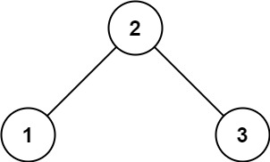
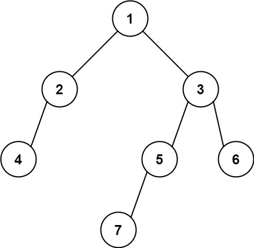
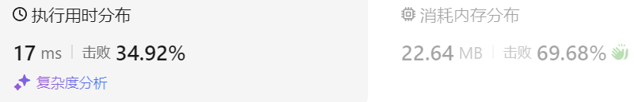

### 14、找树左下角的值（20231221，513题，中等。240726整理，15min）
<div style="border: 1px solid black; padding: 10px; background-color: SteelBlue;">

给定一个二叉树的 根节点 root，请找出该二叉树的 最底层 最左边 节点的值。

假设二叉树中至少有一个节点。

 

示例 1:




- 输入: root = [2,1,3]
- 输出: 1

示例 2:



- 输入: [1,2,3,4,null,5,6,null,null,7]
- 输出: 7
 

提示:

- 二叉树的节点个数的范围是 [1,104]
- -231 <= Node.val <= 231 - 1 

  </p>
</div>

<hr style="border-top: 5px solid #DC143C;">
<table>
  <tr>
    <td bgcolor="Yellow" style="padding: 5px; border: 0px solid black;">
      <span style="font-weight: bold; font-size: 20px;color: black;">
      重新整理（迭代法，层序遍历，使用队列，240726，15min）
      </span>
    </td>
  </tr>
</table>
<div style="padding: 0px; border: 1.5px solid LightSalmon; margin-bottom: 10px;">

```C++
/*
15min
思路：
找的是最底层最左边的节点，没要求必须是左叶子节点！！！
迭代法，层序遍历，使用队列
用result记录每层第一个节点，is_first判断是否为第一个节点
最后返回result。
*/ 
class Solution {
public:
    int findBottomLeftValue(TreeNode* root) {
        // if(root->left == nullptr && root->right == nullptr) return root->val;
        queue<TreeNode*> que;
        TreeNode* cur_node = nullptr;

        que.push(root);
        bool is_first = true;
        int result = -1;

        while(!que.empty()){
            int size = que.size();

            for(int i = 0; i < size; i++){
                cur_node = que.front();
                que.pop();

                // if(cur_node->left && cur_node->left->left == nullptr && cur_node->left->right == nullptr && is_first)
                if(is_first){  // 可以在i=0时记录result，不用is_first标记！！！
                    result = cur_node->val;
                    is_first = false;
                }

                if(cur_node->left) que.push(cur_node->left);
                if(cur_node->right) que.push(cur_node->right);
            }
            is_first = true;
        }
        return result;
    }
};
```

</div>


 <table>
  <tr>
    <td bgcolor="Yellow" style="padding: 5px; border: 0px solid black;">
      <span style="font-weight: bold; font-size: 20px;color: black;">
      重新整理（递归法，240724，9min）
      </span>
    </td>
  </tr>
</table>
<div style="padding: 0px; border: 1.5px solid LightSalmon; margin-bottom: 10px;">

```C++
/*
9min
思路：
递归法，
成员result记录递归中找到的第一个最左值；
成员depth记录之前到过的最大深度；
递归遍历树时，使用cur_depth记录当前的深度
    当cur_depth > depth时，说明到了新的深度，更新result；
    同时depth = cur_depth，防止遍历后续同层节点再次更新result
最后返回result。
*/ 
class Solution {
public:

    int depth;
    int result;
    void travelTree(TreeNode* cur_node, int cur_depth){
        if(cur_node == nullptr) return;

        if(cur_depth > depth){
            result = cur_node->val;
            depth = cur_depth;
        }

        if(cur_node->left) travelTree(cur_node->left, cur_depth+1);
        if(cur_node->right) travelTree(cur_node->right, cur_depth+1);
    }
    int findBottomLeftValue(TreeNode* root) {
        depth = 0;
        result = 0;

        travelTree(root, 1);

        return result;
    }
};
```

</div>



<hr style="border-top: 5px solid #DC143C;">
<table>
  <tr>
    <td bgcolor="Yellow" style="padding: 5px; border: 0px solid black;">
      <span style="font-weight: bold; font-size: 20px;color: black;">
      自己答案（递归方法，通过！）
      </span>
    </td>
  </tr>
</table>
<div style="padding: 0px; border: 1.5px solid LightSalmon; margin-bottom: 10px;">

```C++
/*
思路：
使用层序遍历，每次将当前层的第一个数存入成员变量ret中，
遍历整个树之后，ret中存的就是左下角的值了。
*/ 
class Solution {
public:
    int ret = 0;

    int findBottomLeftValue(TreeNode* root) {
        queue<TreeNode*> que;
        que.push(root);
        while(!que.empty())
        {
            int que_size = que.size();
            for(int i = 0; i < que_size; i++)
            {
                TreeNode* tmp = que.front();
                que.pop();
                if(tmp->left != nullptr) que.push(tmp->left);
                if(tmp->right != nullptr) que.push(tmp->right);
                if(i == 0) ret = tmp->val;
            }
        }
        return ret;
    }
};
```

</div>


<hr style="border-top: 5px solid #DC143C;">
<table>
  <tr>
    <td bgcolor="Yellow" style="padding: 5px; border: 0px solid black;">
      <span style="font-weight: bold; font-size: 20px;color: black;">
      随想录答案（递归法）
      </span>
    </td>
  </tr>
</table>
<div style="padding: 0px; border: 1.5px solid LightSalmon; margin-bottom: 10px;">

```C++
class Solution {
public:
    int maxDepth = INT_MIN;
    int result;
    void traversal(TreeNode* root, int depth) {
        if (root->left == NULL && root->right == NULL) {
            if (depth > maxDepth) {
                maxDepth = depth;
                result = root->val;
            }
            return;
        }
        if (root->left) {
            depth++;
            traversal(root->left, depth);
            depth--; // 回溯
        }
        if (root->right) {
            depth++;
            traversal(root->right, depth);
            depth--; // 回溯
        }
        return;
    }
    int findBottomLeftValue(TreeNode* root) {
        traversal(root, 0);
        return result;
    }
};

// 回溯的地方可以精简，精简代码如下
class Solution {
public:
    int maxDepth = INT_MIN;
    int result;
    void traversal(TreeNode* root, int depth) {
        if (root->left == NULL && root->right == NULL) {
            if (depth > maxDepth) {
                maxDepth = depth;
                result = root->val;
            }
            return;
        }
        if (root->left) {
            traversal(root->left, depth + 1); // 隐藏着回溯
        }
        if (root->right) {
            traversal(root->right, depth + 1); // 隐藏着回溯
        }
        return;
    }
    int findBottomLeftValue(TreeNode* root) {
        traversal(root, 0);
        return result;
    }
};
```

</div>


 <table>
  <tr>
    <td bgcolor="Yellow" style="padding: 5px; border: 0px solid black;">
      <span style="font-weight: bold; font-size: 20px;color: black;">
      随想录答案（迭代法）
      </span>
    </td>
  </tr>
</table>
<div style="padding: 0px; border: 1.5px solid LightSalmon; margin-bottom: 10px;">

```C++
class Solution {
public:
    int findBottomLeftValue(TreeNode* root) {
        queue<TreeNode*> que;
        if (root != NULL) que.push(root);
        int result = 0;
        while (!que.empty()) {
            int size = que.size();
            for (int i = 0; i < size; i++) {
                TreeNode* node = que.front();
                que.pop();
                if (i == 0) result = node->val; // 记录最后一行第一个元素
                if (node->left) que.push(node->left);
                if (node->right) que.push(node->right);
            }
        }
        return result;
    }
};
```

</div>