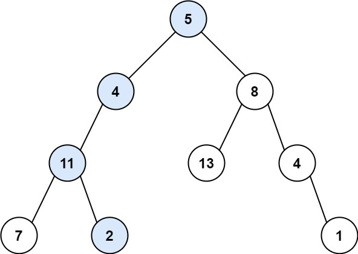
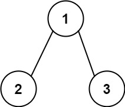
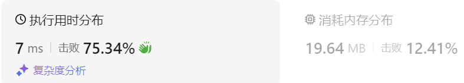
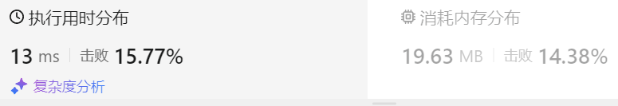
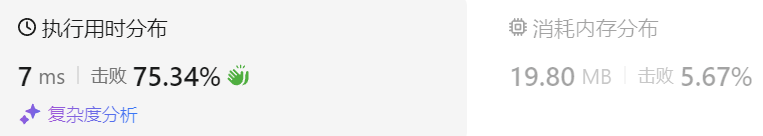
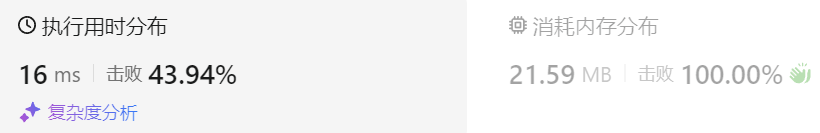

### 15、路径总和（20231222，106题，简单。240729整理，10min）
<div style="border: 1px solid black; padding: 10px; background-color: SteelBlue;">

给你二叉树的根节点 root 和一个表示目标和的整数 targetSum 。  
判断该树中是否存在 根节点到叶子节点 的路径，这条路径上所有节点值相加等于目标和 targetSum 。  
如果存在，返回 true ；否则，返回 false 。  

叶子节点 是指没有子节点的节点。

 

示例 1：



- 输入：root = [5,4,8,11,null,13,4,7,2,null,null,null,1], targetSum = 22
- 输出：true
- 解释：等于目标和的根节点到叶节点路径如上图所示。

示例 2：



- 输入：root = [1,2,3], targetSum = 5
- 输出：false
- 解释：  
树中存在两条根节点到叶子节点的路径：  
(1 --> 2): 和为 3  
(1 --> 3): 和为 4  
不存在 sum = 5 的根节点到叶子节点的路径。  

示例 3：

- 输入：root = [], targetSum = 0
- 输出：false
- 解释：由于树是空的，所以不存在根节点到叶子节点的路径。
 

提示：

- 树中节点的数目在范围 [0, 5000] 内
- -1000 <= Node.val <= 1000
- -1000 <= targetSum <= 1000

  </p>
</div>

<hr style="border-top: 5px solid #DC143C;">
<table>
  <tr>
    <td bgcolor="Yellow" style="padding: 5px; border: 0px solid black;">
      <span style="font-weight: bold; font-size: 20px;color: black;">
      重新整理（递归法，240729，10min）
      </span>
    </td>
  </tr>
</table>
<div style="padding: 0px; border: 1.5px solid LightSalmon; margin-bottom: 10px;">

```C++ {.line-numbers}
/*
10min
思路：
递归遍历树，将sum作为参数传入，记录当前路径中节点累加和
sum需要在递归后进行回溯

找到叶子结点的累加和sum==targetSum时，返回false
空节点返回true
    这样只要存在“sum==targetSum”情况，就=递归最后返回的是false
    最后返回递归的取反即可！
*/
class Solution {
public:
    bool travelTree(TreeNode* cur_node, int targetSum, int sum){
        if(cur_node == nullptr) return true;

        sum += cur_node->val;
        if(cur_node->left == nullptr && cur_node->right == nullptr && sum == targetSum) return false;

        bool left = travelTree(cur_node->left, targetSum, sum);
        bool right = travelTree(cur_node->right, targetSum, sum);

        sum -= cur_node->val;

        return left && right;
    }

    bool hasPathSum(TreeNode* root, int targetSum) {
        int sum = 0;
        bool ret = travelTree(root, targetSum, sum);

        return !ret;
    }
};
```

</div>



<hr style="border-top: 5px solid #DC143C;">
<table>
  <tr>
    <td bgcolor="Yellow" style="padding: 5px; border: 0px solid black;">
      <span style="font-weight: bold; font-size: 20px;color: black;">
      仿照答案思路（递归法，240729，11min）
      </span>
    </td>
  </tr>
</table>
<div style="padding: 0px; border: 1.5px solid LightSalmon; margin-bottom: 10px;">

```C++ {.line-numbers}
/*
11min
思路：
将targetSum转为count，意为targetSum减去当前节点对应路径上的所有节点之后的剩余值
剩余的count为0，且当前节点为叶子节点时，说明找打了正确的路径。
只要找到满足条件的叶子节点，返回即可；
    这种情况可以让递归为true时，返回true，结束递归
    递归为false时，返回false，这样自动进行后面的递归！！！
 */
class Solution {
public:
    bool travelTree(TreeNode* cur_node, int count){
        if(cur_node->left == nullptr && cur_node->right == nullptr && count == 0) return true;
        if(cur_node->left == nullptr && cur_node->right == nullptr) return false;

        if(cur_node->left){
            // bool left = travelTree(cur_node->left, count - cur_node->left->val);
            // if(left) return true;

            // if(travelTree(cur_node->left, count - cur_node->val)) return true;
            // 递归处理的哪个节点，就减去哪个节点的值。递归函数开头的两个if判断就是基于本节点的val已经从总数中减去的情况！！
            if(travelTree(cur_node->left, count - cur_node->left->val)) return true;
        }

        if(cur_node->right){
            // if(travelTree(cur_node->right, count - cur_node->val)) return true;
            // 递归处理的哪个节点，就减去哪个节点的值。递归函数开头的两个if判断就是基于本节点的val已经从总数中减去的情况！！
            if(travelTree(cur_node->right, count - cur_node->right->val)) return true;
        }

        return false;
    }


    bool hasPathSum(TreeNode* root, int targetSum) {
        if(root == nullptr) return false;

        return travelTree(root, targetSum - root->val);
    }
};
```

</div>




<table>
  <tr>
    <td bgcolor="Yellow" style="padding: 5px; border: 0px solid black;">
      <span style="font-weight: bold; font-size: 20px;color: black;">
      仿照答案思路改写（迭代法，240729，8min）
      </span>
    </td>
  </tr>
</table>
<div style="padding: 0px; border: 1.5px solid LightSalmon; margin-bottom: 10px;">

```C++ {.line-numbers}
/*
8min
迭代法，思路：
使用一个节点栈stack<TreeNode*> node_stk记录遍历的节点
使用一个整型stack<int> count_stk记录当前路径下，各节点的和
当node_stk的top节点为叶子节点，且count_stk的top值等于targetSum时，返回true

while循环后，说明没找到合适的节点，最后返回false。
 */
class Solution {
public:
    bool hasPathSum(TreeNode* root, int targetSum) {
        if(root == nullptr) return false;

        stack<TreeNode*> node_stk;
        stack<int> count_stk;

        node_stk.push(root);
        count_stk.push(root->val);
        while(!node_stk.empty()){
            TreeNode* cur_node = node_stk.top();
            node_stk.pop();

            int cur_sum = count_stk.top();
            count_stk.pop();

            if(cur_node->left == nullptr && cur_node->right == nullptr && cur_sum == targetSum) return true;

            if(cur_node->left){
                node_stk.push(cur_node->left);
                count_stk.push(cur_sum + cur_node->left->val);
            }

            if(cur_node->right){
                node_stk.push(cur_node->right);
                count_stk.push(cur_sum + cur_node->right->val);
            }
        }
        return false;
    }
};
```

</div>



<hr style="border-top: 5px solid #DC143C;">
<table>
  <tr>
    <td bgcolor="Yellow" style="padding: 5px; border: 0px solid black;">
      <span style="font-weight: bold; font-size: 20px;color: black;">
      自己答案（递归方法，通过！）
      </span>
    </td>
  </tr>
</table>
<div style="padding: 0px; border: 1.5px solid LightSalmon; margin-bottom: 10px;">

```C++ {.line-numbers}
 /*
 思路：
 成员变量isTrue记录遍历结果
 遍历到叶子结点后，返回这条路径的和，对比target，相等则将isTrue改为true
 最后返回isTrue；
 */
class Solution {
public:
    bool isTrue = false;
    int sum;

    void getPathSum(TreeNode* cur, int targetSum)
    {
        if(cur == nullptr) return;

        sum += cur->val;
        getPathSum(cur->left, targetSum);
        getPathSum(cur->right, targetSum);
        if(cur->left == nullptr && cur->right == nullptr && sum == targetSum)
        {
            isTrue = true;
        }
        sum -= cur->val;

    }
    bool hasPathSum(TreeNode* root, int targetSum) {
        sum = 0;

        getPathSum(root, targetSum);

        return isTrue;
    }
};
```

</div>




<hr style="border-top: 5px solid #DC143C;">
<table>
  <tr>
    <td bgcolor="Yellow" style="padding: 5px; border: 0px solid black;">
      <span style="font-weight: bold; font-size: 20px;color: black;">
      随想录答案（迭代法）
      </span>
    </td>
  </tr>
</table>
<div style="padding: 0px; border: 1.5px solid LightSalmon; margin-bottom: 10px;">

```C++ {.line-numbers}
class Solution {
private:
    bool traversal(TreeNode* cur, int count) {
        if (!cur->left && !cur->right && count == 0) return true; // 遇到叶子节点，并且计数为0
        if (!cur->left && !cur->right) return false; // 遇到叶子节点直接返回

        if (cur->left) { // 左
            count -= cur->left->val; // 递归，处理节点;
            if (traversal(cur->left, count)) return true;
            count += cur->left->val; // 回溯，撤销处理结果
        }
        if (cur->right) { // 右
            count -= cur->right->val; // 递归，处理节点;
            if (traversal(cur->right, count)) return true;
            count += cur->right->val; // 回溯，撤销处理结果
        }
        return false;
    }

public:
    bool hasPathSum(TreeNode* root, int sum) {
        if (root == NULL) return false;
        return traversal(root, sum - root->val);
    }
};

// 简化回溯部分
class Solution {
private:
    bool traversal(TreeNode* cur, int count) {
        if (!cur->left && !cur->right && count == 0) return true; // 遇到叶子节点，并且计数为0
        if (!cur->left && !cur->right) return false; // 遇到叶子节点直接返回

        if (cur->left) { // 左 （空节点不遍历）
            // 遇到叶子节点返回true，则直接返回true
            if (traversal(cur->left, count - cur->left->val)) return true; // 注意这里有回溯的逻辑
        }
        if (cur->right) { // 右 （空节点不遍历）
            // 遇到叶子节点返回true，则直接返回true
            if (traversal(cur->right, count - cur->right->val)) return true; // 注意这里有回溯的逻辑
        }
        return false;
    }

public:
    bool hasPathSum(TreeNode* root, int sum) {
        if (root == NULL) return false;
        return traversal(root, sum - root->val);
    }
};

```

</div>

 <table>
  <tr>
    <td bgcolor="Yellow" style="padding: 5px; border: 0px solid black;">
      <span style="font-weight: bold; font-size: 20px;color: black;">
      重新整理（递归法）
      </span>
    </td>
  </tr>
</table>
<div style="padding: 0px; border: 1.5px solid LightSalmon; margin-bottom: 10px;">

```C++ {.line-numbers}
class solution {

public:
    bool haspathsum(TreeNode* root, int sum) {
        if (root == null) return false;
        // 此时栈里要放的是pair<节点指针，路径数值>
        stack<pair<TreeNode*, int>> st;
        st.push(pair<TreeNode*, int>(root, root->val));
        while (!st.empty()) {
            pair<TreeNode*, int> node = st.top();
            st.pop();
            // 如果该节点是叶子节点了，同时该节点的路径数值等于sum，那么就返回true
            if (!node.first->left && !node.first->right && sum == node.second) return true;

            // 右节点，压进去一个节点的时候，将该节点的路径数值也记录下来
            if (node.first->right) {
                st.push(pair<TreeNode*, int>(node.first->right, node.second + node.first->right->val));
            }

            // 左节点，压进去一个节点的时候，将该节点的路径数值也记录下来
            if (node.first->left) {
                st.push(pair<TreeNode*, int>(node.first->left, node.second + node.first->left->val));
            }
        }
        return false;
    }
};
```

</div>


