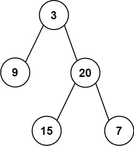

### 16、从中序与后序遍历序列构造二叉树（20240620，112题，中等）
<div style="border: 1px solid black; padding: 10px; background-color: SteelBlue;">

给定两个整数数组 inorder 和 postorder ，其中 inorder 是二叉树的中序遍历， postorder 是同一棵树的后序遍历，请你构造并返回这颗 二叉树 。

 

示例 1:



- 输入：inorder = [9,3,15,20,7], postorder = [9,15,7,20,3]
- 输出：[3,9,20,null,null,15,7]

示例 2:

- 输入：inorder = [-1], postorder = [-1]
- 输出：[-1]
 

提示:

- 1 <= inorder.length <= 3000
- postorder.length == inorder.length
- -3000 <= inorder[i], postorder[i] <= 3000
- inorder 和 postorder 都由 不同 的值组成
- postorder 中每一个值都在 inorder 中
- inorder 保证是树的中序遍历
- postorder 保证是树的后序遍历

  </p>
</div>

<hr style="border-top: 5px solid #DC143C;">
<table>
  <tr>
    <td bgcolor="Yellow" style="padding: 5px; border: 0px solid black;">
      <span style="font-weight: bold; font-size: 20px;color: black;">
      自己答案（通过！）
      </span>
    </td>
  </tr>
</table>
<div style="padding: 0px; border: 1.5px solid LightSalmon; margin-bottom: 10px;">

```C++ {.line-numbers}
/*
思路：
后序的最后元素为中序遍历的中间节点，可用于区分中序遍历的左右子树，进而后续遍历的左右子树也确定。
递归处理左右子树。
*/

// 去注释
class Solution {
public:

    TreeNode* buildTree(vector<int>& inorder, vector<int>& postorder) {
        size_t size = inorder.size();

        if(size == 1){
            TreeNode* cur_mid_node = new TreeNode(inorder[0]);  
            return cur_mid_node;
        }
        // 处理中序遍历，构建哈希，方便通过后续遍历中找到的中间节点，确定其在中序遍历的索引
        unordered_map<int,int> in_map;   

        for(int i = 0; i < size; i++){
            in_map[inorder[i]] = i;     // in_map[num[i]] = i 
        }

        int mid_node_val = postorder.back();  // 取中间节点值
        TreeNode* cur_mid_node = new TreeNode(mid_node_val);   

        int inorder_mid_node_index = in_map[mid_node_val];  
        
        // 需要确保中序里面，中间元素区分开的左右子树的元素个数大于0，不然vector处理会出问题！！！
        vector<int> inorder_left, inorder_right, postorder_left, postorder_right;
        if(inorder_mid_node_index == 0){  // 中间元素索引为0，说明左子树没有
            cur_mid_node->left = nullptr;
            inorder_right = vector<int>(inorder.begin() + 1, inorder.begin() + size); // 中序右子树元素集合
            postorder_right = vector<int>(postorder.begin(), postorder.begin() + inorder_right.size()); // 后序右子树元素集合  size - 1 / inorder_right.size()
        }else if(inorder_mid_node_index == size-1){ // 中间元素索引为size-1，说明右子树没有
            cur_mid_node->right = nullptr;
            inorder_left = vector<int>(inorder.begin(), inorder.begin() + inorder_mid_node_index);  // 中序左子树元素集合
            postorder_left = vector<int>(postorder.begin(), postorder.begin() + inorder_left.size());   // 后序左子树元素集合
        }else{    // 左右子树都存在情况
            inorder_left = vector<int>(inorder.begin(), inorder.begin() + inorder_mid_node_index);  // 中序左子树元素集合
            inorder_right = vector<int>(inorder.begin() + inorder_mid_node_index + 1, inorder.begin() + size); // 中序右子树元素集合
        
            postorder_left = vector<int>(postorder.begin(), postorder.begin() + inorder_left.size());   // 后序左子树元素集合
            postorder_right = vector<int>(postorder.begin() + inorder_left.size(), postorder.begin() + size - 1); // 后序右子树元素集合
        }

        if(inorder_left.size() == 0 && inorder_right.size() != 0) {
            cur_mid_node->left = nullptr;
            cur_mid_node->right = buildTree(inorder_right, postorder_right);  // 遍历右子树
        }else if(inorder_left.size() != 0 && inorder_right.size() == 0){
            cur_mid_node->left = buildTree(inorder_left, postorder_left);   // 遍历左子树
            cur_mid_node->right = nullptr;
        }else if(inorder_left.size() == 0 && inorder_right.size() == 0) {
            cur_mid_node->left = nullptr;
            cur_mid_node->right = nullptr;
        }else{
            cur_mid_node->left = buildTree(inorder_left, postorder_left);   // 遍历左子树
            cur_mid_node->right = buildTree(inorder_right, postorder_right);  // 遍历右子树
        }
        
        return cur_mid_node;
    }
};

// 初始版本
class Solution {
public:

    TreeNode* buildTree(vector<int>& inorder, vector<int>& postorder) {
        size_t size = inorder.size();

        if(size == 1){
            TreeNode* cur_mid_node = new TreeNode(inorder[0]);  // TreeNode* cur_mid_node = TreeNode(inorder[0]); 指针需要new，不new是非指针的实例化。。
            return cur_mid_node;
        }
        // 处理中序遍历，构建哈希，方便通过后续遍历中找到的中间节点，确定其在中序遍历的索引
        unordered_map<int,int> in_map;  // unordered_map<int> in_map; map定义写错了。。

        for(int i = 0; i < size; i++){
            in_map[inorder[i]] = i;     // in_map[num[i]] = i;处理的是inorder，而不是不存在的num。。
        }

        int mid_node_val = postorder.back();  // 取中间节点值
        TreeNode* cur_mid_node = new TreeNode(mid_node_val);  // new TreeNode(mid_node);上面从mid_node改为了int mid_node_val，但这里忘了改了。。

        int inorder_mid_node_index = in_map[mid_node_val];    // inorder_mid_node_index = in_map[mid_node];声明忘了写数据类型。。
        
        // 需要确保中序里面，中间元素区分开的左右子树的元素个数大于0，不然vector处理会出问题！！！
        vector<int> inorder_left, inorder_right, postorder_left, postorder_right;
        if(inorder_mid_node_index == 0){  // 中间元素索引为0，说明左子树没有
            cur_mid_node->left = nullptr;
            inorder_right = vector<int>(inorder.begin() + 1, inorder.begin() + size); // 中序右子树元素集合
            postorder_right = vector<int>(postorder.begin(), postorder.begin() + inorder_right.size()); // 后序右子树元素集合  size - 1 / inorder_right.size()
        }else if(inorder_mid_node_index == size-1){ // 中间元素索引为size-1，说明右子树没有
            cur_mid_node->right = nullptr;
            inorder_left = vector<int>(inorder.begin(), inorder.begin() + inorder_mid_node_index);  // 中序左子树元素集合
            postorder_left = vector<int>(postorder.begin(), postorder.begin() + inorder_left.size());   // 后序左子树元素集合
        }else{    // 左右子树都存在情况
            inorder_left = vector<int>(inorder.begin(), inorder.begin() + inorder_mid_node_index);  // 中序左子树元素集合
            inorder_right = vector<int>(inorder.begin() + inorder_mid_node_index + 1, inorder.begin() + size); // 中序右子树元素集合
        
            postorder_left = vector<int>(postorder.begin(), postorder.begin() + inorder_left.size());   // 后序左子树元素集合
            postorder_right = vector<int>(postorder.begin() + inorder_left.size(), postorder.begin() + size - 1); // 后序右子树元素集合
        }

        // if(cur_mid_node->left == nullptr) {  // 左右子树都存在情况下，这个条件也是成立的，所以不能这么判断。。
        //     cur_mid_node->right = buildTree(inorder_right, postorder_right);  // 遍历右子树
        // }else if(cur_mid_node->right == nullptr){
        //     cur_mid_node->left = buildTree(inorder_left, postorder_left);   // 遍历左子树
        // }else{
        //     cur_mid_node->left = buildTree(inorder_left, postorder_left);   // 遍历左子树
        //     cur_mid_node->right = buildTree(inorder_right, postorder_right);  // 遍历右子树
        // }
        

        if(inorder_left.size() == 0 && inorder_right.size() != 0) {
            cur_mid_node->left = nullptr;
            cur_mid_node->right = buildTree(inorder_right, postorder_right);  // 遍历右子树
        }else if(inorder_left.size() != 0 && inorder_right.size() == 0){
            cur_mid_node->left = buildTree(inorder_left, postorder_left);   // 遍历左子树
            cur_mid_node->right = nullptr;
        }else if(inorder_left.size() == 0 && inorder_right.size() == 0) {
            cur_mid_node->left = nullptr;
            cur_mid_node->right = nullptr;
        }else{
            cur_mid_node->left = buildTree(inorder_left, postorder_left);   // 遍历左子树
            cur_mid_node->right = buildTree(inorder_right, postorder_right);  // 遍历右子树
        }
        
        return cur_mid_node;
    }
};
```

</div>


<hr style="border-top: 5px solid #DC143C;">
<table>
  <tr>
    <td bgcolor="Yellow" style="padding: 5px; border: 0px solid black;">
      <span style="font-weight: bold; font-size: 20px;color: black;">
      仿照答案（传入索引）
      </span>
    </td>
  </tr>
</table>
<div style="padding: 0px; border: 1.5px solid LightSalmon; margin-bottom: 10px;">

```C++ {.line-numbers}
/*
思路：
后续的最后元素中间节点，可用于区分中序遍历的左右子树，进而后续遍历的左右子树也确定。
递归处理左右子树。

递归处理中，可以不用一直造新的容器存放左右子树，可以只传递左右子树在初始数组中的索引！！！
 */
class Solution {
public:

    TreeNode* backTracking(vector<int>& inorder, int inorder_left, int inorder_right, vector<int>& postorder, int postorder_left, int postorder_right) {

        // 只考虑当前传进来的左右子树，是空的，怎么空的，看具体实现；但在具体实现中不考虑空的情况（按照设想的逻辑构建左右子树，并进行递归即可），在这里统一处理！！！
        if(inorder_right < 0 || postorder_left > postorder_right){  // 由于用的左闭右闭来描述新的左右子树的区间，则左或者右子树不存在的情况就是这样的
            return nullptr;
        }

        int mid_node_val = postorder[postorder_right];  
        TreeNode* cur_mid_node = new TreeNode(mid_node_val);  

        // if(size == 1){
        //     return cur_mid_node;
        // }
        if(inorder_right - inorder_left == 0){
            return cur_mid_node;
        }

        // 1、遍历中序数组，找到当前中间节点
        int inorder_mid_node_index = 0;
        for(int i = inorder_left; i <= inorder_right; i++){
            int num = inorder[i];
            if(num == mid_node_val) inorder_mid_node_index = i;
        }

        // inorder_left = vector<int>(inorder.begin(), inorder.begin() + inorder_mid_node_index);  // 中序左子树元素集合
        int inorder_left_tree_left = inorder_left;  // inorder_left_tree_left = inorder_left; 使用新变量，别忘记声明它的数据类型
        int inorder_left_tree_right = inorder_mid_node_index-1;

        // inorder_right = vector<int>(inorder.begin() + inorder_mid_node_index + 1, inorder.begin() + size); // 中序右子树元素集合
        int inorder_right_tree_left = inorder_mid_node_index+1;
        int inorder_right_tree_right = inorder_right;

        // postorder_left = vector<int>(postorder.begin(), postorder.begin() + inorder_left.size());   // 后序左子树元素集合
        int postorder_left_tree_left = postorder_left;
        int postorder_left_tree_right = postorder_left + (inorder_left_tree_right - inorder_left_tree_left);  // 4、后序左边界，加上中序那边计算得到的左子树长度，即为后序左子树的右边界。由于索引从0开始，本来求长度要加1，索引位置要减1，刚好抵消！！！

        // postorder_right = vector<int>(postorder.begin() + inorder_left.size(), postorder.begin() + size - 1); // 后序右子树元素集合
        int postorder_right_tree_left = postorder_left_tree_right + 1;
        int postorder_right_tree_right = postorder_right - 1; 

        // cur_mid_node->left = backTracking(inorder_left, postorder_left);   // 遍历左子树
        // cur_mid_node->right = backTracking(inorder_right, postorder_right);  // 遍历右子树
        cur_mid_node->left = backTracking(inorder, inorder_left_tree_left, inorder_left_tree_right, postorder, postorder_left_tree_left , postorder_left_tree_right);   // 遍历左子树
        cur_mid_node->right = backTracking(inorder, inorder_right_tree_left, inorder_right_tree_right, postorder, postorder_right_tree_left, postorder_right_tree_right);  // 遍历右子树
        
        return cur_mid_node;
    }

    TreeNode* buildTree(vector<int>& inorder, vector<int>& postorder) {
        size_t size = inorder.size();

        // 第二个索引是最后一个元素的位置，size=1的时候，就是在0处
        TreeNode* root = backTracking(inorder, 0 , size-1, postorder, 0 , size-1);
        return root;
    }
};
```

</div>


<hr style="border-top: 5px solid #DC143C;">
<table>
  <tr>
    <td bgcolor="Yellow" style="padding: 5px; border: 0px solid black;">
      <span style="font-weight: bold; font-size: 20px;color: black;">
      随想录答案（传入索引）
      </span>
    </td>
  </tr>
</table>
<div style="padding: 0px; border: 1.5px solid LightSalmon; margin-bottom: 10px;">

```C++ {.line-numbers}
class Solution {
private:
    // 中序区间：[inorderBegin, inorderEnd)，后序区间[postorderBegin, postorderEnd)
    TreeNode* traversal (vector<int>& inorder, int inorderBegin, int inorderEnd, vector<int>& postorder, int postorderBegin, int postorderEnd) {
        if (postorderBegin == postorderEnd) return NULL;

        int rootValue = postorder[postorderEnd - 1];
        TreeNode* root = new TreeNode(rootValue);

        if (postorderEnd - postorderBegin == 1) return root;

        int delimiterIndex;
        for (delimiterIndex = inorderBegin; delimiterIndex < inorderEnd; delimiterIndex++) {
            if (inorder[delimiterIndex] == rootValue) break;
        }
        // 切割中序数组
        // 左中序区间，左闭右开[leftInorderBegin, leftInorderEnd)
        int leftInorderBegin = inorderBegin;
        int leftInorderEnd = delimiterIndex;
        // 右中序区间，左闭右开[rightInorderBegin, rightInorderEnd)
        int rightInorderBegin = delimiterIndex + 1;
        int rightInorderEnd = inorderEnd;

        // 切割后序数组
        // 左后序区间，左闭右开[leftPostorderBegin, leftPostorderEnd)
        int leftPostorderBegin =  postorderBegin;
        int leftPostorderEnd = postorderBegin + delimiterIndex - inorderBegin; // 终止位置是 需要加上 中序区间的大小size
        // 右后序区间，左闭右开[rightPostorderBegin, rightPostorderEnd)
        int rightPostorderBegin = postorderBegin + (delimiterIndex - inorderBegin);
        int rightPostorderEnd = postorderEnd - 1; // 排除最后一个元素，已经作为节点了

        root->left = traversal(inorder, leftInorderBegin, leftInorderEnd,  postorder, leftPostorderBegin, leftPostorderEnd);
        root->right = traversal(inorder, rightInorderBegin, rightInorderEnd, postorder, rightPostorderBegin, rightPostorderEnd);

        return root;
    }
public:
    TreeNode* buildTree(vector<int>& inorder, vector<int>& postorder) {
        if (inorder.size() == 0 || postorder.size() == 0) return NULL;
        // 左闭右开的原则
        return traversal(inorder, 0, inorder.size(), postorder, 0, postorder.size());
    }
};
```

</div>

<hr style="border-top: 5px solid #DC143C;">
<table>
  <tr>
    <td bgcolor="Yellow" style="padding: 5px; border: 0px solid black;">
      <span style="font-weight: bold; font-size: 20px;color: black;">
      随想录答案（传入vector）
      </span>
    </td>
  </tr>
</table>
<div style="padding: 0px; border: 1.5px solid LightSalmon; margin-bottom: 10px;">

```C++ {.line-numbers}
class Solution {
private:
    TreeNode* traversal (vector<int>& inorder, vector<int>& postorder) {
        if (postorder.size() == 0) return NULL;

        // 后序遍历数组最后一个元素，就是当前的中间节点
        int rootValue = postorder[postorder.size() - 1];
        TreeNode* root = new TreeNode(rootValue);

        // 叶子节点
        if (postorder.size() == 1) return root;

        // 找到中序遍历的切割点
        int delimiterIndex;
        for (delimiterIndex = 0; delimiterIndex < inorder.size(); delimiterIndex++) {
            if (inorder[delimiterIndex] == rootValue) break;
        }

        // 切割中序数组
        // 左闭右开区间：[0, delimiterIndex)
        vector<int> leftInorder(inorder.begin(), inorder.begin() + delimiterIndex);
        // [delimiterIndex + 1, end)
        vector<int> rightInorder(inorder.begin() + delimiterIndex + 1, inorder.end() );

        // postorder 舍弃末尾元素
        postorder.resize(postorder.size() - 1);

        // 切割后序数组
        // 依然左闭右开，注意这里使用了左中序数组大小作为切割点
        // [0, leftInorder.size)
        vector<int> leftPostorder(postorder.begin(), postorder.begin() + leftInorder.size());
        // [leftInorder.size(), end)
        vector<int> rightPostorder(postorder.begin() + leftInorder.size(), postorder.end());

        root->left = traversal(leftInorder, leftPostorder);
        root->right = traversal(rightInorder, rightPostorder);

        return root;
    }
public:
    TreeNode* buildTree(vector<int>& inorder, vector<int>& postorder) {
        if (inorder.size() == 0 || postorder.size() == 0) return NULL;
        return traversal(inorder, postorder);
    }
};
```

</div>


