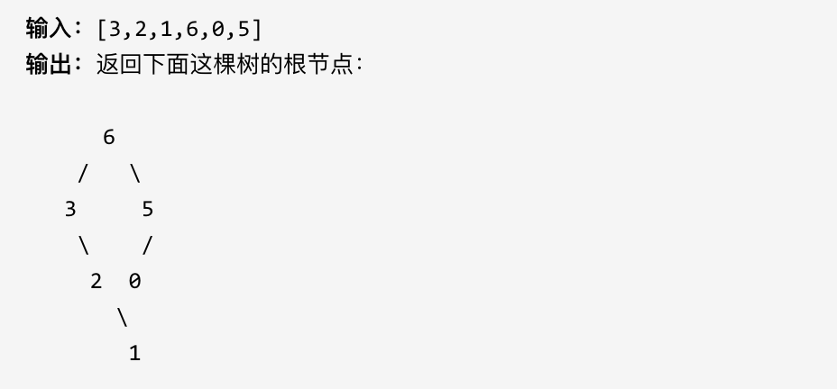

### 17、最大二叉树（20240623，654题，中等）
<div style="border: 1px solid black; padding: 10px; background-color: SteelBlue;">

给定一个不含重复元素的整数数组。一个以此数组构建的最大二叉树定义如下：

- 二叉树的根是数组中的最大元素。
- 左子树是通过数组中最大值左边部分构造出的最大二叉树。
- 右子树是通过数组中最大值右边部分构造出的最大二叉树。

通过给定的数组构建最大二叉树，并且输出这个树的根节点。

示例 ：



提示：

- 给定的数组的大小在 [1, 1000] 之间。

  </p>
</div>


<hr style="border-top: 5px solid #DC143C;">
<table>
  <tr>
    <td bgcolor="Yellow" style="padding: 5px; border: 0px solid black;">
      <span style="font-weight: bold; font-size: 20px;color: black;">
      自己答案（通过！！！）
      </span>
    </td>
  </tr>
</table>
<div style="padding: 0px; border: 1.5px solid LightSalmon; margin-bottom: 10px;">

```C++
/*
思路1：
依次遍历nums，并按照规则来构建树：
    当前的数值大于上一个，则遍历之前数，找到最大的
    当前的数值小于上一个，则挂在上一个的右节点上
思路2：
依次遍历：
    找到最大的点A
    A的左节点是其左边最大的B；A的右节点是其右边最大的C
    以此类推。
 */
// 去注释
class Solution {
public:
    TreeNode* backTracking(vector<int>& nums,int left, int right){  
        if(left > right){  
            return nullptr;
        }

        int max_num = 0;
        int max_num_index = 0;
        for(int i = left; i <= right; i++){
            int cur_num = nums[i];
            if(cur_num >= max_num){
                max_num = cur_num;
                max_num_index = i;
            }
        }
        TreeNode* cur_root = new TreeNode(max_num);
        if(right - left == 0){  
            return cur_root;
        }

        int left_tree_left = left;
        int left_tree_right = max_num_index - 1;
        int right_tree_left = max_num_index + 1;
        int right_tree_right = right;

        cur_root->left = backTracking(nums,left_tree_left, left_tree_right);
        cur_root->right = backTracking(nums,right_tree_left, right_tree_right);

        return cur_root;
    }

    TreeNode* constructMaximumBinaryTree(vector<int>& nums) {
        size_t size = nums.size();

        TreeNode* root = backTracking(nums, 0, size-1);
        return root;
    }
};

// 初始版本
class Solution {
public:
    // // 确定了中间节点，把左子树和右子树的左右边界传入递归函数。在递归函数的头部先根据左右边界确定是否返回null，即空节点
    // backTracking(vector<int>& nums,int left_tree_left, int left_tree_right, int right_tree_left, int right_tree_right){
    //     if(){  // 判断是否为空节点，一般是左右边界相等
    //         return nullptr;
    //     }
    // }

    // 传入左子树或者右子树，而不是同时传入！！！
    TreeNode* backTracking(vector<int>& nums,int left, int right){  // backTracking(vector<int>& nums,int left, int right) 函数忘记写返回类型。。
        if(left > right){  // 判断是否为空节点，一般是左右边界相等
            return nullptr;
        }

        // 找中间节点，即最大的节点
        int max_num = 0;
        int max_num_index = 0;
        for(int i = left; i <= right; i++){
            int cur_num = nums[i];
            if(cur_num >= max_num){
                max_num = cur_num;
                max_num_index = i;
            }
        }
        TreeNode* cur_root = new TreeNode(max_num);
        if(right - left == 0){  // 只剩一个节点时，只需直接返回当前节点
            return cur_root;
        }

        int left_tree_left = left;
        int left_tree_right = max_num_index - 1;
        int right_tree_left = max_num_index + 1;
        int right_tree_right = right;

        cur_root->left = backTracking(nums,left_tree_left, left_tree_right);
        cur_root->right = backTracking(nums,right_tree_left, right_tree_right);

        return cur_root;
    }

    TreeNode* constructMaximumBinaryTree(vector<int>& nums) {
        size_t size = nums.size();

        TreeNode* root = backTracking(nums, 0, size-1);
        return root;
    }
};
```

</div>


<hr style="border-top: 5px solid #DC143C;">
<table>
  <tr>
    <td bgcolor="Yellow" style="padding: 5px; border: 0px solid black;">
      <span style="font-weight: bold; font-size: 20px;color: black;">
      随想录答案
      </span>
    </td>
  </tr>
</table>
<div style="padding: 0px; border: 1.5px solid LightSalmon; margin-bottom: 10px;">

```C++
class Solution {
private:
    // 在左闭右开区间[left, right)，构造二叉树
    TreeNode* traversal(vector<int>& nums, int left, int right) {
        if (left >= right) return nullptr;

        // 分割点下标：maxValueIndex
        int maxValueIndex = left;
        for (int i = left + 1; i < right; ++i) {
            if (nums[i] > nums[maxValueIndex]) maxValueIndex = i;
        }

        TreeNode* root = new TreeNode(nums[maxValueIndex]);

        // 左闭右开：[left, maxValueIndex)
        root->left = traversal(nums, left, maxValueIndex);

        // 左闭右开：[maxValueIndex + 1, right)
        root->right = traversal(nums, maxValueIndex + 1, right);

        return root;
    }
public:
    TreeNode* constructMaximumBinaryTree(vector<int>& nums) {
        return traversal(nums, 0, nums.size());
    }
};
```

</div>
