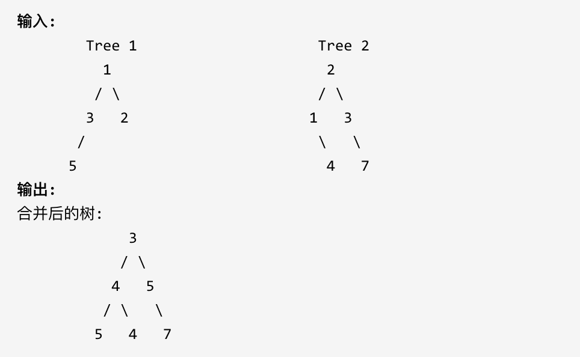

### 18、合并二叉树（20240623，617题，简单）
<div style="border: 1px solid black; padding: 10px; background-color: SteelBlue;">

给定两个二叉树，想象当你将它们中的一个覆盖到另一个上时，两个二叉树的一些节点便会重叠。

你需要将他们合并为一个新的二叉树。合并的规则是如果两个节点重叠，那么将他们的值相加作为节点合并后的新值，否则不为 NULL 的节点将直接作为新二叉树的节点。

示例 1:



注意: 合并必须从两个树的根节点开始。

  </p>
</div>


<hr style="border-top: 5px solid #DC143C;">
<table>
  <tr>
    <td bgcolor="Yellow" style="padding: 5px; border: 0px solid black;">
      <span style="font-weight: bold; font-size: 20px;color: black;">
      看过答案v2（去注释，双端队列，层序遍历解法）
      </span>
    </td>
  </tr>
</table>
<div style="padding: 0px; border: 1.5px solid LightSalmon; margin-bottom: 10px;">

```C++ {.line-numbers}
/*
思路1：
采用层序遍历
    先遍历两个树，得到最大的深度depth；
    按层遍历

思路2：
同时一起遍历两个树，处理当前节点，将二者相加作为新节点

思路3：
    使用双端队列进行层序遍历
 */
// 去注释
class Solution {
public:
    TreeNode* mergeTrees(TreeNode* root1, TreeNode* root2) {
        if(root1 == nullptr) return root2;
        if(root2 == nullptr) return root1;

        queue<TreeNode*> que;
        que.push(root1);
        que.push(root2);
        while(!que.empty()){
            TreeNode* cur_node1 = que.front(); que.pop();
            TreeNode* cur_node2 = que.front(); que.pop();

            cur_node1->val += cur_node2->val;
            if(cur_node1->left != nullptr && cur_node2->left != nullptr){
                que.push(cur_node1->left);
                que.push(cur_node2->left);
            }
            if(cur_node1->right != nullptr && cur_node2->right != nullptr){
                que.push(cur_node1->right);
                que.push(cur_node2->right);
            }
            if(cur_node1->left == nullptr && cur_node2->left != nullptr){
                cur_node1->left = cur_node2->left;
            }
            if(cur_node1->right == nullptr && cur_node2->right != nullptr){
                cur_node1->right = cur_node2->right;
            }
        }

        return root1;
    }
};

// 初始版本
class Solution {
public:
    TreeNode* mergeTrees(TreeNode* root1, TreeNode* root2) {
        if(root1 == nullptr) return root2;
        if(root2 == nullptr) return root1;

        queue<TreeNode*> que;
        que.push(root1);
        que.push(root2);
        while(!que.empty()){
            TreeNode* cur_node1 = que.front(); que.pop();
            TreeNode* cur_node2 = que.front(); que.pop();

            // if(cur_node1 == nullptr){
            //     cur_node1 = cur_node2;
            // }else if(cur_node2 == nullptr){
            //     // cur_node1 = cur_node1;
            //     continue;
            // }else{
            //     cur_node1->val += cur_node2->val;
            //     que.push(cur_node1->left);
            //     que.push(cur_node2->left);
            //     que.push(cur_node1->right);
            //     que.push(cur_node2->right);
            // }

            cur_node1->val += cur_node2->val;
            if(cur_node1->left != nullptr && cur_node2->left != nullptr){
                que.push(cur_node1->left);
                que.push(cur_node2->left);
            }
            if(cur_node1->right != nullptr && cur_node2->right != nullptr){
                que.push(cur_node1->right);
                que.push(cur_node2->right);
            }
            if(cur_node1->left == nullptr && cur_node2->left != nullptr){
                cur_node1->left = cur_node2->left;
            }
            if(cur_node1->right == nullptr && cur_node2->right != nullptr){
                cur_node1->right = cur_node2->right;
            }

            // 依次循环中必须同时判断当前节点的左子节点和右子节点，所以不能用else if！！
            // cur_node1->val += cur_node2->val;
            // if(cur_node1->left != nullptr && cur_node2->left != nullptr){
            //     que.push(cur_node1->left);
            //     que.push(cur_node2->left);
            // }else if(cur_node1->right != nullptr && cur_node2->right != nullptr){
            //     que.push(cur_node1->right);
            //     que.push(cur_node2->right);
            // }else if(cur_node1->left == nullptr && cur_node2->left != nullptr){
            //     cur_node1->left = cur_node2->left;
            // }else if(cur_node1->right == nullptr && cur_node2->right != nullptr){
            //     cur_node1->right = cur_node2->right;
            // }

            // if(cur_node1->left == nullptr && cur_node2->left != nullptr){
            //     cur_node1->left = cur_node2->left;
            // }else if(cur_node1->right == nullptr && cur_node2->right != nullptr){
            //     cur_node1->right = cur_node2->right;
            // }else if(cur_node1->left != nullptr && cur_node2->left == nullptr){
            //     continue;
            // }else if(cur_node1->right != nullptr && cur_node2->right == nullptr){
            //     continue;
            // }else if(cur_node1->right != nullptr && cur_node2->right != nullptr){
            //     que.push(cur_node1->left);
            //     que.push(cur_node2->left);
            //     que.push(cur_node1->right);
            //     que.push(cur_node2->right);
            // }

            // else{
            //     que.push(cur_node1->left);
            //     que.push(cur_node2->left);
            //     que.push(cur_node1->right);
            //     que.push(cur_node2->right);
            // }
        }

        return root1;
    }
};
```

</div>


<hr style="border-top: 5px solid #DC143C;">
<table>
  <tr>
    <td bgcolor="Yellow" style="padding: 5px; border: 0px solid black;">
      <span style="font-weight: bold; font-size: 20px;color: black;">
      自己答案（通过！递归解法）
      </span>
    </td>
  </tr>
</table>
<div style="padding: 0px; border: 1.5px solid LightSalmon; margin-bottom: 10px;">

```C++ {.line-numbers}
/*
思路1：
采用层序遍历
    先遍历两个树，得到最大的深度depth；
    按层遍历

思路2：
同时一起遍历两个树，处理当前节点，将二者相加作为新节点
 */
// 去注释
class Solution {
public:
    TreeNode* backTracking(TreeNode* cur_root1, TreeNode* cur_root2){
        if(cur_root1 == nullptr && cur_root2 == nullptr){  
            return nullptr;
        }

        TreeNode* cur_root = new TreeNode();
        if(cur_root1 == nullptr){
            cur_root->val = cur_root2->val;
            cur_root->left = backTracking(nullptr, cur_root2->left);
            cur_root->right =backTracking(nullptr, cur_root2->right);
        }else if(cur_root2 == nullptr){
            cur_root->val = cur_root1->val;
            cur_root->left = backTracking(cur_root1->left, nullptr);
            cur_root->right =backTracking(cur_root1->right, nullptr);
        }else{
            cur_root->val = cur_root1->val + cur_root2->val;
            cur_root->left = backTracking(cur_root1->left, cur_root2->left);
            cur_root->right =backTracking(cur_root1->right, cur_root2->right);
        }
        return cur_root;
    }

    TreeNode* mergeTrees(TreeNode* root1, TreeNode* root2) {

        TreeNode* root = backTracking(root1, root2);
        return root;
    }
};

// 初始版本
class Solution {
public:
    TreeNode* backTracking(TreeNode* cur_root1, TreeNode* cur_root2){
        if(cur_root1 == nullptr && cur_root2 == nullptr){  // 两棵树的这个位置的节点都为空
            return nullptr;
        }

        TreeNode* cur_root = new TreeNode();
        if(cur_root1 == nullptr){
            cur_root->val = cur_root2->val;
            cur_root->left = backTracking(nullptr, cur_root2->left);
            cur_root->right =backTracking(nullptr, cur_root2->right);
        }else if(cur_root2 == nullptr){
            cur_root->val = cur_root1->val;
            cur_root->left = backTracking(cur_root1->left, nullptr);
            cur_root->right =backTracking(cur_root1->right, nullptr);
        }else{
            cur_root->val = cur_root1->val + cur_root2->val;
            cur_root->left = backTracking(cur_root1->left, cur_root2->left);
            cur_root->right =backTracking(cur_root1->right, cur_root2->right);
        }
        return cur_root;
        // backTracking要做的是将当前传入的节点进行整合，成为一个新的节点，并传回上层，作为其左或者右节点
        // cur_root->left = backTracking(cur_root1->left, cur_root2->left);
        // cur_root->right =backTracking(cur_root1->right, cur_root2->right);
    }

    TreeNode* mergeTrees(TreeNode* root1, TreeNode* root2) {

        TreeNode* root = backTracking(root1, root2);
        return root;
    }
};
```

</div>


<hr style="border-top: 5px solid #DC143C;">

 <table>
  <tr>
    <td bgcolor="Yellow" style="padding: 5px; border: 0px solid black;">
      <span style="font-weight: bold; font-size: 20px;color: black;">
      仿照答案(递归解法)
      </span>
    </td>
  </tr>
</table>
<div style="padding: 0px; border: 1.5px solid LightSalmon; margin-bottom: 10px;">

```C++ {.line-numbers}
// 去注释
class Solution {
public:
    TreeNode* backTracking(TreeNode* cur_root1, TreeNode* cur_root2){
        if(cur_root1 == nullptr){  
            return cur_root2;
        }
        if(cur_root2 == nullptr){ 
            return cur_root1;
        }

        TreeNode* cur_root = new TreeNode();
        cur_root->val = cur_root1->val + cur_root2->val;
        cur_root->left = backTracking(cur_root1->left, cur_root2->left);
        cur_root->right =backTracking(cur_root1->right, cur_root2->right);

        return cur_root;
    }

    TreeNode* mergeTrees(TreeNode* root1, TreeNode* root2) {
        TreeNode* root = backTracking(root1, root2);
        return root;
    }
};

// 初始版
class Solution {
public:
    TreeNode* backTracking(TreeNode* cur_root1, TreeNode* cur_root2){
        // if(cur_root1 == nullptr && cur_root2 == nullptr){  // 两棵树的这个位置的节点都为空
        //     return nullptr;
        // }

        if(cur_root1 == nullptr){  // 一棵树当前节点为空，则让新树直接接替另一颗树，不用再遍历第二颗树！！！
            return cur_root2;
        }
        if(cur_root2 == nullptr){  // 一棵树当前节点为空，则让新树直接接替另一颗树，不用再遍历第二颗树！！！
            return cur_root1;
        }

        TreeNode* cur_root = new TreeNode();
        
        // if(cur_root1 == nullptr){
        //     cur_root->val = cur_root2->val;
        //     cur_root->left = backTracking(nullptr, cur_root2->left);
        //     cur_root->right =backTracking(nullptr, cur_root2->right);
        // }else if(cur_root2 == nullptr){
        //     cur_root->val = cur_root1->val;
        //     cur_root->left = backTracking(cur_root1->left, nullptr);
        //     cur_root->right =backTracking(cur_root1->right, nullptr);
        // }else{
        //     cur_root->val = cur_root1->val + cur_root2->val;
        //     cur_root->left = backTracking(cur_root1->left, cur_root2->left);
        //     cur_root->right =backTracking(cur_root1->right, cur_root2->right);
        // }

        cur_root->val = cur_root1->val + cur_root2->val;
        cur_root->left = backTracking(cur_root1->left, cur_root2->left);
        cur_root->right =backTracking(cur_root1->right, cur_root2->right);

        return cur_root;
    }

    TreeNode* mergeTrees(TreeNode* root1, TreeNode* root2) {

        TreeNode* root = backTracking(root1, root2);
        return root;
    }
};
```

</div>


<hr style="border-top: 5px solid #DC143C;">

 <table>
  <tr>
    <td bgcolor="Yellow" style="padding: 5px; border: 0px solid black;">
      <span style="font-weight: bold; font-size: 20px;color: black;">
      随想录答案(递归解法)
      </span>
    </td>
  </tr>
</table>
<div style="padding: 0px; border: 1.5px solid LightSalmon; margin-bottom: 10px;">

```C++ {.line-numbers}
class Solution {
public:
    TreeNode* mergeTrees(TreeNode* t1, TreeNode* t2) {
        if (t1 == NULL) return t2; // 如果t1为空，合并之后就应该是t2
        if (t2 == NULL) return t1; // 如果t2为空，合并之后就应该是t1
        // 修改了t1的数值和结构
        t1->val += t2->val;                             // 中
        t1->left = mergeTrees(t1->left, t2->left);      // 左
        t1->right = mergeTrees(t1->right, t2->right);   // 右
        return t1;
    }
};
```

</div>

 <table>
  <tr>
    <td bgcolor="Yellow" style="padding: 5px; border: 0px solid black;">
      <span style="font-weight: bold; font-size: 20px;color: black;">
      随想录答案(递归解法，不修改树结构)
      </span>
    </td>
  </tr>
</table>
<div style="padding: 0px; border: 1.5px solid LightSalmon; margin-bottom: 10px;">

```C++ {.line-numbers}
class Solution {
public:
    TreeNode* mergeTrees(TreeNode* t1, TreeNode* t2) {
        if (t1 == NULL) return t2;
        if (t2 == NULL) return t1;
        // 重新定义新的节点，不修改原有两个树的结构
        TreeNode* root = new TreeNode(0);
        root->val = t1->val + t2->val;
        root->left = mergeTrees(t1->left, t2->left);
        root->right = mergeTrees(t1->right, t2->right);
        return root;
    }
};
```

</div>

 <table>
  <tr>
    <td bgcolor="Yellow" style="padding: 5px; border: 0px solid black;">
      <span style="font-weight: bold; font-size: 20px;color: black;">
      随想录答案(迭代解法)
      </span>
    </td>
  </tr>
</table>
<div style="padding: 0px; border: 1.5px solid LightSalmon; margin-bottom: 10px;">

```C++ {.line-numbers}
class Solution {
public:
    TreeNode* mergeTrees(TreeNode* t1, TreeNode* t2) {
        if (t1 == NULL) return t2;
        if (t2 == NULL) return t1;
        queue<TreeNode*> que;
        que.push(t1);
        que.push(t2);
        while(!que.empty()) {
            TreeNode* node1 = que.front(); que.pop();
            TreeNode* node2 = que.front(); que.pop();
            // 此时两个节点一定不为空，val相加
            node1->val += node2->val;

            // 如果两棵树左节点都不为空，加入队列
            if (node1->left != NULL && node2->left != NULL) {
                que.push(node1->left);
                que.push(node2->left);
            }
            // 如果两棵树右节点都不为空，加入队列
            if (node1->right != NULL && node2->right != NULL) {
                que.push(node1->right);
                que.push(node2->right);
            }

            // 当t1的左节点 为空 t2左节点不为空，就赋值过去
            if (node1->left == NULL && node2->left != NULL) {
                node1->left = node2->left;
            }
            // 当t1的右节点 为空 t2右节点不为空，就赋值过去
            if (node1->right == NULL && node2->right != NULL) {
                node1->right = node2->right;
            }
        }
        return t1;
    }
};
```

</div>