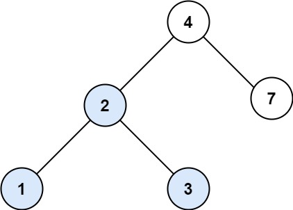
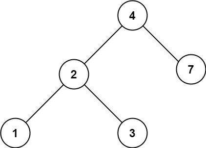

### 19、二叉搜索树中的搜索（20240715，700题，简单）
<div style="border: 1px solid black; padding: 10px; background-color: SteelBlue;">

给定二叉搜索树（BST）的根节点 root 和一个整数值 val。

你需要在 BST 中找到节点值等于 val 的节点。 返回以该节点为根的子树。 如果节点不存在，则返回 null 。

 

示例 1:  


- 输入：root = [4,2,7,1,3], val = 2
- 输出：[2,1,3]

示例 2:  


- 输入：root = [4,2,7,1,3], val = 5
- 输出：[]
 

提示：

- 树中节点数在 [1, 5000] 范围内
- 1 <= Node.val <= 107
- root 是二叉搜索树
- 1 <= val <= 107

  </p>
</div>

<hr style="border-top: 5px solid #DC143C;">


<table>
  <tr>
    <td bgcolor="Yellow" style="padding: 5px; border: 0px solid black;">
      <span style="font-weight: bold; font-size: 20px;color: black;">
      ChatGPT修改答案
      </span>
    </td>
  </tr>
</table>

<div style="padding: 0px; border: 1.5px solid LightSalmon; margin-bottom: 10px;">

```C++
/*
利用搜索二叉树特性，直接去找对应值的节点，有的话，直接就能找到并返回这个节点
没有就会返回null
不会存在有这个val的节点，但是走到null节点，返回null的情况！！！
*/
class Solution {
public:

    TreeNode* find_node(TreeNode* cur_node, int val){
        if(cur_node == nullptr) return nullptr;

        if(cur_node->val == val){
            return cur_node;
        }
        if(cur_node->val > val){
            return find_node(cur_node->left, val);
        }else if(cur_node->val < val){
            return find_node(cur_node->right, val);
        }
        return nullptr;
    }
    TreeNode* searchBST(TreeNode* root, int val) {

        return find_node(root, val);
    }
};
```

</div>


<hr style="border-top: 5px solid #DC143C;">

<table>
  <tr>
    <td bgcolor="Yellow" style="padding: 5px; border: 0px solid black;">
      <span style="font-weight: bold; font-size: 20px;color: black;">
      ChatGPT修改答案（使用引用）
      </span>
    </td>
  </tr>
</table>

<div style="padding: 0px; border: 1.5px solid LightSalmon; margin-bottom: 10px;">

```C++
 class Solution {
public:

    void find_node(TreeNode* cur_node, int val , TreeNode*& goal){
        if(cur_node == nullptr) return ;

        if(cur_node->val == val){
            goal = cur_node;
            return ;
        }

        find_node(cur_node->left, val, goal);
        find_node(cur_node->right, val, goal);

        return ;
    }
    TreeNode* searchBST(TreeNode* root, int val) {

        TreeNode* node = nullptr;
        find_node(root, val, node);

        return node;
    }
};
```

</div>


<table>
  <tr>
    <td bgcolor="Yellow" style="padding: 5px; border: 0px solid black;">
      <span style="font-weight: bold; font-size: 20px;color: black;">
      ChatGPT修改答案（使用指针的指针）
      </span>
    </td>
  </tr>
</table>

<div style="padding: 0px; border: 1.5px solid LightSalmon; margin-bottom: 10px;">

```C++
class Solution {
public:
    void find_node(TreeNode* cur_node, int val , TreeNode** goal){
        if(cur_node == nullptr) return ;

        if(cur_node->val == val){
            // goal = &cur_node;
            *goal = cur_node;
            return ;
        }

        find_node(cur_node->left, val, goal);
        find_node(cur_node->right, val, goal);
        
        return ;
    }
    TreeNode* searchBST(TreeNode* root, int val) {

        TreeNode* node = nullptr;
        find_node(root, val, &node);

        return node;
    }
};

```

</div>


<hr style="border-top: 5px solid #DC143C;">

<table>
  <tr>
    <td bgcolor="Yellow" style="padding: 5px; border: 0px solid black;">
      <span style="font-weight: bold; font-size: 20px;color: black;">
      仿照随想录答案（迭代方法！）
      </span>
    </td>
  </tr>
</table>

<div style="padding: 0px; border: 1.5px solid LightSalmon; margin-bottom: 10px;">

```C++
class Solution {
public:
    TreeNode* searchBST(TreeNode* root, int val) {

        while(root != nullptr){
            if(root->val == val) return root;
            if(root->val > val) root = root->left;
            else if(root->val < val) root = root->right;
        } 
        return root;
    }
};
```

</div>


<table>
  <tr>
    <td bgcolor="Yellow" style="padding: 5px; border: 0px solid black;">
      <span style="font-weight: bold; font-size: 20px;color: black;">
      随想录答案（递归方法！）
      </span>
    </td>
  </tr>
</table>

<div style="padding: 0px; border: 1.5px solid LightSalmon; margin-bottom: 10px;">

```C++
class Solution {
public:
    TreeNode* searchBST(TreeNode* root, int val) {
        if (root == NULL || root->val == val) return root;
        if (root->val > val) return searchBST(root->left, val);
        if (root->val < val) return searchBST(root->right, val);
        return NULL;
    }
};
```

</div>


