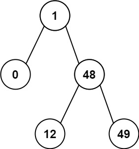

### 21、二叉搜索树的最小绝对差（20240716，530题，简单，12min）
<div style="border: 1px solid black; padding: 10px; background-color: SteelBlue;">

给你一个二叉搜索树的根节点 root ，返回 **树中任意两不同节点值之间的最小差值** 。

差值是一个正数，其数值等于两值之差的绝对值。

 

示例 1：  


- 输入：root = [4,2,6,1,3]
- 输出：1

示例 2：  


- 输入：root = [1,0,48,null,null,12,49]
- 输出：1
 

提示：

- 树中节点的数目范围是 [2, 104]
- 0 <= Node.val <= 105

  </p>
</div>

<hr style="border-top: 5px solid #DC143C;">
<table>
  <tr>
    <td bgcolor="Yellow" style="padding: 5px; border: 0px solid black;">
      <span style="font-weight: bold; font-size: 20px;color: black;">
      自己答案（通过！）
      </span>
    </td>
  </tr>
</table>

<div style="padding: 0px; border: 1.5px solid LightSalmon; margin-bottom: 10px;">

```C++
class Solution {
public:
    int min_diff = INT32_MAX;
    TreeNode* pre = nullptr;
    
    void actualGetMin(TreeNode* root){
        if(root == nullptr) return;

        getMinimumDifference(root->left);
        if(pre != nullptr){
            int cur_diff = root->val - pre->val;
            if(cur_diff < min_diff){
                min_diff = cur_diff;
            }
        }
        pre = root;

        getMinimumDifference(root->right);
    }

    int getMinimumDifference(TreeNode* root) {
        
        actualGetMin(root);
        return min_diff;
    }
};
```

</div>


<hr style="border-top: 5px solid #DC143C;">

<table>
  <tr>
    <td bgcolor="Yellow" style="padding: 5px; border: 0px solid black;">
      <span style="font-weight: bold; font-size: 20px;color: black;">
      随想录答案（递归）
      </span>
    </td>
  </tr>
</table>

<div style="padding: 0px; border: 1.5px solid LightSalmon; margin-bottom: 10px;">

```C++
class Solution {
private:
int result = INT_MAX;
TreeNode* pre = NULL;
void traversal(TreeNode* cur) {
    if (cur == NULL) return;
    traversal(cur->left);   // 左
    if (pre != NULL){       // 中
        result = min(result, cur->val - pre->val);
    }
    pre = cur; // 记录前一个
    traversal(cur->right);  // 右
}
public:
    int getMinimumDifference(TreeNode* root) {
        traversal(root);
        return result;
    }
};

```

</div>


<table>
  <tr>
    <td bgcolor="Yellow" style="padding: 5px; border: 0px solid black;">
      <span style="font-weight: bold; font-size: 20px;color: black;">
      随想录答案（迭代）
      </span>
    </td>
  </tr>
</table>

<div style="padding: 0px; border: 1.5px solid LightSalmon; margin-bottom: 10px;">

```C++
class Solution {
public:
    int getMinimumDifference(TreeNode* root) {
        stack<TreeNode*> st;
        TreeNode* cur = root;
        TreeNode* pre = NULL;
        int result = INT_MAX;
        while (cur != NULL || !st.empty()) {
            if (cur != NULL) { // 指针来访问节点，访问到最底层
                st.push(cur); // 将访问的节点放进栈
                cur = cur->left;                // 左
            } else {
                cur = st.top();
                st.pop();
                if (pre != NULL) {              // 中
                    result = min(result, cur->val - pre->val);
                }
                pre = cur;
                cur = cur->right;               // 右
            }
        }
        return result;
    }
};
```

</div>

