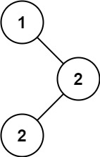

### 22、二叉搜索树中的众数（20240716，501题，简单，29min）
<div style="border: 1px solid black; padding: 10px; background-color: SteelBlue;">

给你一个含重复值的二叉搜索树（BST）的根节点 root ，找出并返回 BST 中的所有 众数（即，出现频率最高的元素）。

如果树中有不止一个众数，可以按 **任意顺序** 返回。

假定 BST 满足如下定义：

- 结点左子树中所含节点的值 **小于等于** 当前节点的值
- 结点右子树中所含节点的值 **大于等于** 当前节点的值
- 左子树和右子树都是二叉搜索树
 

示例 1：  


- 输入：root = [1,null,2,2]
- 输出：[2]

示例 2：

- 输入：root = [0]
- 输出：[0]
 

提示：

- 树中节点的数目在范围 [1, 104] 内
- -105 <= Node.val <= 105
 

进阶：你可以不使用额外的空间吗？（假设由递归产生的隐式调用栈的开销不被计算在内）

  </p>
</div>


<hr style="border-top: 5px solid #DC143C;">
<table>
  <tr>
    <td bgcolor="Yellow" style="padding: 5px; border: 0px solid black;">
      <span style="font-weight: bold; font-size: 20px;color: black;">
      自己答案（通过！）
      </span>
    </td>
  </tr>
</table>
<div style="padding: 0px; border: 1.5px solid LightSalmon; margin-bottom: 10px;">

```C++ {.line-numbers}
/*
思路：
中序递归遍历二叉树，从小到大遍历搜索二叉树的值
    用unordered_map<int, int> map记录每个值出现的次数
    遍历结束后，遍历依次map得到最大出现次数max_count；
    第二次遍历map，记录出现max_count次的所有数字，即为答案！
*/
class Solution {
public:

    unordered_map<int, int> map;
    void actual_findMode(TreeNode* cur_node){
        if(cur_node == nullptr) return;

        actual_findMode(cur_node->left);
        // if(find(map.begin(), map.end(), ))
        if(map.find(cur_node->val) != map.end()){
            map[cur_node->val]++;
        }else{
            map[cur_node->val] = 1;
        }
        
        actual_findMode(cur_node->right);
    }

    vector<int> findMode(TreeNode* root) {
        vector<int> result;

        actual_findMode(root);
        int max_count = 0;
        for(auto& pair : map){
            if(pair.second >= max_count){
                max_count = pair.second;
            }
        }

        for(auto& pair : map){
            if(pair.second == max_count){
                result.push_back(pair.first);
            }
        }

        return result;
    }
};
```

</div>


<table>
  <tr>
    <td bgcolor="Yellow" style="padding: 5px; border: 0px solid black;">
      <span style="font-weight: bold; font-size: 20px;color: black;">
      仿照答案思路
      </span>
    </td>
  </tr>
</table>

<div style="padding: 0px; border: 1.5px solid LightSalmon; margin-bottom: 10px">

```C++ {.line-numbers}
/*
思路：
中序遍历二叉搜索树，并记录当前所有数字出现的最大次数max_count
    当前数值大于上一个数值pre时，更新数字计数count=1
    新数值a的出现次数count等于max_count时，同样记录a到vector<int> vec；
    新数值b的出现次数count大于max_count，则清除vec，并将b放入vec。
*/
class Solution {
public:
    int cur_count = 0;
    int max_count = 0;
    int pre_num = 0;
    vector<int> ret;

    void actualFindMode(TreeNode* cur_node){
        if(cur_node == NULL) return;

        actualFindMode(cur_node->left);
        if(ret.size() == 0){  // 第一个点，将计数置为1
            cur_count = 1;
            pre_num = cur_node->val;
            // ret.push_back(cur_node->val);
        }
        // else if(cur_node->val > ret.back()){ // 当前节点和上个节点值不同，重置count
        //     cur_count = 1;
        // }
        else if(cur_node->val > pre_num){ // 当前节点和上个节点值不同，重置count
            cur_count = 1;
            pre_num = cur_node->val;
        }
        // else if(cur_node->val == ret.back()){ // 当前节点和上个节点值相同，count累加
        //     cur_count++;
        // }
        else if(cur_node->val == pre_num){ // 当前节点和上个节点值相同，count累加
            cur_count++;
        }
        if(cur_count == max_count){
            ret.push_back(cur_node->val);
        }
        else if(cur_count > max_count){
            ret.clear();
            ret.push_back(cur_node->val);
            max_count = cur_count;
        }

        actualFindMode(cur_node->right);
    }

    vector<int> findMode(TreeNode* root) {
        ret.clear();

        actualFindMode(root);
        return ret;
    }
};

// 去注释
class Solution {
public:
    int cur_count = 0;
    int max_count = 0;
    int pre_num = 0;
    vector<int> ret;

    void actualFindMode(TreeNode* cur_node){
        if(cur_node == NULL) return;

        actualFindMode(cur_node->left);
        if(ret.size() == 0){  // 第一个点，将计数置为1
            cur_count = 1;
            pre_num = cur_node->val;
        }
        else if(cur_node->val > pre_num){ // 当前节点和上个节点值不同，重置count
            cur_count = 1;
            pre_num = cur_node->val;
        }
        else if(cur_node->val == pre_num){ // 当前节点和上个节点值相同，count累加
            cur_count++;
        }
        if(cur_count == max_count){
            ret.push_back(cur_node->val);
        }
        else if(cur_count > max_count){
            ret.clear();
            ret.push_back(cur_node->val);
            max_count = cur_count;
        }

        actualFindMode(cur_node->right);
    }

    vector<int> findMode(TreeNode* root) {
        ret.clear();

        actualFindMode(root);
        return ret;
    }
};
```
</div>


<hr style="border-top: 5px solid #DC143C;">

<table>
  <tr>
    <td bgcolor="Yellow" style="padding: 5px; border: 0px solid black;">
      <span style="font-weight: bold; font-size: 20px;color: black;">
      随想录答案（递归方法）
      </span>
    </td>
  </tr>
</table>

<div style="padding: 0px; border: 1.5px solid LightSalmon; margin-bottom: 10px">

```C++ {.line-numbers}
class Solution {
private:
    int maxCount = 0; // 最大频率
    int count = 0; // 统计频率
    TreeNode* pre = NULL;  // 这里使用的pre指针，我的是pre的值！！！
    vector<int> result;
    void searchBST(TreeNode* cur) {
        if (cur == NULL) return ;

        searchBST(cur->left);       // 左
                                    // 中
        if (pre == NULL) { // 第一个节点
            count = 1;
        } else if (pre->val == cur->val) { // 与前一个节点数值相同
            count++;
        } else { // 与前一个节点数值不同
            count = 1;
        }
        pre = cur; // 更新上一个节点

        if (count == maxCount) { // 如果和最大值相同，放进result中
            result.push_back(cur->val);
        }

        if (count > maxCount) { // 如果计数大于最大值频率
            maxCount = count;   // 更新最大频率
            result.clear();     // 很关键的一步，不要忘记清空result，之前result里的元素都失效了
            result.push_back(cur->val);
        }

        searchBST(cur->right);      // 右
        return ;
    }

public:
    vector<int> findMode(TreeNode* root) {
        count = 0;
        maxCount = 0;
        pre = NULL; // 记录前一个节点
        result.clear();

        searchBST(root);
        return result;
    }
};
```
</div>

<table>
  <tr>
    <td bgcolor="Yellow" style="padding: 5px; border: 0px solid black;">
      <span style="font-weight: bold; font-size: 20px;color: black;">
      随想录答案（迭代方法）
      </span>
    </td>
  </tr>
</table>

<div style="padding: 0px; border: 1.5px solid LightSalmon; margin-bottom: 10px">

```C++ {.line-numbers}
class Solution {
public:
    vector<int> findMode(TreeNode* root) {
        stack<TreeNode*> st;
        TreeNode* cur = root;
        TreeNode* pre = NULL;
        int maxCount = 0; // 最大频率
        int count = 0; // 统计频率
        vector<int> result;
        while (cur != NULL || !st.empty()) {
            if (cur != NULL) { // 指针来访问节点，访问到最底层
                st.push(cur); // 将访问的节点放进栈
                cur = cur->left;                // 左
            } else {
                cur = st.top();
                st.pop();                       // 中
                if (pre == NULL) { // 第一个节点
                    count = 1;
                } else if (pre->val == cur->val) { // 与前一个节点数值相同
                    count++;
                } else { // 与前一个节点数值不同
                    count = 1;
                }
                if (count == maxCount) { // 如果和最大值相同，放进result中
                    result.push_back(cur->val);
                }

                if (count > maxCount) { // 如果计数大于最大值频率
                    maxCount = count;   // 更新最大频率
                    result.clear();     // 很关键的一步，不要忘记清空result，之前result里的元素都失效了
                    result.push_back(cur->val);
                }
                pre = cur;
                cur = cur->right;               // 右
            }
        }
        return result;
    }
};
```
</div>

<hr style="border-top: 5px solid #DC143C;">

<table>
  <tr>
    <td bgcolor="Yellow" style="padding: 5px; border: 0px solid black;">
      <span style="font-weight: bold; font-size: 20px;color: black;">
      随想录答案，普通二叉树找众数（递归法）
      </span>
    </td>
  </tr>
</table>

<div style="padding: 0px; border: 1.5px solid LightSalmon; margin-bottom: 10px">

```C++ {.line-numbers}
// 和我开始的思路类似。。
class Solution {
private:

void searchBST(TreeNode* cur, unordered_map<int, int>& map) { // 前序遍历
    if (cur == NULL) return ;
    map[cur->val]++; // 统计元素频率
    searchBST(cur->left, map);
    searchBST(cur->right, map);
    return ;
}
bool static cmp (const pair<int, int>& a, const pair<int, int>& b) {
    return a.second > b.second;
}
public:
    vector<int> findMode(TreeNode* root) {
        unordered_map<int, int> map; // key:元素，value:出现频率
        vector<int> result;
        if (root == NULL) return result;
        searchBST(root, map);
        vector<pair<int, int>> vec(map.begin(), map.end());
        sort(vec.begin(), vec.end(), cmp); // 给频率排个序
        result.push_back(vec[0].first);
        for (int i = 1; i < vec.size(); i++) {
            // 取最高的放到result数组中
            if (vec[i].second == vec[0].second) result.push_back(vec[i].first);
            else break;
        }
        return result;
    }
};
```
</div>
