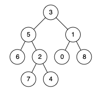

### 23、二叉树的最近公共祖先（20240716，236题，中等，18min）
<div style="border: 1px solid black; padding: 10px; background-color: #00BFFF;">

给定一个二叉树, 找到该树中两个指定节点的最近公共祖先。

百度百科中最近公共祖先的定义为：“对于有根树 T 的两个节点 p、q，最近公共祖先表示为一个节点 x，满足 x 是 p、q 的祖先且 x 的深度尽可能大（**一个节点也可以是它自己的祖先**）。”

 

示例 1：  


- 输入：root = [3,5,1,6,2,0,8,null,null,7,4], p = 5, q = 1
- 输出：3
- 解释：节点 5 和节点 1 的最近公共祖先是节点 3 。

示例 2：  


- 输入：root = [3,5,1,6,2,0,8,null,null,7,4], p = 5, q = 4
- 输出：5
- 解释：节点 5 和节点 4 的最近公共祖先是节点 5 。因为根据定义最近公共祖先节点可以为节点本身。

示例 3：

- 输入：root = [1,2], p = 1, q = 2
- 输出：1
 

提示：

- 树中节点数目在范围 [2, 105] 内。
- -109 <= Node.val <= 109
- 所有 Node.val 互不相同 。
- p != q
- p 和 q 均存在于给定的二叉树中。

  </p>
</div>

<hr style="border-top: 5px solid #DC143C;">
<table>
  <tr>
    <td bgcolor="Yellow" style="padding: 5px; border: 0px solid black;">
      <span style="font-weight: bold; font-size: 20px;color: black;">
      自己答案（通过！）
      </span>
    </td>
  </tr>
</table>

```C++
/*
遍历树，后续遍历，左右中；
空节点返回0；
找到一个对的节点，则返回1；
则找到第二个节点后，会存在一个节点返回2，
    这就是对的节点，但只返回一次。
*/
class Solution {
public:
    bool flag = true;

    int findNode(TreeNode* root, TreeNode* p, TreeNode* q, TreeNode*& node){
        if(root == NULL) return 0;

        int left = findNode(root->left, p, q, node);
        int right = findNode(root->right, p, q, node);

        int sum = 0;
        if(root->val == p->val || root->val == q->val){
            sum = left + right + 1;
        }else{
            sum = left + right;
        }

        if(sum == 2 && flag){
            node = root;
            flag = false;
        }
        return sum;
    }
    TreeNode* lowestCommonAncestor(TreeNode* root, TreeNode* p, TreeNode* q) {

        TreeNode* node = NULL;
        findNode(root, p, q, node);

        return node;
    }
};
```


<table>
  <tr>
    <td bgcolor="Yellow" style="padding: 5px; border: 0px solid black;">
      <span style="font-weight: bold; font-size: 20px;color: black;">
      自己答案（通过！）
      </span>
    </td>
  </tr>
</table>

```C++


```

<hr style="border-top: 5px solid #DC143C;">

<table>
  <tr>
    <td bgcolor="Yellow" style="padding: 5px; border: 0px solid black;">
      <span style="font-weight: bold; font-size: 20px;color: black;">
      自己调试版本（通过！！！）
      </span>
    </td>
  </tr>
</table>

```C++


```

<table>
  <tr>
    <td bgcolor="Yellow" style="padding: 5px; border: 0px solid black;">
      <span style="font-weight: bold; font-size: 20px;color: black;">
      仿照答案版本v2（去注释）
      </span>
    </td>
  </tr>
</table>

```C++


```

<hr style="border-top: 5px solid #DC143C;">

<table>
  <tr>
    <td bgcolor="Yellow" style="padding: 5px; border: 0px solid black;">
      <span style="font-weight: bold; font-size: 20px;color: black;">
      仿照答案版本v2
      </span>
    </td>
  </tr>
</table>

```C++


```

<table>
  <tr>
    <td bgcolor="Yellow" style="padding: 5px; border: 0px solid black;">
      <span style="font-weight: bold; font-size: 20px;color: black;">
      随想录答案
      </span>
    </td>
  </tr>
</table>

```C++


```
