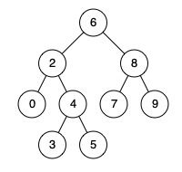

### 24、二叉搜索树的最近公共祖先（20240716，235题，中等，20min）
<div style="border: 1px solid black; padding: 10px; background-color: SteelBlue;">

给定一个二叉搜索树, 找到该树中两个指定节点的最近公共祖先。

百度百科中最近公共祖先的定义为：“对于有根树 T 的两个结点 p、q，最近公共祖先表示为一个结点 x，满足 x 是 p、q 的祖先且 x 的深度尽可能大（**一个节点也可以是它自己的祖先**）。”

例如，给定如下二叉搜索树:  root = [6,2,8,0,4,7,9,null,null,3,5]



 

示例 1:

- 输入: root = [6,2,8,0,4,7,9,null,null,3,5], p = 2, q = 8
- 输出: 6 
- 解释: 节点 2 和节点 8 的最近公共祖先是 6。

示例 2:

- 输入: root = [6,2,8,0,4,7,9,null,null,3,5], p = 2, q = 4
- 输出: 2
- 解释: 节点 2 和节点 4 的最近公共祖先是 2, 因为根据定义最近公共祖先节点可以为节点本身。
 

说明:

- 所有节点的值都是唯一的。
- p、q 为不同节点且均存在于给定的二叉搜索树中。

  </p>
</div>

<hr style="border-top: 5px solid #DC143C;">
<table>
  <tr>
    <td bgcolor="Yellow" style="padding: 5px; border: 0px solid black;">
      <span style="font-weight: bold; font-size: 20px;color: black;">
      自己答案（递归法，通过！）
      </span>
    </td>
  </tr>
</table>
<div style="padding: 0px; border: 1.5px solid LightSalmon; margin-bottom: 10px;">

```C++
/*
中左右递归遍历，
1，当前节点A的值大于p，小于q，说明p、q位于A的两边，返回A
2，A的值大于p、q，则往左节点继续找；
3，A的值小于p、q，则往右节点继续找。
*/
class Solution {
public:
    TreeNode* lowestCommonAncestor(TreeNode* root, TreeNode* p, TreeNode* q) {
        
        if(root == NULL || root == p || root == q) return root;

        if((root->val > p->val && root->val < q->val) || (root->val < p->val && root->val > q->val)){
            return root;
        }
        if(root->val > p->val && root->val > q->val){
            return lowestCommonAncestor(root->left, p, q);
        }if(root->val < p->val && root->val < q->val){
            return lowestCommonAncestor(root->right, p, q);
        }

        return root;
    }
};
```

</div>


<hr style="border-top: 5px solid #DC143C;">

<table>
  <tr>
    <td bgcolor="Yellow" style="padding: 5px; border: 0px solid black;">
      <span style="font-weight: bold; font-size: 20px;color: black;">
      随想录答案（递归法）
      </span>
    </td>
  </tr>
</table>

<div style="padding: 0px; border: 1.5px solid LightSalmon; margin-bottom: 10px">

```C++
/*
当我们从上向下去递归遍历，第一次遇到 cur节点是数值在[q, p]区间中，那么cur就是 q和p的最近公共祖先。
*/
class Solution {
private:
    TreeNode* traversal(TreeNode* cur, TreeNode* p, TreeNode* q) {
        if (cur == NULL) return cur;
                                                        // 中
        if (cur->val > p->val && cur->val > q->val) {   // 左
            TreeNode* left = traversal(cur->left, p, q);
            if (left != NULL) {
                return left;
            }
        }

        if (cur->val < p->val && cur->val < q->val) {   // 右
            TreeNode* right = traversal(cur->right, p, q);
            if (right != NULL) {
                return right;
            }
        }
        return cur;
    }
public:
    TreeNode* lowestCommonAncestor(TreeNode* root, TreeNode* p, TreeNode* q) {
        return traversal(root, p, q);
    }
};

// 但是运行发现，不用判断left或者right是否为空即可返回（因为q/p是存在的）
class Solution {
private:
    TreeNode* traversal(TreeNode* cur, TreeNode* p, TreeNode* q) {
        if (cur == NULL) return cur;
                                                        // 中
        if (cur->val > p->val && cur->val > q->val) {   // 左
            TreeNode* left = traversal(cur->left, p, q);
            return left;
        }

        if (cur->val < p->val && cur->val < q->val) {   // 右
            TreeNode* right = traversal(cur->right, p, q);
            return right;
        }
        return cur;
    }
public:
    TreeNode* lowestCommonAncestor(TreeNode* root, TreeNode* p, TreeNode* q) {
        return traversal(root, p, q);
    }
};

// 精简后的代码
class Solution {
public:
    TreeNode* lowestCommonAncestor(TreeNode* root, TreeNode* p, TreeNode* q) {
        if (root->val > p->val && root->val > q->val) {
            return lowestCommonAncestor(root->left, p, q);
        } else if (root->val < p->val && root->val < q->val) {
            return lowestCommonAncestor(root->right, p, q);
        } else return root;
    }
};

```
</div>

 
<table>
  <tr>
    <td bgcolor="Yellow" style="padding: 5px; border: 0px solid black;">
      <span style="font-weight: bold; font-size: 20px;color: black;">
      随想录答案（迭代法）
      </span>
    </td>
  </tr>
</table>

<div style="padding: 0px; border: 1.5px solid LightSalmon; margin-bottom: 10px">

```C++
class Solution {
public:
    TreeNode* lowestCommonAncestor(TreeNode* root, TreeNode* p, TreeNode* q) {
        while(root) {
            if (root->val > p->val && root->val > q->val) {
                root = root->left;
            } else if (root->val < p->val && root->val < q->val) {
                root = root->right;
            } else return root;
        }
        return NULL;
    }
};
```
</div>

<hr style="border-top: 5px solid #DC143C;">

<table>
  <tr>
    <td bgcolor="Yellow" style="padding: 5px; border: 0px solid black;">
      <span style="font-weight: bold; font-size: 20px;color: black;">
      看递归答案后写的（迭代法）
      </span>
    </td>
  </tr>
</table>

<div style="padding: 0px; border: 1.5px solid LightSalmon; margin-bottom: 10px">

```C++
/*
思路：迭代法,5min
找到第一个[p,q]之间的节点
但注意p、q大小未定
*/

class Solution {
public:
    TreeNode* lowestCommonAncestor(TreeNode* root, TreeNode* p, TreeNode* q) {
        TreeNode* cur_node = root;

        while(cur_node){
            if(cur_node->val > p->val && cur_node->val > q->val){
                cur_node = cur_node->left;
            }else if(cur_node->val < p->val && cur_node->val < q->val){
                cur_node = cur_node->right;
            }else{
                return cur_node;
            }
        }
        return cur_node;
    }
};
```
</div>


