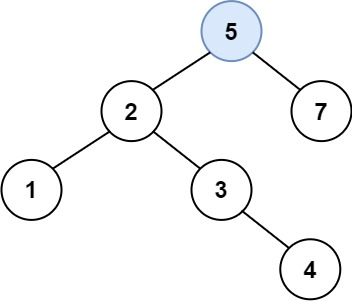

### 25、二叉搜索树中的插入操作（20240716，701题，中等，37min）
<div style="border: 1px solid black; padding: 10px; background-color: #00BFFF;">

给定二叉搜索树（BST）的根节点 root 和要插入树中的值 value ，将值插入二叉搜索树。 返回插入后二叉搜索树的根节点。 输入数据 **保证** ，新值和原始二叉搜索树中的任意节点值都不同。

**注意**，可能存在多种有效的插入方式，只要树在插入后仍保持为二叉搜索树即可。 你可以返回 **任意有效的结果** 。

 

示例 1：  


- 输入：root = [4,2,7,1,3], val = 5
- 输出：[4,2,7,1,3,5]
- 解释：另一个满足题目要求可以通过的树是：



示例 2：

- 输入：root = [40,20,60,10,30,50,70], val = 25
- 输出：[40,20,60,10,30,50,70,null,null,25]

示例 3：

- 输入：root = [4,2,7,1,3,null,null,null,null,null,null], val = 5
- 输出：[4,2,7,1,3,5]
 

提示：

- 树中的节点数将在 [0, 104]的范围内。
- -108 <= Node.val <= 108
- 所有值 Node.val 是 独一无二 的。
- -108 <= val <= 108
- 保证 val 在原始BST中不存在。

  </p>
</div>

<hr style="border-top: 5px solid #DC143C;">
<table>
  <tr>
    <td bgcolor="Yellow" style="padding: 5px; border: 0px solid black;">
      <span style="font-weight: bold; font-size: 20px;color: black;">
      自己答案（通过！）
      </span>
    </td>
  </tr>
</table>

```C++
class Solution {
public:
    void find_position(TreeNode* cur_node, int val){
        if(cur_node == nullptr){
            return;
        }
        
        if(cur_node->val > val){
            find_position(cur_node->left, val);
            if(cur_node->left == nullptr){
                cur_node->left = new TreeNode(val);
                return;
            }
        }else if(cur_node->val < val){
            find_position(cur_node->right, val);
            if(cur_node->right == nullptr){
                cur_node->right = new TreeNode(val);
                return;
            }
        }
    }

    TreeNode* insertIntoBST(TreeNode* root, int val) {
        if(root == nullptr){
            return new TreeNode(val);
        }
        find_position(root, val);
        return root;
    }
};
```


<table>
  <tr>
    <td bgcolor="Yellow" style="padding: 5px; border: 0px solid black;">
      <span style="font-weight: bold; font-size: 20px;color: black;">
      自己答案（通过！）
      </span>
    </td>
  </tr>
</table>

```C++


```

<hr style="border-top: 5px solid #DC143C;">

<table>
  <tr>
    <td bgcolor="Yellow" style="padding: 5px; border: 0px solid black;">
      <span style="font-weight: bold; font-size: 20px;color: black;">
      自己调试版本（通过！！！）
      </span>
    </td>
  </tr>
</table>

```C++


```

<table>
  <tr>
    <td bgcolor="Yellow" style="padding: 5px; border: 0px solid black;">
      <span style="font-weight: bold; font-size: 20px;color: black;">
      仿照答案版本v2（去注释）
      </span>
    </td>
  </tr>
</table>

```C++


```

<hr style="border-top: 5px solid #DC143C;">

<table>
  <tr>
    <td bgcolor="Yellow" style="padding: 5px; border: 0px solid black;">
      <span style="font-weight: bold; font-size: 20px;color: black;">
      仿照答案版本v2
      </span>
    </td>
  </tr>
</table>

```C++


```

<table>
  <tr>
    <td bgcolor="Yellow" style="padding: 5px; border: 0px solid black;">
      <span style="font-weight: bold; font-size: 20px;color: black;">
      随想录答案
      </span>
    </td>
  </tr>
</table>

```C++


```
