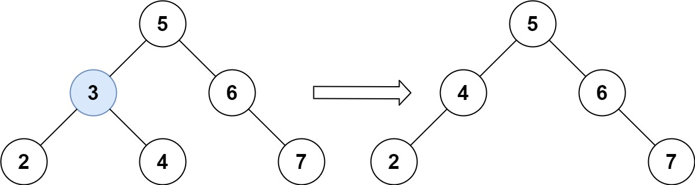
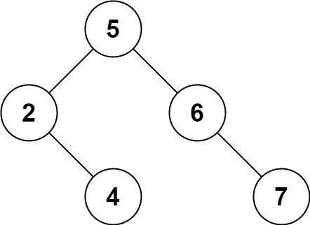

### 26、删除二叉搜索树中的节点（20240716，450题，中等）
<div style="border: 1px solid black; padding: 10px; background-color: SteelBlue;">

给定一个二叉搜索树的根节点 **root** 和一个值 **key**，删除二叉搜索树中的 key 对应的节点，并保证二叉搜索树的性质不变。返回二叉搜索树（有可能被更新）的根节点的引用。

一般来说，删除节点可分为两个步骤：

- 首先找到需要删除的节点；  
- 如果找到了，删除它。
 

示例 1:



- 输入：root = [5,3,6,2,4,null,7], key = 3
- 输出：[5,4,6,2,null,null,7]
- 解释：给定需要删除的节点值是 3，所以我们首先找到 3 这个节点，然后删除它。  
一个正确的答案是 [5,4,6,2,null,null,7], 如下图所示。  
另一个正确答案是 [5,2,6,null,4,null,7]。 



示例 2:

- 输入: root = [5,3,6,2,4,null,7], key = 0
- 输出: [5,3,6,2,4,null,7]
- 解释: 二叉树不包含值为 0 的节点

示例 3:

- 输入: root = [], key = 0
- 输出: []
 

提示:

- 节点数的范围 [0, 104].
- -105 <= Node.val <= 105
- 节点值唯一
- root 是合法的二叉搜索树
- -105 <= key <= 105
 

进阶： 要求算法时间复杂度为 O(h)，h 为树的高度。

  </p>
</div>

<hr style="border-top: 5px solid #DC143C;">

<table>
  <tr>
    <td bgcolor="Yellow" style="padding: 5px; border: 0px solid black;">
      <span style="font-weight: bold; font-size: 20px;color: black;">
      仿照答案（递归方法，14min）
      </span>
    </td>
  </tr>
</table>

<div style="padding: 0px; border: 1.5px solid LightSalmon; margin-bottom: 10px">

```C++ {.line-numbers}
/*
思路，递归方法14min
递归函数返回一个节点

利用二叉搜索树的特点，找到特定key的节点A
    A有一个子树为空，则返回另一个子树
    A左右子树都有，则找到右子树最左点节点B，将A的左子树A1接到B的左子树上
*/

class Solution {
public:
    TreeNode* deleteNode(TreeNode* root, int key) {
        if(root == nullptr) return nullptr;

        if(root->val == key){
            if(root->left == nullptr){
                return root->right;
            }else if(root->right == nullptr){
                return root->left;
            }else{
                // TreeNode* tmp_node = root->right; 要从待删除节点的有几点递归找左节点的下家
                TreeNode* tmp_node = root->right;
                while(tmp_node->left){
                    tmp_node = tmp_node->left;
                }
                tmp_node->left = root->left;
                TreeNode* ret_node = root->right;
                delete root;
                return ret_node;
            }
        }

        if(root->val > key) root->left = deleteNode(root->left, key);
        if(root->val < key) root->right = deleteNode(root->right, key);

        return root;
    }
};
```
</div>


<table>
  <tr>
    <td bgcolor="Yellow" style="padding: 5px; border: 0px solid black;">
      <span style="font-weight: bold; font-size: 20px;color: black;">
      仿照答案（迭代方法，31min）
      </span>
    </td>
  </tr>
</table>

<div style="padding: 0px; border: 1.5px solid LightSalmon; margin-bottom: 10px">

```C++ {.line-numbers}
/*
思路，迭代方法，31min（其实和自己方法一样的？）
先找到key对应的节点A
再通过递归相似的方式处理待删除的节点A，可以使用一个函数来处理A
    A有一个节点为空，则返回这个节点
    否则类似递归方法处理A右子节点B，并返回B

注意删除根节点的情况
    
*/

class Solution {
public:
    TreeNode* actualDeleteNode(TreeNode* del_node){
        if(del_node == nullptr) return nullptr;

        if(del_node->left == nullptr){
            return del_node->right;
        }else if(del_node->right == nullptr){
            return del_node->left;
        }else{
            TreeNode* tmp_node = del_node->right;
            while(tmp_node->left){
                tmp_node = tmp_node->left;
            }
            tmp_node->left = del_node->left;
            TreeNode* ret_node = del_node->right;
            delete del_node;
            return ret_node;
        }
    }

    TreeNode* deleteNode(TreeNode* root, int key) {
        if(root == nullptr) return nullptr;

        TreeNode* pre = nullptr;
        TreeNode* cur_node = root;
        while(cur_node){  // while(root)  不能改变根节点，这里只是要找出待删除的对应key的节点！！！
            if(cur_node->val == key){
                 break;
            }
            else if(cur_node->val < key){
                pre = cur_node;
                cur_node = cur_node->right;
            }else{
                pre = cur_node;
                cur_node = cur_node->left;
            }
        }
        if(pre == nullptr){
            return actualDeleteNode(cur_node);

        }else if(pre->left != nullptr && pre->left->val == key){
            pre->left = actualDeleteNode(pre->left);

        }else if(pre->right != nullptr && pre->right->val == key){
            pre->right = actualDeleteNode(pre->right);

        }else{  // 不可能到这？没有要删除的点就会到这里！！！
            // cout << "wrong!" << endl;
            // return nullptr;
            return root;
        }
        return root;
    }
};
```
</div>


<hr style="border-top: 5px solid #DC143C;">

<table>
  <tr>
    <td bgcolor="Yellow" style="padding: 5px; border: 0px solid black;">
      <span style="font-weight: bold; font-size: 20px;color: black;">
      自己答案（小优化）
      </span>
    </td>
  </tr>
</table>

<div style="padding: 0px; border: 1.5px solid LightSalmon; margin-bottom: 10px">

```C++ {.line-numbers}
 /*
 思路：
找到需要删除的节点B，
    若B存在右子节点B2，则找到B2的最左节点B2n，将B的左子节点B1作为B2n的左子节点！
        （与此类似的是B存在左子结点B1，可以找到B1的最右节点B1n，将B2作为其右子节点插入）
    若B不存在右子节点B2，则直接考虑下一步
接着看B的父节点A情况：
    若A是根节点，有B2，则返回B2；
    若A是不是根节点
        若B是A的左子节点，
            B存在B2，则A的左子节点改为B2；
            B不存在B2,则A的左子节点改为B1；
        若B是A的右子节点，
            B存在B2，则A的右子节点改为B2；
            B不存在B2,则A的右子节点改为B1；
 */

// 删除根节点也统一处理
class Solution {
public:
    TreeNode* deleteNode(TreeNode* root, int key) {

        TreeNode* parent = root;
        TreeNode* cur_node = root;
        while(cur_node != nullptr){  // 找需要改的节点
            if(cur_node->val > key){
                parent = cur_node;
                cur_node = cur_node->left;
            }else if(cur_node->val < key){
                parent = cur_node;
                cur_node = cur_node->right;
            }else{
                break;
            }
        }
        if(cur_node != nullptr){  // 存在需要改的节点 
            if(cur_node->right != nullptr){  // 待删除节点存在右节点情况
                TreeNode* cur1 = cur_node->right;
                TreeNode* pre1 = cur1;
                while(cur1 != nullptr){
                    pre1 = cur1;
                    cur1 = cur1->left;
                }
                pre1->left = cur_node->left;
                if(cur_node == root){  // 删除的是根节点
                    TreeNode* ret = cur_node->right;
                    delete root;
                    return ret;
                }else if(parent->left == cur_node){
                    parent->left = cur_node->right;
                }else if(parent->right == cur_node){
                    parent->right = cur_node->right;
                }else{
                    return nullptr;  // 不可能走到这
                }
                delete cur_node;
            }else{  // 待删除节点不存在右节点情况
                if(cur_node == root){  // 删除的是根节点
                    TreeNode* ret = cur_node->left;
                    delete root;
                    return ret;
                }
                else if(parent->left == cur_node){
                    parent->left = cur_node->left;
                }else if(parent->right == cur_node){
                    parent->right = cur_node->left;
                }else{
                    return nullptr;  // 不可能走到这
                }
                delete cur_node;
            }
        }
        return root;
    }
};
```

</div>


<table>
  <tr>
    <td bgcolor="Yellow" style="padding: 5px; border: 0px solid black;">
      <span style="font-weight: bold; font-size: 20px;color: black;">
      自己答案（通过！）
      </span>
    </td>
  </tr>
</table>

<div style="padding: 0px; border: 1.5px solid LightSalmon; margin-bottom: 10px">

```C++ {.line-numbers}
 /*
 思路：
找到需要删除的节点，看其为父节点的左还是右子节点
    待删除的节点B是父节点A的左子节点：
        B有左子节点则，A左子节点改为B左，B的右子节点接到左子节点右边
        B无左子节点则，A左子节点改为B右，
    待删除的节点B是父节点A的右子节点：
        B有左子节点则，A右子节点改为B左，B的右子节点接到左子节点右边
        B无左子节点则，A右子节点改为B右，
 */

class Solution {
public:
    TreeNode* deleteNode(TreeNode* root, int key) {
        TreeNode* pre = nullptr;
        TreeNode* cur = root;
        if(root != nullptr && root->val == key){  // 删除根节点情况
            if(root->right != nullptr){
                TreeNode* cur = root->right;
                while(cur != nullptr){
                    pre = cur;
                    cur = cur->left;
                }
                TreeNode* right = root->right;
                pre->left = root->left;
                delete root;
                return right;
            }else{
                TreeNode* left = root->left;
                delete root;
                return left;
            }
        }

        TreeNode* parent = nullptr;
        TreeNode* cur_node = root;
        while(cur_node != nullptr){  // 找需要改的节点
            if(cur_node->val > key){
                parent = cur_node;
                cur_node = cur_node->left;
            }else if(cur_node->val < key){
                parent = cur_node;
                cur_node = cur_node->right;
            }else{
                break;
            }
        }
        if(parent != nullptr && cur_node != nullptr){  // 找到需要改的节点 
            if(cur_node->right != nullptr){  // 待删除节点存在右节点情况
                // TreeNode* pre1 = nullptr;
                TreeNode* cur1 = cur_node->right;
                TreeNode* pre1 = cur1;
                while(cur1 != nullptr){
                    pre1 = cur1;
                    cur1 = cur1->left;
                }
                pre1->left = cur_node->left;
                if(parent->left == cur_node){
                    parent->left = cur_node->right;
                }else if(parent->right == cur_node){
                    parent->right = cur_node->right;
                }else{
                    return nullptr;  // 不可能走到这
                }
                delete cur_node;
            }else{  // 待删除节点不存在右节点情况
                if(parent->left == cur_node){
                    parent->left = cur_node->left;
                }else if(parent->right == cur_node){
                    parent->right = cur_node->left;
                }else{
                    return nullptr;  // 不可能走到这
                }
                delete cur_node;
            }
        }
        return root;
    }
};
```

</div>


<hr style="border-top: 5px solid #DC143C;">

<table>
  <tr>
    <td bgcolor="Yellow" style="padding: 5px; border: 0px solid black;">
      <span style="font-weight: bold; font-size: 20px;color: black;">
      随想录答案（递归方法）
      </span>
    </td>
  </tr>
</table>

<div style="padding: 0px; border: 1.5px solid LightSalmon; margin-bottom: 10px">

```C++ {.line-numbers}
class Solution {
public:
    TreeNode* deleteNode(TreeNode* root, int key) {
        if (root == nullptr) return root; // 第一种情况：没找到删除的节点，遍历到空节点直接返回了
        if (root->val == key) {
            // 第二种情况：左右孩子都为空（叶子节点），直接删除节点， 返回NULL为根节点
            if (root->left == nullptr && root->right == nullptr) {
                ///! 内存释放
                delete root;
                return nullptr;
            }
            // 第三种情况：其左孩子为空，右孩子不为空，删除节点，右孩子补位 ，返回右孩子为根节点
            else if (root->left == nullptr) {
                auto retNode = root->right;
                ///! 内存释放
                delete root;
                return retNode;
            }
            // 第四种情况：其右孩子为空，左孩子不为空，删除节点，左孩子补位，返回左孩子为根节点
            else if (root->right == nullptr) {
                auto retNode = root->left;
                ///! 内存释放
                delete root;
                return retNode;
            }
            // 第五种情况：左右孩子节点都不为空，则将删除节点的左子树放到删除节点的右子树的最左面节点的左孩子的位置
            // 并返回删除节点右孩子为新的根节点。
            else {
                TreeNode* cur = root->right; // 找右子树最左面的节点
                while(cur->left != nullptr) {
                    cur = cur->left;
                }
                cur->left = root->left; // 把要删除的节点（root）左子树放在cur的左孩子的位置
                TreeNode* tmp = root;   // 把root节点保存一下，下面来删除
                root = root->right;     // 返回旧root的右孩子作为新root
                delete tmp;             // 释放节点内存（这里不写也可以，但C++最好手动释放一下吧）
                return root;
            }
        }
        if (root->val > key) root->left = deleteNode(root->left, key);
        if (root->val < key) root->right = deleteNode(root->right, key);
        return root;
    }
};
```

</div>


<table>
  <tr>
    <td bgcolor="Yellow" style="padding: 5px; border: 0px solid black;">
      <span style="font-weight: bold; font-size: 20px;color: black;">
      随想录答案（迭代方法）
      </span>
    </td>
  </tr>
</table>

<div style="padding: 0px; border: 1.5px solid LightSalmon; margin-bottom: 10px">

```C++ {.line-numbers}
class Solution {
private:
    // 将目标节点（删除节点）的左子树放到 目标节点的右子树的最左面节点的左孩子位置上
    // 并返回目标节点右孩子为新的根节点
    // 是动画里模拟的过程
    TreeNode* deleteOneNode(TreeNode* target) {
        if (target == nullptr) return target;
        if (target->right == nullptr) return target->left;
        TreeNode* cur = target->right;
        while (cur->left) {
            cur = cur->left;
        }
        cur->left = target->left;
        return target->right;
    }
public:
    TreeNode* deleteNode(TreeNode* root, int key) {
        if (root == nullptr) return root;
        TreeNode* cur = root;
        TreeNode* pre = nullptr; // 记录cur的父节点，用来删除cur
        while (cur) {
            if (cur->val == key) break;
            pre = cur;
            if (cur->val > key) cur = cur->left;
            else cur = cur->right;
        }
        if (pre == nullptr) { // 如果搜索树只有头结点
            return deleteOneNode(cur);
        }
        // pre 要知道是删左孩子还是右孩子
        if (pre->left && pre->left->val == key) {
            pre->left = deleteOneNode(cur);
        }
        if (pre->right && pre->right->val == key) {
            pre->right = deleteOneNode(cur);
        }
        return root;
    }
};
```

</div>


<hr style="border-top: 5px solid #DC143C;">

<table>
  <tr>
    <td bgcolor="Yellow" style="padding: 5px; border: 0px solid black;">
      <span style="font-weight: bold; font-size: 20px;color: black;">
      随想录答案（递归方法，普通二叉树的删除方式）
      </span>
    </td>
  </tr>
</table>

<div style="padding: 0px; border: 1.5px solid LightSalmon; margin-bottom: 10px">

```C++ {.line-numbers}
/*
普通二叉树的删除方式（没有使用搜索树的特性，遍历整棵树），用交换值的操作来删除目标节点。

代码中目标节点（要删除的节点）被操作了两次：

第一次是和目标节点的右子树最左面节点交换。
第二次直接被NULL覆盖了。
*/
class Solution {
public:
    TreeNode* deleteNode(TreeNode* root, int key) {
        if (root == nullptr) return root;
        if (root->val == key) {
            if (root->right == nullptr) { // 这里第二次操作目标值：最终删除的作用
                return root->left;
            }
            TreeNode *cur = root->right;
            while (cur->left) {
                cur = cur->left;
            }
            swap(root->val, cur->val); // 这里第一次操作目标值：交换目标值其右子树最左面节点。
        }
        root->left = deleteNode(root->left, key);
        root->right = deleteNode(root->right, key);
        return root;
    }
};
```

</div>


