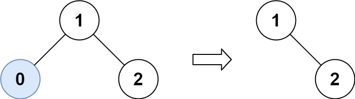
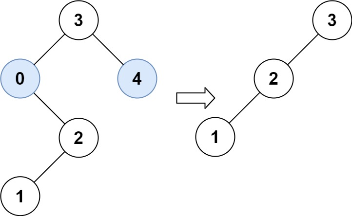

### 27、修剪二叉搜索树（20240717，669题，中等）
<div style="border: 1px solid black; padding: 10px; background-color: SteelBlue;">

给你二叉搜索树的根节点 root ，同时给定最小边界low 和最大边界 high。通过修剪二叉搜索树，使得所有节点的值在[low, high]中。修剪树 **不应该** 改变保留在树中的元素的相对结构 (即，如果没有被移除，原有的父代子代关系都应当保留)。 可以证明，存在 **唯一的答案** 。

所以结果应当返回修剪好的二叉搜索树的新的根节点。注意，根节点可能会根据给定的边界发生改变。

示例 1：  


- 输入：root = [1,0,2], low = 1, high = 2
- 输出：[1,null,2]

示例 2：  


- 输入：root = [3,0,4,null,2,null,null,1], low = 1, high = 3
- 输出：[3,2,null,1]
 

提示：

- 树中节点数在范围 [1, 104] 内
- 0 <= Node.val <= 104
- 树中每个节点的值都是 唯一 的
- 题目数据保证输入是一棵有效的二叉搜索树
- 0 <= low <= high <= 104

  </p>
</div>

<hr style="border-top: 5px solid #DC143C;">
<table>
  <tr>
    <td bgcolor="Yellow" style="padding: 5px; border: 0px solid black;">
      <span style="font-weight: bold; font-size: 20px;color: black;">
      仿照答案（递归法）
      </span>
    </td>
  </tr>
</table>

<div style="padding: 0px; border: 1.5px solid LightSalmon; margin-bottom: 10px">

```C++ {.line-numbers}
 /*
 [x10,x20]
找到第一个小于小于左区间x10的节点x5，并不能通过删除x5左子树，接上右子树而确定小于x10的节点都被去掉
    因为x5的右子树也可能存在[x6,x15]的也需要删除或保留的节点！！！
    同理找到第一个大于x20的节点x30，在x30的左子树可能存在[x15,x30]的也需要删除或保留的节点！！！
    所以找到小于或大于x10、x20区间边界的节点时，需要递归处理这些点！！！

需要遍历整个树！！！左右中，后序遍历。
    在遇到小于左边界x10的节点x5时，x5左子节点必定无效，所以继续递归处理x5的右子节点；
    在遇到大于右边界x20的节点x25时，x25右子节点必定无效，所以继续递归处理x25的左子节点；
 */

class Solution {
public:
    TreeNode* trimBST(TreeNode* root, int low, int high) {

        if(root == nullptr) return root;

        // 异常节点不会进入递归，而是令其左或右子节点进入递归，返回子节点递归结果，自身不会被返回，即被删除
        if(root->val < low){  // 遍历树的过程遇到小于low的节点，令右节点递归，即左节点被抛弃了
            TreeNode* right = trimBST(root->right, low, high);
            return right;
        }
        if(root->val > high){  // 不满足条件的节点，将返回递归中找到的正常节点！！！
            TreeNode* left = trimBST(root->left, low, high);
            return left;
        }

        // 正常节点进入递归，并更新左右子节点，并将自身返回
        root->left = trimBST(root->left, low, high); // 递归处理所有节点，并由上面三个条件摒弃了不合格的节点！！！
        root->right = trimBST(root->right, low, high);

        return root;  // 满足条件的节点会返回自身！
    }
};
```

</div>


<table>
  <tr>
    <td bgcolor="Yellow" style="padding: 5px; border: 0px solid black;">
      <span style="font-weight: bold; font-size: 20px;color: black;">
      仿照答案（迭代法）
      </span>
    </td>
  </tr>
</table>

<div style="padding: 0px; border: 1.5px solid LightSalmon; margin-bottom: 10px">

```C++ {.line-numbers}
// 删注释
class Solution {
public:
    TreeNode* trimBST(TreeNode* root, int low, int high) {
        if(root == nullptr) return root;
        if(root->val < low || root->val > high){  // 令根节点指向能找到的第一个正常节点
            while(root != nullptr){
                if(root->val < low){
                    root = root->right;
                }else if(root->val > high){
              
                    root = root->left;
                }else{
                    break;
                }
            }
        }
        TreeNode* cur_node = root;
        while(cur_node){  // 连续找cur_node的左节点值小于左边界的节点B，用B右子树B2代替B
            while(cur_node->left != nullptr && cur_node->left->val < low){
                cur_node->left = cur_node->left->right;
            }
            cur_node = cur_node->left;  // 去左子树找小于low的可能！！
        }
        cur_node = root;
        while(cur_node){  // 连续找cur_node的右节点值大于右边界的节点B，用B左子树B1代替B
            while(cur_node->right != nullptr && cur_node->right->val > high){
                cur_node->right = cur_node->right->left;
            }
            cur_node = cur_node->right;  // 右子树B正常，则继续找B的左子树可能大于右边界的节点
        }
        return root;
    }
};

/*
迭代法
从根节点开始处理，有三种情况
    1，当前节点小于low
        需一直去右节点找大于low的第一个节点B，找到后，需要去除B左子节点中所有小于low的节点；
    2，当前节点大于high
        需一直去左节点找第一个小于high的节点C，找到后，需要去除C右子节点中所有大于high的节点，直到null
    3，当前节点在low和high之间
        去左边找小于low的节点，同情况1，处理这些节点
        返回根节点，去右边找大于high的节点，同情况2，处理这些节点
情况1，需要去右节点找正常节点，找到正常节点A后，需要找A左子树是否有异常节点并处理
情况2，需要去左节点找正常节点，找到正常节点A后，需要找A右子树是否有异常节点并处理
情况3，类似前两种情况的先找到正常节点A。

合并下，就是先统一情况1和2，令当前节点到正常的节点去；然后分两次去掉小于左区间和大于右区间的所有节点。
*/ 
class Solution {
public:
    TreeNode* trimBST(TreeNode* root, int low, int high) {
        if(root == nullptr) return root;
        if(root->val < low || root->val > high){  // 令根节点指向能找到的第一个正常节点
            while(root != nullptr){
                if(root->val < low){
                    root = root->right;
                }else if(root->val > high){
                    root = root->left;
                }else{
                    break;
                }
            }
        }
        TreeNode* cur_node = root;
        while(cur_node){  // 从当前正常节点出发，往左处理值小于low的节点！！！
            // if(cur_node->left != nullptr){
            //     if(cur_node->left->val < val){
            //         cur_node->left = cur_node->left->right;
            //     }
            // }
            // 连续找cur_node的左节点值小于左边界的节点B，用B右子树B2代替B
            while(cur_node->left != nullptr && cur_node->left->val < low){
                cur_node->left = cur_node->left->right;
            }
            // 上面while更新了cur_node的左节点，令cur_node指向自己的左节点，继续处理
            // 就算上面while没处理，即cur_node值大于low，那也是cur_node继续指向自己左节点，找小于low的节点！！！
            cur_node = cur_node->left;  // cur_node = cur_node->right; cur_node值大于low了，所以要去左子树找小于low的可能！！
        }
        cur_node = root;
        while(cur_node){  // 连续找cur_node的右节点值大于右边界的节点B，用B左子树B1代替B
            while(cur_node->right != nullptr && cur_node->right->val > high){
                cur_node->right = cur_node->right->left;
            }
            cur_node = cur_node->right;  // 右子树B正常，则继续找B的左子树可能大于右边界的节点
        }
        return root;
    }
};
```

</div>


<hr style="border-top: 5px solid #DC143C;">

<table>
  <tr>
    <td bgcolor="Yellow" style="padding: 5px; border: 0px solid black;">
      <span style="font-weight: bold; font-size: 20px;color: black;">
      自己答案（未通过。。）
      </span>
    </td>
  </tr>
</table>

<div style="padding: 0px; border: 1.5px solid LightSalmon; margin-bottom: 10px">

```C++ {.line-numbers}
 /*
 分两次处理
 第一次处理左边界，找到小于左边界的第一个点，删除此点及其左边的子树，右子树接上
 第二次处理右边界，同理
 */
class Solution {
public:
    TreeNode* deletelower(TreeNode*& cur_node, int low){
        if(cur_node == nullptr) return nullptr;

        if(cur_node->val < low){
            TreeNode* ret = cur_node->right;
            delete cur_node;
            return ret;
        }
        if(cur_node->val >= low) cur_node->left = deletelower(cur_node->left, low);

        return cur_node;
    }

    TreeNode* deletehigher(TreeNode*& cur_node, int high){
        if(cur_node == nullptr) return nullptr;

        if(cur_node->val > high){
            TreeNode* tmp = cur_node;
            while(cur_node){
                if(cur_node->val <= high){
                    delete tmp;
                    return cur_node;
                }
                cur_node = cur_node->left;
            }
            delete tmp;
            return nullptr;
        }
        if(cur_node->val <= high) cur_node->right = deletehigher(cur_node->right, high);

        return cur_node;
    }

    TreeNode* trimBST(TreeNode* root, int low, int high) {

        TreeNode* tmp = deletelower(root, low);
        TreeNode* ret = deletehigher(tmp, high);
        return ret;
    }
};
```

</div>

<hr style="border-top: 5px solid #DC143C;">


<table>
  <tr>
    <td bgcolor="Yellow" style="padding: 5px; border: 0px solid black;">
      <span style="font-weight: bold; font-size: 20px;color: black;">
      随想录答案（递归法）
      </span>
    </td>
  </tr>
</table>

<div style="padding: 0px; border: 1.5px solid LightSalmon; margin-bottom: 10px">

```C++ {.line-numbers}
class Solution {
public:
    TreeNode* trimBST(TreeNode* root, int low, int high) {
        if (root == nullptr ) return nullptr;
        if (root->val < low) {
            TreeNode* right = trimBST(root->right, low, high); // 寻找符合区间[low, high]的节点
            return right;
        }
        if (root->val > high) {
            TreeNode* left = trimBST(root->left, low, high); // 寻找符合区间[low, high]的节点
            return left;
        }
        root->left = trimBST(root->left, low, high); // root->left接入符合条件的左孩子
        root->right = trimBST(root->right, low, high); // root->right接入符合条件的右孩子
        return root;
    }
};

// 精简后
class Solution {
public:
    TreeNode* trimBST(TreeNode* root, int low, int high) {
        if (root == nullptr) return nullptr;
        if (root->val < low) return trimBST(root->right, low, high);
        if (root->val > high) return trimBST(root->left, low, high);
        root->left = trimBST(root->left, low, high);
        root->right = trimBST(root->right, low, high);
        return root;
    }
};
```

</div>

<table>
  <tr>
    <td bgcolor="Yellow" style="padding: 5px; border: 0px solid black;">
      <span style="font-weight: bold; font-size: 20px;color: black;">
      随想录答案（迭代法）
      </span>
    </td>
  </tr>
</table>

<div style="padding: 0px; border: 1.5px solid LightSalmon; margin-bottom: 10px">

```C++ {.line-numbers}
/*
因为二叉搜索树的有序性，不需要使用栈模拟递归的过程。

在剪枝的时候，可以分为三步：

将root移动到[L, R] 范围内，注意是左闭右闭区间
剪枝左子树
剪枝右子树
*/
class Solution {
public:
    TreeNode* trimBST(TreeNode* root, int L, int R) {
        if (!root) return nullptr;

        // 处理头结点，让root移动到[L, R] 范围内，注意是左闭右闭
        while (root != nullptr && (root->val < L || root->val > R)) {
            if (root->val < L) root = root->right; // 小于L往右走
            else root = root->left; // 大于R往左走
        }
        TreeNode *cur = root;
        // 此时root已经在[L, R] 范围内，处理左孩子元素小于L的情况
        while (cur != nullptr) {
            while (cur->left && cur->left->val < L) {
                cur->left = cur->left->right;
            }
            cur = cur->left;
        }
        cur = root;

        // 此时root已经在[L, R] 范围内，处理右孩子大于R的情况
        while (cur != nullptr) {
            while (cur->right && cur->right->val > R) {
                cur->right = cur->right->left;
            }
            cur = cur->right;
        }
        return root;
    }
};
```
</div>
