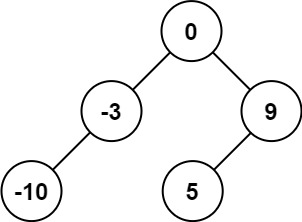
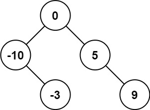
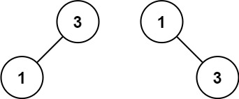

### 28、将有序数组转换为二叉搜索树（20240718，108题，中等。50min）
<div style="border: 1px solid black; padding: 10px; background-color: #00BFFF;">

给你一个整数数组 nums ，其中元素已经按 **升序** 排列，请你将其转换为一棵 **平衡** 二叉搜索树。

 

示例 1：



- 输入：nums = [-10,-3,0,5,9]
- 输出：[0,-3,9,-10,null,5]
- 解释：[0,-10,5,null,-3,null,9] 也将被视为正确答案：



示例 2：



- 输入：nums = [1,3]
- 输出：[3,1]
- 解释：[1,null,3] 和 [3,1] 都是高度平衡二叉搜索树。
 

提示：

- 1 <= nums.length <= 104
- -104 <= nums[i] <= 104
- nums 按 严格递增 顺序排列

  </p>
</div>

<hr style="border-top: 5px solid #DC143C;">
<table>
  <tr>
    <td bgcolor="Yellow" style="padding: 5px; border: 0px solid black;">
      <span style="font-weight: bold; font-size: 20px;color: black;">
      看答案思路
      </span>
    </td>
  </tr>
</table>
<div style="padding: 0px; border: 1.5px solid black;">

```C++
 /*
 思路：
每次取中间的数作为构建节点，左边即为左子树，右边为右子树
在递归中处理左右子树
 */
class Solution {
public:

    TreeNode* constructBST(vector<int>& nums, int left, int right){
        if(left > right) return nullptr;

        // int mid = left + right / 2;
        int mid = left + (right-left) / 2;
        TreeNode* cur_node = new TreeNode(nums[mid]);

        cur_node->left = constructBST(nums, left, mid-1);
        cur_node->right = constructBST(nums, mid+1, right);

        return cur_node;
    }

    TreeNode* sortedArrayToBST(vector<int>& nums) {
        size_t size = nums.size();

        TreeNode* root = constructBST(nums, 0, size-1);

        return root;
    }
};

```

</div>


<hr style="border-top: 5px solid #DC143C;">

<table>
  <tr>
    <td bgcolor="Yellow" style="padding: 5px; border: 0px solid black;">
      <span style="font-weight: bold; font-size: 20px;color: black;">
      自己答案（通过！）
      </span>
    </td>
  </tr>
</table>

<div style="padding: 0px; border: 1.5px solid black;">

```C++
 /*
 思路：
 50min
 先不管数字大小，按照一层层的方式构建二叉树，把所有数字用完
 最后使用中序遍历重新给树赋值
 */
class Solution {
public:

    void giveCorrectVal(TreeNode* cur_node, vector<int>& nums){
        if(cur_node == nullptr) return ;

        giveCorrectVal(cur_node->left, nums);

        cur_node->val = nums.back();
        nums.pop_back();

        giveCorrectVal(cur_node->right, nums);
    }

    TreeNode* sortedArrayToBST(vector<int>& nums) {
        size_t size = nums.size();

        TreeNode* root = new TreeNode(nums[0]);
        int count = size - 1;
        queue<TreeNode*> que;
        que.push(root);   // que.push_back(root); 队列没有push_back()，是que.push(root)！！！

        while(count){
            while(!que.empty()){
                TreeNode* cur_node = que.front();
                que.pop();
                if(count > 0){
                    cur_node->left = new TreeNode(0);
                    count--;
                    que.push(cur_node->left);
                }
                if(count > 0){
                    cur_node->right = new TreeNode(0);
                    count--;
                    que.push(cur_node->right);
                }
                if(count == 0) break;
            }
        }

        reverse(nums.begin(), nums.end());
        giveCorrectVal(root, nums);

        return root;
    }
};
```
</div>


<hr style="border-top: 5px solid #DC143C;">

<table>
  <tr>
    <td bgcolor="Yellow" style="padding: 5px; border: 0px solid black;">
      <span style="font-weight: bold; font-size: 20px;color: black;">
      自己调试版本（通过！！！）
      </span>
    </td>
  </tr>
</table>

<div style="padding: 0px; border: 1.5px solid black;">

```C++


```
</div>

<table>
  <tr>
    <td bgcolor="Yellow" style="padding: 5px; border: 0px solid black;">
      <span style="font-weight: bold; font-size: 20px;color: black;">
      仿照答案版本v2（去注释）
      </span>
    </td>
  </tr>
</table>

<div style="padding: 0px; border: 1.5px solid black;">

```C++


```
</div>

<hr style="border-top: 5px solid #DC143C;">

<table>
  <tr>
    <td bgcolor="Yellow" style="padding: 5px; border: 0px solid black;">
      <span style="font-weight: bold; font-size: 20px;color: black;">
      仿照答案版本v2
      </span>
    </td>
  </tr>
</table>

<div style="padding: 0px; border: 1.5px solid black;">

```C++


```
</div>

<table>
  <tr>
    <td bgcolor="Yellow" style="padding: 5px; border: 0px solid black;">
      <span style="font-weight: bold; font-size: 20px;color: black;">
      随想录答案
      </span>
    </td>
  </tr>
</table>

<div style="padding: 0px; border: 1.5px solid black;">

```C++


```
</div>
