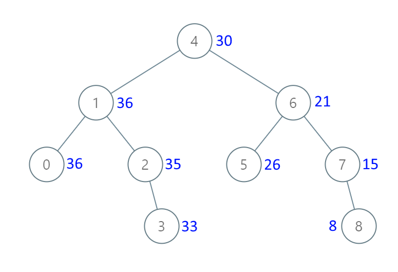

### 29、把二叉搜索树转换为累加树（20240718，538题，中等。40min）
<div style="border: 1px solid black; padding: 10px; background-color: #00BFFF;">

给出二叉 **搜索** 树的根节点，该树的节点值各不相同，请你将其转换为累加树（Greater Sum Tree），使每个节点 node 的新值等于原树中大于或等于 node.val 的值之和。

提醒一下，二叉搜索树满足下列约束条件：

- 节点的左子树仅包含键 **小于** 节点键的节点。
- 节点的右子树仅包含键 **大于** 节点键的节点。
- 左右子树也必须是二叉搜索树。
 
示例 1：



- 输入：[4,1,6,0,2,5,7,null,null,null,3,null,null,null,8]
- 输出：[30,36,21,36,35,26,15,null,null,null,33,null,null,null,8]

示例 2：

- 输入：root = [0,null,1]
- 输出：[1,null,1]

示例 3：

- 输入：root = [1,0,2]
- 输出：[3,3,2]

示例 4：

- 输入：root = [3,2,4,1]
- 输出：[7,9,4,10]
 

提示：

- 树中的节点数介于 0 和 104 之间。
- 每个节点的值介于 -104 和 104 之间。
- 树中的所有值 **互不相同** 。
- 给定的树为二叉搜索树。

  </p>
</div>

<hr style="border-top: 5px solid #DC143C;">
<table>
  <tr>
    <td bgcolor="Yellow" style="padding: 5px; border: 0px solid black;">
      <span style="font-weight: bold; font-size: 20px;color: black;">
      看答案思路
      </span>
    </td>
  </tr>
</table>
<div style="padding: 0px; border: 1.5px solid LightSalmon; margin-bottom: 10px;">

```C++
/*
 思路：
可以右中左顺序遍历树
使用一个成员记录上一个节点值
每次遍历，需要将右子树返回的结果，和本节点的值相加，传给左子树

返回左右子树中的最大值
 */
class Solution {
public:
    int pre = 0;
    void travelBST(TreeNode* cur_node){
        if(cur_node == nullptr) return ;

        travelBST(cur_node->right);

        int cur_val = pre + cur_node->val ;
        cur_node->val = cur_val;
        pre = cur_val;

        travelBST(cur_node->left);
    }
    TreeNode* convertBST(TreeNode* root){

        travelBST(root);

        return root;
    }
};
```

</div>


<hr style="border-top: 5px solid #DC143C;">

<table>
  <tr>
    <td bgcolor="Yellow" style="padding: 5px; border: 0px solid black;">
      <span style="font-weight: bold; font-size: 20px;color: black;">
      自己答案（通过！）
      </span>
    </td>
  </tr>
</table>

<div style="padding: 0px; border: 1.5px solid LightSalmon; margin-bottom: 10px">

```C++
 /*
 40min
 思路：
 先获得这个数的数组，
 再建立累加和数组
 */
class Solution {
public:
    vector<int> vec;
    void trvalTree(TreeNode* cur_node){  // 遍历树，得到数组
        if(cur_node == nullptr) return;

        trvalTree(cur_node->left);
        vec.push_back(cur_node->val);
        trvalTree(cur_node->right);
    }

    void giveNewVal(vector<int>& tmp, TreeNode* cur_node){ // 遍历树，用数组重新赋值
        if(cur_node == nullptr) return;

        giveNewVal(tmp, cur_node->left);  // trvalTree(tmp, cur_node->left);  用错函数了！！！复制粘贴后，要好好检查内容对不对啊！！！

        cur_node->val = tmp.back();
        tmp.pop_back();

        giveNewVal(tmp, cur_node->right);
    }

    TreeNode* convertBST(TreeNode* root){
        vec.clear();
        if(root == nullptr) return root;

        trvalTree(root);

        vector<int> tmp(vec.size(), 0);

        tmp[0] = vec[vec.size()-1];
        // for(int i = vec.size()-2, int j = 1; i >= 0; i--)   // j不需要int声明
        for(int i = vec.size()-2, j = 1; i >= 0; i--){
            tmp[j] = tmp[j-1] + vec[i];
            j++;
        }

        // reverse(vec.begin(), vec.end());
        // tmp[0] = vec[0];
        // for(int i = 1; i < vec.size(); i++){
        //     tmp[i] = tmp[i-1] + vec[i];
        // }

        giveNewVal(tmp, root);

        return root;
    }
};
```
</div>


<hr style="border-top: 5px solid #DC143C;">

<table>
  <tr>
    <td bgcolor="Yellow" style="padding: 5px; border: 0px solid black;">
      <span style="font-weight: bold; font-size: 20px;color: black;">
      随想录答案（迭代法）
      </span>
    </td>
  </tr>
</table>

<div style="padding: 0px; border: 1.5px solid LightSalmon; margin-bottom: 10px">

```C++
class Solution {
private:
    int pre; // 记录前一个节点的数值
    void traversal(TreeNode* root) {
        stack<TreeNode*> st;
        TreeNode* cur = root;
        while (cur != NULL || !st.empty()) {
            if (cur != NULL) {
                st.push(cur);
                cur = cur->right;   // 右
            } else {
                cur = st.top();     // 中
                st.pop();
                cur->val += pre;
                pre = cur->val;
                cur = cur->left;    // 左
            }
        }
    }
public:
    TreeNode* convertBST(TreeNode* root) {
        pre = 0;
        traversal(root);
        return root;
    }
};
```
</div>
