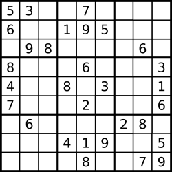
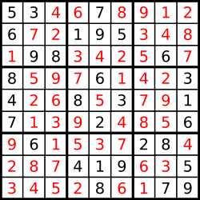

### 14、解数独树（20240710，37题，困难）
<div style="border: 1px solid black; padding: 10px; background-color: #00BFFF;">

编写一个程序，通过填充空格来解决数独问题。

数独的解法需 遵循如下规则：

- 数字 1-9 在每一行只能出现一次。
- 数字 1-9 在每一列只能出现一次。
- 数字 1-9 在每一个以粗实线分隔的 3x3 宫内只能出现一次。（请参考示例图） 

数独部分空格内已填入了数字，空白格用 '.' 表示。

 

示例 1：  


- 输入：board = [["5","3",".",".","7",".",".",".","."],["6",".",".","1","9","5",".",".","."],[".","9","8",".",".",".",".","6","."],["8",".",".",".","6",".",".",".","3"],["4",".",".","8",".","3",".",".","1"],["7",".",".",".","2",".",".",".","6"],[".","6",".",".",".",".","2","8","."],[".",".",".","4","1","9",".",".","5"],[".",".",".",".","8",".",".","7","9"]]
- 输出：[["5","3","4","6","7","8","9","1","2"],["6","7","2","1","9","5","3","4","8"],["1","9","8","3","4","2","5","6","7"],["8","5","9","7","6","1","4","2","3"],["4","2","6","8","5","3","7","9","1"],["7","1","3","9","2","4","8","5","6"],["9","6","1","5","3","7","2","8","4"],["2","8","7","4","1","9","6","3","5"],["3","4","5","2","8","6","1","7","9"]]
- 解释：输入的数独如上图所示，唯一有效的解决方案如下所示：


 

提示：

- board.length == 9
- board[i].length == 9
- board[i][j] 是一位数字或者 '.'
题目数据 保证 输入数独仅有一个解

  </p>
</div>

<hr style="border-top: 5px solid #DC143C;">
<table>
  <tr>
    <td bgcolor="Yellow" style="padding: 5px; border: 0px solid black;">
      <span style="font-weight: bold; font-size: 20px;color: black;">
      自己答案（去注释，通过！）
      </span>
    </td>
  </tr>
</table>

```C++ {.line-numbers}
/*
思路：
依次遍历各点，未确定的点，则根据所在的九宫格和行列，确定可以取的数字的集合
map<int, map<>>
vector<vector<list<int>>> num_map(9, vector<list<int>>(9))

确定的格子，将数值存入list，
不确定的格子按规则存入可能得数字
    从所在行、列、九宫格，去掉已经确定的数字，其余的存入当前格子list中
每确定一个格子，更行当前行和列中未知格子

初始化的时候，直接将未知格子初始化为1~9.

search_map是保证了所有格子都遍历，并用来更新其他人
    所以更新是个递归过程，处理当前格子，
        若list大小为1，则更新当前格子的x和y方向，以及9宫格
            被更新的格子若list大小减为1，同样继续更新其周围格子
        若list大小大于1，说明确定不了什么，继续search_map的遍历！！！

一次回溯可能还不够，因为可能存在有些格子都不确定的情况。
需要尝试选定数字来确认。。
    依然从头遍历，找到还未确定的格子
        再次遍历未确定的数字
    由于可能当前数字不对，但遍历过程会修改board和num_map,所以最好这次遍历只修改其副本
    另外当前数字假定为a后，不能推导出全部，怎么办？
        放弃对a的假定，继续遍历，直到最终有一个能推导全部的数字被确定。。
            修改update_data，令其在遇到相同数字时，返回true，说明这次遍历不对，得重新选数字
                否则返回false，让其一直更新当前的board和num_map
        search_map遍历一个格子，遇到存在多种可能，就进行遍历 
            遇到返回true，遍历当前格子的下一个可能
            （a）若遍历这个格子所有可能，还不能确定整张图，说明这个格子不能一下确定全部图
                继续找其他的能确定数字后，推导全图的格子

在步骤（a）中，虽然这个假定数字不能一下递归全部确定所有格子，但可以在这个起点下，继续递归
    查找过程找到了正确的组合，如何返回正确答案，而不继续递归？
    查找过程，遇到重复情况，如何快速结束当前递归？
*/
class Solution {
public:
    bool update_data(int x, int y, vector<vector<char>>& board, vector<vector<list<char>>>& num_map){
        char cur_num = board[x][y];  
        for(int m = 0; m < 9; m++){  // 检查x方向
            if(m != x && board[m][y] == cur_num){
                return true;
            }
            if(m != x && num_map[m][y].size() != 1){  // 更新未确定的list
                num_map[m][y].remove(cur_num);
                if(num_map[m][y].size() == 1){  // 确定了一个格子
                    board[m][y] = num_map[m][y].front();  // 更新board
                    if(update_data(m, y, board, num_map)) return true;
                }
            }
        }

        for(int m = 0; m < 9; m++){  // 检查y方向
            if(m != y && board[x][m] == cur_num){  // 找到了和更新点相同的数字！！！说明上次这次的更新源头不对！！
                return true;
            }
            if(m != y && num_map[x][m].size() != 1){  // 更新未确定的list
                num_map[x][m].remove(cur_num);
                if(num_map[x][m].size() == 1){  // 确定了一个格子
                    board[x][m] = num_map[x][m].front();  // 更新board
                    // update_data(x, m, board, num_map);
                    if(update_data(x, m, board, num_map)) return true;   // 传递底层可能遇到的重复数字的情况
                }
            }
        }

        for(int i = x/3*3; i < x/3*3+3; i++){         // 检查当前九宫格
            for(int j = y/3*3; j < y/3*3+3; j++){
                if(i != x && j != y && board[i][j] == cur_num){  // 找到了和更新点相同的数字！
                    return true;
                }
                if(num_map[i][j].size() > 1){
                    num_map[i][j].remove(cur_num);
                    if(num_map[i][j].size() == 1){  // 确定了一个格子
                        board[i][j] = num_map[i][j].front();  // 更新board
                        if(update_data(i, j, board, num_map)) return true;   // 传递底层可能遇到的重复数字的情况
                    }
                }
            }
        }
        return false;
    }

    void search_board(vector<vector<char>>& board, vector<vector<list<char>>>& num_map){
        for(int i = 0; i < 9; i++){
            for(int j = 0; j < 9; j++){
                if(num_map[i][j].size() == 1){ 
                    update_data(i, j, board, num_map);
                }
            }
        }
    }

    bool deal_each_point(vector<vector<char>>& board, vector<vector<list<char>>>& num_map, int x, int y){
        vector<vector<char>> tmp_board = board; 
        vector<vector<list<char>>> tmp_num_map = num_map;

        for(int i = x; i < 9; i++){   // 上层假定了（x，y），这里找下一个需要假定的格子
            for(int j = y; j < 9; j++){
                if(x == 8 && y == 8 && tmp_num_map[x][y].size() == 1){
                    return true;   // 上一层已经将所有格子确定了！！
                }
                if(tmp_num_map[i][j].size() > 1){  // 找到未确定的格子
                    list<char> tmp_list(tmp_num_map[i][j]);
                    for(auto& tmp_char : tmp_list){  // 这里遍历完，没有找到答案，说明上层选的不对！！
                        tmp_board[i][j] = tmp_char;  // 不给这两个赋值，怎么让后面直到我假定了这个格子的值？！！！
                        tmp_num_map[i][j].assign(1, tmp_char);

                        bool flag = update_data(i, j, tmp_board, tmp_num_map);  
                        if(flag){  // 有重复数字，则继续遍历，但要重置参数！
                            tmp_board = board;
                            tmp_num_map = num_map;   
                            continue ;  
                        }else if(deal_each_point(tmp_board, tmp_num_map, i, j)){
                            board = tmp_board;  // 将正确的tmp_board向上传递
                            return true;
                        }else{       // 上面的else if中的deal_each_point可能都是错误选项，即本轮的选点错误，需要重置参数！
                            tmp_board = board;
                            tmp_num_map = num_map;  
                        }
                    }
                    return false;
                }
            }
        }
        board = tmp_board; 
        return true;
    }

    void solveSudoku(vector<vector<char>>& board) {
        vector<vector<list<char>>> num_map(9, vector<list<char>>(9));  
        int size = 9;

        for(int i = 0; i < size; i++){
            for(int j = 0; j < size; j++){
                if(board[i][j] == '.'){
                    num_map[i][j].assign({'1','2','3','4','5','6','7','8','9'});
                }else{
                    num_map[i][j].push_back(board[i][j]);
                }
            }
        }

        search_board(board, num_map);  // 第一次处理九宫格

        deal_each_point(board, num_map, 0, 0);
    }
};
```

<table>
  <tr>
    <td bgcolor="Yellow" style="padding: 5px; border: 0px solid black;">
      <span style="font-weight: bold; font-size: 20px;color: black;">
      自己答案（通过！）
      </span>
    </td>
  </tr>
</table>

```C++ {.line-numbers}
/*
思路：
依次遍历各点，未确定的点，则根据所在的九宫格和行列，确定可以取的数字的集合
map<int, map<>>
vector<vector<list<int>>> num_map(9, vector<list<int>>(9))

确定的格子，将数值存入list，
不确定的格子按规则存入可能得数字
    从所在行、列、九宫格，去掉已经确定的数字，其余的存入当前格子list中
每确定一个格子，更行当前行和列中未知格子

初始化的时候，直接将未知格子初始化为1~9.

search_map是保证了所有格子都遍历，并用来更新其他人
    所以更新是个递归过程，处理当前格子，
        若list大小为1，则更新当前格子的x和y方向，以及9宫格
            被更新的格子若list大小减为1，同样继续更新其周围格子
        若list大小大于1，说明确定不了什么，继续search_map的遍历！！！

一次回溯可能还不够，因为可能存在有些格子都不确定的情况。
需要尝试选定数字来确认。。
    依然从头遍历，找到还未确定的格子
        再次遍历未确定的数字
    由于可能当前数字不对，但遍历过程会修改board和num_map,所以最好这次遍历只修改其副本
    另外当前数字假定为a后，不能推导出全部，怎么办？
        放弃对a的假定，继续遍历，直到最终有一个能推导全部的数字被确定。。
            修改update_data，令其在遇到相同数字时，返回true，说明这次遍历不对，得重新选数字
                否则返回false，让其一直更新当前的board和num_map
        search_map遍历一个格子，遇到存在多种可能，就进行遍历 
            遇到返回true，遍历当前格子的下一个可能
            （a）若遍历这个格子所有可能，还不能确定整张图，说明这个格子不能一下确定全部图
                继续找其他的能确定数字后，推导全图的格子

在步骤（a）中，虽然这个假定数字不能一下递归全部确定所有格子，但可以在这个起点下，继续递归
    查找过程找到了正确的组合，如何返回正确答案，而不继续递归？
    查找过程，遇到重复情况，如何快速结束当前递归？
*/
class Solution {
public:
    bool update_data(int x, int y, vector<vector<char>>& board, vector<vector<list<char>>>& num_map){
        char cur_num = board[x][y];  // int cur_num = board[x][y] board中数据是char类型的，不是int
        for(int m = 0; m < 9; m++){  // 检查x方向
            if(m != x && board[m][y] == cur_num){  // 找到了和更新点相同的数字！！！说明上次这次的更新源头不对！！
                return true;
            }
            if(m != x && num_map[m][y].size() != 1){  // 更新未确定的list.实际应该改为大于1？？
                num_map[m][y].remove(cur_num);
                if(num_map[m][y].size() == 1){  // 确定了一个格子
                    board[m][y] = num_map[m][y].front();  // 更新board
                    // update_data(m, y, board, num_map);
                    if(update_data(m, y, board, num_map)) return true;   // 传递底层可能遇到的重复数字的情况
                }
            }
        }

        for(int m = 0; m < 9; m++){  // 检查y方向
            if(m != y && board[x][m] == cur_num){  // 找到了和更新点相同的数字！！！说明上次这次的更新源头不对！！
                return true;
            }
            if(m != y && num_map[x][m].size() != 1){  // 更新未确定的list
                num_map[x][m].remove(cur_num);
                if(num_map[x][m].size() == 1){  // 确定了一个格子
                    board[x][m] = num_map[x][m].front();  // 更新board
                    // update_data(x, m, board, num_map);
                    if(update_data(x, m, board, num_map)) return true;   // 传递底层可能遇到的重复数字的情况
                }
            }
        }

        // for(int i = x/3*3; i < 3; i++){      // i < 3是错的。。
        //     for(int j = y/3*3; j < 3; j++){
        for(int i = x/3*3; i < x/3*3+3; i++){         // 检查当前九宫格
            for(int j = y/3*3; j < y/3*3+3; j++){
                if(i != x && j != y && board[i][j] == cur_num){  // 找到了和更新点相同的数字！！！说明上次这次的更新源头不对！！
                    return true;
                }
                if(num_map[i][j].size() > 1){
                    num_map[i][j].remove(cur_num);
                    if(num_map[i][j].size() == 1){  // 确定了一个格子
                        board[i][j] = num_map[i][j].front();  // 更新board
                        // update_data(i, j, board, num_map);
                        if(update_data(i, j, board, num_map)) return true;   // 传递底层可能遇到的重复数字的情况
                    }
                }
            }
        }
        return false;
    }

    void search_board(vector<vector<char>>& board, vector<vector<list<char>>>& num_map){
        for(int i = 0; i < 9; i++){
            for(int j = 0; j < 9; j++){
                if(num_map[i][j].size() == 1){  // if(board[i][j] == ".")
                    update_data(i, j, board, num_map);
                }
            }
        }
    }

    bool check_map(vector<vector<char>>& tmp_board){
        for(int i = 0; i < 9; i++){
            for(int j = 0; j < 9; j++){
                if(tmp_board[i][j] == '.'){  
                    return false;
                }
            }
        }
        return true;
    }

    // 内层递归中，可能出现，当前的几种可能都不对，因为上层选的就不对，这时候怎么办？
    bool deal_each_point(vector<vector<char>>& board, vector<vector<list<char>>>& num_map, int x, int y){
        vector<vector<char>> tmp_board = board; 
        vector<vector<list<char>>> tmp_num_map = num_map;

        for(int i = x; i < 9; i++){   // 上层假定了（x，y），这里找下一个需要假定的格子
            for(int j = y; j < 9; j++){
                if(x == 8 && y == 8 && tmp_num_map[x][y].size() == 1){
                    return true;   // 上一层已经将所有格子确定了！！
                }
                if(tmp_num_map[i][j].size() > 1){  // 找到未确定的格子
                    // list<char> tmp_list(tmp_num_map[i][j]);
                    list<char> tmp_list(tmp_num_map[i][j]);
                    // for(auto& tmp_char : tmp_num_map[i][j])  // update_data递归中可能会删除num_map，所以不能这样遍历
                    // for(auto& tmp_char : tmp_list[i][j])
                    for(auto& tmp_char : tmp_list){  // 这里遍历完，没有找到答案，说明上层选的不对！！
                        tmp_board[i][j] = tmp_char;        // 不给这两个赋值，怎么让后面直到我假定了这个格子的值？！！！
                        // tmp_num_map[i][j].assign(list(tmp_char));   // 不给这两个赋值，怎么让后面直到我假定了这个格子的值？！！！
                        tmp_num_map[i][j].assign(1, tmp_char);

                        bool flag = update_data(i, j, tmp_board, tmp_num_map);  // 检查当前格子的假定数字，能否推导全局
                        if(flag){  // 有重复数字，则继续遍历，但要重置参数！
                            tmp_board = board;
                            tmp_num_map = num_map;   
                            continue ;  
                        }else if(deal_each_point(tmp_board, tmp_num_map, i, j)){
                            board = tmp_board;  // 将正确的tmp_board向上传递
                            return true;
                        }else{       // 上面的else if中的deal_each_point可能都是错误选项，即本轮的选点错误，需要重置参数！
                            tmp_board = board;
                            tmp_num_map = num_map;  
                        }
                    }
                    return false;
                }
            }
        }
        board = tmp_board;  // 将正确的tmp_board向上传递
        return true;
    }

    void solveSudoku(vector<vector<char>>& board) {
        // vector<vector<list<int>>> num_map(9, vector<list<int>>(9));
        vector<vector<list<char>>> num_map(9, vector<list<char>>(9));  // list中是char不是int，看board就知道了。。
        int size = 9;

        // list tmp_list = {1,2,3,4,5,6,7,8,9};  为什么不能用这个给assign赋值？
        for(int i = 0; i < size; i++){
            for(int j = 0; j < size; j++){
                if(board[i][j] == '.'){  // if(board[i][j] == ".")
                    // num_map[i][j].assign(tmp_list);
                    num_map[i][j].assign({'1','2','3','4','5','6','7','8','9'});
                }else{
                    num_map[i][j].push_back(board[i][j]);
                }
            }
        }

        search_board(board, num_map);  // 第一次处理九宫格

        deal_each_point(board, num_map, 0, 0);
    }
};

```

<hr style="border-top: 5px solid #DC143C;">

<table>
  <tr>
    <td bgcolor="Yellow" style="padding: 5px; border: 0px solid black;">
      <span style="font-weight: bold; font-size: 20px;color: black;">
      ChatGPT优化自己的版本
      </span>
    </td>
  </tr>
</table>

```C++ {.line-numbers}
class Solution {
public:
    bool update_data(int x, int y, vector<vector<char>>& board, vector<vector<list<char>>>& num_map) {
        char cur_num = board[x][y];
        
        // 检查和更新x方向
        for (int m = 0; m < 9; m++) {
            if (m != x) {
                if (board[m][y] == cur_num) {
                    return true;  // 找到了和更新点相同的数字，说明上次更新有误
                }
                if (num_map[m][y].size() != 1) {
                    num_map[m][y].remove(cur_num);
                    if (num_map[m][y].size() == 1) {
                        board[m][y] = num_map[m][y].front();
                        if (update_data(m, y, board, num_map)) return true;
                    }
                }
            }
        }

        // 检查和更新y方向
        for (int m = 0; m < 9; m++) {
            if (m != y) {
                if (board[x][m] == cur_num) {
                    return true;
                }
                if (num_map[x][m].size() != 1) {
                    num_map[x][m].remove(cur_num);
                    if (num_map[x][m].size() == 1) {
                        board[x][m] = num_map[x][m].front();
                        if (update_data(x, m, board, num_map)) return true;
                    }
                }
            }
        }

        // 检查和更新当前九宫格
        int startRow = (x / 3) * 3, startCol = (y / 3) * 3;
        for (int i = startRow; i < startRow + 3; i++) {
            for (int j = startCol; j < startCol + 3; j++) {
                if (i != x || j != y) {   // x或者y相同的剪枝
                    if (board[i][j] == cur_num) {
                        return true;
                    }
                    if (num_map[i][j].size() != 1) {
                        num_map[i][j].remove(cur_num);
                        if (num_map[i][j].size() == 1) {
                            board[i][j] = num_map[i][j].front();
                            if (update_data(i, j, board, num_map)) return true;
                        }
                    }
                }
            }
        }
        return false;
    }

    void search_board(vector<vector<char>>& board, vector<vector<list<char>>>& num_map) {
        for (int i = 0; i < 9; i++) {
            for (int j = 0; j < 9; j++) {
                if (num_map[i][j].size() == 1) {
                    update_data(i, j, board, num_map);
                }
            }
        }
    }

    bool deal_each_point(vector<vector<char>>& board, vector<vector<list<char>>>& num_map, int x, int y) {
        // 避免不必要的复制，减少开销
        vector<vector<char>> tmp_board = board;
        vector<vector<list<char>>> tmp_num_map = num_map;

        for (int i = x; i < 9; i++) {
            for (int j = (i == x ? y : 0); j < 9; j++) {
                if (num_map[i][j].size() > 1) {
                    list<char> tmp_list(num_map[i][j]);
                    for (char tmp_char : tmp_list) {
                        tmp_board[i][j] = tmp_char;
                        tmp_num_map[i][j].assign(1, tmp_char);

                        bool flag = update_data(i, j, tmp_board, tmp_num_map);
                        if (flag) {
                            tmp_board = board;
                            tmp_num_map = num_map;
                            continue;
                        } else if (deal_each_point(tmp_board, tmp_num_map, i, j)) {
                            board = tmp_board;
                            return true;
                        } else {
                            tmp_board = board;
                            tmp_num_map = num_map;
                        }
                    }
                    return false;
                }
            }
        }
        board = tmp_board;
        return true;
    }

    void solveSudoku(vector<vector<char>>& board) {
        vector<vector<list<char>>> num_map(9, vector<list<char>>(9));
        for (int i = 0; i < 9; i++) {
            for (int j = 0; j < 9; j++) {
                if (board[i][j] == '.') {
                    num_map[i][j].assign({'1','2','3','4','5','6','7','8','9'});
                } else {
                    num_map[i][j].push_back(board[i][j]);
                }
            }
        }
        search_board(board, num_map);
        deal_each_point(board, num_map, 0, 0);
    }
};
```


<hr style="border-top: 5px solid #DC143C;">


<table>
  <tr>
    <td bgcolor="Yellow" style="padding: 5px; border: 0px solid black;">
      <span style="font-weight: bold; font-size: 20px;color: black;">
      随想录答案
      </span>
    </td>
  </tr>
</table>

```C++ {.line-numbers}
class Solution {
private:
bool backtracking(vector<vector<char>>& board) {
    for (int i = 0; i < board.size(); i++) {        // 遍历行
        for (int j = 0; j < board[0].size(); j++) { // 遍历列
            if (board[i][j] == '.') {
                for (char k = '1'; k <= '9'; k++) {     // (i, j) 这个位置放k是否合适
                    if (isValid(i, j, k, board)) {
                        board[i][j] = k;                // 放置k
                        if (backtracking(board)) return true; // 如果找到合适一组立刻返回
                        board[i][j] = '.';              // 回溯，撤销k
                    }
                }
                return false;  // 9个数都试完了，都不行，那么就返回false
            }
        }
    }
    return true; // 遍历完没有返回false，说明找到了合适棋盘位置了
}
bool isValid(int row, int col, char val, vector<vector<char>>& board) {
    for (int i = 0; i < 9; i++) { // 判断行里是否重复
        if (board[row][i] == val) {
            return false;
        }
    }
    for (int j = 0; j < 9; j++) { // 判断列里是否重复
        if (board[j][col] == val) {
            return false;
        }
    }
    int startRow = (row / 3) * 3;
    int startCol = (col / 3) * 3;
    for (int i = startRow; i < startRow + 3; i++) { // 判断9方格里是否重复
        for (int j = startCol; j < startCol + 3; j++) {
            if (board[i][j] == val ) {
                return false;
            }
        }
    }
    return true;
}
public:
    void solveSudoku(vector<vector<char>>& board) {
        backtracking(board);
    }
};

```
