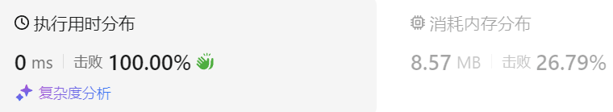

### 14、零钱兑换 II（20240808，518题，中等。16min）
<div style="border: 1px solid black; padding: 10px; background-color: SteelBlue;">

给你一个整数数组 coins 表示不同面额的硬币，另给一个整数 amount 表示总金额。

请你计算并返回可以凑成总金额的硬币组合数。如果任何硬币组合都无法凑出总金额，返回 0 。

假设每一种面额的硬币有无限个。 

题目数据保证结果符合 32 位带符号整数。

 

示例 1：

- 输入：amount = 5, coins = [1, 2, 5]
- 输出：4
- 解释：有四种方式可以凑成总金额：  
5=5  
5=2+2+1  
5=2+1+1+1  
5=1+1+1+1+1  

示例 2：

- 输入：amount = 3, coins = [2]
- 输出：0
- 解释：只用面额 2 的硬币不能凑成总金额 3 。

示例 3：

- 输入：amount = 10, coins = [10] 
- 输出：1
 

提示：

- 1 <= coins.length <= 300
- 1 <= coins[i] <= 5000
- coins 中的所有值 互不相同
- 0 <= amount <= 5000

  </p>
</div>

<hr style="border-top: 5px solid #DC143C;">
<table>
  <tr>
    <td bgcolor="Yellow" style="padding: 5px; border: 0px solid black;">
      <span style="font-weight: bold; font-size: 20px;color: black;">
      自己答案（去注释，通过！）
      </span>
    </td>
  </tr>
</table>
<div style="padding: 0px; border: 1.5px solid LightSalmon; margin-bottom: 10px;">

```C++ {.line-numbers}
/*
16min
思路：
整数amount即为背包的大小，需要使用不同面额的硬币刚好填满背包
但是求得是组合的数目。
则dp[j]表示背包容量为j时，填满j的组合数。

硬币的价值是coins ，重量相同记为weight = coins 。
dp[j] = dp[j] + dp[j-weight[i]]

*/class Solution {
public:
    int change(int amount, vector<int>& coins) {
        size_t size = coins.size();

        vector<int> dp(amount+1, 0);
        dp[0] = 1;  // 初始化为1，背包为0时，有一种方式填满背包，就是都不取！！！

        for(int i = 0; i < size; i++){
            for(int j = coins[i]; j <= amount; j++){
                dp[j] = dp[j] + dp[j-coins[i]];
            }
        }
        return dp[amount];
    }
};
```

</div>



<hr style="border-top: 5px solid #DC143C;">

<table>
  <tr>
    <td bgcolor="Yellow" style="padding: 5px; border: 0px solid black;">
      <span style="font-weight: bold; font-size: 20px;color: black;">
      随想录答案
      </span>
    </td>
  </tr>
</table>

<div style="padding: 0px; border: 1.5px solid LightSalmon; margin-bottom: 10px">

```C++ {.line-numbers}
class Solution {
public:
    int change(int amount, vector<int>& coins) {
        vector<int> dp(amount + 1, 0);
        dp[0] = 1;
        for (int i = 0; i < coins.size(); i++) { // 遍历物品
            for (int j = coins[i]; j <= amount; j++) { // 遍历背包
                dp[j] += dp[j - coins[i]];
            }
        }
        return dp[amount];
    }
};
```
</div>

时间复杂度: O(mn)，其中 m 是amount，n 是 coins 的长度  
空间复杂度: O(m)  

<table>
  <tr>
    <td bgcolor="Yellow" style="padding: 5px; border: 0px solid black;">
      <span style="font-weight: bold; font-size: 20px;color: black;">
      1,能否再举一个详细的例子，指明什么时候排列的方式重复计算了不同顺序的组合
      </span>
    </td>
  </tr>
</table>

### 举例说明排列的方式如何重复计算不同顺序的组合

假设我们有硬币 `coins = [1, 2]`，目标金额 `amount = 3`。

#### 1. 先遍历硬币，再遍历金额（组合数）

```cpp
for (int coin : coins) {
    for (int j = coin; j <= amount; j++) {
        dp[j] += dp[j - coin];
    }
}
```

**步骤：**

- 使用硬币1：
  - `dp[1] += dp[0]` => `dp[1] = 1`
  - `dp[2] += dp[1]` => `dp[2] = 1`
  - `dp[3] += dp[2]` => `dp[3] = 1`  // 使用硬币1的时候，还没硬币2，所以暂时只有硬币1满足情况情况
- 使用硬币2：
  - `dp[2] += dp[0]` => `dp[2] = 2`
  - `dp[3] += dp[1]` => `dp[3] = 2`  // 使用硬币2时，可以和硬币1组成新的可能组合，但也只有这一次更新，只有一种组合

**结果：**

- `dp[3] = 2`，表示两种组合：[1, 1, 1] 和 [1, 2]

#### 2. 先遍历金额，再遍历硬币（排列数）

```cpp
for (int j = 0; j <= amount; j++) {
    for (int coin : coins) {
        if (j >= coin) {
            dp[j] += dp[j - coin];
        }
    }
}
```

**步骤：**

- 对于 `j = 1`：
  - 使用硬币1：`dp[1] += dp[0]` => `dp[1] = 1`
- 对于 `j = 2`：
  - 使用硬币1：`dp[2] += dp[1]` => `dp[2] = 1`
  - 使用硬币2：`dp[2] += dp[0]` => `dp[2] = 2`
- 对于 `j = 3`：
  - 使用硬币1：`dp[3] += dp[2]` => `dp[3] = 2`  // 这里是固定硬币1，dp[2]中包含了{1,1}和{2}，这里就形成了两种组合{1,1，1}和{2，1}
  - 使用硬币2：`dp[3] += dp[1]` => `dp[3] = 3`  // 这里是固定硬币2，dp[1]中包含了{1}，这里就形成了一种新组合{1,2}，再加上上面刚计算dp[3]，总共3中方案！！！

  可以看到，组合情况下，只有一种硬币最后更新了结果dp[3]；但是排列情况下，每种硬币都更新了一遍结果dp[3]，导致了排列的方案数更多。
**结果：**

- `dp[3] = 3`，表示三种排列：[1, 1, 1], [1, 2], [2, 1]

### 关键区别

在组合数的计算中，[1, 2] 和 [2, 1] 被视为同一种组合；而在排列数的计算中，它们被视为不同的排列，从而增加了可能的解的数量。这就是为什么先遍历金额再遍历硬币会导致计算出排列数而不是组合数。