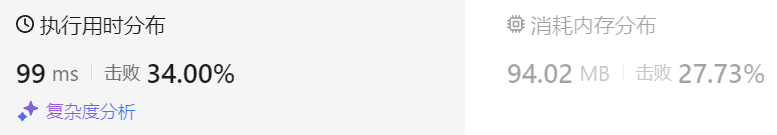
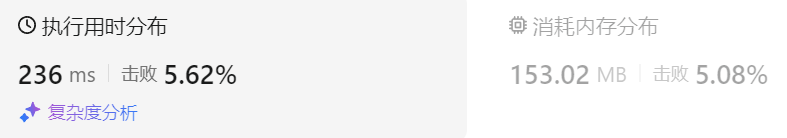

### 24、买卖股票的最佳时机（20240814，121题，简单。29min）
<div style="border: 1px solid black; padding: 10px; background-color: SteelBlue;">

给定一个数组 prices ，它的第 i 个元素 prices[i] 表示一支给定股票第 i 天的价格。

你只能选择 某一天 买入这只股票，并选择在 未来的某一个不同的日子 卖出该股票。设计一个算法来计算你所能获取的最大利润。

返回你可以从这笔交易中获取的最大利润。如果你不能获取任何利润，返回 0 。

 

示例 1：

- 输入：[7,1,5,3,6,4]
- 输出：5
- 解释：在第 2 天（股票价格 = 1）的时候买入，在第 5 天（股票价格 = 6）的时候卖出，最大利润 = 6-1 = 5 。  
     注意利润不能是 7-1 = 6, 因为卖出价格需要大于买入价格；同时，你不能在买入前卖出股票。

示例 2：

- 输入：prices = [7,6,4,3,1]
- 输出：0
- 解释：在这种情况下, 没有交易完成, 所以最大利润为 0。
 

提示：

- 1 <= prices.length <= 105
- 0 <= prices[i] <= 104

  </p>
</div>

<hr style="border-top: 5px solid #DC143C;">
<table>
  <tr>
    <td bgcolor="Yellow" style="padding: 5px; border: 0px solid black;">
      <span style="font-weight: bold; font-size: 20px;color: black;">
      自己答案（贪心法，通过！）
      </span>
    </td>
  </tr>
</table>
<div style="padding: 0px; border: 1.5px solid LightSalmon; margin-bottom: 10px;">

```C++
/*
29min
思路：
记录遇到的最小股价，遇到更小的更新之
遍历过程中，利用当前股价减去最小股价，记录此过程的最大值val
返回记录的最大val。
*/

class Solution {
public:
    int maxProfit(vector<int>& prices) {
        int cur_val = 0;
        int min_num = prices[0];
        for(int i = 1; i <= prices.size()-1; i++){
            int val = prices[i] - min_num;

            if(val > 0 && val > cur_val){
                cur_val = val;
            }

            if(prices[i] < min_num){
                min_num = prices[i];
            }
        }
        return cur_val;
    }
};
```

</div>




<table>
  <tr>
    <td bgcolor="Yellow" style="padding: 5px; border: 0px solid black;">
      <span style="font-weight: bold; font-size: 20px;color: black;">
      仿照答案（动态规划法）
      </span>
    </td>
  </tr>
</table>

<div style="padding: 0px; border: 1.5px solid LightSalmon; margin-bottom: 10px">

```C++
/*
思路：
dp[j][0]表示第j天持有股票情况下，具有的最大现金（利润）；
dp[j][1]表示第j天未持有股票时，具有的最大现金。

dp[j][0]的推导如下:
    第j-1天持有股票，并且保持到第j天，即维持dp[j-1][0];
    第j-1天没股票，第j天购买股票，dp[j-1][1] - prices[j];  // 加上dp[j-1][1]，可能是由于之前卖了股票来的！！
        是 -prices[j]，而不是dp[j-1][1] - prices[j]！！！
    即dp[j][0] = max(dp[j-1][0], -prices[j])  // dp[j][0] = max(dp[j-1][0], dp[j-1][1] - prices[j])

dp[j][1]的推导如下:
    第j-1天持有股票，在第j天卖出，dp[j-1][0] + prices[j]
    第j-1天没股票，保持到今天，dp[j-1][1]
    即dp[j][1] = max(dp[j-1][0] + prices[j], dp[j-1][1])

初始化：
    dp[0][0]表示第0天持有股票时，最多的现金，dp[0][0] = -prices[0]
    dp[0][1]表示第0天没股票时，最多的现金，dp[0][1] = 0
*/

class Solution {
public:
    int maxProfit(vector<int>& prices) {
        size_t size = prices.size();
        vector<vector<int>> dp(size, vector<int>(2, 0));
        dp[0][0] = -prices[0];
        dp[0][1] = 0;

        for(int j = 1; j < size; j++){
            // dp[j][0] = max(dp[j-1][0], dp[j-1][1] - prices[j]);
            dp[j][0] = max(dp[j-1][0], -prices[j]);
            dp[j][1] = max(dp[j-1][0] + prices[j], dp[j-1][1]);
        }

        return dp[size-1][1];
    }
};

/*
版本二
从递推公式可以看出，dp[i]只是依赖于dp[i - 1]的状态。

dp[i][0] = max(dp[i - 1][0], -prices[i]);
dp[i][1] = max(dp[i - 1][1], prices[i] + dp[i - 1][0]);
那么我们只需要记录 当前天的dp状态和前一天的dp状态就可以了，可以使用滚动数组来节省空间，代码如下.

时间复杂度：O(n)
空间复杂度：O(1)
*/
class Solution {
public:
    int maxProfit(vector<int>& prices) {
        int len = prices.size();
        vector<vector<int>> dp(2, vector<int>(2)); // 注意这里只开辟了一个2 * 2大小的二维数组
        dp[0][0] -= prices[0];
        dp[0][1] = 0;
        for (int i = 1; i < len; i++) {
            dp[i % 2][0] = max(dp[(i - 1) % 2][0], -prices[i]);
            dp[i % 2][1] = max(dp[(i - 1) % 2][1], prices[i] + dp[(i - 1) % 2][0]);
        }
        return dp[(len - 1) % 2][1];
    }
};
```
</div>



时间复杂度：O(n)  
空间复杂度：O(n)

<table>
  <tr>
    <td bgcolor="Yellow" style="padding: 5px; border: 0px solid black;">
      <span style="font-weight: bold; font-size: 20px;color: black;">
      自己答案（超时）
      </span>
    </td>
  </tr>
</table>

<div style="padding: 0px; border: 1.5px solid LightSalmon; margin-bottom: 10px">

```C++
/*
思路：
最简单的是计算每种买入能获得的最大价值，最后取最大的

从后往前遍历，计算最大价值，并记录

*/

class Solution {
public:
    int maxProfit(vector<int>& prices) {
        // vector<int> vec(1, 0);
        int cur_val = 0;
        for(int i = prices.size()-1; i > 0; i--){
            for(int j = 0; j < i; j++){
                int val = prices[i] - prices[j];
                if(val > 0 && val > cur_val){
                    cur_val = val;
                    // vec.push_back(cur_val);
                }
            }
        }

        // int ret = 0;
        // for(int i = 0; i < vec.size()-1; i++){
        //     if(vec[i] > ret){
        //         ret = vec[i];
        //     }
        // }
        return cur_val;
    }
};
```
</div>


<hr style="border-top: 5px solid #DC143C;">

<table>
  <tr>
    <td bgcolor="Yellow" style="padding: 5px; border: 0px solid black;">
      <span style="font-weight: bold; font-size: 20px;color: black;">
      随想录答案
      </span>
    </td>
  </tr>
</table>

<div style="padding: 0px; border: 1.5px solid LightSalmon; margin-bottom: 10px">

```C++
// 版本一
class Solution {
public:
    int maxProfit(vector<int>& prices) {
        int len = prices.size();
        if (len == 0) return 0;
        vector<vector<int>> dp(len, vector<int>(2));
        dp[0][0] -= prices[0];
        dp[0][1] = 0;
        for (int i = 1; i < len; i++) {
            dp[i][0] = max(dp[i - 1][0], -prices[i]);
            dp[i][1] = max(dp[i - 1][1], prices[i] + dp[i - 1][0]);
        }
        return dp[len - 1][1];
    }
};
```
</div>

时间复杂度：O(n)  
空间复杂度：O(n)