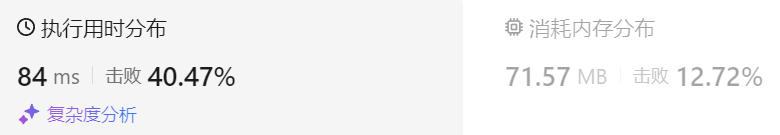

### 35、最大子序和（20240822，53题，中等。32min）
<div style="border: 1px solid black; padding: 10px; background-color: SteelBlue;">

给你一个整数数组 nums ，请你找出一个具有最大和的连续子数组（子数组最少包含一个元素），返回其最大和。

子数组
是数组中的一个连续部分。

 

示例 1：

- 输入：nums = [-2,1,-3,4,-1,2,1,-5,4]
- 输出：6
- 解释：连续子数组 [4,-1,2,1] 的和最大，为 6 。

示例 2：

- 输入：nums = [1]
- 输出：1

示例 3：

- 输入：nums = [5,4,-1,7,8]
- 输出：23
 

提示：

- 1 <= nums.length <= 105
- -104 <= nums[i] <= 104
 

进阶：如果你已经实现复杂度为 O(n) 的解法，尝试使用更为精妙的 分治法 求解。

  </p>
</div>

<hr style="border-top: 5px solid #DC143C;">
<table>
  <tr>
    <td bgcolor="Yellow" style="padding: 5px; border: 0px solid black;">
      <span style="font-weight: bold; font-size: 20px;color: black;">
      自己答案（去注释，通过！）
      </span>
    </td>
  </tr>
</table>
<div style="padding: 0px; border: 1.5px solid LightSalmon; margin-bottom: 10px;">

```C++
/*
32min
思路：
dp[j]表示以nums[j]为尾结点的数组的最大连续子数组的和
可以通过对比nums[j]和dp[j-1]的大小来确定dp[j]
    nums[j] 大于 dp[j-1]，
        dp[j-1] < 0; 就用 nums[j] 
        dp[j-1] > 0; 就用 nums[j] + dp[j-1]
        dp[j-1] = 0, 就用 nums[j] 
    nums[j] 小于 dp[j-1]，
        dp[j-1] < 0; 就用 nums[j] 
        dp[j-1] > 0; 就用 nums[j] + dp[j-1]
        dp[j-1] = 0, 就用 nums[j]

由于结果可能是中间某个数值为结尾的连续序列的和，所以需要使用变量result记录过程中的最大和！！！
*/

class Solution {
public:
    int maxSubArray(std::vector<int>& nums) {
        size_t size = nums.size();

        vector<int> dp(size, 0);
        dp[0] = nums[0];
        int result = nums[0];

        for(int j = 1; j < size; j++){
            if(dp[j-1] <= 0){
                dp[j] = nums[j];
            }else{
                dp[j] = nums[j] + dp[j-1];
            }
            if(dp[j] > result) result = dp[j];
        }
        return result;
    }
};

/*
更好的思路：
dp[i]只有两个方向可以推出来：

dp[i - 1] + nums[i]，即：nums[i]加入当前连续子序列和
nums[i]，即：从头开始计算当前连续子序列和
*/
```

</div>



<table>
  <tr>
    <td bgcolor="Yellow" style="padding: 5px; border: 0px solid black;">
      <span style="font-weight: bold; font-size: 20px;color: black;">
      随想录答案
      </span>
    </td>
  </tr>
</table>

<div style="padding: 0px; border: 1.5px solid LightSalmon; margin-bottom: 10px">

```C++
class Solution {
public:
    int maxSubArray(vector<int>& nums) {
        if (nums.size() == 0) return 0;
        vector<int> dp(nums.size());
        dp[0] = nums[0];
        int result = dp[0];
        for (int i = 1; i < nums.size(); i++) {
            dp[i] = max(dp[i - 1] + nums[i], nums[i]); // 状态转移公式
            if (dp[i] > result) result = dp[i]; // result 保存dp[i]的最大值
        }
        return result;
    }
};
```
</div>

时间复杂度：O(n)  
空间复杂度：O(n)