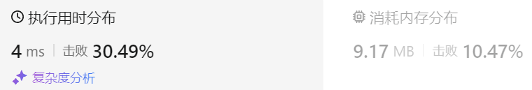
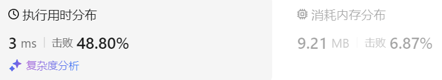

### 36、判断子序列（20240822，392题，中等。15min）
<div style="border: 1px solid black; padding: 10px; background-color: SteelBlue;">

给定字符串 s 和 t ，判断 s 是否为 t 的子序列。

字符串的一个子序列是原始字符串删除一些（也可以不删除）字符而不改变剩余字符相对位置形成的新字符串。（例如，"ace"是"abcde"的一个子序列，而"aec"不是）。

进阶：

如果有大量输入的 S，称作 S1, S2, ... , Sk 其中 k >= 10亿，你需要依次检查它们是否为 T 的子序列。在这种情况下，你会怎样改变代码？
 

示例 1：

- 输入：s = "abc", t = "ahbgdc"
- 输出：true

示例 2：

- 输入：s = "axc", t = "ahbgdc"
- 输出：false
 

提示：

- 0 <= s.length <= 100
- 0 <= t.length <= 10^4
- 两个字符串都只由小写字符组成。

  </p>
</div>

<hr style="border-top: 5px solid #DC143C;">

<table>
  <tr>
    <td bgcolor="Yellow" style="padding: 5px; border: 0px solid black;">
      <span style="font-weight: bold; font-size: 20px;color: black;">
      自己答案（15min）
      </span>
    </td>
  </tr>
</table>
<div style="padding: 0px; border: 1.5px solid LightSalmon; margin-bottom: 10px;">

```C++
/*
15min
思路：

dp[i][j]表示以s[i-1]和t[j-1]为结尾的字符串的公共最大子串的长度

则只要dp[i][j]打到过t的长度，即可返回真，否则为假

题意是判断s是否为t的子序列，所以公共最大子串的长度需要是s的长度！！！


另外，是否应该外循环t，内循环s会更快？
*/
class Solution {
public:
    bool isSubsequence(string s, string t) {
        size_t size1 = s.size();
        size_t size2 = t.size();
        if(size1 == 0 ) return true;

        vector<vector<int>> dp(size1+1, vector<int>(size2+1, 0));

        for(int i = 1; i <= size1; i++){
            for(int j = 1; j <= size2; j++){
                if(s[i-1] == t[j-1]){
                    dp[i][j] = dp[i-1][j-1] + 1;
                }else{
                    dp[i][j] = max(dp[i-1][j], dp[i][j-1]);
                }
                if(dp[i][j] == size1){  // if(dp[i][j] == size2 || dp[i][j] == size1)
                    return true;
                }
            }
        }
        return false;
    }
};

// 根据答案和自己的思路修改后
class Solution {
public:
    bool isSubsequence(string s, string t) {
        size_t size1 = s.size();
        size_t size2 = t.size();
        if(size1 == 0) return true;

        vector<vector<int>> dp(size1+1, vector<int>(size2+1, 0));

        for(int j = 1; j <= size2; j++){      // j外循环t   size2   dp[i][j]
            for(int i = 1; i <= size1; i++){  // i内循环s   size1   dp[size1][size2]
                if(s[i-1] == t[j-1]){
                    dp[i][j] = dp[i-1][j-1] + 1;
                }else{
                    dp[i][j] = dp[i][j-1];   
                }
                if(dp[i][j] == size1){ 
                    return true;
                }
            }
        }
        return false;
    }
};
```

</div>




<hr style="border-top: 5px solid #DC143C;">

<table>
  <tr>
    <td bgcolor="Yellow" style="padding: 5px; border: 0px solid black;">
      <span style="font-weight: bold; font-size: 20px;color: black;">
      随想录答案
      </span>
    </td>
  </tr>
</table>

<div style="padding: 0px; border: 1.5px solid LightSalmon; margin-bottom: 10px">

```C++
class Solution {
public:
    bool isSubsequence(string s, string t) {
        vector<vector<int>> dp(s.size() + 1, vector<int>(t.size() + 1, 0));
        for (int i = 1; i <= s.size(); i++) {
            for (int j = 1; j <= t.size(); j++) {
                if (s[i - 1] == t[j - 1]) dp[i][j] = dp[i - 1][j - 1] + 1;
                else dp[i][j] = dp[i][j - 1];
            }
        }
        if (dp[s.size()][t.size()] == s.size()) return true;
        return false;
    }
};
```
</div>

时间复杂度：O(n × m)  
空间复杂度：O(n × m)