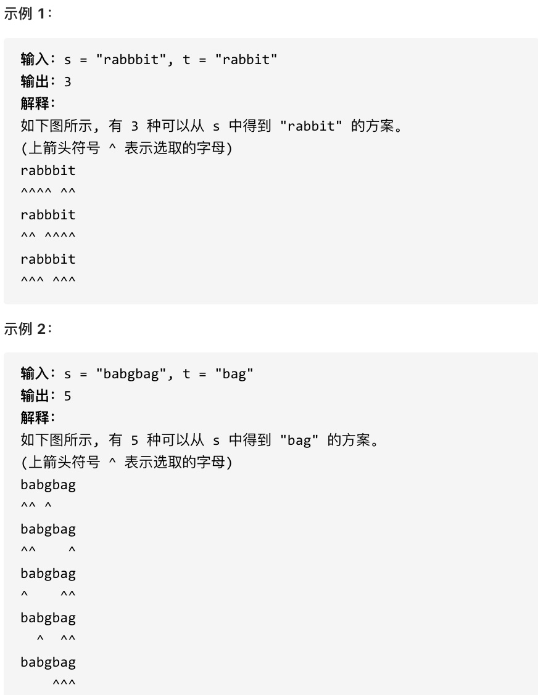
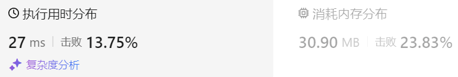

### 37、不同的子序列（20240823，115题，困难）
<div style="border: 1px solid black; padding: 10px; background-color: SteelBlue;">

给你两个字符串 s 和 t ，统计并返回在 s 的 子序列 中 t 出现的个数，结果需要对 109 + 7 取模。



提示：

- 1 <= s.length, t.length <= 1000
- s 和 t 由英文字母组成

  </p>
</div>

<hr style="border-top: 5px solid #DC143C;">
<table>
  <tr>
    <td bgcolor="Yellow" style="padding: 5px; border: 0px solid black;">
      <span style="font-weight: bold; font-size: 20px;color: black;">
      仿照答案 
      </span>
    </td>
  </tr>
</table>
<div style="padding: 0px; border: 1.5px solid LightSalmon; margin-bottom: 10px;">

```C++ {.line-numbers}
/*
思路：

dp[i][j]表示以s[i-1]为结尾的子序列中，以t[j-1]为子序列的序列出现次数
    当s[i-1] = t[j-1]时，
        可以使用s[i-1]和t[j-1]（用s[i-1]来匹配），dp[i-1][j-1]有多少种可能，这里就是多少种，因为最后这两个字符相同，不需要考虑了！！！
        不使用这个相等特性（不用s[i-1]来匹配），可以沿用dp[i-1][j]，即之前匹配的种数
        dp[i][j] = dp[i-1][j-1] + dp[i-1][j]

    当s[i-1] ！= t[j-1]时，
        dp[i-1][j]，只能不使用s[i-1]来匹配
        dp[i][j] = dp[i-1][j]

初始化
    dp[i][0]，表示以s[i-1]为结尾的子序列中，空序列出现的次数？
        考虑dp[2][1]，
        s[1] = t[0]时，dp[2][1] = dp[i-1][j-1] + dp[i-1][j] = dp[1][0] + dp[1][1] = ？
            dp[1][1]由s和t字符串的第一个字符是否相等获得，可能0或者1；而s[1] = t[0]，t子序列只有一个字符，相等则必然会新增一种可能
            所以dp[1][0]需要初始化为1，来表示这种可能！！！
        s[1] != t[0]时，dp[2][1] = dp[i-1][j] = dp[1][1] = ？（可能0或者1）

    dp[0][j]，显然为0！！！

    dp[0][0]
        考虑dp[1][1]，
        s[0] = t[0]时，dp[1][1] = dp[i-1][j-1] + dp[i-1][j] = dp[0][0] + dp[0][1] = 1
            由定义，dp[0][1] = 0，s没字符，t有字符，则没有可能t是其子串。推出dp[0][0] = 1
        s[0] != t[0]时，dp[1][1] = dp[i-1][j] = dp[0][1] = 0
*/

class Solution {
public:
    int numDistinct(string s, string t) {
        size_t size1 = s.size();
        size_t size2 = t.size();

        vector<vector<uint64_t>> dp(size1+1, vector<uint64_t>(size2+1, 0));  // vector<vector<int>> dp(size1+1, vector<int>(size2+1, 0));
        for(int m = 0; m <= size1; m++){
            dp[m][0] = 1;
        }

        for(int i = 1; i <= size1; i++){      
            for(int j = 1; j <= size2; j++){    
                if(s[i-1] == t[j-1]){
                    dp[i][j] = dp[i-1][j-1] + dp[i-1][j];
                }else{
                    dp[i][j] = dp[i-1][j];   
                }
            } 
        }
        return dp[size1][size2];
    }
};

```

</div>



<table>
  <tr>
    <td bgcolor="Yellow" style="padding: 5px; border: 0px solid black;">
      <span style="font-weight: bold; font-size: 20px;color: black;">
      随想录答案
      </span>
    </td>
  </tr>
</table>

<div style="padding: 0px; border: 1.5px solid LightSalmon; margin-bottom: 10px">

```C++ {.line-numbers}
class Solution {
public:
    int numDistinct(string s, string t) {
        vector<vector<uint64_t>> dp(s.size() + 1, vector<uint64_t>(t.size() + 1));
        for (int i = 0; i < s.size(); i++) dp[i][0] = 1;
        for (int j = 1; j < t.size(); j++) dp[0][j] = 0;
        for (int i = 1; i <= s.size(); i++) {
            for (int j = 1; j <= t.size(); j++) {
                if (s[i - 1] == t[j - 1]) {
                    dp[i][j] = dp[i - 1][j - 1] + dp[i - 1][j];
                } else {
                    dp[i][j] = dp[i - 1][j];
                }
            }
        }
        return dp[s.size()][t.size()];
    }
};
```
</div>

时间复杂度: O(n * m)  
空间复杂度: O(n * m)