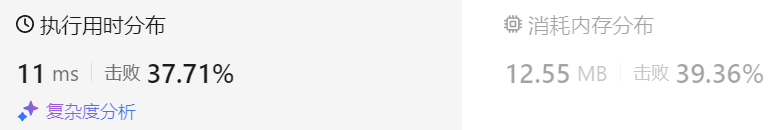

### 39、编辑距离（20240826，72题，中等）
<div style="border: 1px solid black; padding: 10px; background-color: black;">

给你两个单词 word1 和 word2， 请返回将 word1 转换成 word2 所使用的最少操作数  。

你可以对一个单词进行如下三种操作：

插入一个字符
删除一个字符
替换一个字符
 

示例 1：

- **输入**：word1 = "horse", word2 = "ros"
- **输出**：3
- **解释**：
horse -> rorse (将 'h' 替换为 'r')  
rorse -> rose (删除 'r')  
rose -> ros (删除 'e')  

示例 2：

- **输入**：word1 = "intention", word2 = "execution"
- **输出**：5
- **解释**：
intention -> inention (删除 't')  
inention -> enention (将 'i' 替换为 'e')  
enention -> exention (将 'n' 替换为 'x')  
exention -> exection (将 'n' 替换为 'c')  
exection -> execution (插入 'u')  
 

提示：

- 0 <= word1.length, word2.length <= 500
- word1 和 word2 由小写英文字母组成

  </p>
</div>

<hr style="border-top: 5px solid #DC143C;">
<table>
  <tr>
    <td bgcolor="Yellow" style="padding: 5px; border: 0px solid black;">
      <span style="font-weight: bold; font-size: 20px;color: black;">
      仿照答案 
      </span>
    </td>
  </tr>
</table>
<div style="padding: 0px; border: 1.5px solid LightSalmon; margin-bottom: 10px;">

```C++ {.line-numbers}
/*
思路：
dp[i][j]表示以word1[i-1]和word2[j-1]为结尾的字符串（使其相同）的最短编辑距离
    当word1[i-1] = word2[j-1]时，不用编辑，编辑长度依旧是dp[i-1][j-1]
        dp[i][j] = dp[i-1][j-1]
    当word1[i-1] != word2[j-1]时，
        存在删除word1[i-1]，以word1[i-2]和word2[j-1]为结尾的字符串相同的情况，dp[i-1][j] + 1
        存在删除word2[j-1]，以word1[i-1]和word2[j-2]为结尾的字符串相同的情况，dp[i][j-1] + 1

        替换word1[i-1] 或 word2[j-1]为对方也可以，即dp[i-1][j-1] + 1

        存在增加word1[i]，以word1[i]和word2[j-1]为结尾的字符串相同的情况，dp[i][j-1] + 1。  word2[j-1]属于ab  word1[i]属于a的情况，感受下
            增加字符的操作实际是和删除一样的！！！
        dp[i][j] = min({dp[i-1][j] + 1, dp[i][j-1] + 1, p[i-1][j-1] + 1})

初始化
    dp[i][0]，考虑dp[2][1]，以word1[1]和word2[0]为结尾的字符串（使其相同）的最短编辑距离
        尾字符相同时，dp[2][1] = dp[1][0] = 1，因为word2要增加一个字符来和word1相同。
        尾字符不相同时，dp[2][1] =  
            存在删除word1[1]，以word1[1]和word2[0]为结尾的字符串相同的情况，dp[1][1] + 1，这里是两字符串首字符相同，dp[1][1] = 0，这里只要操作1步。首字符不同时，dp[1][1] = 1，这里就要操作2步！！！
            存在删除word2[0]，以word1[1]和word2[1-2]为结尾的字符串相同的情况，dp[2][-1] + 1，不存在这种情况，删除word2[0]，还要增加word1的两个字符，这里要用3步使得两字符串相同！！！
            替换word1[1] 或 word2[0]为对方也可以，即dp[1][0] + 1，长度不同，替换后字符串要相同，dp[1][0]需要补充word2字符，即增加一个word1[0]，所以这里需要2步，且dp[1][0] = 1

        再考虑dp[3][1]，以word1[2]和word2[0]为结尾的字符串（使其相同）的最短编辑距离
            尾字符相同时，dp[3][1] = dp[2][0] = 2，因为word2要增加2个字符来和word1相同。
                从这里可以看到，dp[i][0] = i！！！
    dp[0][j]
        与上面同理，dp[0][j] = j
    
    dp[0][0]
        考虑dp[1][1]，以word1[0]和word2[0]为结尾的字符串（使其相同）的最短编辑距离
            当word1[0]=word2[0]时，dp[1][1] = dp[0][0]，显然dp[0][0] = 0
*/
class Solution {
public:
    int minDistance(string word1, string word2) {
        size_t size1 = word1.size();
        size_t size2 = word2.size();

        vector<vector<int>> dp(size1+1, vector<int>(size2+1, 0));
        for(int i = 1; i <= size1; i++){
            dp[i][0] = i;
        }
        for(int j = 1; j <= size2; j++){
            dp[0][j] = j;
        }

        for(int i = 1; i <= size1; i++){
            for(int j = 1; j <= size2; j++){
                if(word1[i-1] == word2[j-1]){
                    dp[i][j] = dp[i-1][j-1];
                }else{
                    dp[i][j] = min({dp[i-1][j] + 1, dp[i][j-1] + 1, dp[i-1][j-1] + 1});
                }
            }
        }
        return dp[size1][size2];
    }
};
```

</div>



<hr style="border-top: 5px solid #DC143C;">

<table>
  <tr>
    <td bgcolor="Yellow" style="padding: 5px; border: 0px solid black;">
      <span style="font-weight: bold; font-size: 20px;color: black;">
      随想录答案
      </span>
    </td>
  </tr>
</table>

<div style="padding: 0px; border: 1.5px solid LightSalmon; margin-bottom: 10px">

```C++ {.line-numbers}
class Solution {
public:
    int minDistance(string word1, string word2) {
        vector<vector<int>> dp(word1.size() + 1, vector<int>(word2.size() + 1, 0));
        for (int i = 0; i <= word1.size(); i++) dp[i][0] = i;
        for (int j = 0; j <= word2.size(); j++) dp[0][j] = j;
        for (int i = 1; i <= word1.size(); i++) {
            for (int j = 1; j <= word2.size(); j++) {
                if (word1[i - 1] == word2[j - 1]) {
                    dp[i][j] = dp[i - 1][j - 1];
                }
                else {
                    dp[i][j] = min({dp[i - 1][j - 1], dp[i - 1][j], dp[i][j - 1]}) + 1;
                }
            }
        }
        return dp[word1.size()][word2.size()];
    }
};
```
</div>

时间复杂度: O(n * m)  
空间复杂度: O(n * m)