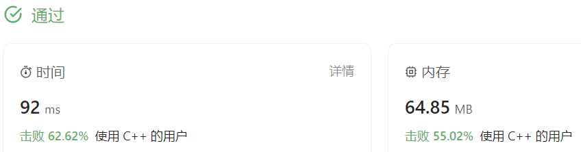

### 02、最大子数组和（20231017，53题，中等。240702整理）
<div style="border: 1px solid black; padding: 10px; background-color: #000000;">

给你一个整数数组 nums ，请你找出一个具有最大和的连续子数组（子数组最少包含一个元素），返回其最大和。

子数组
是数组中的一个连续部分。

 

示例 1：

- 输入：nums = [-2,1,-3,4,-1,2,1,-5,4]
- 输出：6
- 解释：
  连续子数组 [4,-1,2,1] 的和最大，为 6 。

示例 2：

- 输入：nums = [1]
- 输出：1

示例 3：

- 输入：nums = [5,4,-1,7,8]
- 输出：23
 

提示：

- 1 <= nums.length <= 105
- -104 <= nums[i] <= 104
 

进阶：
- 如果你已经实现复杂度为 O(n) 的解法，尝试使用更为精妙的 分治法 求解。

  </p>
</div>

<hr style="border-top: 5px solid #DC143C;">
<table>
  <tr>
    <td bgcolor="Yellow" style="padding: 5px; border: 0px solid black;">
      <span style="font-weight: bold; font-size: 20px;color: black;">
      自己版本（未通过！，ChatGPT增加一行，通过了！）
      </span>
    </td>
  </tr>
</table>

```C++
/*
思路：
找连续的正整数，遇到负数，只要负数累加和不大于整数累加和即可。
负数累加和大于正整数累加和，则记录此前最大正整数累加和
遍历数组后，取最大的正整数累加和.
*/

class Solution {
public:
    int maxSubArray(vector<int>& nums) {
        int preSum = -100000;  //-10^5写法不对
        int retSum = -100000;
        int tmpSum = 0;

        for(auto num : nums)
        {
            //开始负数只取最大值
            if(preSum <= 0 && num <= 0)
            {
                if(num >= preSum)
                {
                    preSum = num;
                    //retSum = num;
                    retSum = (num > retSum ? num : retSum);
                }
                continue;
            }
            //找到第一个正整数
            if(num > 0 && preSum < 0 )
            {
                preSum = num;
                //retSum = num;
                retSum = (num > retSum ? num : retSum);
                tmpSum = num;  /*tmpSum也要等于num！！！*/
                continue;
            }
            //找到第一个正整数后，往后累加，不能使得累加和小于0,。时刻记录最大累加和
            tmpSum += num;
            preSum = (preSum > tmpSum ? preSum : tmpSum);   //累加后记录最大的累加和
            //累加和小于0了，记录下最大累加和。后续要重新找到新的累加和！！！
            if(tmpSum < 0)
            {
                retSum = (preSum > retSum ? preSum : retSum);
                preSum = -100000;  //-10^5写法不对
                tmpSum = 0;
                //continue;
            }
        }
        /*tmpSum < 0才更新retSum结果，这里需要在最后也更新retSum结果。可能后面一直大于零，没有tmpSum < 0的情况出现，导致retSum没更新到的情况。。*/
        retSum = std::max(preSum, retSum); /*确保最后一次累加的结果被考虑在内*/
        return retSum;
    }
};

```

<table>
  <tr>
    <td bgcolor="Yellow" style="padding: 5px; border: 0px solid black;">
      <span style="font-weight: bold; font-size: 20px;color: black;">
      ChatGPT修改的简化，默写版本
      </span>
    </td>
  </tr>
</table>

```C++
/*
思路：
遍历数组，当前数字num是否大于历史累加和preNum，大于，则更新preNum
使用tmpSum记录临时的累加和，若大于历史累加和preNum，更新之；若小于0，则重置tmpSum
最后返回preSum
*/

#include <vector>
#include <limits>

class Solution {
public:
    int maxSubArray(std::vector<int>& nums) {
        int preNum = std::numeric_limits<int>::min();
        int tmpSum = 0;

        for(auto num : nums)
        {
            if(num > preNum)
            {
                preNum = num;
            }
            tmpSum += num;
            if(tmpSum > preNum)
            {
                preNum = tmpSum;
            }
            else if(tmpSum < 0)
            {
                tmpSum = 0;
            } 
        }
        return preNum;
}
};

```

<hr style="border-top: 5px solid #DC143C;">

<table>
  <tr>
    <td bgcolor="Yellow" style="padding: 5px; border: 0px solid black;">
      <span style="font-weight: bold; font-size: 20px;color: black;">
      自己调试版本（通过！！！）
      </span>
    </td>
  </tr>
</table>

```C++


```

<table>
  <tr>
    <td bgcolor="Yellow" style="padding: 5px; border: 0px solid black;">
      <span style="font-weight: bold; font-size: 20px;color: black;">
      仿照答案版本v2（去注释）
      </span>
    </td>
  </tr>
</table>

```C++


```

<hr style="border-top: 5px solid #DC143C;">

<table>
  <tr>
    <td bgcolor="Yellow" style="padding: 5px; border: 0px solid black;">
      <span style="font-weight: bold; font-size: 20px;color: black;">
      仿照答案版本v2
      </span>
    </td>
  </tr>
</table>

```C++


```

<table>
  <tr>
    <td bgcolor="Yellow" style="padding: 5px; border: 0px solid black;">
      <span style="font-weight: bold; font-size: 20px;color: black;">
      随想录答案
      </span>
    </td>
  </tr>
</table>

```C++


```
