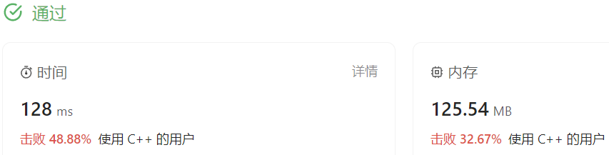

### 07、加油站（20231116，134题，中等。240702整理）
<div style="border: 1px solid black; padding: 10px; background-color: #000000;">

在一条环路上有 N 个加油站，其中第 i 个加油站有汽油 gas[i] 升。

你有一辆油箱容量无限的的汽车，从第 i 个加油站开往第 i+1 个加油站需要消耗汽油 cost[i] 升。你从其中的一个加油站出发，开始时油箱为空。

如果你可以绕环路行驶一周，则返回出发时加油站的编号，否则返回 -1。

说明:

如果题目有解，该答案即为唯一答案。
输入数组均为非空数组，且长度相同。
输入数组中的元素均为非负数。

示例 1:   
输入:

- gas = [1,2,3,4,5]
- cost = [3,4,5,1,2]

输出: 
- 3   
  
解释:

- 从 3 号加油站(索引为 3 处)出发，可获得 4 升汽油。此时油箱有 = 0 + 4 = 4 升汽油
- 开往 4 号加油站，此时油箱有 4 - 1 + 5 = 8 升汽油
- 开往 0 号加油站，此时油箱有 8 - 2 + 1 = 7 升汽油
- 开往 1 号加油站，此时油箱有 7 - 3 + 2 = 6 升汽油
- 开往 2 号加油站，此时油箱有 6 - 4 + 3 = 5 升汽油
- 开往 3 号加油站，你需要消耗 5 升汽油，正好足够你返回到 3 号加油站。
- 因此，3 可为起始索引。

示例 2: 

输入:

- gas = [2,3,4]

- cost = [3,4,3]

输出:
-  -1

解释: 
- 你不能从 0 号或 1 号加油站出发，因为没有足够的汽油可以让你行驶到下一个加油站。我们从 2 号加油站出发，可以获得 4 升汽油。 此时油箱有 = 0 + 4 = 4 升汽油。开往 0 号加油站，此时油箱有 4 - 3 + 2 = 3 升汽油。开往 1 号加油站，此时油箱有 3 - 3 + 3 = 3 升汽油。你无法返回 2 号加油站，因为返程需要消耗 4 升汽油，但是你的油箱只有 3 升汽油。因此，无论怎样，你都不可能绕环路行驶一周。

  </p>
</div>

<hr style="border-top: 5px solid #DC143C;">
<table>
  <tr>
    <td bgcolor="Yellow" style="padding: 5px; border: 0px solid black;">
      <span style="font-weight: bold; font-size: 20px;color: black;">
      自己答案（去注释，通过！）
      </span>
    </td>
  </tr>
</table>

```C++


```

<table>
  <tr>
    <td bgcolor="Yellow" style="padding: 5px; border: 0px solid black;">
      <span style="font-weight: bold; font-size: 20px;color: black;">
      自己答案（通过！）
      </span>
    </td>
  </tr>
</table>

```C++


```

<hr style="border-top: 5px solid #DC143C;">

<table>
  <tr>
    <td bgcolor="Yellow" style="padding: 5px; border: 0px solid black;">
      <span style="font-weight: bold; font-size: 20px;color: black;">
      自己调试版本（通过！！！）
      </span>
    </td>
  </tr>
</table>

```C++


```

<table>
  <tr>
    <td bgcolor="Yellow" style="padding: 5px; border: 0px solid black;">
      <span style="font-weight: bold; font-size: 20px;color: black;">
      仿照答案版本v2（去注释）
      </span>
    </td>
  </tr>
</table>

```C++
/*
思路：
用positive记录当前的正数油量的累加值；
positive_index记录的是positive的起始位置；
若positive小于零，positive_index记为下一个加油站的索引;
最终返回索引positive_index;
*/
class Solution {
public:
    int canCompleteCircuit(vector<int>& gas, vector<int>& cost) {
        int positive_index = 0;
        int gas_sum = 0;
        int positive = 0;
        int len = gas.size();

        for(int i = 0; i < len; i++)
        {
            positive += (gas[i] - cost[i]);
            gas_sum += (gas[i] - cost[i]);
            if(positive < 0)
            {   
                positive = 0;
                positive_index = i + 1;
            }
        }
        if(gas_sum < 0)
        {
            return -1;
        }
        else 
        {
            return positive_index;
        }
        // return positive_index;
    }
};
```


<hr style="border-top: 5px solid #DC143C;">

<table>
  <tr>
    <td bgcolor="Yellow" style="padding: 5px; border: 0px solid black;">
      <span style="font-weight: bold; font-size: 20px;color: black;">
      自己答案，未通过
      </span>
    </td>
  </tr>
</table>

```C++
/*
思路：
将gas和cost相减，得到数组arr1，累加arr1，若大于0则继续，并记录起点
若小于0，则重新计算；
同时还要记录最小的负数，因为最大的整数累加小于最小累加负数，也不可能到达终点。
*/

class Solution {
public:
    int canCompleteCircuit(vector<int>& gas, vector<int>& cost) {
        int len_pre = gas.size();
        int positive_max = 0;
        int negitive_min = 0;
        int positive_index = 0;
        int negitive_index = 0;
        int sub_sum = 0;
        int positive = 0;
        int negitive = 0;
        int count = 0;
        int count_max = 0;

        gas.insert(gas.end(), gas.begin(),gas.end());
        cost.insert(cost.end(), cost.begin(),cost.end());
        int len = gas.size();

        for(int i = 0; i < len; i++)
        {
            sub_sum = (gas[i] - cost[i]);
            positive += sub_sum;
            negitive += sub_sum;
            //count += 1;

            if(positive >  positive_max) 
            {
                //同时要记录此时的count，方便往前推起始的位置
                count_max = count;
                positive_max = positive; //实时记录最大的整数
            }
            if(negitive <  negitive_min) 
            {
                negitive_min = negitive; //实时记录最大的整数
            }

            if(positive < 0)
            {   
                positive = 0;
                positive_index = i;
                count = 0;
            }
            else
            {
                count++;
            }
            if(negitive >= 0)
            {
                negitive = 0;
                negitive_index = i;
            }
        }

        if(positive_max + negitive_min < 0)
        {
            return -1;
        }
        else if(positive_index + 1 > len - len_pre - 1)
        {
            return positive_index + 1 - len_pre;
        }
        else 
        {
            //return positive_index + 1;
            return positive_max - count_max;
        }
    }
};
```

<table>
  <tr>
    <td bgcolor="Yellow" style="padding: 5px; border: 0px solid black;">
      <span style="font-weight: bold; font-size: 20px;color: black;">
      随想录答案
      </span>
    </td>
  </tr>
</table>

```C++


```

