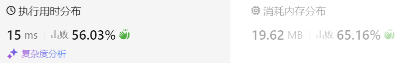
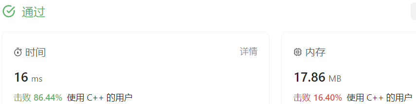

### 08、分发糖果（20231129，135题，困难。240702整理）
<div style="border: 1px solid black; padding: 10px; background-color: #00BFFF;">

老师想给孩子们分发糖果，有 N 个孩子站成了一条直线，老师会根据每个孩子的表现，预先给他们评分。

你需要按照以下要求，帮助老师给这些孩子分发糖果：

- 每个孩子至少分配到 1 个糖果。
- 相邻的孩子中，评分高的孩子必须获得更多的糖果。
  
那么这样下来，老师至少需要准备多少颗糖果呢？

示例 1:

- 输入: [1,0,2]
- 输出: 5
- 解释: 你可以分别给这三个孩子分发 2、1、2 颗糖果。

示例 2:

- 输入: [1,2,2]
- 输出: 4
- 解释: 你可以分别给这三个孩子分发 1、2、1 颗糖果。第三个孩子只得到 1 颗糖果，这已满足上述两个条件。

  </p>
</div>

<hr style="border-top: 5px solid #DC143C;">
<table>
  <tr>
    <td bgcolor="Yellow" style="padding: 5px; border: 0px solid black;">
      <span style="font-weight: bold; font-size: 20px;color: black;">
      重新整理（去注释，通过！240704）
      </span>
    </td>
  </tr>
</table>

```C++
class Solution {
public:
    int candy(vector<int>& ratings) {
        size_t size = ratings.size();
        vector<int> vec_candy(size, 0);
        int sum = 0;

        vec_candy[0] = 1;  // 第一个孩子先给一个糖果
        for(int i = 1; i < size; i++){  // 从第二个孩子开始给糖果
            if(ratings[i] > ratings[i-1]){
                vec_candy[i] = vec_candy[i-1] + 1;  
            }else{
                vec_candy[i] = 1;  // 不必前面大的都只给1个
            }
        }

        for(int i = size-1; i > 0; i--){  // 从后往前给糖果
            if(ratings[i-1] > ratings[i]){
                vec_candy[i-1] = max(vec_candy[i] + 1, vec_candy[i-1]);  
            }
        }
        for(auto j : vec_candy){
            sum += j;  // sum += vec_candy[j];
        }
        return sum;
    }
};

```

<table>
  <tr>
    <td bgcolor="Yellow" style="padding: 5px; border: 0px solid black;">
      <span style="font-weight: bold; font-size: 20px;color: black;">
      重新整理
      </span>
    </td>
  </tr>
</table>

```C++
/*
思路：
分两个方向遍历，
先从左边按规则设定糖果数，第一个孩子给1个，后面按规则至少给一个；
    降序的孩子只给1个
    与前一个还在相同的只给一个；
    大于前一个孩子，则相应增加一个
再从右边往回遍历，纠正各孩子的糖果数
    比上一个孩子评分高，若糖果已经大于上一个孩子，则不变
        若糖果比上个孩子少，增加1个
    比上个孩子评分低，保持不变（正向过程保证了这部分的单调）
    与上个孩子一样，保持不变

*/
class Solution {
public:
    int candy(vector<int>& ratings) {
        size_t size = ratings.size();
        vector<int> vec_candy(size, 0);
        int sum = 0;

        vec_candy[0] = 1;  // 第一个孩子先给一个糖果
        for(int i = 1; i < size; i++){  // 从第二个孩子开始给糖果
            if(ratings[i] > ratings[i-1]){
                vec_candy[i] = vec_candy[i-1] + 1;  // vec_candy[i] = ratings[i-1] + 1;  用错了数组！！！
            }else{
                vec_candy[i] = 1;  // 不必前面大的都只给1个
            }
        }

        for(int i = size-1; i > 0; i--){  // 从后往前给糖果
            if(ratings[i-1] > ratings[i]){
                vec_candy[i-1] = max(vec_candy[i] + 1, vec_candy[i-1]);  // vec_candy[i-1] = max(ratings[i] + 1, vec_candy[i-1]);  处理的是糖果数组，别用成了评分数组！！！
            }
        }
        for(auto j : vec_candy){
            sum += j;  // sum += vec_candy[j]; j就是容器中的元素，而不是索引！！！
        }
        return sum;
    }
};

```


<hr style="border-top: 5px solid #DC143C;">

<table>
  <tr>
    <td bgcolor="Yellow" style="padding: 5px; border: 0px solid black;">
      <span style="font-weight: bold; font-size: 20px;color: black;">
      自己调试版本（通过！！！）
      </span>
    </td>
  </tr>
</table>

```C++


```

<table>
  <tr>
    <td bgcolor="Yellow" style="padding: 5px; border: 0px solid black;">
      <span style="font-weight: bold; font-size: 20px;color: black;">
      仿照答案版本v2（去注释）
      </span>
    </td>
  </tr>
</table>

```C++
/*
思路：
分两边遍历；
先从左边往右遍历，左边遍历确保每个孩子与他左边孩子相比获得数量是正确的；
从右往左遍历时，确保每个孩子与他右边孩子相比获得数量是正确的；
*/
class Solution {
public:
    int candy(vector<int>& ratings) {
        int len = ratings.size();
        int sum = 0;
        int count = 1;
        int pre_rating = -1;
        vector<int> tmp(len+1);
        tmp[0] = 1;

        if(len == 1) return 1;
        for(int i = 1; i < len; i++)
        {
            if(ratings[i] > ratings[i-1])  //上坡
            {
                tmp[i] = tmp[i-1] + 1;
            }
            else 
            {
                tmp[i] = 1;
            }
        }

        for(int j = len - 2; j >= 0; j--)
        {
            if(ratings[j] > ratings[j+1])  //上坡
            {
                int tmp_val = tmp[j+1] + 1;
                tmp[j] = max(tmp_val, tmp[j]);
            }
        }
        return accumulate(tmp.begin(),tmp.end(),0);
    }
};
```



<hr style="border-top: 5px solid #DC143C;">

<table>
  <tr>
    <td bgcolor="Yellow" style="padding: 5px; border: 0px solid black;">
      <span style="font-weight: bold; font-size: 20px;color: black;">
      自己答案，未通过
      </span>
    </td>
  </tr>
</table>

```C++
/*
思路：
分两边遍历；
先从左边往右遍历，记录连续递增的次数count，可由此计算这一段的sum；
    另外记录这一段的极大值的索引index和count的关系；可使用unordermap,hash[index] = count;
    遇到平坡时，记录个数，大于两个，则从第二个起，其只能拿一个，直到最后一个转折点；
    单点平坡，需要右边遍历到此点确定其糖果数；
    两点平坡，左边点由左边坡度确定糖果数；右边点分情况：
         下坡，要右边遍历过来确定其糖果；
         上坡，当前点只能有一个糖果；
    多点平坡，左边点由左边坡度确定糖果数；中间只有一个；右边点同上。
    （上坡过程，遇到平坡（平坡说明前一段已经确定，不用记录左边点的hash！）和下坡，第一时间记录上坡的索引index，
    和对应的hash[index] = count； sum只管累加即可，需要修改的地方，等右边遍历过来修改。
    平坡暂时算作1个，就算下坡，也等右边遍历来修正！）
从右往左遍历时，主要考虑上坡。
    关注一点顶的地方，遇到下坡（没经过平坡的下坡），记录最高点，查看cur_count是否高于hash中的count，更具情况修改sum！
    关注平坡地方？记录最高点索引，修正sum，原先此点只算做1糖果。
则需要根据hash值更新顶点的实际应该记录的总值，实际就是count_larger和count_lower，计算此坡两边
小孩的糖果数，就是count_larger和（count_lower-1）的高斯计算公式的和。
上坡遇到平坡和下坡两种情况
*/
class Solution {
public:
    int candy(vector<int>& ratings) {
        int len = ratings.size();
        int sum = 0;
        int count = 1;
        int pre_rating = -1;
        unordered_map<int, int> hash;

        //保证后续至少有两个点
        if(len == 1) return 1;
        if(len == 2)
        {
            if(ratings[0] == ratings[1]) return 2;
            else return 3;
        }

        for(int i = 1; i < len; i++)
        {
            pre_rating = ratings[i-1];
            //上坡遍历
            if(ratings[i] > pre_rating)  //上坡
            {
                count++;
                if(len-1 == i)  //遇到最后一个点
                {
                    hash[i] = count;
                    break;
                }
            }
            else if(ratings[i] == pre_rating) //平平坡记录hash值，右边遍历再计算sum，平坡和拐点的糖果数不同！
            {
                hash[i-1] = count;  //上一个点可能是左点，要记录hash
                count = 1;   // 还是初始化为0？？？
                hash[i] = count;  //右点怎么处理，在这记为1？可以，右边遍历，比较右点记录的count，用大的计算
            }
            else     //下坡情况
            {
                count = 1;
                hash[i] = 1;
            }
        }

        count = 1;
        for(int j = len - 2; j >= 0; j--)
        {
            pre_rating = ratings[j+1];
            if(ratings[j] > pre_rating)  //上坡
            {
                count++;
                if(hash[j] > 1)  //说明当前至少是个订点
                {
                    int cur_count = max(hash[j], count);
                    //sum += (cur_count + 2) * (cur_count-1) / 2;
                    sum += (cur_count + 1) * (cur_count) / 2;   //包括了底部点
                }
                //if(j == 0) sum += (count + 1) * count / 2;
            }
            else if(ratings[j] == pre_rating) //平坡记录hash值，右边遍历再计算sum，平坡和拐点的糖果数不同！
            {
                if(hash[j+1] > 1)  //说明前一个点是右点
                {
                    int cur_count = max(hash[j+1], count);  //右点肯定hash更大？？？
                    sum += (cur_count + 1) * cur_count / 2;
                }
                else
                {
                    sum += 1;  //说明前一个点是平坡中间
                }
                if(j == 0) sum += 1;  //遍历到第一个点了，需要处理这个点而不再是等下一个点再出来当前点
            }
            else  if(ratings[j] < pre_rating) //下坡
            {
                //下坡，判断hash[j-1],大于1说明是左点
                if(hash[j+1] > 1)
                {
                    sum += (hash[j+1] + 2) * (hash[j+1] - 1) / 2;  //不包括底部1个糖果的，避免和平坡时重复计算右点
                    if(j == 0) sum += 1;
                }
                else
                {
                    continue;
                }
            }
            else return -1;
        }
        
        return sum;
    }
};
```

<table>
  <tr>
    <td bgcolor="Yellow" style="padding: 5px; border: 0px solid black;">
      <span style="font-weight: bold; font-size: 20px;color: black;">
      自己答案，未通过
      </span>
    </td>
  </tr>
</table>

```C++
/*
思路：
分两边遍历；
先从左边往右遍历，记录连续递增的次数count，可由此计算这一段的sum；
另外记录这一段的极大值的索引index和count的关系；可使用unordermap,hash[index] = count;
从右往左遍历时，遍历至之前的顶点，可能是平坡，也可能是同样的上坡顶点，但此时的坡长更长或者更短；
则需要根据hash值更新顶点的实际应该记录的总值，实际就是count_larger和count_lower，计算此坡两边
小孩的糖果数，就是count_larger和（count_lower-1）的高斯计算公式的和。
上坡遇到平坡和下坡两种情况
*/
class Solution {
public:
    int candy(vector<int>& ratings) {
        int len = ratings.size();
        int sum = 1;

        if(len == 0)
        {
            return 0;
        }

        else if(len == 1)
        {
            return 1;
        }
        if(ratings[0] > ratings[1]) sum = 2;
            for(int i = 1; i < len; i++)
            {
                if(i + 1 >= len)   //遍历到最后一个，返回结果
                {
                    if(ratings[i] > ratings[i-1])
                    {
                        sum += 2;
                        return sum;
                    }
                    else
                    {
                        sum += 1;
                        return sum;
                    }
                }
                else  //遍历在中间，当前数只要大于左右数中的一个，sum就加2
                {
                    if(ratings[i] > ratings[i-1] || ratings[i] > ratings[i+1])
                    {
                        sum += 2;
                    }
                    else
                    {
                        sum += 1;
                    }
                }
            }
        return sum;
    }
};
```


