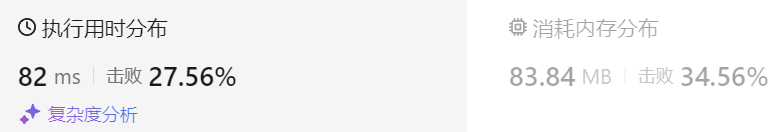
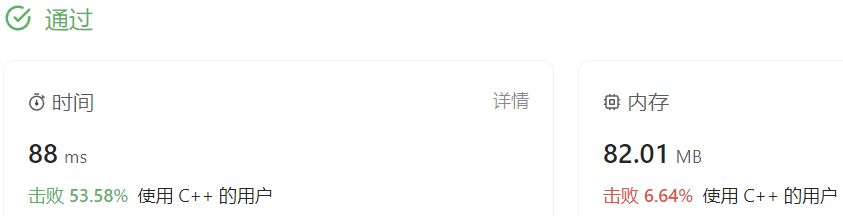

### 09、柠檬水找零（20231201，860题，简单。240702整理）
<div style="border: 1px solid black; padding: 10px; background-color: #00BFFF;">

在柠檬水摊上，每一杯柠檬水的售价为 5 美元。顾客排队购买你的产品，（按账单 bills 支付的顺序）一次购买一杯。

每位顾客只买一杯柠檬水，然后向你付 5 美元、10 美元或 20 美元。你必须给每个顾客正确找零，也就是说净交易是每位顾客向你支付 5 美元。

注意，一开始你手头没有任何零钱。

给你一个整数数组 bills ，其中 bills[i] 是第 i 位顾客付的账。如果你能给每位顾客正确找零，返回 true ，否则返回 false 。

 

示例 1：

- 输入：bills = [5,5,5,10,20]
- 输出：true
- 解释：
前 3 位顾客那里，我们按顺序收取 3 张 5 美元的钞票。
第 4 位顾客那里，我们收取一张 10 美元的钞票，并返还 5 美元。
第 5 位顾客那里，我们找还一张 10 美元的钞票和一张 5 美元的钞票。
由于所有客户都得到了正确的找零，所以我们输出 true。

示例 2：

- 输入：bills = [5,5,10,10,20]
- 输出：false
- 解释：
前 2 位顾客那里，我们按顺序收取 2 张 5 美元的钞票。
对于接下来的 2 位顾客，我们收取一张 10 美元的钞票，然后返还 5 美元。
对于最后一位顾客，我们无法退回 15 美元，因为我们现在只有两张 10 美元的钞票。
由于不是每位顾客都得到了正确的找零，所以答案是 false。
 

提示：

- 1 <= bills.length <= 105
- bills[i] 不是 5 就是 10 或是 20 

  </p>
</div>

<hr style="border-top: 5px solid #DC143C;">
<table>
  <tr>
    <td bgcolor="Yellow" style="padding: 5px; border: 0px solid black;">
      <span style="font-weight: bold; font-size: 20px;color: black;">
      重新整理（通过！240704，23min）
      </span>
    </td>
  </tr>
</table>

```C++ {.line-numbers}
/*
思路：
注意到钱币只有三种，则使用vector<int> money(2,0)记录每种钱有多少张.20的不用记，不会用来找零。
5元不用找零，只增加money[0]的计数；
10元需要找零一张5元，money[0]的计数减1，money[1]的计数加1
    money[0]的计数减为负数，返回false
20元有多种找零方式
    1，找零一张10，一张5；
    2.找零3张5；
    按照1和2的顺序找零，若方法2使得money[0]的计数减为负数，返回false。
*/

class Solution {
public:
    bool lemonadeChange(vector<int>& bills) {
        size_t size = bills.size();
        vector<int> money(2,0);

        for(int i = 0; i < size; i++){
            if(bills[i] == 5){
                money[0] += 1;
            }else if(bills[i] == 10){
                money[0] -= 1;
                if(money[0] < 0) return false;
                money[1] += 1;
            }else{
                if(money[1] >= 1 && money[0] >= 1){
                    money[0] -= 1;
                    money[1] -= 1;
                }else if(money[0] >= 3){
                    money[0] -= 3;
                }else{
                    return false;
                }
            }
        }
        return true;
    }
};
```


<hr style="border-top: 5px solid #DC143C;">

<table>
  <tr>
    <td bgcolor="Yellow" style="padding: 5px; border: 0px solid black;">
      <span style="font-weight: bold; font-size: 20px;color: black;">
      自己答案（通过！）
      </span>
    </td>
  </tr>
</table>

```C++ {.line-numbers}
/*
思路：
使用hash记录当前5元、10元的个数；
顾客给10元，5元必须大于1个；此时5元计数减1,10元加1；
顾客给20元，有两种找零方式：
    找零1个5元，1个10元，5元和10元都必须大于等于1个；此时5元10元计数各减1；优先这种找零方式
    找零3个5元，5元必须大于等于3个；此时5元计数减3；次选这种找零方式
当5元或者10元个数不足时，返回false
*/

class Solution {
public:
    bool lemonadeChange(vector<int>& bills) {
        unordered_map<int, int> hash;
        int len = bills.size();

        for(int i = 0; i < len; i++)
        {
            if(bills[i] == 5)
            {
                hash[5] += 1;
                continue;
            }
            else if(bills[i] == 10)
            {
                if(hash[5] < 1) return false;
                else
                {
                    hash[5] -= 1;
                    hash[10] += 1;
                }
            }
            else if(bills[i] == 20)
            {
                if(hash[5] >= 1 && hash[10] >= 1)
                {
                    hash[5] -= 1;
                    hash[10] -= 1;
                    continue;
                }
                else if(hash[5] >= 3)
                {
                    hash[5] -= 3;
                    continue;
                }
                else
                {
                    return false;
                }
            }
        }
        return true;
    }
};
```


<hr style="border-top: 5px solid #DC143C;">

<table>
  <tr>
    <td bgcolor="Yellow" style="padding: 5px; border: 0px solid black;">
      <span style="font-weight: bold; font-size: 20px;color: black;">
      随想录答案
      </span>
    </td>
  </tr>
</table>

```C++ {.line-numbers}
class Solution {
public:
    bool lemonadeChange(vector<int>& bills) {
        int five = 0, ten = 0, twenty = 0;
        for (int bill : bills) {
            // 情况一
            if (bill == 5) five++;
            // 情况二
            if (bill == 10) {
                if (five <= 0) return false;
                ten++;
                five--;
            }
            // 情况三
            if (bill == 20) {
                // 优先消耗10美元，因为5美元的找零用处更大，能多留着就多留着
                if (five > 0 && ten > 0) {
                    five--;
                    ten--;
                    twenty++; // 其实这行代码可以删了，因为记录20已经没有意义了，不会用20来找零
                } else if (five >= 3) {
                    five -= 3;
                    twenty++; // 同理，这行代码也可以删了
                } else return false;
            }
        }
        return true;
    }
};
```


