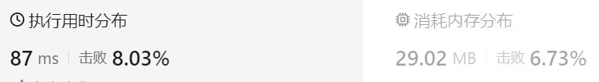
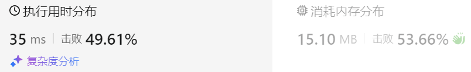
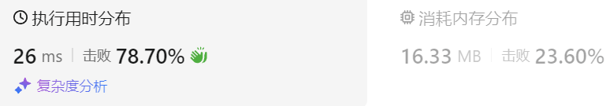

### 10、根据身高重建队列（20240613，406题，中等）
<div style="border: 1px solid black; padding: 10px; background-color: #00BFFF;">

假设有打乱顺序的一群人站成一个队列，数组 people 表示队列中一些人的属性（不一定按顺序）。每个 people[i] = [hi, ki] 表示第 i 个人的身高为 hi ，前面 正好 有 ki 个身高大于或等于 hi 的人。

请你重新构造并返回输入数组 people 所表示的队列。返回的队列应该格式化为数组 queue ，其中 queue[j] = [hj, kj] 是队列中第 j 个人的属性（queue[0] 是排在队列前面的人）。

示例 1：

- 输入：people = [[7,0],[4,4],[7,1],[5,0],[6,1],[5,2]]
- 输出：[[5,0],[7,0],[5,2],[6,1],[4,4],[7,1]]
- 解释：
  -  编号为 0 的人身高为 5 ，没有身高更高或者相同的人排在他前面。
  -  编号为 1 的人身高为 7 ，没有身高更高或者相同的人排在他前面。
  -  编号为 2 的人身高为 5 ，有 2 个身高更高或者相同的人排在他前面，即编号为 0 和 1 的人。
  -  编号为 3 的人身高为 6 ，有 1 个身高更高或者相同的人排在他前面，即编号为 1 的人。
  -  编号为 4 的人身高为 4 ，有 4 个身高更高或者相同的人排在他前面，即编号为 0、1、2、3 的人。
  -  编号为 5 的人身高为 7 ，有 1 个身高更高或者相同的人排在他前面，即编号为 1 的人。
  -  因此 [[5,0],[7,0],[5,2],[6,1],[4,4],[7,1]] 是重新构造后的队列。

示例 2：

- 输入：people = [[6,0],[5,0],[4,0],[3,2],[2,2],[1,4]]
- 输出：[[4,0],[5,0],[2,2],[3,2],[1,4],[6,0]]

提示：

- 1 <= people.length <= 2000
- 0 <= hi <= 10^6
- 0 <= ki < people.length

题目数据确保队列可以被重建

  </p>
</div>

<hr style="border-top: 5px solid #DC143C;">
<table>
  <tr>
    <td bgcolor="Yellow" style="padding: 5px; border: 0px solid black;">
      <span style="font-weight: bold; font-size: 20px;color: black;">
      ChatGPT查资料看到的
      </span>
    </td>
  </tr>
</table>

```C++ {.line-numbers}
/*
思路1：
将people中的元素进行排序，以第一个子元素从小到大排序；第一个元素相同的按照第二个元素进行从小到大排序
再依次排序。
每个新元素b都从第一个元素a开始遍历,
    若大于a，且a的计数大于0，则继续往左边遍历，并将a计数减1，直到a计数为0；
            a的计数等于0，则应该停止遍历；

思路2：
先对people排序，第一个元素从大到小，第二个元素从小到大排序，
之后按照第二个元素，作为索引插入到新的容器中（相当于排序了）
*/
class Solution {
public:
    vector<vector<int>> reconstructQueue(vector<vector<int>>& people) {
        // sort(people.begin(), people.end());

        // for(auto& man : people){
        //     int count = man[1];
        //     man.push_back(count);
        // }

        sort(people.begin(), people.end(), [&](const vector<int>& a, const vector<int>& b){   // 使用const和引用！！
            // for(int i = 0; i < a.size(); i++){
            if(a[0] != b[0]){
                return a[0] > b[0];
            }else{
                return a[1] < b[1];
            }
            // }
        });   // 别忘记分号

        vector<vector<int>> result;
        for(auto& element : people){ // 使用引用！！
            result.insert(result.begin() + element[1], element);
        }

        return result;
    }
};
```

>使用引用和const之后的结果


<hr style="border-top: 5px solid #DC143C;">
<table>
  <tr>
    <td bgcolor="Yellow" style="padding: 5px; border: 0px solid black;">
      <span style="font-weight: bold; font-size: 20px;color: black;">
      随想录答案
      </span>
    </td>
  </tr>
</table>

```C++ {.line-numbers}
class Solution {
public:
    vector<vector<int>> reconstructQueue(vector<vector<int>>& people) {
        sort(people.begin(), people.end(), [&](const vector<int>& a, const vector<int>& b){   
            if(a[0] != b[0]){
                return a[0] > b[0];
            }else{
                return a[1] < b[1];
            }
        });   

        list<vector<int>> que;
        for(auto& element : people){ 
            int count = element[1];
            std::list<vector<int>>::iterator it = que.begin();
            while(count--){
                it++;
            }
            que.insert(it, element);
        }

        return vector<vector<int>>(que.begin(), que.end());
    }
};
```


使用vector是非常费时的，C++中**vector**（可以理解是一个动态数组，底层是普通数组实现的）如果插入元素大于预先普通数组大小，vector底部会有一个**扩容的操作**，即申请两倍于原先普通数组的大小，然后**把数据拷贝到另一个更大的数组上**。

所以使用vector（动态数组）来insert，是**费时**的，插入再拷贝的话，单纯一个插入的操作就是O(n^2)了，甚至可能拷贝好几次，就不止O(n^2)了。

好的，我们来分析一下这段代码的复杂度。

### 代码分解

1. **对`people`数组进行排序**:
   ```cpp
   sort(people.begin(), people.end(), cmp);
   ```
   - **时间复杂度**: 对`n`个元素进行排序需要 \(O(n \log n)\) 时间，其中`n`是`people`的元素个数。

2. **将元素插入到链表`que`中**:
   ```cpp
   list<vector<int>> que;
   for (int i = 0; i < people.size(); i++) {
       int position = people[i][1];
       std::list<vector<int>>::iterator it = que.begin();
       while (position--) {
           it++;
       }
       que.insert(it, people[i]);
   }
   ```
   - 对于排序后的每一个人，需要：
     - 找到正确的插入位置，这涉及将迭代器前进`position`步。
     - 在找到的位置插入元素，链表的插入操作是 \(O(1)\) 的。
   - **时间复杂度**:
     - 将迭代器前进`position`步需要 \(O(position)\)。
     - 插入操作是 \(O(1)\) 的。
     - 最坏情况下，每个元素的插入位置`position`可以达到`i`（如果插入到链表末尾），所以插入循环的最坏情况为：\(\sum_{i=0}^{n-1} i = O(n^2)\)。

3. **将链表转换为向量**:
   ```cpp
   return vector<vector<int>>(que.begin(), que.end());
   ```
   - **时间复杂度**: 从链表复制`n`个元素到向量需要 \(O(n)\) 时间。

### 总时间复杂度
- 排序: \(O(n log n)\)
- 插入: \(O(n^2)\)
- 转换为向量: \(O(n)\)

因此，整体的时间复杂度主要由插入步骤决定：
\[ O(n^2) \]

### 空间复杂度

- 额外的空间使用包括：
  - 链表`que`，存储了`n`个元素。
  - 排序后的向量，与输入大小相同，为`n`个元素。
  - 临时变量和迭代器，使用 \(O(1)\) 空间。

### 总空间复杂度
- 由于链表`que`和输入向量`people`都包含相同的`n`个元素，额外空间为 \(O(n)\)。

所以，空间复杂度为：
\[ O(n) \]

### 总结

- **时间复杂度**: \(O(n^2)\)
- **空间复杂度**: \(O(n)\)