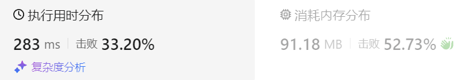

### 12、无重叠区间（20240627，435题，中等）
给定一个区间的集合，找到需要移除区间的最小数量，使剩余区间互不重叠。

- 注意: 可以认为区间的终点总是大于它的起点。 区间 [1,2] 和 [2,3] 的边界相互“接触”，但没有相互重叠。

示例 1:

- 输入: [ [1,2], [2,3], [3,4], [1,3] ]
- 输出: 1
- 解释: 移除 [1,3] 后，剩下的区间没有重叠。

示例 2:

- 输入: [ [1,2], [1,2], [1,2] ]
- 输出: 2
- 解释: 你需要移除两个 [1,2] 来使剩下的区间没有重叠。

示例 3:

- 输入: [ [1,2], [2,3] ]
- 输出: 0
- 解释: 你不需要移除任何区间，因为它们已经是无重叠的了。
  

<table>
  <tr>
    <td bgcolor="Yellow" style="padding: 5px; border: 0px solid black;">
      <span style="font-weight: bold; font-size: 20px; color: black;">自己调试版本（按照左边界从小到大排序，lambda表达式中参数改为引用）</span>
    </td>
  </tr>
</table>


```C++
class Solution {
public:
    int eraseOverlapIntervals(vector<vector<int>>& intervals) {
        size_t size = intervals.size();
        int count = 0;
        int deal_index = 0;

        sort(intervals.begin(), intervals.end(), [] (vector<int>& a, vector<int>& b) {   
            if(a[0] == b[0]){
                return a[1] < b[1];  
            }
            return a[0] < b[0];
        });

        if(size == 1) return count;

        for(auto i = 1; i < size; i++){

            int cur_left = intervals[i][0];
            int cur_right = intervals[i][1];
            int pre_left = intervals[deal_index][0];
            int pre_right = intervals[deal_index][1];

            if(cur_left >= pre_right){
                deal_index = i;
                continue;
            }  

            if(cur_right >= pre_right){  
                count++;
                continue;
            }else{   
                deal_index = i;
                count++;
            }
        }
        return count;
    }
};
```


<table>
  <tr>
    <td bgcolor="Yellow" style="padding: 5px; border: 0px solid black;">
      <span style="font-weight: bold; font-size: 20px;color: black;">自己调试版本（按照左边界从小到大排序，通过！！！）</span>
    </td>
  </tr>
</table>

```C++
/*
思路：
先将数据进行排序，按照第一个数字从小到大排序，次选按照第二个数字从小到大排序
依次遍历数据，比较当前区间是否与之前区间重叠
    重叠后，去掉较长者！或者说是右区间更大者。
*/
class Solution {
public:
    int eraseOverlapIntervals(vector<vector<int>>& intervals) {
        size_t size = intervals.size();
        int count = 0;
        int deal_index = 0;

        // sort(intervals(intervals.begin(), intervals.end(), [] (vector<int> a, vector<int> b) {
        sort(intervals.begin(), intervals.end(), [] (vector<int> a, vector<int> b) {   // lambda表达式中参数一定要使用引用，否则内存消耗很大！！！！！！！
            if(a[0] == b[0]){
                return a[1] < b[1];  // 区间左边相同时。按照右区间从小到大排序
            }
            return a[0] < b[0];
        });

        if(size == 1) return count;

        for(auto i = 1; i < size; i++){

            int cur_left = intervals[i][0];
            int cur_right = intervals[i][1];
            int pre_left = intervals[deal_index][0];
            int pre_right = intervals[deal_index][1];

            if(cur_left >= pre_right){  // 新的左边界大于之前的右边界，说明是新独立区间
                deal_index = i;
                continue;
            }  

            if(cur_right >= pre_right){  // 上面排除了新独立区间，这里是新右边界大于之前边界情况，不需要更新右边界，直接删除（跳过）这个区间
                count++;
                continue;
            }else{    // 上面排除了新独立区间，这里是新右边界小于之前边界情况，需要更新右边界
                deal_index = i;
                count++;
            }
        }
        return count;
    }
};
```


<table>
  <tr>
    <td bgcolor="Yellow" style="padding: 5px; border: 0px solid black;">
      <span style="font-weight: bold; font-size: 20px;color: black;">仿照答案版本v3（按照左边界从小到大排序）</span>
    </td>
  </tr>
</table>

```C++
class Solution {
public:
    int eraseOverlapIntervals(vector<vector<int>>& intervals) {
        size_t size = intervals.size();
        int count = 0;
        
        sort(intervals.begin(), intervals.end(), [] (vector<int>& a, vector<int>& b) {
            return a[0] < b[0];
        });

        if(size == 1) return count;

        int end = intervals[0][1];   // 初始的右边界
        for(auto i = 1; i < size; i++){

            int cur_left = intervals[i][0];
            int cur_right = intervals[i][1];

            if(cur_left >= end){  // 新的左边界大于之前的右边界，说明是新独立区间。更新右边界
                end = cur_right;
            }else{
                // end = min(cur_right, intervals[i-1][1]);  // end就是之前的右边界，不用使用intervals[i-1][1]
                end = min(cur_right, end);  // 更新右边界
                count++;
            }  
        }
        return count;
    }
};
```


<table>
  <tr>
    <td bgcolor="Yellow" style="padding: 5px; border: 0px solid black;">
      <span style="font-weight: bold; font-size: 20px;color: black;">随想录答案（按照左边界从小到大排序）</span>
    </td>
  </tr>
</table>

```C++
/*
用 intervals[i][1] 替代 end变量，只判断 重叠情况就好。但是这样就改变了源数据了。。
*/
class Solution {
public:
    static bool cmp (const vector<int>& a, const vector<int>& b) {
        return a[0] < b[0]; // 改为左边界排序
    }
    int eraseOverlapIntervals(vector<vector<int>>& intervals) {
        if (intervals.size() == 0) return 0;
        sort(intervals.begin(), intervals.end(), cmp);
        int count = 0; // 注意这里从0开始，因为是记录重叠区间
        for (int i = 1; i < intervals.size(); i++) {
            if (intervals[i][0] < intervals[i - 1][1]) { //重叠情况
                intervals[i][1] = min(intervals[i - 1][1], intervals[i][1]);
                count++;
            }
        }
        return count;
    }
};
```

<hr style="border-top: 5px solid #333;">
<table>
  <tr>
    <td bgcolor="Yellow" style="padding: 5px; border: 0px solid black;">
      <span style="font-weight: bold; font-size: 20px;color: black;">仿照答案版本v2（去注释,按照右边界从小到大排序）</span>
    </td>
  </tr>
</table>

```C++
class Solution {
public:
    int eraseOverlapIntervals(vector<vector<int>>& intervals) {
        size_t size = intervals.size();
        int count = 1;  

        sort(intervals.begin(), intervals.end(), [] (vector<int>& a, vector<int>& b) {
            return a[1] < b[1];  
        });

        if(size == 1) return 0;

        int right1 = intervals[0][1];
        for(auto i = 1; i < size; i++){  // 从第二个开始
            if(intervals[i][0] >= right1){   // 确定有新的区间了
                count++;  
                right1 =  intervals[i][1];
            }  
        }
        return size - count;
    }
};
```


- **时间复杂度**：O(nlog n) ，有一个快排
- **空间复杂度**：O(n)，有一个快排，最差情况(倒序)时，需要n次递归调用。因此确实需要O(n)的栈空间

<table>
  <tr>
    <td bgcolor="Yellow" style="padding: 5px; border: 0px solid black;">
      <span style="font-weight: bold; font-size: 20px;color: black;">仿照答案版本v2（按照右边界从小到大排序）</span>
    </td>
  </tr>
</table>

```C++
/*
思路：
题目要求移除最少数量的区间，是的剩余区间不重叠；
也就是要求最大的独立区间个数x（区间总数减去x即为被移除区间的个数。）（每个独立区间只留一组数据）

按照右区间从小到大排序数据，
    第一组数据的右边界right1确定了一个区间；
        后续遍历中，数据左区间left1大于right1时，说明找到了新的区间；
        新数据左区间left1大于right1时，需要同时记录最小的右区间，用于确定下一独立区间的对比右边界right2
*/
class Solution {
public:
    int eraseOverlapIntervals(vector<vector<int>>& intervals) {
        size_t size = intervals.size();
        int count = 1;  // 记录最大独立区间个数
        int deal_index = 0;
        // sort(intervals.begin(), intervals.end(), [] (vector<int> a, vector<int> b)
        sort(intervals.begin(), intervals.end(), [] (vector<int>& a, vector<int>& b) {
            // return a[0] < b[0];
            return a[1] < b[1];  // 需要按照右区间从小到大排序
        });

        if(size == 1) return 0;

        int right1 = intervals[0][1];
        for(auto i = 1; i < size; i++){  // 从第二个开始
            // if(intervals[i][0] >= intervals[right1][1])
            if(intervals[i][0] >= right1){   // 确定有新的区间了
                count++;  
                right1 =  intervals[i][1];
            }  
        }
        return size - count;
    }
};
```


