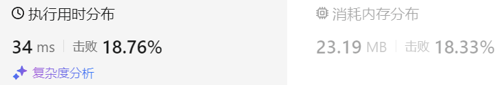

### 14、合并区间（20240628，56题，中等）
<div style="border: 1px solid black; padding: 10px; background-color: #00BFFF;">

给出一个区间的集合，请合并所有重叠的区间。

示例 1:

- 输入: intervals = [[1,3],[2,6],[8,10],[15,18]]
- 输出: [[1,6],[8,10],[15,18]]
- 解释: 区间 [1,3] 和 [2,6] 重叠, 将它们合并为 [1,6].

示例 2:

- 输入: intervals = [[1,4],[4,5]]
- 输出: [[1,5]]
- 解释: 区间 [1,4] 和 [4,5] 可被视为重叠区间。

  </p>
</div>
<hr style="border-top: 5px solid #DC143C;">

<table>
  <tr>
    <td bgcolor="Yellow" style="padding: 5px; border: 0px solid black;">
      <span style="font-weight: bold; font-size: 20px;color: black;">
      仿照答案版本v2
      </span>
    </td>
  </tr>
</table>

```C++
class Solution {
public:
    vector<vector<int>> merge(vector<vector<int>>& intervals) {
        size_t size = intervals.size();

        sort(intervals.begin(), intervals.end(), [](vector<int>& a, vector<int>& b){
            return a[0]<b[0];
        });

        vector<vector<int>> result;
        result.push_back(intervals[0]);
        for(int i = 1; i < size; i++){
            int cur_left = intervals[i][0];
            int cur_right = intervals[i][1];

            if(cur_left <= result.back()[1]){   // 重叠情况处理,更新结果最后区间的右区间
                result.back()[1] = max(result.back()[1], cur_right);
            }else{
                result.push_back(intervals[i]);  // 不重叠,直接将区间存入结果
            }
        }
        return result;    // 忘记返回结果。。
    }
};
```


<table>
  <tr>
    <td bgcolor="Yellow" style="padding: 5px; border: 0px solid black;">
      <span style="font-weight: bold; font-size: 20px;color: black;">
      自己答案（去注释，通过！）
      </span>
    </td>
  </tr>
</table>

```C++
class Solution {
public:
    vector<vector<int>> merge(vector<vector<int>>& intervals) {
        size_t size = intervals.size();
        if(size == 1) return intervals;
        
        sort(intervals.begin(), intervals.end(), [](vector<int>& a, vector<int>& b){
            return a[0]<b[0];
        });

        vector<vector<int>> result;
        int left = intervals[0][0];
        int right = intervals[0][1];
        for(int i = 1; i < size; i++){
            int cur_left = intervals[i][0];
            int cur_right = intervals[i][1];

            if(cur_left <= right){   // 重叠情况处理  可能是最后一个区间。。
                right = max(right, cur_right);
            }
            
            if(cur_left > right){  // 不重叠情况处理
                vector<int> tmp;
                tmp.push_back(left);   // 将合并的区间存入结果
                tmp.push_back(right);
                result.push_back(tmp);
                left = cur_left;
                right = cur_right;
            }

            if(i == size-1){
                vector<int> tmp;
                tmp.push_back(left);   // 将合并的区间存入结果
                tmp.push_back(right);
                result.push_back(tmp);
            }
        }
        return result;    // 忘记返回结果。。
    }
};

```


<table>
  <tr>
    <td bgcolor="Yellow" style="padding: 5px; border: 0px solid black;">
      <span style="font-weight: bold; font-size: 20px;color: black;">
      自己答案（通过！）
      </span>
    </td>
  </tr>
</table>

```C++
/*
思路：
将区间按照左区间从小到大排序
    当前区间为[left,right]，遍历下一个区间[new_left,new_right]，若new_right > right，则更新right
    遇到new_left > right，则更新left,并将数据保存

*/

class Solution {
public:
    vector<vector<int>> merge(vector<vector<int>>& intervals) {
        size_t size = intervals.size();
        if(size == 1) return intervals;
        
        sort(intervals.begin(), intervals.end(), [](vector<int>& a, vector<int>& b){
            return a[0]<b[0];
        });

        vector<vector<int>> result;
        int left = intervals[0][0];
        int right = intervals[0][1];
        for(int i = 1; i < size; i++){
            int cur_left = intervals[i][0];
            int cur_right = intervals[i][1];

            if(cur_left <= right){   // 重叠情况处理  可能是最后一个区间。。
                right = max(right, cur_right);
            }
            
            // if(cur_left > right || i == size-1)
            if(cur_left > right){  // 不重叠情况处理
                vector<int> tmp;
                tmp.push_back(left);   // 将合并的区间存入结果
                tmp.push_back(right);
                result.push_back(tmp);
                left = cur_left;
                right = cur_right;
            }

            if(i == size-1){
                vector<int> tmp;
                tmp.push_back(left);   // 将合并的区间存入结果
                tmp.push_back(right);
                result.push_back(tmp);
            }
        }
        return result;    // 忘记返回结果。。
    }
};
```
