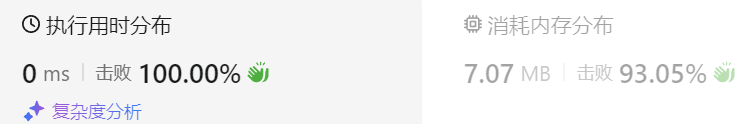

### 15、单调递增的数字（20240627，738题，中等）
<div style="border: 1px solid black; padding: 10px; background-color: #00BFFF;">

给定一个非负整数 N，找出小于或等于 N 的最大的整数，同时这个整数需要满足其各个位数上的数字是单调递增。

（当且仅当每个相邻位数上的数字 x 和 y 满足 x <= y 时，我们称这个整数是单调递增的。）

示例 1:

- 输入: N = 10
- 输出: 9

示例 2:

- 输入: N = 1234
- 输出: 1234

示例 3:

- 输入: N = 332
- 输出: 299

说明: N 是在 [0, 10^9] 范围内的一个整数。

  </p>
</div>
<hr style="border-top: 5px solid #DC143C;">

<table>
  <tr>
    <td bgcolor="Yellow" style="padding: 5px; border: 0px solid black;">
      <span style="font-weight: bold; font-size: 20px;color: black;">
      答案版本v3
      </span>
    </td>
  </tr>
</table>

```C++
class Solution {
public:
    int monotoneIncreasingDigits(int n) {
        string s = to_string(n);
        size_t size = s.size();
         
        int index = size;       // 设置为size大小，可以省略标记位标记是否要反转
        for(int i = size-2; i >= 0; i--){  // 从十位数开始往高位遍历
            if(s[i] > s[i+1]){  // 高位比低位大的情况
                index = i+1;
                s[i] = s[i] - 1;  
            }  
        }     

        for(int i = index; i < size; i++){  // i直接赋值为要翻转处的索引，不用从0开始遍历！！
            s[i] = '9';
        }
        return stoi(s);
    }
};

```

<hr style="border-top: 5px solid #DC143C;">
<table>
  <tr>
    <td bgcolor="Yellow" style="padding: 5px; border: 0px solid black;">
      <span style="font-weight: bold; font-size: 20px;color: black;">
      仿照答案版本v2（去注释）
      </span>
    </td>
  </tr>
</table>

```C++
class Solution {
public:

    int monotoneIncreasingDigits(int n) {
        int result = 0;  
        string s = to_string(n);
        size_t size = s.size();
         
        int index = 0;  // 记录要反转的索引
        bool need_change = false;
        for(int i = size-2; i >= 0; i--){  // 从十位数开始往高位遍历
            if(s[i] > s[i+1]){  // 高位比低位大的情况
                index = i+1;
                s[i] = s[i] - 1;  
                need_change = true;
            }  
        }     

        if(need_change){
            for(int i = 0; i < size; i++){
                if(i > index - 1){
                    s[i] = '9';
                }
            }
        }

        result = stoi(s);
        return result;
    }
};
```
<table>
  <tr>
    <td bgcolor="Yellow" style="padding: 5px; border: 0px solid black;">
      <span style="font-weight: bold; font-size: 20px;color: black;">
      仿照答案版本v2
      </span>
    </td>
  </tr>
</table>

```C++
/*
思路：
遇到98这种相邻两个数，左边大于右边的情况，将左边的数字减一，右边所有的位数变成9；
遇到88或78这种非递减相邻两个数，保持原状即可！
*/class Solution {
public:

    int monotoneIncreasingDigits(int n) {
        int result = 0;  
        string s = to_string(n);
        size_t size = s.size();
         
        int index = 0;  // 记录要反转的索引
        bool need_change = false;
        for(int i = size-2; i >= 0; i--){  // 从十位数开始往高位遍历
            if(s[i] > s[i+1]){  // 高位比低位大的情况
                index = i+1;
                s[i] = s[i] - 1;  // 332 没有这句输出错误329；有则输出299！！！每次需要反转的时候，必须立即将较大的高为减1，再与更高位比较！！！
                need_change = true;
            }  
        }     

        if(need_change){
            for(int i = 0; i < size; i++){
                // if(i == index - 1){
                //     s[i] = s[i] - 1;     // 上面已经处理了反转的高位，将其减1，这里就不用再重复处理！！！s[i] = s[i] - 1;
                // }else if(i > index - 1){
                //     s[i] = '9';
                // }
                if(i > index - 1){
                    s[i] = '9';
                }
            }
        }

        result = stoi(s);
        return result;
    }
};
```


<hr style="border-top: 5px solid #DC143C;">
<table>
  <tr>
    <td bgcolor="Yellow" style="padding: 5px; border: 0px solid black;">
      <span style="font-weight: bold; font-size: 20px;color: black;">
      自己答案（去注释，通过！）
      </span>
    </td>
  </tr>
</table>

```C++
class Solution {
public:
    void rebuild(vector<int>& ret, int pos){  // 处理遇到0的情况，需要将之前数字变为9的情况
        for(int i = 0; i < pos; i++){
            ret[i] = 9;
        }
    }

    int monotoneIncreasingDigits(int n) {
        int result = 0;  // int result;  变量未初始化可能导致问题
        vector<int> vec;

        if(n==0) return 0;
        // if(n<=10) return n-1;  // 后续从两位数开始处理
        if(n<=10) return n;  // 可以返回相等的数，注意审题！！！

        int byte_num = 0;  // 记录n的位数
        int m = n;
        while(m){
            m = m/10;
            byte_num++;
        }

        int count = 1;    // 记录处理第几位数
        int num = n % 10;  // num用于记录上一个处理的数
        n = n/10;   // 从十位开始处理，就别忘了把原始数据个位数去掉！！！
        
        bool is_borrow = false;  // 记录上次是否遇到0，这次要借位减1
        if(num == 0){
            vec.push_back(9);  // 先存入个位数
            num = 9;   
            is_borrow = true; 
        }else{
            vec.push_back(num);
        }
        while(n){
            count++;
            int cur_num = n % 10;  // 从十位数开始取数值

            if(cur_num == 0){       // 先处理等于0的情况
                is_borrow = true;
                vec.push_back(cur_num);
                rebuild(vec, count);
                num = 9;  // 重建后num被置为9！！！
            }else if(cur_num > num){    // 再处理当前数更大的情况，使用前一个数。
                rebuild(vec, count-1);
                vec.push_back(cur_num-1);
                num = cur_num-1;   // vec放入新数的时候，别忘了更新num！！！
                is_borrow = false;
            }else{                   // 再处理当前数更小的情况，使用当前数
                if(is_borrow){
                    vec.push_back(cur_num-1);  // 之前借过位，要减1
                    num = cur_num-1;
                }else{
                    vec.push_back(cur_num);
                    num = cur_num;
                }
                is_borrow = false;
            }
            n = n/10;
        }

        int j = 1;
        result = vec[0];
        for(int i = 1; i < vec.size(); i++){  
            j = j*10;
            result = result + vec[i] * j;
        }
        return result;
    }
};

```

<table>
  <tr>
    <td bgcolor="Yellow" style="padding: 5px; border: 0px solid black;">
      <span style="font-weight: bold; font-size: 20px;color: black;">
      自己答案（通过！）
      </span>
    </td>
  </tr>
</table>

```C++
/*
思路：
从最低位开始读取abcd，
    沿用最低位的数值d，
    读取下一位c，若小于等于d，则继续沿用c
        若c大于d，则将之后的数字改为9，并且下一个数字遍历，所取数值要减1，
        比如取到b，最多只能取b-1
    读取到0，必须取9，下一位取数值自动减1
*/

class Solution {
public:
    void rebuild(vector<int>& ret, int pos){  // 处理遇到0的情况，需要将之前数字变为9的情况
        for(int i = 0; i < pos; i++){
            ret[i] = 9;
        }
    }

    int monotoneIncreasingDigits(int n) {
        int result = 0;  // int result;  变量未初始化可能导致问题，后续“result = result + vec[i] * j”的计算，result可能会用到开始的脏数据！！！
        vector<int> vec;

        if(n==0) return 0;
        // if(n<=10) return n-1;  // 后续从两位数开始处理
        if(n<=10) return n;  // 可以返回相等的数，注意身体！！！

        int byte_num = 0;  // 记录n的位数
        int m = n;
        while(m){
            m = m/10;
            byte_num++;
        }

        int count = 1;    // 记录处理第几位数
        int num = n % 10;  // num用于记录上一个处理的数
        n = n/10;   // 从十位开始处理，就别忘了把原始数据个位数去掉！！！
        
        bool is_borrow = false;  // 记录上次是否遇到0，这次要借位减1
        if(num == 0){
            vec.push_back(9);  // 先存入个位数
            num = 9;   // 这里push_back(9)，相当于num变成了9，不这样赋值，后面else if(cur_num > num)就是cur_num > 0 而不是cur_num > 9，对于120用例就错了
            is_borrow = true; 
        }else{
            vec.push_back(num);
        }
        while(n){
            count++;
            int cur_num = n % 10;  // 从十位数开始取数值

            if(cur_num == 0){       // 先处理等于0的情况
                is_borrow = true;
                vec.push_back(cur_num);
                rebuild(vec, count);
                num = 9;  // 重建后num被置为9！！！
            }else if(cur_num > num){        // 再处理当前数更大的情况，使用前一个数。

                rebuild(vec, count-1);
                vec.push_back(cur_num-1);
                num = cur_num-1;   // vec放入新数的时候，别忘了更新num！！！
                is_borrow = false;
                // if(count == byte_num){      // 332  022， 处理到300时，给出299的结果
                //     rebuild(vec, count-1);
                //     vec.push_back(cur_num-1);
                // }else{                 // 332  002，处理30时，沿用2在十位。
                //     is_borrow = false;
                //     vec.push_back(num);
                // }  
            }else{                   // 再处理当前数更小的情况，使用当前数
                if(is_borrow){
                    vec.push_back(cur_num-1);  // 之前借过位，要减1
                    num = cur_num-1;
                }else{
                    vec.push_back(cur_num);
                    num = cur_num;
                }
                is_borrow = false;
            }
            n = n/10;
        }

        int j = 1;
        result = vec[0];
        for(int i = 1; i < vec.size(); i++){  
            j = j*10;
            result = result + vec[i] * j;
            // j = j*10;  // n = 1000000000时，最后还会计算一次，将超出int的10位数的范围！！！
        }

        // int j = 1;
        // int j = 1;
        // for(int i = 0; i < vec.size(); i++){  // 将vec转为整型数
        //     // result = result + vec[i] * pow(10,i);  pow返回的是双精度double的数据，强转为int，可能会丢失数据，如pow(10,2)=100
        //     j = j*10;
        //     result = result + vec[i] * j;
        //     // j = j*10;
        // }
        return result;
    }
};
```
