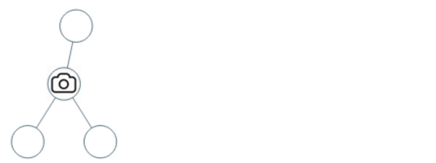
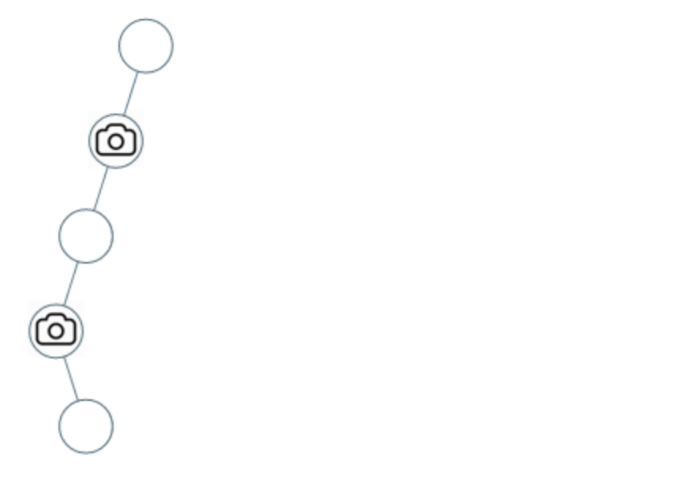

### 16、监控二叉树（20240702，968题，困难）
<div style="border: 1px solid black; padding: 10px; background-color: #000000;">

  给定一个二叉树，我们在树的节点上安装摄像头。 

  节点上的每个摄影头都可以监视其父对象、自身及其直接子对象。 
   
  计算监控树的所有节点所需的最小摄像头数量。

示例 1：



- 输入：[0,0,null,0,0]
- 输出：1
- 解释：如图所示，一台摄像头足以监控所有节点。

示例 2：



- 输入：[0,0,null,0,null,0,null,null,0]
- 输出：2
- 解释：需要至少两个摄像头来监视树的所有节点。 上图显示了摄像头放置的有效位置之一。
  
提示：

- 给定树的节点数的范围是 [1, 1000]。
- 每个节点的值都是 0。
  </p>
</div>


<hr style="border-top: 5px solid #DC143C;">

<table>
  <tr>
    <td bgcolor="Yellow" style="padding: 5px; border: 0px solid black;">
      <span style="font-weight: bold; font-size: 20px;color: black;">
      仿照答案版本
      </span>
    </td>
  </tr>
</table>

```C++
/*
思路：
从下往上遍历，开始按照监控器。即使用左右中的递归遍历方式。

每个节点的状态分别3类，根据当前节点的左右子节点返回的状态，确定自身的状态，并将自身的状态传给上一层。
    0：未被监控
    1：安放监控器了
    2：已监控
递归过层遇到空节点，则空节点要返回状态2，即已被监控状态；左右子节点已经监控则返回状态0，表示未监控。这样方便叶子节点的父节点安装监控（返回状态1）
归纳下可知如下状态传递规则：
    1，左右节点都被监控（左右都是2），当前节点返回0（未被监控）；排除2,2
    2，左右节点存在一个未被监控（左右节点有个0），当前节点返回1（安放监控器）；排除0
    3，左右节点存在一个监控（左右节点有个1），当前节点返回2（已监控）。排除1
    可以看到上面三种情况已经是所有的情况了。情况3中的（0,1）被情况2优先处理了！！！
最后，由于可能存在根节点的左右节点是（2,2）,导致根节点未被监控的情况，所以递归完成后，需要判断根节点！！！
*/
class Solution {
public:
    int result = 0;

    int backTracking(TreeNode* node){
        if(node == nullptr) return 2;

        int left = backTracking(node->left);
        int right = backTracking(node->right);

        if(left == 2 && right == 2) return 0;
        if(left == 0 || right == 0){
            result++;
            return 1;
        }
        if(left == 1 || right == 1) return 2;

        return -1;  // 逻辑上不会走到，但是要写一个。。应该有更好的处理
    }

    int minCameraCover(TreeNode* root) {

        int ret = backTracking(root);
        if(ret == 0) result++;

        return result;
    }
};

```
**时间复杂度**: O(n)，需要遍历二叉树上的每个节点  
**空间复杂度**: O(n)