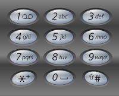
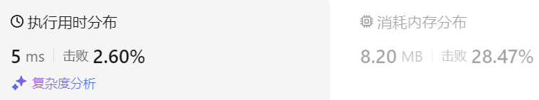
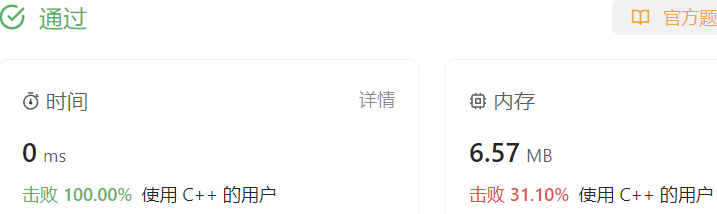

### 03、电话号码的字母组合（20231020，17题，中等。240711整理，31min）

<div style="border: 1px solid black; padding: 10px; background-color: #00BFFF;">

给定一个仅包含数字 2-9 的字符串，返回所有它能表示的字母组合。答案可以按 任意顺序 返回。

给出数字到字母的映射如下（与电话按键相同）。注意 1 不对应任何字母。



示例 1：

- 输入：digits = "23"
- 输出：["ad","ae","af","bd","be","bf","cd","ce","cf"]

示例 2：

- 输入：digits = ""
- 输出：[]

示例 3：

- 输入：digits = "2"
- 输出：["a","b","c"]
 

提示：

- 0 <= digits.length <= 4
- digits[i] 是范围 ['2', '9'] 的一个数字。

  </p>
</div>


<hr style="border-top: 5px solid #DC143C;">
<table>
  <tr>
    <td bgcolor="Yellow" style="padding: 5px; border: 0px solid black;">
      <span style="font-weight: bold; font-size: 20px;color: black;">
      重新整理（240711）
      </span>
    </td>
  </tr>
</table>

```C++ {.line-numbers}
class Solution {
public:
    string path;
    vector<string> result;

    unordered_map<char, string> key_board = {
        {'2', "abc"},
        {'3', "def"},
        {'4', "ghi"},
        {'5', "jkl"},
        {'6', "mno"},
        {'7', "pqrs"},
        {'8', "tuv"},
        {'9', "wxyz"}
    };
    void backtracking(int i, string digits)
    {
        if(i == digits.size()){
            result.push_back(path);
            return;
        }
        // for(char ch : unordered_map[digits[i]])  用实例的名称，而不是用容器的名字来去元素。。
        for(char ch : key_board[digits[i]]){
            path += ch;

            backtracking(i+1, digits);

            // path -= ch;  string 没有“-”来删除元素的操作。。
            path.pop_back();
        }
    }
    vector<string> letterCombinations(string digits) {
        if(digits.size() == 0) return result;

        backtracking(0, digits);
        return result;
    }
};
```


<hr style="border-top: 5px solid #DC143C;">

<table>
  <tr>
    <td bgcolor="Yellow" style="padding: 5px; border: 0px solid black;">
      <span style="font-weight: bold; font-size: 20px;color: black;">
      看答案修改，通过。
      </span>
    </td>
  </tr>
</table>

```C++ {.line-numbers}
/*
思路：
要从digits每个数字对应的字母集合中分别取出一个数字，进行组合。每次递归使用path存储当前数字
可以令递归的深度为digits的数字的个数
横向上，每次遍历当前数字对应的字母集合
当递归了digits长度次数后，返回path中的集合至ret中，最后返回ret。
*/

class Solution {
public:
    //vector<vector<string>> ret;  //错误！！！
    //vector<string> path;
    vector<string> ret;
    string path;
    int depth = 0;
    //vector<vector<string>> graph = {
    const string graph[10] = {
        {""},    //0，可能会按键按到0/1这些没有对应字母的！！！
        {""},    //1
        {"abc"}, //2
        {"def"}, //3
        {"ghi"}, //4
        {"jkl"},
        {"mno"},    //{m,n,o},
        {"pqrs"},   //{p,q,r,s},
        {"tuv"},   //{t,u,v},
        {"wxyz"}    //{w,x,y,z}
    };

    void backtracking(int i, string digits)
    {
        if(i > digits.size()-1)   //if(i >= digits.size()-1),不能等于！！！
        {
            ret.push_back(path);
            return;
        }
        
        //char* curWords = graph[digits[i] - '0' - 2];
        //vector<string> curWords = graph[digits[i] - '0' - 2];
        string curWords = graph[digits[i] - '0'];
        int len = curWords.size();

        for(int j = 0; j < len; j++)
        {
            path.push_back(curWords[j]);  //path.push_back(graph[j]);
            backtracking(i + 1, digits);
            path.pop_back();
        }
    }
    vector<string> letterCombinations(string digits) {
        if(digits.size() == 0)
        {
            return ret;
        }
        backtracking(0, digits);
        return ret;
    }
};

```


<hr style="border-top: 5px solid #DC143C;">


<table>
  <tr>
    <td bgcolor="Yellow" style="padding: 5px; border: 0px solid black;">
      <span style="font-weight: bold; font-size: 20px;color: black;">
      随想录答案
      </span>
    </td>
  </tr>
</table>

```C++ {.line-numbers}
class Solution {
private:
    const string letterMap[10] = {
        "", // 0
        "", // 1
        "abc", // 2
        "def", // 3
        "ghi", // 4
        "jkl", // 5
        "mno", // 6
        "pqrs", // 7
        "tuv", // 8
        "wxyz", // 9
    };
public:
    vector<string> result;
    string s;
    void backtracking(const string& digits, int index) {
        if (index == digits.size()) {
            result.push_back(s);
            return;
        }
        int digit = digits[index] - '0';        // 将index指向的数字转为int
        string letters = letterMap[digit];      // 取数字对应的字符集
        for (int i = 0; i < letters.size(); i++) {
            s.push_back(letters[i]);            // 处理
            backtracking(digits, index + 1);    // 递归，注意index+1，一下层要处理下一个数字了
            s.pop_back();                       // 回溯
        }
    }
    vector<string> letterCombinations(string digits) {
        s.clear();
        result.clear();
        if (digits.size() == 0) {
            return result;
        }
        backtracking(digits, 0);
        return result;
    }
};
```
**时间复杂度**: O(3^m * 4^n)，其中 m 是对应三个字母的数字个数，n 是对应四个字母的数字个数  
**空间复杂度**: O(3^m * 4^n)