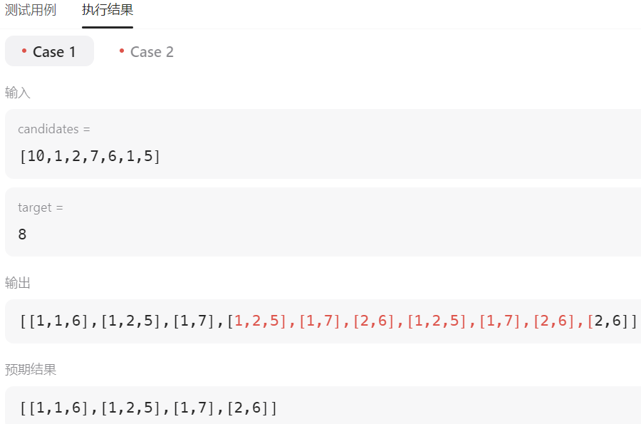
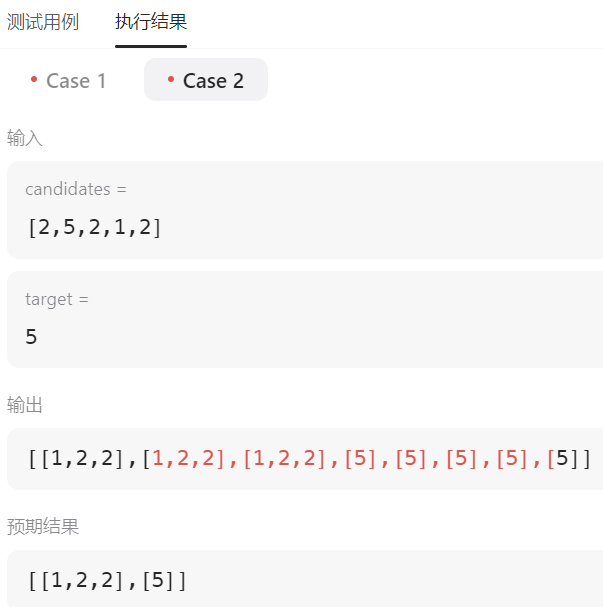

### 05、组合总和II（20231110，40题，中等。2407整理）
<div style="border: 1px solid black; padding: 10px; background-color: #00BFFF;">

给定一个候选人编号的集合 candidates 和一个目标数 target ，找出 candidates 中所有可以使数字和为 target 的组合。

candidates 中的每个数字在每个组合中只能使用 一次 。

注意：解集不能包含重复的组合。 

示例 1:

- 输入: candidates = [10,1,2,7,6,1,5], target = 8,
- 输出:
[
[1,1,6],
[1,2,5],
[1,7],
[2,6]
]

示例 2:

- 输入: candidates = [2,5,2,1,2], target = 5,
- 输出:
[
[1,2,2],
[5]
]
 

提示:

- 1 <= candidates.length <= 100
- 1 <= candidates[i] <= 50
- 1 <= target <= 30

  </p>
</div>

<hr style="border-top: 5px solid #DC143C;">
<table>
  <tr>
    <td bgcolor="Yellow" style="padding: 5px; border: 0px solid black;">
      <span style="font-weight: bold; font-size: 20px;color: black;">
      自己答案（去注释，通过！）
      </span>
    </td>
  </tr>
</table>

```C++


```

<table>
  <tr>
    <td bgcolor="Yellow" style="padding: 5px; border: 0px solid black;">
      <span style="font-weight: bold; font-size: 20px;color: black;">
      自己答案（通过！）
      </span>
    </td>
  </tr>
</table>

```C++


```

<hr style="border-top: 5px solid #DC143C;">

<table>
  <tr>
    <td bgcolor="Yellow" style="padding: 5px; border: 0px solid black;">
      <span style="font-weight: bold; font-size: 20px;color: black;">
      根据答案修改版本，通过。
      </span>
    </td>
  </tr>
</table>

```C++
/*
思路：
第一层遍历中依次遍历candidate中的值cur，遍历的值存入vector<int> tmp;
再利用回溯（递归）遍历cur之后的值；
每次回溯记录遍历的累加值sum；
回溯结束条件式sum等于target的时候，将tmp放入全局的ret二维数组，
每次迭代中，tmp需要pop出当前的数值
*/
class Solution {
public:
    vector<vector<int>> ret;
    vector<int> tmp;
    int sum = 0;

    void backtracking(vector<int>& candidates, int target, int index)
    {
        for(int j = index; j < candidates.size(); j++)
        {
            // 要对同一树层使用过的元素进行跳过
            // 若使用j > 0，会用想下一层回溯调用，令其不能使用当前的相同数。j > index，由于当前j = index，不可能走到这个判断。所以纵向回溯调不到，横向的层序遍历过程才会调到！
            if(j > index && candidates[j] == candidates[j-1])
            {
                continue;
            }
            tmp.push_back(candidates[j]);
            sum += candidates[j];
            //判断必须当前判断，不能放在下一次回溯中，不然不好跳过相同的等于target的数
            if(sum == target) 
            {
                ret.push_back(tmp);
                tmp.pop_back();
                sum -= candidates[j];
                // int m = j;
                // if(m < candidates.size() &&  candidates[m] >= candidates[m-1])
                // {
                //     continue;
                // }
                return ;
            }
            else if(sum > target)
            {
                //表明当前没必要继续遍历
                tmp.pop_back();
                sum -= candidates[j];
                // int m = j;
                // if(m < candidates.size() &&  candidates[m] >= candidates[m-1])
                // {
                //     continue;
                // }
                return ;
            }
            backtracking(candidates, target, j+1);
            tmp.pop_back();
            sum -= candidates[j];
        }
        return ;
    }

    vector<vector<int>> combinationSum2(vector<int>& candidates, int target) {
        tmp.clear();
        ret.clear();

        sort(candidates.begin(), candidates.end());
        backtracking(candidates, target, 0);
        return ret;
    }
};
```


<table>
  <tr>
    <td bgcolor="Yellow" style="padding: 5px; border: 0px solid black;">
      <span style="font-weight: bold; font-size: 20px;color: black;">
      自己的答案，未通过。
      </span>
    </td>
  </tr>
</table>

```C++
/*
思路：
第一层遍历中依次遍历candidate中的值cur，遍历的值存入vector<int> tmp;
再利用回溯（递归）遍历cur之后的值；
每次回溯记录遍历的累加值sum；
回溯结束条件式sum等于target的时候，将tmp放入全局的ret二维数组，
每次迭代中，tmp需要pop出当前的数值
*/
class Solution {
public:
    vector<vector<int>> ret;
    vector<int> tmp;
    int sum = 0;

    void backtracking(vector<int>& candidates, int target, int index)
    {
        for(int j = index; j < candidates.size(); j++)
        {
            tmp.push_back(candidates[j]);
            sum += candidates[j];
            //判断必须当前判断，不能放在下一次回溯中，不然不好跳过相同的等于target的数
            if(sum == target) 
            {
                ret.push_back(tmp);
                tmp.pop_back();
                sum -= candidates[j];
                int m = j;
                if(m < candidates.size() &&  candidates[m] >= candidates[m-1])
                {
                    continue;
                }
                return ;
            }
            else if(sum > target)
            {
                //表明当前没必要继续遍历
                tmp.pop_back();
                sum -= candidates[j];
                int m = j;
                if(m < candidates.size() &&  candidates[m] >= candidates[m-1])
                {
                    continue;
                }
                return ;
            }
            backtracking(candidates, target, j+1);
            tmp.pop_back();
            sum -= candidates[j];
        }
        return ;
    }

    vector<vector<int>> combinationSum2(vector<int>& candidates, int target) {

        int len = candidates.size();
        for(int i = 0; i < len; i++)
        {
            sort(candidates.begin(), candidates.end());
            backtracking(candidates, target, i);
        }
        return ret;
    }
};
```



<hr style="border-top: 5px solid #DC143C;">

<table>
  <tr>
    <td bgcolor="Yellow" style="padding: 5px; border: 0px solid black;">
      <span style="font-weight: bold; font-size: 20px;color: black;">
      随想录答案2
      </span>
    </td>
  </tr>
</table>

```C++
/*
思路：
类似我一开始的思路，上面答案由此修改而来。
*/
class Solution {
private:
    vector<vector<int>> result;
    vector<int> path;
    void backtracking(vector<int>& candidates, int target, int sum, int startIndex) {
        if (sum == target) {
            result.push_back(path);
            return;
        }
        for (int i = startIndex; i < candidates.size() && sum + candidates[i] <= target; i++) {
            // 要对同一树层使用过的元素进行跳过
            if (i > startIndex && candidates[i] == candidates[i - 1]) {
                continue;
            }
            sum += candidates[i];
            path.push_back(candidates[i]);
            backtracking(candidates, target, sum, i + 1); // 和39.组合总和的区别1，这里是i+1，每个数字在每个组合中只能使用一次
            sum -= candidates[i];
            path.pop_back();
        }
    }

public:
    vector<vector<int>> combinationSum2(vector<int>& candidates, int target) {
        path.clear();
        result.clear();
        // 首先把给candidates排序，让其相同的元素都挨在一起。
        sort(candidates.begin(), candidates.end());
        backtracking(candidates, target, 0, 0);
        return result;
    }
};

```

<table>
  <tr>
    <td bgcolor="Yellow" style="padding: 5px; border: 0px solid black;">
      <span style="font-weight: bold; font-size: 20px;color: black;">
      随想录答案1
      </span>
    </td>
  </tr>
</table>

```C++
/*
思路：
使用used数组来标记同一树枝和同一数层上，数字的使用情况，避免同层上相同数字被重复使用。
*/
class Solution {
private:
    vector<vector<int>> result;
    vector<int> path;
    void backtracking(vector<int>& candidates, int target, int sum, int startIndex, vector<bool>& used) {
        if (sum == target) {
            result.push_back(path);
            return;
        }
        for (int i = startIndex; i < candidates.size() && sum + candidates[i] <= target; i++) {
            // used[i - 1] == true，说明同一树枝candidates[i - 1]使用过
            // used[i - 1] == false，说明同一树层candidates[i - 1]使用过
            // 要对同一树层使用过的元素进行跳过
            if (i > 0 && candidates[i] == candidates[i - 1] && used[i - 1] == false) {
                continue;
            }
            sum += candidates[i];
            path.push_back(candidates[i]);
            used[i] = true;
            backtracking(candidates, target, sum, i + 1, used); // 和39.组合总和的区别1，这里是i+1，每个数字在每个组合中只能使用一次
            used[i] = false;
            sum -= candidates[i];
            path.pop_back();
        }
    }

public:
    vector<vector<int>> combinationSum2(vector<int>& candidates, int target) {
        vector<bool> used(candidates.size(), false);
        path.clear();
        result.clear();
        // 首先把给candidates排序，让其相同的元素都挨在一起。
        sort(candidates.begin(), candidates.end());
        backtracking(candidates, target, 0, 0, used);
        return result;
    }
};

```


### 5、组合总和II（20231110，40题，中等）


>随想录答案。
```C++

```

>随想录答案。
```C++

```
