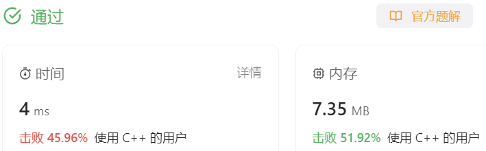

### 08、子集（20231205，78题，中等。2407整理）
<div style="border: 1px solid black; padding: 10px; background-color: #00BFFF;">

给定一组不含重复元素的整数数组 nums，返回该数组所有可能的子集（幂集）。

说明：解集不能包含重复的子集。

示例: 
- 输入: nums = [1,2,3] 输出: [ [3],   [1],   [2],   [1,2,3],   [1,3],   [2,3],   [1,2],   [] ]

  </p>
</div>

<hr style="border-top: 5px solid #DC143C;">
<table>
  <tr>
    <td bgcolor="Yellow" style="padding: 5px; border: 0px solid black;">
      <span style="font-weight: bold; font-size: 20px;color: black;">
      自己答案（去注释，通过！）
      </span>
    </td>
  </tr>
</table>

```C++


```

<table>
  <tr>
    <td bgcolor="Yellow" style="padding: 5px; border: 0px solid black;">
      <span style="font-weight: bold; font-size: 20px;color: black;">
      自己答案（通过！）
      </span>
    </td>
  </tr>
</table>

```C++
/*
思路：
横向上，依次遍历数组中每个数字
纵向上，也是可选的依次取各种可能得数字；
每次取数字都需要将当前的数字存入tmp中，同时将tmp放入ret中；
终止条件则是遍历到最后一个数。
*/
class Solution {
public:
    vector<vector<int>> ret;
    vector<int> cur; 
    void backtracking(vector<int> &nums, int index)   
    {
        ret.push_back(cur);
        for(int i = index; i < nums.size(); i++)  
        {
            cur.push_back(nums[i]); 
            backtracking(nums, i+1);
            cur.pop_back();
        }
    }
    vector<vector<int>> subsets(vector<int>& nums) {
        ret.clear();
        backtracking(nums, 0);
        return ret;
    }
};
/*************************************************************************/
class Solution {
public:
    vector<vector<int>> ret;
    vector<int> cur; 

    void backtracking(vector<int> &nums, int index)   //index表明上次读取了哪个数，告诉下层递归取数的开始位置
    {
        /*这里不需要终止条件，遍历完就结束了*/
        /*以前终止条件是因为遍历到某种条件，不对了，不用继续往下遍历*/
        //终止条件，遍历到了最后
        // if(index == nums.size())
        // {
        //     return;
        // }
        //横向遍历
        /*ret.push_back(cur)方在了cur.push_back(nums[i])之前，所以开始会把空集放入ret中，此时index等于0。backtracking存入的是index之前的一个数，所以ret.push_back(cur)必须放在终止条件之前，不然会漏掉最后一个数！！！*/
        ret.push_back(cur);           //每次取数都要在这返回
        for(int i = index; i < nums.size(); i++)  //这次递归只能从上次递归取数的index之后取数字
        {
            cur.push_back(nums[i]);   /*cur.push_back(nums[index]);*/
            /*可以在这里取值到ret，但是最后要补充空集合到ret中*/
            //ret.push_back(cur);           //每次取数都要在这返回
            backtracking(nums, i+1); /*backtracking(nums, index+1);*/
            cur.pop_back();
        }
    }

    vector<vector<int>> subsets(vector<int>& nums) {
        ret.clear();

        backtracking(nums, 0);
        //ret.push_back(vector<int> ());

        return ret;
    }
};
```



<hr style="border-top: 5px solid #DC143C;">

<table>
  <tr>
    <td bgcolor="Yellow" style="padding: 5px; border: 0px solid black;">
      <span style="font-weight: bold; font-size: 20px;color: black;">
      自己调试版本（通过！！！）
      </span>
    </td>
  </tr>
</table>

```C++


```

<table>
  <tr>
    <td bgcolor="Yellow" style="padding: 5px; border: 0px solid black;">
      <span style="font-weight: bold; font-size: 20px;color: black;">
      仿照答案版本v2（去注释）
      </span>
    </td>
  </tr>
</table>

```C++


```

<hr style="border-top: 5px solid #DC143C;">

<table>
  <tr>
    <td bgcolor="Yellow" style="padding: 5px; border: 0px solid black;">
      <span style="font-weight: bold; font-size: 20px;color: black;">
      仿照答案版本v2
      </span>
    </td>
  </tr>
</table>

```C++


```

<table>
  <tr>
    <td bgcolor="Yellow" style="padding: 5px; border: 0px solid black;">
      <span style="font-weight: bold; font-size: 20px;color: black;">
      随想录答案
      </span>
    </td>
  </tr>
</table>

```C++


```
