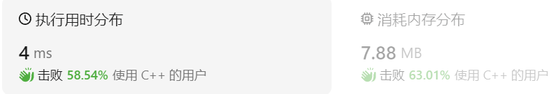

### 09、子集II（20231212，90题，中等。240715整理，11min）
<div style="border: 1px solid black; padding: 10px; background-color: #00BFFF;">

给定一个可能包含重复元素的整数数组 nums，返回该数组所有可能的子集（幂集）。

说明：解集不能包含重复的子集。

示例:

- 输入: [1,2,2]
- 输出: [ [2], [1], [1,2,2], [2,2], [1,2], [] ]

  </p>
</div>

<hr style="border-top: 5px solid #DC143C;">
<table>
  <tr>
    <td bgcolor="Yellow" style="padding: 5px; border: 0px solid black;">
      <span style="font-weight: bold; font-size: 20px;color: black;">
      重新整理（240715）
      </span>
    </td>
  </tr>
</table>

```C++
class Solution {
public:

    vector<int> path;
    vector<vector<int>> result;

    void backtracking(vector<int>& nums, int index){
        if(index == nums.size()) return;

        
        for(int i = index; i < nums.size(); i++){
            if(i > index && nums[i] == nums[i-1]) continue;

            path.push_back(nums[i]);
            result.push_back(path);

            backtracking(nums, i+1);

            path.pop_back();
        }
    }

    vector<vector<int>> subsetsWithDup(vector<int>& nums) {
        
        result.push_back(path);
        sort(nums.begin(), nums.end());

        backtracking(nums, 0);

        return result;

    }
};
```


<hr style="border-top: 5px solid #DC143C;">

<table>
  <tr>
    <td bgcolor="Yellow" style="padding: 5px; border: 0px solid black;">
      <span style="font-weight: bold; font-size: 20px;color: black;">
      自己写，看答案修正。
      </span>
    </td>
  </tr>
</table>

```C++
/*
思路：
先sort一把；
横向上不要取相同的数字；
纵向上依次往后取值。
*/

class Solution {
public:
    vector<vector<int>> ret;
    vector<int> cur;

    void backtracking(vector<int>& nums, int index)
    {
        //
        // ret.push_back(cur);
        // if(index == nums.size())
        // {
        //     return;
        // }
        ret.push_back(cur);
        for(int i = index; i < nums.size(); i++)
        {
            /*不是index-1，nums[i] == nums[index-1])*/
            if(i > index && nums[i] == nums[i-1]) continue;
            cur.push_back(nums[i]);
            //ret.push_back(cur);
            backtracking(nums, i+1);
            cur.pop_back();
        }
    }
    vector<vector<int>> subsetsWithDup(vector<int>& nums) {
        ret.clear();
        cur.clear();
        sort(nums.begin(), nums.end());

        backtracking(nums, 0);

        //ret.push_back(vector<int>());
        return ret;
    }
};
```




<hr style="border-top: 5px solid #DC143C;">


<table>
  <tr>
    <td bgcolor="Yellow" style="padding: 5px; border: 0px solid black;">
      <span style="font-weight: bold; font-size: 20px;color: black;">
      随想录答案
      </span>
    </td>
  </tr>
</table>

```C++
class Solution {
private:
    vector<vector<int>> result;
    vector<int> path;
    void backtracking(vector<int>& nums, int startIndex) {
        result.push_back(path);
        for (int i = startIndex; i < nums.size(); i++) {
            // 而我们要对同一树层使用过的元素进行跳过
            if (i > startIndex && nums[i] == nums[i - 1] ) { // 注意这里使用i > startIndex
                continue;
            }
            path.push_back(nums[i]);
            backtracking(nums, i + 1);
            path.pop_back();
        }
    }

public:
    vector<vector<int>> subsetsWithDup(vector<int>& nums) {
        result.clear();
        path.clear();
        sort(nums.begin(), nums.end()); // 去重需要排序
        backtracking(nums, 0);
        return result;
    }
};
```
