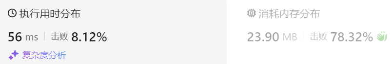
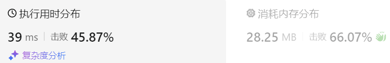

### 10、非递减子序列（20240619，491题，中等）
给定一个整型数组, 你的任务是找到所有该数组的递增子序列，递增子序列的长度至少是2。

**示例**:

- 输入: [4, 6, 7, 7]
- 输出: [[4, 6], [4, 7], [4, 6, 7], [4, 6, 7, 7], [6, 7], [6, 7, 7], [7,7], [4,7,7]]  
  
**说明**:

- 给定数组的长度不会超过15。
- 数组中的整数范围是 [-100,100]。
- 给定数组中可能包含重复数字，相等的数字应该被视为递增的一种情况。 

>自己答案（通过，去注释）
```C++ {.line-numbers}
class Solution {
public:
    size_t nums_size;  
    vector<int> result;
    set<vector<int>> tmp_results;

    void backTracking(vector<int>& nums, int depth){
        if(depth >= nums_size){  
            return;
        }
        for(int i = depth; i < nums_size; i++){

            int cur_num = nums[i];    
            if(cur_num >= nums[depth-1]){  
                result.push_back(cur_num);
                tmp_results.insert(result);

                backTracking(nums, i+1);
                result.pop_back();
            }else{       
                continue;
            } 
        }
    }

    vector<vector<int>> findSubsequences(vector<int>& nums) {
        nums_size = nums.size();

        for(int i = 0; i < nums_size; i++){

            result.push_back(nums[i]);
            backTracking(nums, i+1);
            result.pop_back();
        }

        vector<vector<int>> results(tmp_results.begin(), tmp_results.end());
        return results;
    }
};
```

>自己答案（通过）
```C++ {.line-numbers}
/*
思路：
循环遍历每个数，并找到所有组合。
return条件：当前数大于上一个数时

使用set存每次的结果，可以去除相同的结构
*/

class Solution {
public:
    size_t nums_size;  
    vector<int> result;
    set<vector<int>> tmp_results;

    void backTracking(vector<int>& nums, int depth){
        if(depth >= nums_size){  // if(depth >= size)  前面把数组的长度的名字从“size”改为了“nums_size”，为什么其他地方代码不改。一个地方改了变量名，其它地方也要注意修改。
            return;
        }
        for(int i = depth; i < nums_size; i++){

            int cur_num = nums[i];    // int cur_num = nums[depth];这里不应该继续使用depth，而是要用i，因为横向遍历再使用depth，下次for循环还是用的开始传入的depth，是不对的！！
            // if(cur_num >= nums[i-1]){  横向上是要和nums[depth-1]对比，因为横向上可能会跳过一些不符合的数字
            if(cur_num >= nums[depth-1]){  // if(cur_num >= nums[i-1])当前数字大于前一个，则存入result，并且更新results（错误理解，不是和前一个数字比较）
                result.push_back(cur_num);
                tmp_results.insert(result);

                // 纵向上是就是对比连续增大的数字，不符合则转到横向，并依次和nums[depth-1]对比，找到比nums[depth-1]大的数字。
                backTracking(nums, i+1);
                result.pop_back();
            }else{        // 当前数字小于前一个，继续横向遍历
                continue;
            } 
        }
    }

    vector<vector<int>> findSubsequences(vector<int>& nums) {
        nums_size = nums.size();

        for(int i = 0; i < nums_size; i++){

            result.push_back(nums[i]);
            backTracking(nums, i+1);
            result.pop_back();
        }

        vector<vector<int>> results(tmp_results.begin(), tmp_results.end());
        return results;
    }
};
```


### 代码复杂度分析

对于给定的代码，我们可以从时间复杂度和空间复杂度两个方面进行分析。

#### 时间复杂度

1. **递归深度**：
   - 递归函数 `backTracking` 的深度最坏情况下会达到 `nums_size`，即数组的长度。在每一层递归中，都会对 `nums` 进行循环，最坏情况下递归深度为 `n`。

2. **递归分支**：
   - 在每层递归中，内部循环的复杂度为 `O(n)`，并且每次递归调用都会创建新的分支。每一层的复杂度可以看作是 `O(n)`。
   - 每个元素都可能是结果序列中的一个元素或不是，这使得递归树的总节点数接近 `2^n`。

3. **结果集合的构建**：
   - 每找到一个合法的递增子序列，就将其加入结果集合中。假设找到的子序列的平均长度为 `k`，那么拷贝这些子序列到结果集合的复杂度为 `O(k)`。

综上所述，最坏情况下，递归树的每一层都有 `n` 个分支，总的时间复杂度为 `O(n * 2^n)`。但在实际运行中，由于去重和剪枝操作，实际复杂度会有所降低。

#### 空间复杂度

1. **递归调用栈**：
   - 最坏情况下，递归调用栈的深度为 `n`，每一层递归都需要保存当前状态，空间复杂度为 `O(n)`。

2. **结果集合**：
   - 最坏情况下，结果集合 `tmp_results` 需要存储所有可能的递增子序列。假设结果集合中有 `C` 个序列，每个序列平均长度为 `k`，那么空间复杂度为 `O(C * k)`。在极端情况下，`C` 可以接近 `2^n`。

3. **临时向量**：
   - 使用了一个 `vector<int>` 存储当前的子序列 `result`，空间复杂度为 `O(n)`。

综上所述，空间复杂度为 `O(n + C * k)`，其中 `C` 和 `k` 取决于具体输入数组的排列和去重效果。

### 具体代码复杂度分析

1. **主函数 `findSubsequences`**:
   - 外层循环运行 `n` 次，每次调用递归函数 `backTracking`，所以总复杂度为 `O(n)`。

2. **递归函数 `backTracking`**:
   - 每次递归最多进行 `n` 次循环，总的递归调用次数在最坏情况下可以达到 `2^n`。
   - 内部条件判断和操作的复杂度为 `O(1)`。
   - 每次递归调用时，向集合 `tmp_results` 插入一个子序列，插入操作平均复杂度为 `O(log (2^n))`，即 `O(n)`。

综合来看，最坏情况下时间复杂度为 `O(n * 2^n)`，空间复杂度为 `O(n + 2^n * k)`。

代码在处理较小规模的输入时效率较高，但在输入规模较大时可能会遇到性能瓶颈。优化方法包括进一步剪枝和去重策略，或使用动态规划等其他算法。

---

>看过答案默写（去注释）
```C++ {.line-numbers}
class Solution {
public:
    size_t nums_size;  
    vector<int> subque;
    vector<vector<int>> result;

    void backTracking(vector<int>& nums, int startIndex){  
        if(subque.size() > 1){  
            result.push_back(subque);
        }

        unordered_set<int> uset;
        for(int i = startIndex; i < nums_size; i++){

            int cur_num = nums[i];    
            if(!subque.empty() && cur_num < subque.back() || uset.find(cur_num) != uset.end()){ 
                continue;
            }
            uset.insert(cur_num);
            subque.push_back(cur_num);
            backTracking(nums, i+1);
            subque.pop_back();
        }
    }

    vector<vector<int>> findSubsequences(vector<int>& nums) {
        result.clear();    
        nums_size = nums.size();

        backTracking(nums, 0);
        return result;
    }
};
```


>看过答案默写
```C++ {.line-numbers}
class Solution {
public:
    size_t nums_size;  
    vector<int> subque;
    vector<vector<int>> result;

    void backTracking(vector<int>& nums, int startIndex){  // depth取名不太好，这里是横向的遍历，depth更适合纵向的遍历
        if(subque.size() > 1){  
            result.push_back(subque);
        }

        unordered_set<int> uset;  // 横向上不取重复的数字，[4,6,7]，让纵向取后续的7，横线再取7就和纵向重复了！！！
        for(int i = startIndex; i < nums_size; i++){

            int cur_num = nums[i];    
            // if(cur_num >= subque.back() && uset.find(cur_num) == uset.end()){ 没考虑到第一层遍历时subque可能是空的情况，
            // if((subque.empty() || cur_num >= subque.back()) && uset.find(cur_num) == uset.end()){ 
            //     uset.insert(cur_num);
            //     subque.push_back(cur_num);

            //     backTracking(nums, i+1);

            //     subque.pop_back();
            // }else{        // 当前数字小于前一个，继续横向遍历
            //     uset.insert(cur_num);  // 不止上面情况需要插入uset。。
            // } 
            if(!subque.empty() && cur_num < subque.back() || uset.find(cur_num) != uset.end()){ 
                continue;
            }
            uset.insert(cur_num);
            subque.push_back(cur_num);
            backTracking(nums, i+1);
            subque.pop_back();
        }
    }

    vector<vector<int>> findSubsequences(vector<int>& nums) {
        result.clear();    // result.clean(); clear是动词，clean是名词，清除是个动作。。
        nums_size = nums.size();

        backTracking(nums, 0);
        return result;
    }
};
```
### 代码复杂度分析

对于给定的代码，我们可以从时间复杂度和空间复杂度两个方面进行分析。

#### 时间复杂度

1. **递归深度**：
   - 递归函数 `backTracking` 的深度最坏情况下会达到 `nums_size`，即数组的长度。在每一层递归中，都会对 `nums` 进行循环，最坏情况下递归深度为 `n`。

2. **递归分支**：
   - 在每层递归中，内部循环的复杂度为 `O(n)`，并且每次递归调用都会创建新的分支。每一层的复杂度可以看作是 `O(n)`。
   - 每个元素都可能是结果序列中的一个元素或不是，这使得递归树的总节点数接近 `2^n`。

3. **结果集合的构建**：
   - 每找到一个合法的递增子序列，就将其加入结果集合中。假设找到的子序列的平均长度为 `k`，那么拷贝这些子序列到结果集合的复杂度为 `O(k)`。

综上所述，最坏情况下，递归树的每一层都有 `n` 个分支，总的时间复杂度为 `O(n * 2^n)`。但在实际运行中，由于去重和剪枝操作，实际复杂度会有所降低。

#### 空间复杂度

1. **递归调用栈**：
   - 最坏情况下，递归调用栈的深度为 `n`，每一层递归都需要保存当前状态，空间复杂度为 `O(n)`。

2. **结果集合**：
   - 最坏情况下，结果集合 `result` 需要存储所有可能的递增子序列。假设结果集合中有 `C` 个序列，每个序列平均长度为 `k`，那么空间复杂度为 `O(C * k)`。在极端情况下，`C` 可以接近 `2^n`。

3. **临时集合和向量**：
   - 使用了一个 `unordered_set` 来去重和一个 `vector<int>` 存储当前的子序列，空间复杂度为 `O(n)`。

综上所述，空间复杂度为 `O(n + C * k)`，其中 `C` 和 `k` 取决于具体输入数组的排列和去重效果。

### 总结

- **时间复杂度**：最坏情况下为 `O(n * 2^n)`，实际运行中由于剪枝和去重，复杂度会有所降低。
- **空间复杂度**：最坏情况下为 `O(n + C * k)`。

代码在处理较小规模的输入时效率较高，但在输入规模较大时可能会遇到性能瓶颈。优化方法包括进一步剪枝和去重策略，或使用动态规划等其他算法。