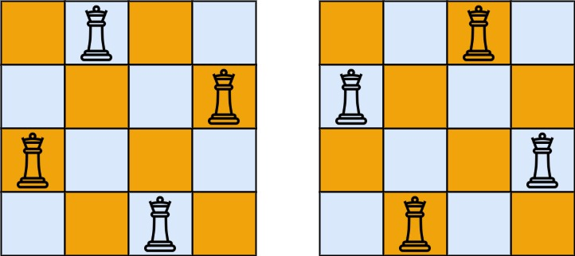

### 15、N 皇后（20240710，51题，困难）
<div style="border: 1px solid black; padding: 10px; background-color: #00BFFF;">

按照国际象棋的规则，皇后可以攻击与之处在同一行或同一列或同一斜线上的棋子。

n 皇后问题 研究的是如何将 n 个皇后放置在 n×n 的棋盘上，并且使皇后彼此之间不能相互攻击。

给你一个整数 n ，返回所有不同的 n 皇后问题 的解决方案。

每一种解法包含一个不同的 n 皇后问题 的棋子放置方案，该方案中 'Q' 和 '.' 分别代表了皇后和空位。

 

示例 1：  


- 输入：n = 4
- 输出：[[".Q..","...Q","Q...","..Q."],["..Q.","Q...","...Q",".Q.."]]
- 解释：如上图所示，4 皇后问题存在两个不同的解法。

示例 2：

- 输入：n = 1
- 输出：[["Q"]]
 

提示：

- 1 <= n <= 9

  </p>
</div>

<hr style="border-top: 5px solid #DC143C;">
<table>
  <tr>
    <td bgcolor="Yellow" style="padding: 5px; border: 0px solid black;">
      <span style="font-weight: bold; font-size: 20px;color: black;">
      自己答案（去注释，通过！）
      </span>
    </td>
  </tr>
</table>

```C++

/*
思路：
1，形成n×n的格子，从头开始放至皇后；vector<vector<int>> map(n, vector<int>(n, 0));
2，每放置一个皇后，标记被占领的格子，下一个皇后选取最近的未被占领的位置
3，递归中，在本次递归完成，需要去掉本次皇后的影响
4，返回条件：
    放置了n个正确的皇后；
    map被填满了（皇后没放完），返回
*/

class Solution {
public:
    pair<int, int> xy;
    vector<pair<int, int>> points;
    vector<vector<pair<int, int>>> results;

    void remember(vector<vector<int>>& map, int n, int x, int y, bool flag){
        // 从y+1行开始遍历
        for(int i = 1; i <= n-1-y; i++){
            if(x-i >= 0 && y+i <= n-1 && flag){  // 左下斜角点
                map[y+i][x-i]++;
            }else if(x-i >= 0 && y+i <= n-1 && !flag){  // 左下斜角点
                map[y+i][x-i]--;
            }

            if(x+i <= n-1 && y+i <= n-1 && flag){  // 右下斜角点
                map[y+i][x+i]++;
            }else if(x+i <= n-1 && y+i <= n-1 && !flag){  // 左下斜角点
                map[y+i][x+i]--;
            }

            if(y+i <= n-1 && flag){  // 正下方的点！！！
                map[y+i][x]++;
            }else if(y+i <= n-1 && !flag){  // 正下方的点
                map[y+i][x]--;
            }
        }
    }
    // 每行，depth记录，确定一个皇后位置，
    void backtracking(vector<vector<int>>& map, int n, int depth){
        if(depth == n){
            results.push_back(points);
            return;
        }

        for(int i = 0; i < n; i++){  // 横向遍历当前
            if(map[depth][i] == 0){  // 当前点没被其他皇后占领过，可以放置新皇后
                xy = {i, depth};
                points.push_back(xy);
                remember(map, n, i, depth, true);  // 记录当前点影响的map范围

                backtracking(map, n, depth+1);

                points.pop_back();
                remember(map, n, i, depth, false);  // 恢复当前点影响的map范围
            }
        }
    }

    vector<vector<string>> solveNQueens(int n) {
        vector<vector<int>> map(n, vector<int>(n, 0));

        backtracking(map, n, 0);

        vector<vector<string>> ret;
        vector<string> rows;
        for(auto result : results){  
            vector<string> rows;
            for(auto point : result){  
                string tmp(n, '.'); 
                tmp[point.first] = 'Q';
                rows.push_back(tmp);
            }
            ret.push_back(rows);
        }

        return ret;
    }
};
```


<table>
  <tr>
    <td bgcolor="Yellow" style="padding: 5px; border: 0px solid black;">
      <span style="font-weight: bold; font-size: 20px;color: black;">
      自己答案（通过！）
      </span>
    </td>
  </tr>
</table>

```C++

/*
思路：
1，形成n×n的格子，从头开始放至皇后；vector<vector<int>> map(n, vector<int>(n, 0));
2，每放置一个皇后，标记被占领的格子，下一个皇后选取最近的未被占领的位置
3，递归中，在本次递归完成，需要去掉本次皇后的影响
4，返回条件：
    放置了n个正确的皇后；
    map被填满了（皇后没放完），返回
*/

class Solution {
public:
    pair<int, int> xy;
    vector<pair<int, int>> points;
    vector<vector<pair<int, int>>> results;

    // 确定当前皇后位置（x1,y1），实际只要标记大于y1各行能到达的位置（提醒后面不要选这些能达到的点）。
    void remember(vector<vector<int>>& map, int n, int x, int y, bool flag){
        // 从y+1行开始遍历
        for(int i = 1; i <= n-1-y; i++){
            if(x-i >= 0 && y+i <= n-1 && flag){  // 左下斜角点
                // map[x-i][y+i]++;
                map[y+i][x-i]++;
            }else if(x-i >= 0 && y+i <= n-1 && !flag){  // 左下斜角点
                // map[x-i][y+i]--;
                map[y+i][x-i]--;
            }

            if(x+i <= n-1 && y+i <= n-1 && flag){  // 右下斜角点
                // map[x+i][y+i]++;
                map[y+i][x+i]++;
            }else if(x+i <= n-1 && y+i <= n-1 && !flag){  // 左下斜角点
                // map[x+i][y+i]--;
                map[y+i][x+i]--;
            }

            if(y+i <= n-1 && flag){  // 正下方的点！！！
                // map[x][y+i]++;
                map[y+i][x]++;
            }else if(y+i <= n-1 && !flag){  // 正下方的点
                // map[x][y+i]--;
                map[y+i][x]--;
            }
        }
    }
    // 每行，depth记录，确定一个皇后位置，
    void backtracking(vector<vector<int>>& map, int n, int depth){
        if(depth == n){
            results.push_back(points);
            return;
        }

        for(int i = 0; i < n; i++){  // 横向遍历当前
            // int cur_num = map[depth][i];
            if(map[depth][i] == 0){  // 当前点没被其他皇后占领过，可以放置新皇后
                xy = {i, depth};
                points.push_back(xy);
                remember(map, n, i, depth, true);  // 记录当前点影响的map范围

                backtracking(map, n, depth+1);

                points.pop_back();
                remember(map, n, i, depth, false);  // 恢复当前点影响的map范围
            }
        }
    }

    vector<vector<string>> solveNQueens(int n) {
        vector<vector<int>> map(n, vector<int>(n, 0));

        backtracking(map, n, 0);

        vector<vector<string>> ret;
        vector<string> rows;
        for(auto result : results){  // vector<pair<int, int>> points
            vector<string> rows;
            for(auto point : result){  // pair<int, int> point
                string tmp(n, '.');  // string tmp(n, ".");
                tmp[point.first] = 'Q';
                rows.push_back(tmp);
            }
            ret.push_back(rows);
        }

        return ret;
    }
};
```

<hr style="border-top: 5px solid #DC143C;">

<table>
  <tr>
    <td bgcolor="Yellow" style="padding: 5px; border: 0px solid black;">
      <span style="font-weight: bold; font-size: 20px;color: black;">
      随想录答案
      </span>
    </td>
  </tr>
</table>

```C++
class Solution {
private:
vector<vector<string>> result;
// n 为输入的棋盘大小
// row 是当前递归到棋盘的第几行了
void backtracking(int n, int row, vector<string>& chessboard) {
    if (row == n) {
        result.push_back(chessboard);
        return;
    }
    for (int col = 0; col < n; col++) {
        if (isValid(row, col, chessboard, n)) { // 验证合法就可以放
            chessboard[row][col] = 'Q'; // 放置皇后
            backtracking(n, row + 1, chessboard);
            chessboard[row][col] = '.'; // 回溯，撤销皇后
        }
    }
}
bool isValid(int row, int col, vector<string>& chessboard, int n) {
    // 检查列
    for (int i = 0; i < row; i++) { // 这是一个剪枝
        if (chessboard[i][col] == 'Q') {
            return false;
        }
    }
    // 检查 45度角是否有皇后
    for (int i = row - 1, j = col - 1; i >=0 && j >= 0; i--, j--) {
        if (chessboard[i][j] == 'Q') {
            return false;
        }
    }
    // 检查 135度角是否有皇后
    for(int i = row - 1, j = col + 1; i >= 0 && j < n; i--, j++) {
        if (chessboard[i][j] == 'Q') {
            return false;
        }
    }
    return true;
}
public:
    vector<vector<string>> solveNQueens(int n) {
        result.clear();
        std::vector<std::string> chessboard(n, std::string(n, '.'));
        backtracking(n, 0, chessboard);
        return result;
    }
};
```
**时间复杂度**: O(n!)  
**空间复杂度**: O(n)