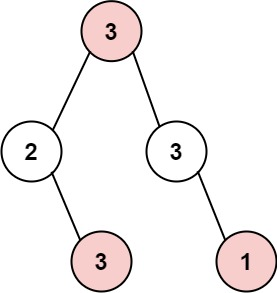
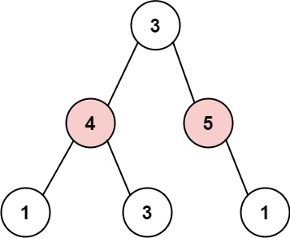
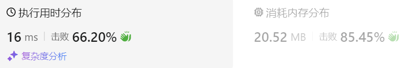

### 23、打家劫舍 III（20240814，337题，中等。55min）
<div style="border: 1px solid black; padding: 10px; background-color: LightSkyBlue;">

小偷又发现了一个新的可行窃的地区。这个地区只有一个入口，我们称之为 root 。

除了 root 之外，每栋房子有且只有一个“父“房子与之相连。一番侦察之后，聪明的小偷意识到“这个地方的所有房屋的排列类似于一棵二叉树”。 如果 两个直接相连的房子在同一天晚上被打劫 ，房屋将自动报警。

给定二叉树的 root 。返回 在不触动警报的情况下 ，小偷能够盗取的最高金额 。

 

示例 1:



- 输入: root = [3,2,3,null,3,null,1]
- 输出: 7 
- 解释: 小偷一晚能够盗取的最高金额 3 + 3 + 1 = 7

示例 2:



- 输入: root = [3,4,5,1,3,null,1]
- 输出: 9
- 解释: 小偷一晚能够盗取的最高金额 4 + 5 = 9
 

提示：

- 树的节点数在 [1, 104] 范围内
- 0 <= Node.val <= 104

  </p>
</div>

<hr style="border-top: 5px solid #DC143C;">
<table>
  <tr>
    <td bgcolor="Yellow" style="padding: 5px; border: 0px solid black;">
      <span style="font-weight: bold; font-size: 20px;color: black;">
      自己答案（55min，通过！）
      </span>
    </td>
  </tr>
</table>
<div style="padding: 0px; border: 1.5px solid LightSalmon; margin-bottom: 10px;">

```C++ {.line-numbers}
/*
55min
思路：
每个节点能提供的价值可以考虑左右子树的返回值A1、A2和本身的价值A（不对，结合后面思路要）
    三者谁大返回谁
    返回A1,说明取的左子树；返回A2，取的右子树
    返回自身A，说明取的自身
另外需要考虑
    若取子树返回，则父节点可以采用自身
    若取自身返回，则父节点不能累加自身值

采用左右中，后序遍历
    递归函数应该返回一个元组，即使用自身的最大值和不使用自身的最大值，pair<int, int> choise
    使用自身，则加上左右子树返回来的不使用自身的second；
    不使用自身，左右子树挑选first和second中最大的，并相加！！

pair<int, int> choise
    first参数是使用自身
    second不使用自身
*/
class Solution {
public:
    pair<int, int> travelTree(TreeNode* cur_node){
        if(cur_node->left == nullptr && cur_node->right == nullptr){
            return make_pair(cur_node->val, 0);
        }

        // int left = 0;
        // int right = 0;
        pair<int, int> left = {0, 0};
        pair<int, int> right = {0, 0};

        if(cur_node->left){
            pair<int, int> tmp_left = travelTree(cur_node->left);
            left.first = tmp_left.first;
            left.second = tmp_left.second;
        }
        if(cur_node->right){
            pair<int, int> tmp_right = travelTree(cur_node->right);
            right.first = tmp_right.first;
            right.second = tmp_right.second;
        }
        
        // 使用自身，则加上左右子树返回来的不使用自身的second
        int use_self = cur_node->val + left.second + right.second;
        // 不使用自身，左右子树挑选first和second中最大的，并相加
        int without_self = max(left.first, left.second) + max(right.first, right.second);

        return make_pair(use_self, without_self);
    }

    int rob(TreeNode* root) {

        pair<int, int> ret = travelTree(root);

        return max(ret.first, ret.second);
    }
};
```

</div>



<hr style="border-top: 5px solid #DC143C;">


<table>
  <tr>
    <td bgcolor="Yellow" style="padding: 5px; border: 0px solid black;">
      <span style="font-weight: bold; font-size: 20px;color: black;">
      随想录答案
      </span>
    </td>
  </tr>
</table>

<div style="padding: 0px; border: 1.5px solid LightSalmon; margin-bottom: 10px">

```C++ {.line-numbers}
class Solution {
public:
    int rob(TreeNode* root) {
        vector<int> result = robTree(root);
        return max(result[0], result[1]);
    }
    // 长度为2的数组，0：不偷，1：偷
    vector<int> robTree(TreeNode* cur) {
        if (cur == NULL) return vector<int>{0, 0};
        vector<int> left = robTree(cur->left);
        vector<int> right = robTree(cur->right);
        // 偷cur，那么就不能偷左右节点。
        int val1 = cur->val + left[0] + right[0];
        // 不偷cur，那么可以偷也可以不偷左右节点，则取较大的情况
        int val2 = max(left[0], left[1]) + max(right[0], right[1]);
        return {val2, val1};
    }
};
```
</div>

时间复杂度：O(n)，每个节点只遍历了一次  
空间复杂度：O(log n)，算上递推系统栈的空间

<table>
  <tr>
    <td bgcolor="Yellow" style="padding: 5px; border: 0px solid black;">
      <span style="font-weight: bold; font-size: 20px;color: black;">
      随想录答案
      </span>
    </td>
  </tr>
</table>

<div style="padding: 0px; border: 1.5px solid LightSalmon; margin-bottom: 10px">

```C++ {.line-numbers}
// 暴力递归
class Solution {
public:
    int rob(TreeNode* root) {
        if (root == NULL) return 0;
        if (root->left == NULL && root->right == NULL) return root->val;
        // 偷父节点
        int val1 = root->val;
        if (root->left) val1 += rob(root->left->left) + rob(root->left->right); // 跳过root->left，相当于不考虑左孩子了
        if (root->right) val1 += rob(root->right->left) + rob(root->right->right); // 跳过root->right，相当于不考虑右孩子了
        // 不偷父节点
        int val2 = rob(root->left) + rob(root->right); // 考虑root的左右孩子
        return max(val1, val2);
    }
};

// 记忆化递推
class Solution {
public:
    unordered_map<TreeNode* , int> umap; // 记录计算过的结果
    int rob(TreeNode* root) {
        if (root == NULL) return 0;
        if (root->left == NULL && root->right == NULL) return root->val;
        if (umap[root]) return umap[root]; // 如果umap里已经有记录则直接返回
        // 偷父节点
        int val1 = root->val;
        if (root->left) val1 += rob(root->left->left) + rob(root->left->right); // 跳过root->left
        if (root->right) val1 += rob(root->right->left) + rob(root->right->right); // 跳过root->right
        // 不偷父节点
        int val2 = rob(root->left) + rob(root->right); // 考虑root的左右孩子
        umap[root] = max(val1, val2); // umap记录一下结果
        return max(val1, val2);
    }
};
```
</div>