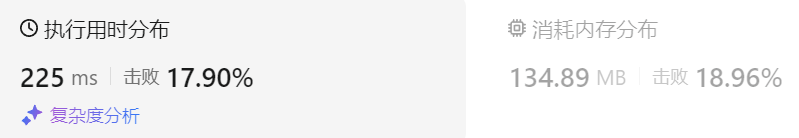

### 26、买卖股票的最佳时机 III（20240815，123题，困难，1h）
<div style="border: 1px solid black; padding: 10px; background-color: LightSkyBlue;">

给定一个数组，它的第 i 个元素是一支给定的股票在第 i 天的价格。

设计一个算法来计算你所能获取的最大利润。你最多可以完成 两笔 交易。

注意：你不能同时参与多笔交易（你必须在再次购买前出售掉之前的股票）。

 

示例 1:

- 输入：prices = [3,3,5,0,0,3,1,4]
- 输出：6
- 解释：在第 4 天（股票价格 = 0）的时候买入，在第 6 天（股票价格 = 3）的时候卖出，这笔交易所能获得利润 = 3-0 = 3 。  
     随后，在第 7 天（股票价格 = 1）的时候买入，在第 8 天 （股票价格 = 4）的时候卖出，这笔交易所能获得利润 = 4-1 = 3 。

示例 2：

- 输入：prices = [1,2,3,4,5]
- 输出：4
- 解释：在第 1 天（股票价格 = 1）的时候买入，在第 5 天 （股票价格 = 5）的时候卖出, 这笔交易所能获得利润 = 5-1 = 4 。     
     注意你不能在第 1 天和第 2 天接连购买股票，之后再将它们卖出。     
     因为这样属于同时参与了多笔交易，你必须在再次购买前出售掉之前的股票。  

示例 3：

- 输入：prices = [7,6,4,3,1] 
- 输出：0 
- 解释：在这个情况下, 没有交易完成, 所以最大利润为 0。

示例 4：

- 输入：prices = [1]
- 输出：0
 

提示：

- 1 <= prices.length <= 105
- 0 <= prices[i] <= 105

  </p>
</div>

<hr style="border-top: 5px solid #DC143C;">


<table>
  <tr>
    <td bgcolor="Yellow" style="padding: 5px; border: 0px solid black;">
      <span style="font-weight: bold; font-size: 20px;color: black;">
      自己答案（通过！）
      </span>
    </td>
  </tr>
</table>

<div style="padding: 0px; border: 1.5px solid LightSalmon; margin-bottom: 10px">

```C++ {.line-numbers}
/*
思路：

dp[j][0][0]，第j天持有股票，且买卖过0次的情况
    1，由j-1天，持有股票，没卖出过股票，保持而来，dp[j-1][0][0]
    2，由j-1天，没有股票，没卖出过股票，今天买股票而来，dp[j-1][1][0] - prices[j]
    dp[j][0][0] = max(dp[j-1][0][0], dp[j-1][1][0] - prices[j])

dp[j][0][1]，第j天持有股票，且卖出过一次
    1，不对，由j-1天，持有股票，没卖出过股票，今天卖出而来，dp[j-1][0][0] + prices[j]  // 但这样卖出，就没有股票了，实际这是dp[j][1][1]的
    2，由j-1天，持有股票，卖出过1次股票，保持而来，dp[j-1][0][1]
    3，由j-1天，没有股票，卖出过1次股票，今天买股票而来，dp[j-1][1][1] - prices[j] 
    4，补充，由j-1天，持有股票，卖出过0次股票，卖出股票，并再次买入而来！dp[j-1][0][0] + prices[j] - prices[j]
    dp[j][0][1] = max(dp[j-1][0][1], dp[j-1][1][1] - prices[j])
    // dp[j][0][1] = max(max(dp[j-1][0][1], dp[j-1][1][1] - prices[j]), dp[j-1][0][0])

dp[j][0][2]，第j天持有股票，且卖出过2次
    1，由j-1天，持有股票，卖出过2次股票，保持而来，dp[j-1][0][2]
    2，由j-1天，没有股票，卖出过2次股票，买票而来，dp[j-1][1][2] - prices[j]  // 这里应该可以省略，因为买了两次，再买就不礼貌了
    3，由j-1天，持有股票，卖出过1次股票，卖出后再买入而来，dp[j-1][0][1] + prices[j] - prices[j]
    dp[j][0][2] = max(dp[j-1][0][2], dp[j-1][1][2] - prices[j]);
    // dp[j][0][2] = max(max(dp[j-1][0][2], dp[j-1][1][2] - prices[j]), dp[j-1][0][1] + prices[j] - prices[j]);

dp[j][1][0]，第j天没有股票，且卖出过0次
    1，由j-1天，持有股票，不可能走到这
    2，由j-1天，没有股票，卖出过0次股票，保持而来，dp[j-1][1][0]
    dp[j][1][0] = dp[j-1][1][0];

dp[j][1][1]，第j天没有股票，且卖出过1次
    1，由j-1天，持有股票，卖出过0次股票，今天卖出而来，dp[j-1][0][0] + prices[j]
    2，由j-1天，没有股票，卖出过1次股票，保持而来，dp[j-1][1][1]
    dp[j][1][1] = max(dp[j-1][0][0] + prices[j], dp[j-1][1][1]);

dp[j][1][2]，第j天没有股票，且卖出过2次
    1，由j-1天，持有股票，卖出过1次股票，今天卖出而来，dp[j-1][0][1] + prices[j]
    2，由j-1天，没有股票，卖出过2次股票，保持而来，dp[j-1][1][2]
    dp[j][1][2] = max(dp[j-1][0][1] + prices[j], dp[j-1][1][2]);

初始化
    dp[0][0][0] = -prices[0];
    dp[0][0][1] = -prices[0];
    dp[0][0][2] = -prices[0];
    dp[0][1][0] = 0;
    dp[0][1][1] = 0;
    dp[0][1][2] = 0;
*/

class Solution {
public:
    int maxProfit(vector<int>& prices) {
        vector<vector<vector<int>>> dp(prices.size(), vector<vector<int>>(2, vector<int>(3, 0)));
        dp[0][0][0] = -prices[0];
        dp[0][0][1] = -prices[0];
        dp[0][0][2] = -prices[0];
        dp[0][1][0] = 0;
        dp[0][1][1] = 0;
        dp[0][1][2] = 0;

        for(int j = 1; j < prices.size(); j++){
            dp[j][0][0] = max(dp[j-1][0][0], dp[j-1][1][0] - prices[j]);
            dp[j][0][1] = max(dp[j-1][0][1], dp[j-1][1][1] - prices[j]);
            // dp[j][0][1] = max(max(dp[j-1][0][1], dp[j-1][1][1] - prices[j]), dp[j-1][0][0]);  // 浪费一次买卖没意义！！！当天买卖
            dp[j][0][2] = max(dp[j-1][0][2], dp[j-1][1][2] - prices[j]);
            // dp[j][0][2] = max(max(dp[j-1][0][2], dp[j-1][1][2] - prices[j]), dp[j-1][0][1] + prices[j] - prices[j]);
            dp[j][1][0] = dp[j-1][1][0];
            dp[j][1][1] = max(dp[j-1][0][0] + prices[j], dp[j-1][1][1]);
            dp[j][1][2] = max(dp[j-1][0][1] + prices[j], dp[j-1][1][2]);
        }
 
        return dp[prices.size()-1][1][2];
    }
};
```
</div>



<table>
  <tr>
    <td bgcolor="Yellow" style="padding: 5px; border: 0px solid black;">
      <span style="font-weight: bold; font-size: 20px;color: black;">
      仿照答案
      </span>
    </td>
  </tr>
</table>
<div style="padding: 0px; border: 1.5px solid LightSalmon; margin-bottom: 10px;">

```C++ {.line-numbers}
/*
1h
思路：
将持股状态分为以下5中
    0，不做任何操作，dp[j][0]
        不做任何操作，其实可以确认dp[j][0] = 0了。不设置这个状态也可以

    1，第一次持股，dp[j][1]
        可以来自上次不操作，即沿用上次的持股，dp[j-1][1]
        也可以上次无操作，本次购买股票，dp[j-1][0] - prices[j]
        dp[j][1] = max(dp[j-1][0] - prices[j], dp[j-1][1]) = max(-prices[j], dp[j-1][1])

    2，第一次不持股，dp[j][2]
        可以由上次持股，卖出而来，dp[j-1][1] + prices[j]
        也可以由上次的不持股延续而来，dp[j-1][2]
        dp[j][2] = max(dp[j-1][1] + prices[j], dp[j-1][2])

    3，第二次持股，dp[j][3]
        可以由第一次持股卖出后，买入得到，dp[j-1][1] + prices[j] - prices[j]  // 答案将此去掉了！！！这里相当于当天买入卖出，没有增加收益，去掉是可以!!!
        也可以由第一次不持股买入得到，dp[j-1][2] - prices[j]
        还可以沿用上次的持股，dp[j-1][3]
        dp[j][3] = max(dp[j-1][2] - prices[j], dp[j-1][3])

    4，第二次不持股，dp[j][4]
        可以第二次持股卖出得到，dp[j-1][3] + prices[j]
        保持上次结果，dp[j-1][4]
        dp[j][4] = max(dp[j-1][3] + prices[j], dp[j-1][4])

初始化
    dp[0][0] = 0;
    dp[0][1] = -prices[0];
    dp[0][2] = 0;
    dp[0][3] = -prices[0];
    dp[0][4] = 0;
*/

class Solution {
public:
    int maxProfit(vector<int>& prices) {
        vector<vector<int>> dp(prices.size(), vector<int>(5, 0));
        dp[0][0] = 0;
        dp[0][1] = -prices[0];
        dp[0][2] = 0;
        dp[0][3] = -prices[0];
        dp[0][4] = 0;

        for(int j = 1; j < prices.size(); j++){
            dp[j][1] = max(-prices[j], dp[j-1][1]);
            dp[j][2] = max(dp[j-1][1] + prices[j], dp[j-1][2]);
            dp[j][3] = max(dp[j-1][2] - prices[j], dp[j-1][3]);
            dp[j][4] = max(dp[j-1][3] + prices[j], dp[j-1][4]);
        }
 
        return dp[prices.size()-1][4];
    }
};
```

</div>


<hr style="border-top: 5px solid #DC143C;">

<table>
  <tr>
    <td bgcolor="Yellow" style="padding: 5px; border: 0px solid black;">
      <span style="font-weight: bold; font-size: 20px;color: black;">
      自己调试版本（未通过）
      </span>
    </td>
  </tr>
</table>

<div style="padding: 0px; border: 1.5px solid LightSalmon; margin-bottom: 10px">

```C++ {.line-numbers}

/*
思路：

dp[j][0][0]，第j天持有股票，且买卖过0次的情况
    1，由j-1天，持有股票，没卖出过股票，保持而来，dp[j][0][0]
    2，由j-1天，没有股票，没卖出过股票，今天买股票而来，dp[j-1][1][0] - prices[j]
    dp[j][0][0] = max(dp[j][0][0], dp[j-1][1][0] - prices[j])

dp[j][0][1]，第j天持有股票，且卖出过一次
    1，不对，由j-1天，持有股票，没卖出过股票，今天卖出而来，dp[j-1][0][0] + prices[j]  // 但这样卖出，就没有股票了，实际这是dp[j][1][1]的
    2，由j-1天，持有股票，卖出过1次股票，保持而来，dp[j-1][0][1]
    3，由j-1天，没有股票，卖出过1次股票，今天买股票而来，dp[j-1][1][1] - prices[j] 
    4，补充，由j-1天，持有股票，卖出过0次股票，卖出股票，并再次买入而来！dp[j-1][0][0] + prices[j] - prices[j]
    // dp[j][0][1] = max(dp[j-1][0][1], dp[j-1][1][1] - prices[j])
    dp[j][0][1] = max(max(dp[j-1][0][1], dp[j-1][1][1] - prices[j]), dp[j-1][0][0])

dp[j][0][2]，第j天持有股票，且卖出过2次
    1，由j-1天，持有股票，卖出过2次股票，保持而来，dp[j-1][0][2]
    2，由j-1天，没有股票，卖出过2次股票，买票而来，dp[j-1][1][2] - prices[j]  // 这里应该可以省略，因为买了两次，再买就不礼貌了
    3，由j-1天，持有股票，卖出过1次股票，卖出后再买入而来，dp[j-1][0][1] + prices[j] - prices[j]
    // dp[j][0][2] = max(dp[j-1][0][2], dp[j-1][1][2] - prices[j]);
    dp[j][0][2] = max(max(dp[j-1][0][2], dp[j-1][1][2] - prices[j]), dp[j-1][0][1] + prices[j] - prices[j]);

dp[j][1][0]，第j天没有股票，且卖出过0次
    1，由j-1天，持有股票，不可能走到这
    2，由j-1天，没有股票，卖出过0次股票，保持而来，dp[j-1][1][0]
    dp[j][1][0] = dp[j-1][1][0];

dp[j][1][1]，第j天没有股票，且卖出过1次
    1，由j-1天，持有股票，卖出过0次股票，今天卖出而来，dp[j-1][0][0] + prices[j]
    2，由j-1天，没有股票，卖出过1次股票，保持而来，dp[j-1][1][1]
    dp[j][1][1] = max(dp[j-1][0][0] + prices[j], dp[j-1][1][1]);

dp[j][1][2]，第j天没有股票，且卖出过2次
    1，由j-1天，持有股票，卖出过1次股票，今天卖出而来，dp[j-1][0][1] + prices[j]
    2，由j-1天，没有股票，卖出过2次股票，保持而来，dp[j-1][1][2]
    dp[j][1][2] = max(dp[j-1][0][1] + prices[j], dp[j-1][1][2]);

初始化
    dp[0][0][0] = -prices[0];
    dp[0][0][1] = -prices[0];
    dp[0][0][2] = -prices[0];
    dp[0][1][0] = 0;
    dp[0][1][1] = 0;
    dp[0][1][2] = 0;
*/

class Solution {
public:
    int maxProfit(vector<int>& prices) {
        vector<vector<vector<int>>> dp(prices.size(), vector<vector<int>>(2, vector<int>(3, 0)));
        dp[0][0][0] = -prices[0];
        dp[0][0][1] = -prices[0];
        dp[0][0][2] = -prices[0];
        dp[0][1][0] = 0;
        dp[0][1][1] = 0;
        dp[0][1][2] = 0;

        for(int j = 1; j < prices.size(); j++){
            dp[j][0][0] = max(dp[j][0][0], dp[j-1][1][0] - prices[j]);
            // dp[j][0][1] = max(dp[j-1][0][1], dp[j-1][1][1] - prices[j]);
            dp[j][0][1] = max(max(dp[j-1][0][1], dp[j-1][1][1] - prices[j]), dp[j-1][0][0]);
            // dp[j][0][2] = max(dp[j-1][0][2], dp[j-1][1][2] - prices[j]);
            dp[j][0][2] = max(max(dp[j-1][0][2], dp[j-1][1][2] - prices[j]), dp[j-1][0][1] + prices[j] - prices[j]);
            dp[j][1][0] = dp[j-1][1][0];
            dp[j][1][1] = max(dp[j-1][0][0] + prices[j], dp[j-1][1][1]);
            dp[j][1][2] = max(dp[j-1][0][1] + prices[j], dp[j-1][1][2]);
        }
 
        return dp[prices.size()-1][1][2];
    }
};
```
</div>

<hr style="border-top: 5px solid #DC143C;">

<table>
  <tr>
    <td bgcolor="Yellow" style="padding: 5px; border: 0px solid black;">
      <span style="font-weight: bold; font-size: 20px;color: black;">
      随想录答案
      </span>
    </td>
  </tr>
</table>

<div style="padding: 0px; border: 1.5px solid LightSalmon; margin-bottom: 10px">

```C++ {.line-numbers}
// 版本一
class Solution {
public:
    int maxProfit(vector<int>& prices) {
        if (prices.size() == 0) return 0;
        vector<vector<int>> dp(prices.size(), vector<int>(5, 0));
        dp[0][1] = -prices[0];
        dp[0][3] = -prices[0];
        for (int i = 1; i < prices.size(); i++) {
            dp[i][0] = dp[i - 1][0];
            dp[i][1] = max(dp[i - 1][1], dp[i - 1][0] - prices[i]);
            dp[i][2] = max(dp[i - 1][2], dp[i - 1][1] + prices[i]);
            dp[i][3] = max(dp[i - 1][3], dp[i - 1][2] - prices[i]);
            dp[i][4] = max(dp[i - 1][4], dp[i - 1][3] + prices[i]);
        }
        return dp[prices.size() - 1][4];
    }
};
```
</div>

时间复杂度：O(n)  
空间复杂度：O(n × 5)

<table>
  <tr>
    <td bgcolor="Yellow" style="padding: 5px; border: 0px solid black;">
      <span style="font-weight: bold; font-size: 20px;color: black;">
      力扣官方题解里的一种优化空间写法
      </span>
    </td>
  </tr>
</table>

<div style="padding: 0px; border: 1.5px solid LightSalmon; margin-bottom: 10px">

```C++ {.line-numbers}
// 版本二
class Solution {
public:
    int maxProfit(vector<int>& prices) {
        if (prices.size() == 0) return 0;
        vector<int> dp(5, 0);
        dp[1] = -prices[0];
        dp[3] = -prices[0];
        for (int i = 1; i < prices.size(); i++) {
            dp[1] = max(dp[1], dp[0] - prices[i]);
            dp[2] = max(dp[2], dp[1] + prices[i]);
            dp[3] = max(dp[3], dp[2] - prices[i]);
            dp[4] = max(dp[4], dp[3] + prices[i]);
        }
        return dp[4];
    }
};
```
</div>

时间复杂度：O(n)  
空间复杂度：O(1)

<table>
  <tr>
    <td bgcolor="Yellow" style="padding: 5px; border: 0px solid black;">
      <span style="font-weight: bold; font-size: 20px;color: black;">
      不设置，‘0. 没有操作’ 这个状态
      </span>
    </td>
  </tr>
</table>

<div style="padding: 0px; border: 1.5px solid LightSalmon; margin-bottom: 10px">

```C++ {.line-numbers}
// 版本三 
class Solution {
public:
    int maxProfit(vector<int>& prices) {
        if (prices.size() == 0) return 0;
        vector<vector<int>> dp(prices.size(), vector<int>(5, 0));
        dp[0][1] = -prices[0];
        dp[0][3] = -prices[0];
        for (int i = 1; i < prices.size(); i++) {
            dp[i][1] = max(dp[i - 1][1], 0 - prices[i]);
            dp[i][2] = max(dp[i - 1][2], dp[i - 1][1] + prices[i]);
            dp[i][3] = max(dp[i - 1][3], dp[i - 1][2] - prices[i]);
            dp[i][4] = max(dp[i - 1][4], dp[i - 1][3] + prices[i]);
        }
        return dp[prices.size() - 1][4];
    }
};
```
</div>