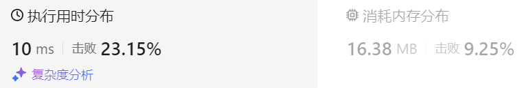

### 27、买卖股票的最佳时机 IV（20240815，188题，困难。39min）
<div style="border: 1px solid black; padding: 10px; background-color: LightSkyBlue;">

给你一个整数数组 prices 和一个整数 k ，其中 prices[i] 是某支给定的股票在第 i 天的价格。

设计一个算法来计算你所能获取的最大利润。你最多可以完成 k 笔交易。也就是说，你最多可以买 k 次，卖 k 次。

注意：你不能同时参与多笔交易（你必须在再次购买前出售掉之前的股票）。

 

示例 1：

- 输入：k = 2, prices = [2,4,1]
- 输出：2
- 解释：在第 1 天 (股票价格 = 2) 的时候买入，在第 2 天 (股票价格 = 4) 的时候卖出，这笔交易所能获得利润 = 4-2 = 2 。

示例 2：

- 输入：k = 2, prices = [3,2,6,5,0,3]
- 输出：7
- 解释：在第 2 天 (股票价格 = 2) 的时候买入，在第 3 天 (股票价格 = 6) 的时候卖出, 这笔交易所能获得利润 = 6-2 = 4 。  
     随后，在第 5 天 (股票价格 = 0) 的时候买入，在第 6 天 (股票价格 = 3) 的时候卖出, 这笔交易所能获得利润 = 3-0 = 3 。
 

提示：

- 1 <= k <= 100
- 1 <= prices.length <= 1000
- 0 <= prices[i] <= 1000

  </p>
</div>

<hr style="border-top: 5px solid #DC143C;">
<table>
  <tr>
    <td bgcolor="Yellow" style="padding: 5px; border: 0px solid black;">
      <span style="font-weight: bold; font-size: 20px;color: black;">
      自己答案（去注释，通过！）
      </span>
    </td>
  </tr>
</table>
<div style="padding: 0px; border: 1.5px solid LightSalmon; margin-bottom: 10px;">

```C++ {.line-numbers}
/*
39min
思路：
dp[j][0][0]，第j天拥有股票，卖出过0次时，拥有的最多现金
dp[j][0][1]，第j天拥有股票，卖出过1次时，拥有的最多现金
dp[j][0][2]，第j天拥有股票，卖出过2次时，拥有的最多现金
...
dp[j][0][k]，第j天拥有股票，卖出过k次时，拥有的最多现金
    可以由j-1天，拥有股票，卖出过k次，延续而来，dp[j-1][0][k]
    可以由j-1天，拥有股票，卖出过k-1次，进行一次买卖而来，但不改变收益，这种情况可以略过！！！
    可以由j-1天，没有股票，卖出过k次，购入股票而来，dp[j-1][1][k] - prices[j]
    dp[j][0][k] = max(dp[j-1][0][k], dp[j-1][1][k] - prices[j]);

dp[j][1][0]，第j天没有股票，卖出过0次时，拥有的最多现金
dp[j][1][1]，第j天没有股票，卖出过1次时，拥有的最多现金
dp[j][1][2]，第j天没有股票，卖出过2次时，拥有的最多现金
...
dp[j][1][k]，第j天没有股票，卖出过k次时，拥有的最多现金
    可以由j-1天，拥有股票，卖出过k-1次，卖出股票而来，dp[j-1][0][k-1] + prices[j]
    可以由j-1天，没有股票，卖出过k次，延续而来，dp[j-1][1][k]

    dp[j][1][k] = max(dp[j-1][0][k-1] + prices[j], dp[j-1][1][k]);

初始化：
dp[0][0][0] = -prices[0];
dp[0][0][1] = -prices[0];
...
dp[0][0][k] = -prices[0];

dp[0][1][0] = 0;
dp[0][1][1] = 0;
...
dp[0][1][k] = 0;
*/
class Solution {
public:
    int maxProfit(int k, vector<int>& prices) {
        size_t size = prices.size();

        vector<vector<vector<int>>> dp(size, vector<vector<int>>(2, vector<int>(k+1, 0)));

        for(int i = 0; i <= k; i++){
            dp[0][0][i] = -prices[0];
        }

        for(int j = 1; j < size; j++){
            for(int m = 0; m <= k; m++){  // for(int m = 1; m <= k; m++)
                dp[j][0][m] = max(dp[j-1][0][m], dp[j-1][1][m] - prices[j]);  // 没卖出过，也需要实时让当前持有的股价最低！！！
                if(m > 0){
                    dp[j][1][m] = max(dp[j-1][0][m-1] + prices[j], dp[j-1][1][m]);
                }else{
                    dp[j][1][0] = 0;
                }
                
            }      
        }

        return dp[size-1][1][k];
    }
};
```

</div>



<hr style="border-top: 5px solid #DC143C;">

<table>
  <tr>
    <td bgcolor="Yellow" style="padding: 5px; border: 0px solid black;">
      <span style="font-weight: bold; font-size: 20px;color: black;">
      随想录答案
      </span>
    </td>
  </tr>
</table>

<div style="padding: 0px; border: 1.5px solid LightSalmon; margin-bottom: 10px">

```C++ {.line-numbers}
class Solution {
public:
    int maxProfit(int k, vector<int>& prices) {

        if (prices.size() == 0) return 0;
        vector<vector<int>> dp(prices.size(), vector<int>(2 * k + 1, 0));
        for (int j = 1; j < 2 * k; j += 2) {
            dp[0][j] = -prices[0];
        }
        for (int i = 1;i < prices.size(); i++) {
            for (int j = 0; j < 2 * k - 1; j += 2) {
                dp[i][j + 1] = max(dp[i - 1][j + 1], dp[i - 1][j] - prices[i]);
                dp[i][j + 2] = max(dp[i - 1][j + 2], dp[i - 1][j + 1] + prices[i]);
            }
        }
        return dp[prices.size() - 1][2 * k];
    }
};
```
</div>

时间复杂度: O(n * k)，其中 n 为 prices 的长度  
空间复杂度: O(n * k)