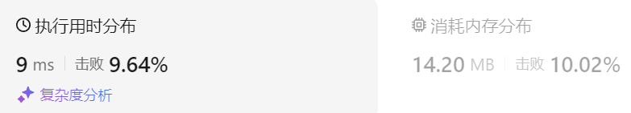

### 28、买卖股票的最佳时机含冷冻期（20240819，309题，中等）
<div style="border: 1px solid black; padding: 10px; background-color: LightSkyBlue;">

给定一个整数数组prices，其中第  prices[i] 表示第 i 天的股票价格 。​

设计一个算法计算出最大利润。在满足以下约束条件下，你可以尽可能地完成更多的交易（多次买卖一支股票）:

卖出股票后，你无法在第二天买入股票 (即冷冻期为 1 天)。  
注意：你不能同时参与多笔交易（你必须在再次购买前出售掉之前的股票）。

 

示例 1:

- 输入: prices = [1,2,3,0,2]
- 输出: 3 
- 解释: 对应的交易状态为: [买入, 卖出, 冷冻期, 买入, 卖出]

示例 2:

- 输入: prices = [1]
- 输出: 0
 

提示：

- 1 <= prices.length <= 5000
- 0 <= prices[i] <= 1000

  </p>
</div>

<hr style="border-top: 5px solid #DC143C;">
<table>
  <tr>
    <td bgcolor="Yellow" style="padding: 5px; border: 0px solid black;">
      <span style="font-weight: bold; font-size: 20px;color: black;">
      仿照答案 
      </span>
    </td>
  </tr>
</table>
<div style="padding: 0px; border: 1.5px solid LightSalmon; margin-bottom: 10px;">

```C++ {.line-numbers}
/*
思路：
    有票  ||  卖  ||  冻结  ||  可买
dp[j][0]，表示第j天持有股票，最大的收益
    第j-1天持有股票保持而来，dp[j-1][0];
    第j-1天为冻结状态，今天买入股票，dp[j-1][1] - prices[j]
    第j-1天为可买状态，今天买了，dp[j-1][3] - prices[j]
    dp[j][0] = max(max(dp[j-1][0], dp[j-1][1] - prices[j]), dp[j-1][3] - prices[j]);

dp[j][1]，表示第j天处于冻结状态，最大的收益（前一天卖出了）
    第j-1天卖出，今天就是冻结状态，收益与昨天一致，dp[j-1][2]
    dp[j][1] = dp[j-1][2];

dp[j][2]，表示第j天处于卖出状态，最大的收益
    第j-1天为有票状态，今天进行卖出，dp[j-1][0] + prices[j]
    dp[j][2] = dp[j-1][0] + prices[j];

dp[j][3]，表示第j天处于可买状态（无票状态的一种，因为冻结也是无票状态），最大的收益
    第j-1天也是可买，延续到今天，dp[j-1][3]
    第j-1天是冻结状态，今天解冻，可买了，dp[j-1][1]
    dp[j][3] = max(dp[j-1][3], dp[j-1][1]);

初始化
dp[0][0] = -prices[0];
dp[0][1] = 0;
dp[0][2] = 0;
dp[0][3] = 0;
*/

class Solution {
public:
    int maxProfit(vector<int>& prices) {
        size_t size = prices.size();
        vector<vector<int>> dp(size, vector<int>(4, 0));
        dp[0][0] = -prices[0];

        for(int j = 1; j < size; j++){
            dp[j][0] = max(max(dp[j-1][0], dp[j-1][1] - prices[j]), dp[j-1][3] - prices[j]);
            dp[j][1] = dp[j-1][2];
            dp[j][2] = dp[j-1][0] + prices[j];
            dp[j][3] = max(dp[j-1][3], dp[j-1][1]);
        }

        return max(dp[size-1][1], max(dp[size-1][2], dp[size-1][3]));
    }
};
```

</div>



<hr style="border-top: 5px solid #DC143C;">

<table>
  <tr>
    <td bgcolor="Yellow" style="padding: 5px; border: 0px solid black;">
      <span style="font-weight: bold; font-size: 20px;color: black;">
      随想录答案
      </span>
    </td>
  </tr>
</table>

<div style="padding: 0px; border: 1.5px solid LightSalmon; margin-bottom: 10px">

```C++ {.line-numbers}
class Solution {
public:
    int maxProfit(vector<int>& prices) {
        int n = prices.size();
        if (n == 0) return 0;
        vector<vector<int>> dp(n, vector<int>(4, 0));
        dp[0][0] -= prices[0]; // 持股票
        for (int i = 1; i < n; i++) {
            dp[i][0] = max(dp[i - 1][0], max(dp[i - 1][3] - prices[i], dp[i - 1][1] - prices[i]));
            dp[i][1] = max(dp[i - 1][1], dp[i - 1][3]);
            dp[i][2] = dp[i - 1][0] + prices[i];
            dp[i][3] = dp[i - 1][2];
        }
        return max(dp[n - 1][3], max(dp[n - 1][1], dp[n - 1][2]));
    }
};
```
</div>

时间复杂度：O(n)  
空间复杂度：O(n)