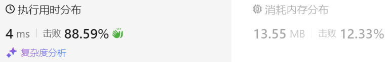

### 31、最长连续递增序列（20240819，674题，简单，10min）
<div style="border: 1px solid black; padding: 10px; background-color: SteelBlue;">

给定一个未经排序的整数数组，找到最长且 连续递增的子序列，并返回该序列的长度。

连续递增的子序列 可以由两个下标 l 和 r（l < r）确定，如果对于每个 l <= i < r，都有 nums[i] < nums[i + 1] ，那么子序列 [nums[l], nums[l + 1], ..., nums[r - 1], nums[r]] 就是连续递增子序列。

 

示例 1：

- 输入：nums = [1,3,5,4,7]
- 输出：3
- 解释：最长连续递增序列是 [1,3,5], 长度为3。  
尽管 [1,3,5,7] 也是升序的子序列, 但它不是连续的，因为 5 和 7 在原数组里被 4 隔开。   

示例 2：

- 输入：nums = [2,2,2,2,2]
- 输出：1
- 解释：最长连续递增序列是 [2], 长度为1。
 

提示：

- 1 <= nums.length <= 104
- -109 <= nums[i] <= 109

  </p>
</div>

<hr style="border-top: 5px solid #DC143C;">
<table>
  <tr>
    <td bgcolor="Yellow" style="padding: 5px; border: 0px solid black;">
      <span style="font-weight: bold; font-size: 20px;color: black;">
      自己答案（去注释，通过！）
      </span>
    </td>
  </tr>
</table>
<div style="padding: 0px; border: 1.5px solid LightSalmon; margin-bottom: 10px;">

```C++ {.line-numbers}
/*
10min
思路：
dp[j]，表示以数字nums[j]为结尾的最长连续子序列的长度
    若dp[j] 大于 dp[j-1] 则dp[j] = dp[j-1] + 1
    否则，dp[j] = 1
*/

class Solution {
public:
    int findLengthOfLCIS(vector<int>& nums) {
        vector<int> dp(nums.size(), 1);
        int result = 1;

        for(int j = 1; j < nums.size(); j++){
            if(nums[j] > nums[j-1]){
                dp[j] = dp[j-1] + 1;
            }
            if(dp[j] > result) result = dp[j];  // 结果在dp[j]生成的过程中，理解下！！！
        }
        return result;
    }
};
```

</div>



<hr style="border-top: 5px solid #DC143C;">

<table>
  <tr>
    <td bgcolor="Yellow" style="padding: 5px; border: 0px solid black;">
      <span style="font-weight: bold; font-size: 20px;color: black;">
      随想录答案（动态规划法）
      </span>
    </td>
  </tr>
</table>

<div style="padding: 0px; border: 1.5px solid LightSalmon; margin-bottom: 10px">

```C++ {.line-numbers}
class Solution {
public:
    int findLengthOfLCIS(vector<int>& nums) {
        if (nums.size() == 0) return 0;
        int result = 1;
        vector<int> dp(nums.size() ,1);
        for (int i = 1; i < nums.size(); i++) {
            if (nums[i] > nums[i - 1]) { // 连续记录
                dp[i] = dp[i - 1] + 1;
            }
            if (dp[i] > result) result = dp[i];
        }
        return result;
    }
};
```
</div>

时间复杂度：O(n)  
空间复杂度：O(n)

<table>
  <tr>
    <td bgcolor="Yellow" style="padding: 5px; border: 0px solid black;">
      <span style="font-weight: bold; font-size: 20px;color: black;">
      随想录答案（贪心法）
      </span>
    </td>
  </tr>
</table>

<div style="padding: 0px; border: 1.5px solid LightSalmon; margin-bottom: 10px">

```C++ {.line-numbers}
class Solution {
public:
    int findLengthOfLCIS(vector<int>& nums) {
        if (nums.size() == 0) return 0;
        int result = 1; // 连续子序列最少也是1
        int count = 1;
        for (int i = 1; i < nums.size(); i++) {
            if (nums[i] > nums[i - 1]) { // 连续记录
                count++;
            } else { // 不连续，count从头开始
                count = 1;
            }
            if (count > result) result = count;
        }
        return result;
    }
};
```
</div>

时间复杂度：O(n)  
空间复杂度：O(1)