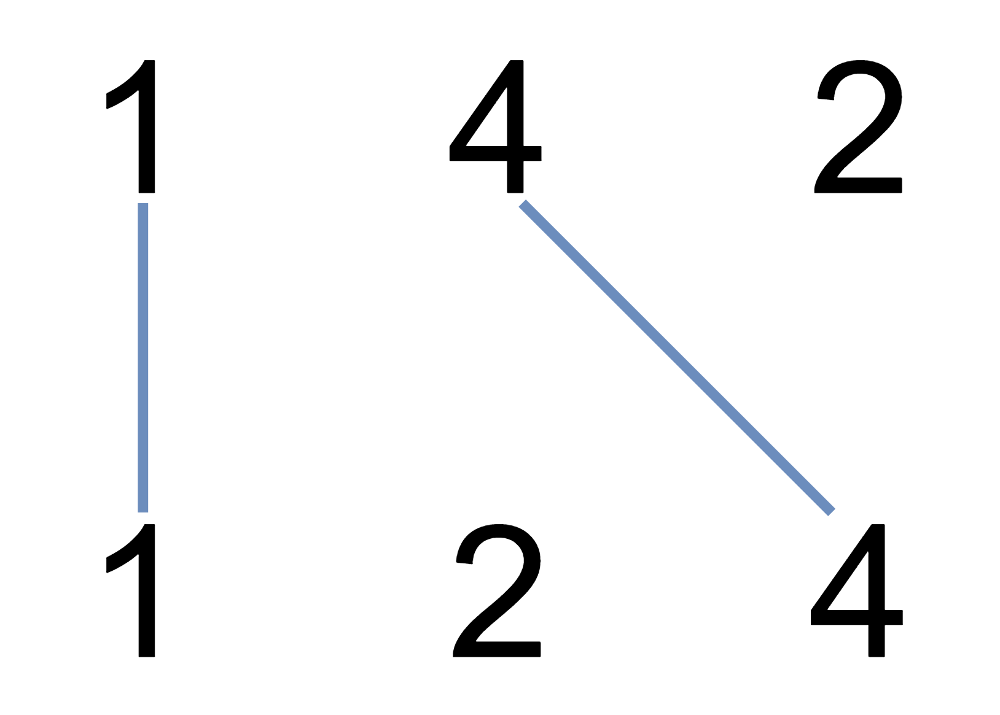

### 34、不相交的线（20240822，1035题，中等）
<div style="border: 1px solid black; padding: 10px; background-color: LightSkyBlue;">

在两条独立的水平线上按给定的顺序写下 nums1 和 nums2 中的整数。

现在，可以绘制一些连接两个数字 nums1[i] 和 nums2[j] 的直线，这些直线需要同时满足：

 - nums1[i] == nums2[j]
- 且绘制的直线不与任何其他连线（非水平线）相交。  

请注意，连线即使在端点也不能相交：每个数字只能属于一条连线。

以这种方法绘制线条，并返回可以绘制的最大连线数。

 

示例 1：



- 输入：nums1 = [1,4,2], nums2 = [1,2,4]
- 输出：2
- 解释：可以画出两条不交叉的线，如上图所示。   
但无法画出第三条不相交的直线，因为从 nums1[1]=4 到 nums2[2]=4 的直线将与从 nums1[2]=2 到 nums2[1]=2 的直线相交。  

示例 2：

- 输入：nums1 = [2,5,1,2,5], nums2 = [10,5,2,1,5,2]
- 输出：3

示例 3：

- 输入：nums1 = [1,3,7,1,7,5], nums2 = [1,9,2,5,1]
- 输出：2
 

提示：

- 1 <= nums1.length, nums2.length <= 500
- 1 <= nums1[i], nums2[j] <= 2000

  </p>
</div>

<hr style="border-top: 5px solid #DC143C;">
<table>
  <tr>
    <td bgcolor="Yellow" style="padding: 5px; border: 0px solid black;">
      <span style="font-weight: bold; font-size: 20px;color: black;">
      自己答案（去注释，通过！）
      </span>
    </td>
  </tr>
</table>
<div style="padding: 0px; border: 1.5px solid LightSalmon; margin-bottom: 10px;">

```C++ {.line-numbers}
/*
19min
思路：
和最长子序列一样的思路，只是换了种说法。。

dp[i][j]表示以nums1[i-1] 和 nums2[j-1]结尾的两个数组的最长相同子序列长度

dp[i-1][j]表示nums1[i-2] 和 nums2[j-1]结尾的两个数组....（注意理解这里）
*/

class Solution {
public:
    int maxUncrossedLines(vector<int>& nums1, vector<int>& nums2) {
        size_t size1 = nums1.size();
        size_t size2 = nums2.size();

        vector<vector<int>> dp(size1+1, vector<int>(size2+1, 0));

        for(int i = 1; i <= size1; i++){
            for(int j = 1; j <= size2; j++){
                if(nums1[i-1] == nums2[j-1]){
                    dp[i][j] = dp[i-1][j-1] + 1;
                }else{
                    // dp[i][j] = max(dp[i-1][j-2], dp[i-2][j-1]);  注意理解这部分！！！dp[i][j]的含义
                    dp[i][j] = max(dp[i-1][j], dp[i][j-1]);
                }
            }
        }
        return dp[size1][size2];
    }
};
```

</div>


<table>
  <tr>
    <td bgcolor="Yellow" style="padding: 5px; border: 0px solid black;">
      <span style="font-weight: bold; font-size: 20px;color: black;">
      随想录答案
      </span>
    </td>
  </tr>
</table>

<div style="padding: 0px; border: 1.5px solid LightSalmon; margin-bottom: 10px">

```C++ {.line-numbers}
class Solution {
public:
    int maxUncrossedLines(vector<int>& A, vector<int>& B) {
        vector<vector<int>> dp(A.size() + 1, vector<int>(B.size() + 1, 0));
        for (int i = 1; i <= A.size(); i++) {
            for (int j = 1; j <= B.size(); j++) {
                if (A[i - 1] == B[j - 1]) {
                    dp[i][j] = dp[i - 1][j - 1] + 1;
                } else {
                    dp[i][j] = max(dp[i - 1][j], dp[i][j - 1]);
                }
            }
        }
        return dp[A.size()][B.size()];
    }
};
```
</div>

时间复杂度: O(n * m)  
空间复杂度: O(n * m)